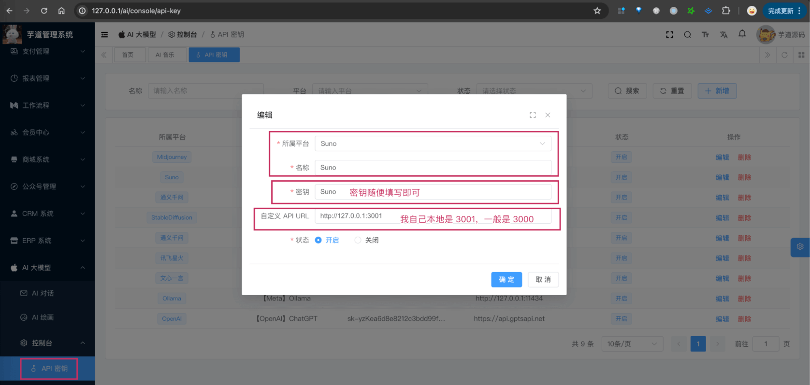

目录

# 【模型接入】Suno

Suno AI，简称 Suno，是一款生成式人工智能音乐创作程序，旨在产生人声与乐器相结合的逼真歌曲。2023 年 12 月 20 日，Suno AI 在推出网络应用程序并与微软建立合作关系后，开始广泛使用。

由于 Suno 没有直接提供 API 接口，所以大家一般通过 [https://github.com/gcui-art/suno-api (opens new window)](https://github.com/gcui-art/suno-api) 项目，模拟用户操作，实现 API 形式调用 AI 生成音乐。

也因此，Spring AI 肯定是不集成 Suno 的，所以我们实现的 `models/suno` 包下的 SunoApi 类，基于上述的 `suno-api` 代理，调用 Suno 实现音乐生成的功能。

## [#](#_1-申请密钥) 1. 申请密钥

可参考 [https://github.com/gcui-art/suno-api/blob/main/README\_CN.md (opens new window)](https://github.com/gcui-art/suno-api/blob/main/README_CN.md) 文档，申请 Suno 账号，并搭建 `suno-api` 代理。

我是采用【本地运行】的方式，因为 Vercel 部署需要 VPN 访问，比较麻烦。

* * *

申请完成后，可以在我们系统的 \[AI 大模型 -> 控制台 -> API 密钥\] 菜单，进行密钥的配置。需要填写“密钥” + “自定义 API URL”。如下图所示：



## [#](#_2-如何使用) 2. 如何使用？

① 如果你的项目里需要直接通过 `@Resource` 注入 SunoApi 对象，需要把 `application.yaml` 配置文件里的 `yudao.ai.suno` 配置项，替换成你的！

```yaml
yudao:
  ai:
    suno:
      enable: true
      base-url: http://127.0.0.1:3001

```

另外，由于 Suno 生成音乐是异步的，可以把项目的 AiSunoSyncJob 定时器类，配置每 1 分钟执行一次，同步音乐生成的结果。怎么使用定时器，可以参考 [《定时任务》](/job) 文档。

② 如果你希望使用 \[AI 大模型 -> 控制台 -> API 密钥\] 菜单的密钥配置，则可以通过 AiApiKeyService 的 `#getSunoApi()` 方法，获取对应的 SunoApi 对象。

另外，SunoApiTests 里有对应的测试用例，可以参考。