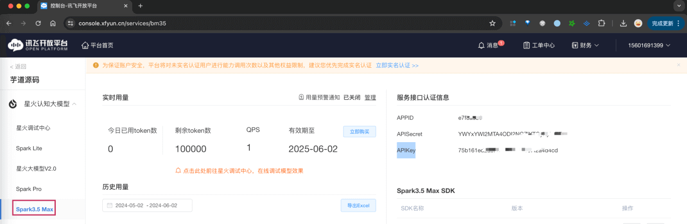
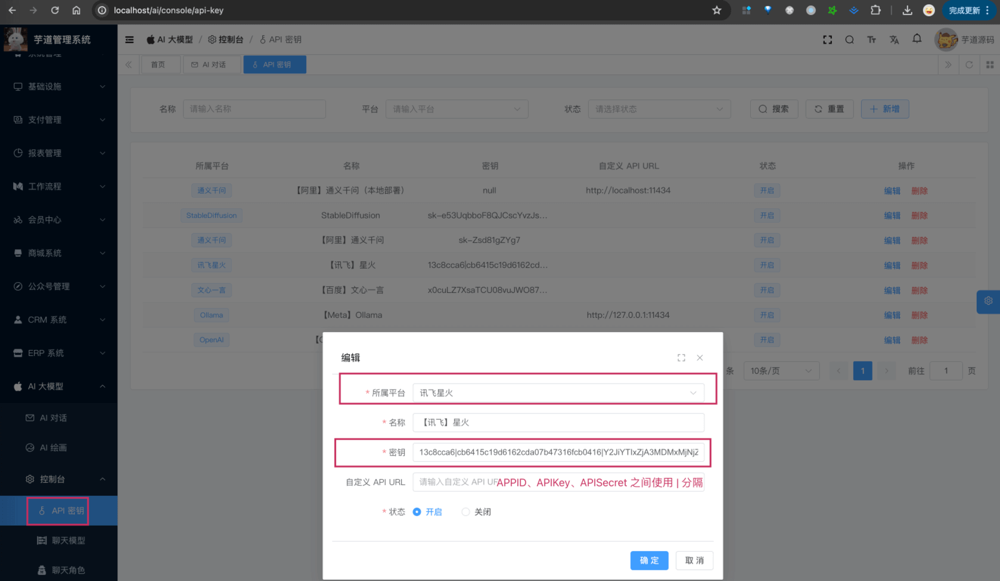

目录

# 【模型接入】讯飞星火

项目基于 Spring AI + 自己实现的 `models/xinghu`，实现 [讯飞星火大模型 (opens new window)](https://xinghuo.xfyun.cn/sparkapi) 的接入：

功能

模型

Spring AI 客户端

AI 对话

generalv3、generalv3.5 等

XingHuoChatModel

AI 绘画

暂未接入

暂未支持

补充说明：

讯飞星火支持 [图片生成 (opens new window)](https://www.xfyun.cn/doc/spark/ImageGeneration.html)，未来我们也会进行集成。

## [#](#_1-申请密钥) 1. 申请密钥

由于讯飞星火是非开源的模型，所以无法私有化部署，需要去官网申请 API Key，然后通过 Spring AI 提供的客户端接入。

### [#](#_1-1-申请讯飞密钥) 1.1 申请讯飞密钥

① 在 [讯飞星火 (opens new window)](https://xinghuo.xfyun.cn/sparkapi) 上，注册一个账号。

② 在 [讯飞星火 (opens new window)](https://xinghuo.xfyun.cn/sparkapi) 上，点击【免费试用】按钮，创建一个应用。

③ 在 [我的应用 (opens new window)](https://console.xfyun.cn/app/myapp) 里，点击该应用的名字，然后选择【Spark3.5 Max】菜单，获得到 APPID、APISecret、APIKey。



* * *

申请完成后，可以在我们系统的 \[AI 大模型 -> 控制台 -> API 密钥\] 菜单，进行密钥的配置。只需要填写“密钥”（`${APPID}|${APIKey}|{APISecret}`），不需要填写“自定义 API URL”（因为 Spring AI 默认官方地址）。如下图所示：



### [#](#_1-2-补充说明) 1.2 补充说明

如果后续你要体验 [《AI 对话》](/ai/chat/) ，需要在 \[AI 大模型 -> 控制台 -> 聊天模型\] 菜单，配置对应的聊天模型。注意，每个模型标识的 `max_tokens`（回复数 Token 数）默认是 4096，最大 8192。

具体有哪些模型，可以去官方文档查看。例如说：`generalv3.5`、`generalv3` 等等。

## [#](#_2-如何使用) 2. 如何使用？

① 如果你的项目里需要直接通过 `@Resource` 注入 XingHuoChatModel 等对象，需要把 `application.yaml` 配置文件里的 `yudao.ai.xinghuo` 配置项，替换成你的！

```yaml
yudao:
  ai:
    xinghuo:
      enable: true
      appId: 13c8cca6
      appKey: cb6415c19d6162cda07b47316fcb0416
      secretKey: Y2JiYTIxZjA3MDMxMjNjZjQzYzVmNzdh
      model: generalv3.5

```

② 如果你希望使用 \[AI 大模型 -> 控制台 -> API 密钥\] 菜单的密钥配置，则可以通过 AiApiKeyService 的 `#getChatModel(...)`，获取对应的模型对象。

* * *

① 和 ② 这两者的后续使用，就是标准的 Spring AI 客户端的使用，调用对应的方法即可。

另外，XingHuoChatModelTests 里有对应的测试用例，可以参考。