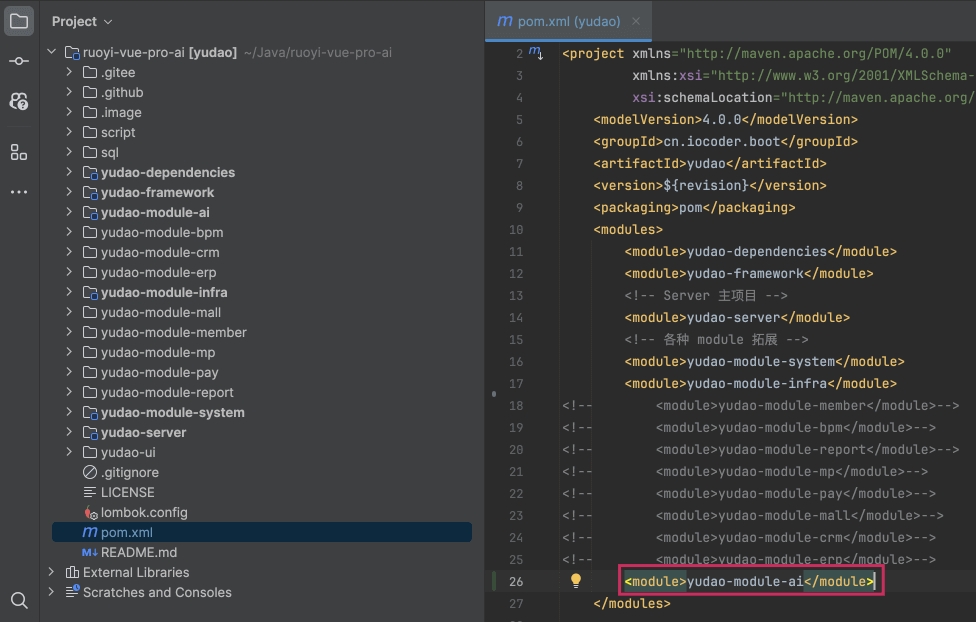
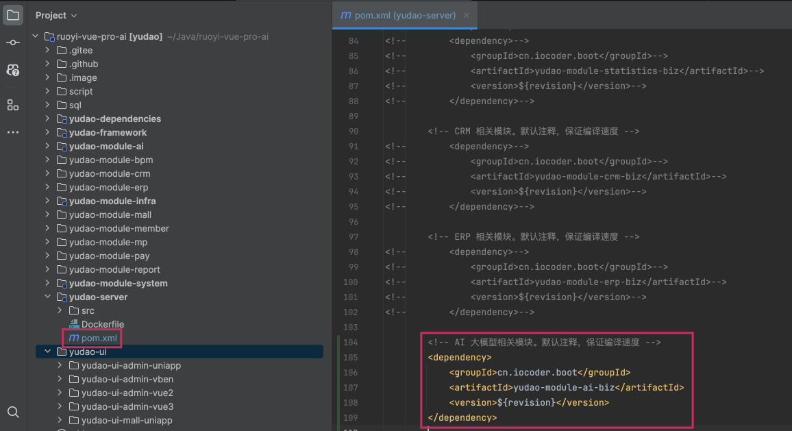
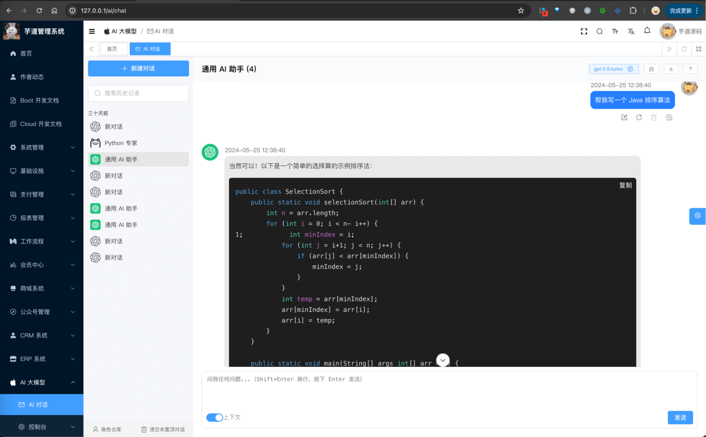

目录

# 功能开启

进度说明：

*   管理后台，请使用 [https://gitee.com/yudaocode/yudao-ui-admin-vue3 (opens new window)](https://gitee.com/yudaocode/yudao-ui-admin-vue3) 仓库的 `master` 分支
*   后端项目，请使用 [https://gitee.com/zhijiantianya/ruoyi-vue-pro (opens new window)](https://gitee.com/zhijiantianya/ruoyi-vue-pro) 仓库的 `master-jdk17` 分支

注意！仅支持 JDK 17/21 使用，因为基于 [Spring AI (opens new window)](https://spring.io/projects/spring-ai) 实现，它基于 Spring Boot 3.X 构建，所以最低要求 JDK 17！！！

AI 系统，后端由 `yudao-module-ai` 模块实现，前端由 `yudao-ui-admin-vue3` 的 `ai` 目录实现。

考虑到编译速度，默认 `yudao-module-ai` 模块是关闭的，需要手动开启。步骤如下：

*   第一步，开启 `yudao-module-ai` 模块
*   第二步，导入 AI 系统的 SQL 数据库脚本
*   第三步，重启后端项目，确认功能是否生效

## [#](#_1-第一步-开启模块) 1. 第一步，开启模块

① 修改根目录的 [`pom.xml` (opens new window)](https://github.com/YunaiV/ruoyi-vue-pro/blob/master/pom.xml) 文件，取消 `yudao-module-ai` 模块的注释。如下图所示：

② 修改 `yudao-server` 目录的 [`pom.xml` (opens new window)](https://github.com/YunaiV/ruoyi-vue-pro/blob/master/yudao-server/pom.xml) 文件，引入 `yudao-module-ai` 模块。如下图所示：

③ 点击 IDEA 右上角的【Reload All Maven Projects】，刷新 Maven 依赖。如下图所示：

## [#](#_2-第二步-导入-sql) 2. 第二步，导入 SQL

点击 [`ai-2024-07-07.sql.zip` (opens new window)](https://t.zsxq.com/09F92) 下载附件，解压出 SQL 文件，然后导入到数据库中。

所以表名字，都使用 `ai_` 作为前缀。

## [#](#_3-第三步-重启项目) 3. 第三步，重启项目

重启后端项目，然后访问前端的 AI 城菜单，确认功能是否生效。如下图所示：

至此，我们就成功开启了 AI 的功能 🙂

可以访问 \[AI 大模型 -> AI 对话\] 菜单，点击左上角的【新建对话】按钮后，确认右上角的模型是“deepseek”后，就可以和 AI 大模型聊起来了！

友情提示：如果你碰到 Spring AI 相关的包，无法从 Maven 仓库下载下来，可以参考如下的链接解决：

[https://t.zsxq.com/gFtUj (opens new window)](https://t.zsxq.com/gFtUj)