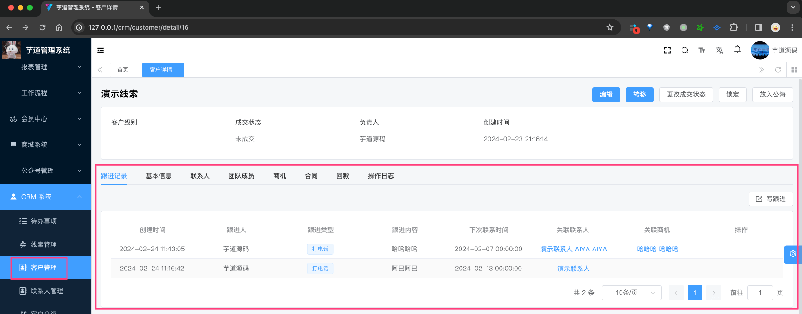
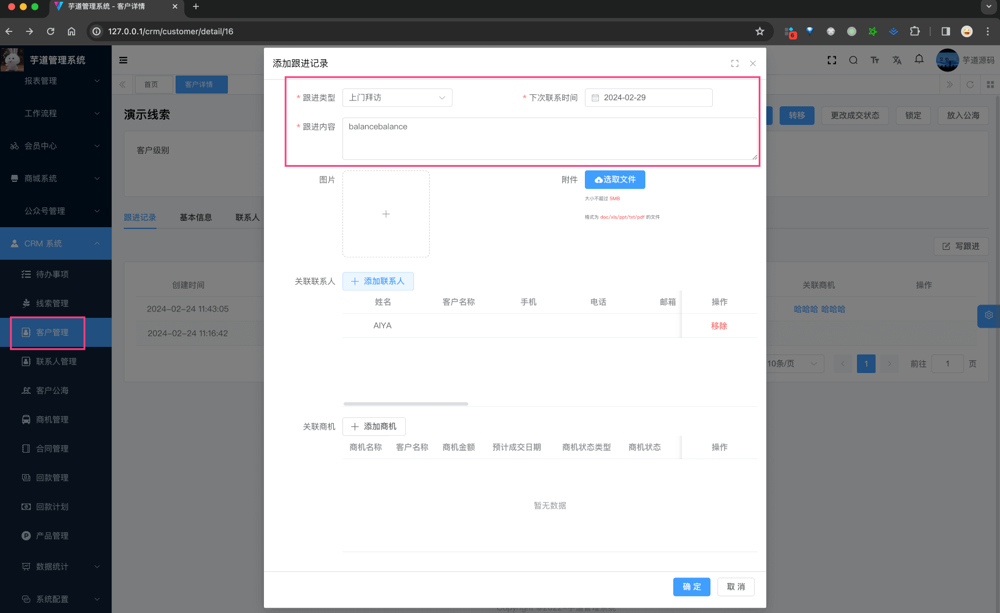
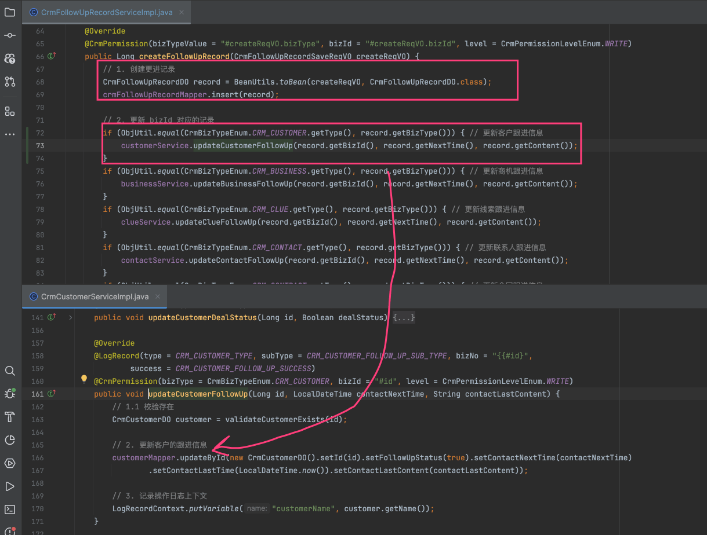
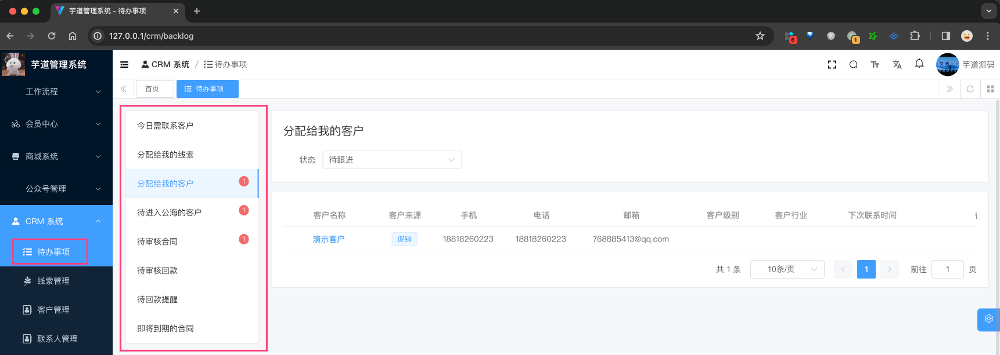
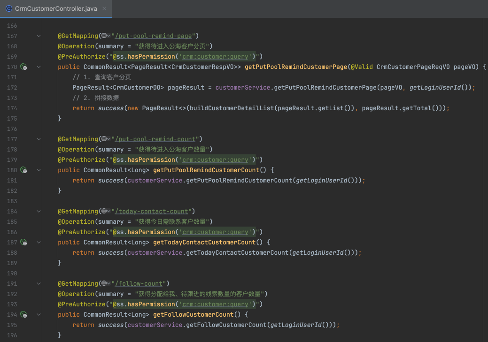

目录

# 【通用】跟进记录、待办事项

跟进记录，由 `yudao-module-crm-biz` 后端模块的 `followup` 包实现，支持线索、客户、联系人、商机、合同等对象的跟进记录。

## [#](#_1-表结构) 1. 表结构

> 省略 creator/create\_time/updater/update\_time/deleted/tenant\_id 等通用字段

```sql
CREATE TABLE `crm_follow_up_record` (
  `id` bigint NOT NULL AUTO_INCREMENT COMMENT '编号',
  
  `biz_type` int DEFAULT NULL COMMENT '数据类型',
  `biz_id` bigint DEFAULT NULL COMMENT '数据编号',

  `next_time` datetime DEFAULT NULL COMMENT '下次联系时间',  
  `type` int DEFAULT NULL COMMENT '跟进类型',
  `content` varchar(512) CHARACTER SET utf8mb4 COLLATE utf8mb4_unicode_ci DEFAULT '' COMMENT '跟进内容',
  `pic_urls` varchar(1024) COLLATE utf8mb4_unicode_ci DEFAULT NULL COMMENT '图片',
  `file_urls` varchar(1024) COLLATE utf8mb4_unicode_ci DEFAULT NULL COMMENT '附件',
  
  `business_ids` varchar(255) CHARACTER SET utf8mb4 COLLATE utf8mb4_unicode_ci DEFAULT '' COMMENT '关联的商机编号数组',
  `contact_ids` varchar(255) CHARACTER SET utf8mb4 COLLATE utf8mb4_unicode_ci DEFAULT '' COMMENT '关联的联系人编号数组',
   PRIMARY KEY (`id`) USING BTREE
) ENGINE=InnoDB AUTO_INCREMENT=33 DEFAULT CHARSET=utf8mb4 COLLATE=utf8mb4_unicode_ci ROW_FORMAT=DYNAMIC COMMENT='CRM 跟进记录';

```

① `biz_type`、`biz_id` 字段：关联被跟进的对象，其中 `biz_type` 由 CrmBizTypeEnum 枚举，包括线索、客户、联系人、商机、合同等等。

② 从 `type` 到 `file_urls` 字段：跟进记录的基本信息，包括跟进类型、跟进内容、下次联系时间、图片、附件等等。比较重要的是 `next_time` 字段，用于提醒用户下次联系时间。

③ `business_ids`、`contact_ids` 字段：关联的商机编号数组、关联的联系人编号数组。例如说，某个跟进记录关联了 3 个商机、2 个联系人。

## [#](#_2-管理后台) 2. 管理后台

在每个数据的详情界面，有一个 \[跟进记录\] 的功能，可以查看、新增、删除跟进记录。如下图所示：



① 点击【写跟进】按钮，会弹出一个对话框，可以填写跟进记录的基本信息。如下图所示：



② 确认后，会新增一条跟进记录。另外，在这个过程中，会更新对应对象的 `next_time` 字段，用于提醒用户下次联系时间。如下图所示：



也就是说，`crm_follow_up_record` 用于记录每一次跟进，`biz_type` + `biz_id` 对应的对象（客户、商机、联系人等等）自己也会记录最后一次的跟进信息。

## [#](#_2-待办事项) 2. 待办事项

对应 \[CRM 系统 -> 待办事项\] 菜单，对应 `yudao-ui-admin-vue3` 项目的 `@/views/crm/backlog` 目录。如下图所示：



它目前没有单独的表存储，或者专属的后端模块，而是通过每个对象的 Controller 实现的。比如说，客户的待办事项是通过 CrmCustomerController 实现的。如下图所示：

