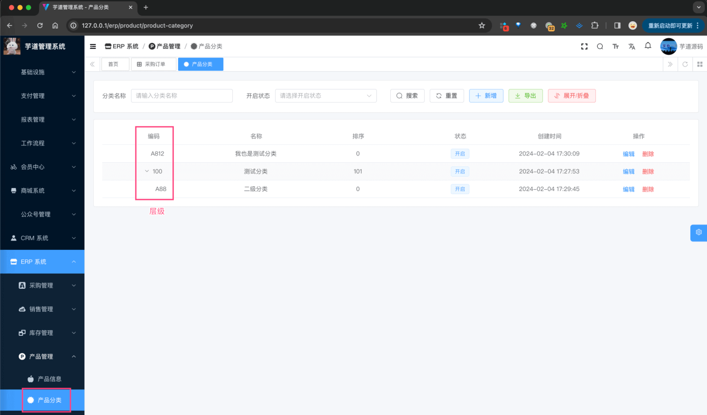
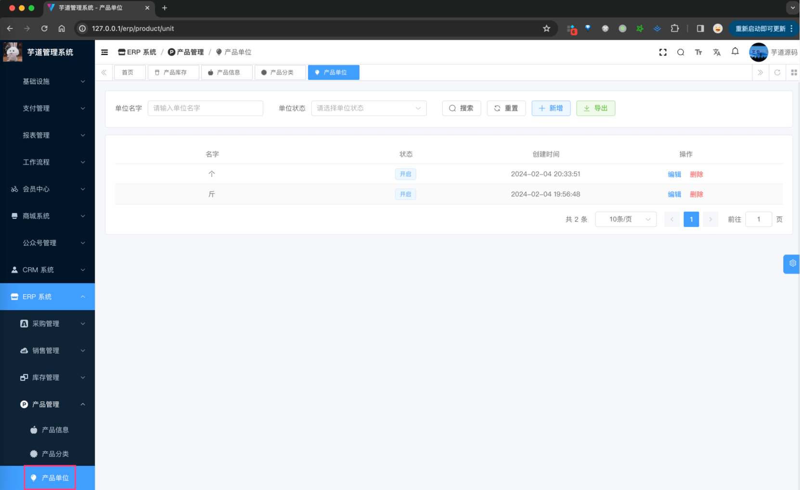
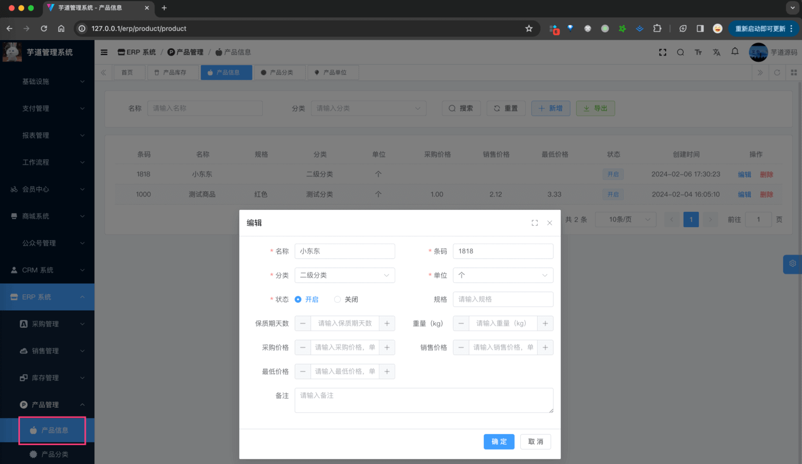

目录

# 【产品】产品信息、分类、单位

友情提示：

不同 ERP 系统，产品可能也会叫做物料、商品等，我们项目统一都叫产品。

产品模块，由 `yudao-module-erp-biz` 后端模块的 `product` 包实现，主要有产品信息、产品分类、产品单位等功能。如下图所示：


## [#](#_1-产品分类) 1. 产品分类

产品分类，由 ErpProductCategoryController 提供接口。

### [#](#_1-1-表结构) 1.1 表结构

> 省略 creator/create\_time/updater/update\_time/deleted/tenant\_id 等通用字段

```sql
CREATE TABLE `erp_product_category` (
  `id` bigint NOT NULL AUTO_INCREMENT COMMENT '分类编号',
  `parent_id` bigint NOT NULL COMMENT '父分类编号',
  `name` varchar(255) CHARACTER SET utf8mb4 COLLATE utf8mb4_unicode_ci NOT NULL COMMENT '分类名称',
  `code` varchar(100) CHARACTER SET utf8mb4 COLLATE utf8mb4_unicode_ci NOT NULL COMMENT '分类编码',
  `sort` int DEFAULT '0' COMMENT '分类排序',
  `status` tinyint NOT NULL COMMENT '开启状态',
  PRIMARY KEY (`id`) USING BTREE
) ENGINE=InnoDB AUTO_INCREMENT=87 DEFAULT CHARSET=utf8mb4 COLLATE=utf8mb4_unicode_ci COMMENT='ERP 产品分类';

```

分类目前支持无限层级，其中 `parent_id` 为 0 的是一级分类。

### [#](#_1-2-管理后台) 1.2 管理后台

对应 \[ERP 系统 -> 产品管理 -> 产品分类\] 菜单，对应 `yudao-ui-admin-vue3` 项目的 `@/views/erp/product/category` 目录。



## [#](#_2-产品单位) 2. 产品单位

产品单位，由 ErpProductUnitController 提供接口。

### [#](#_2-1-表结构) 2.1 表结构

> 省略 creator/create\_time/updater/update\_time/deleted/tenant\_id 等通用字段

```sql
CREATE TABLE `erp_product_unit` (
  `id` bigint NOT NULL AUTO_INCREMENT COMMENT '单位编号',
  `name` varchar(50) COLLATE utf8mb4_unicode_ci NOT NULL COMMENT '单位名字',
  `status` tinyint NOT NULL COMMENT '单位状态',
  PRIMARY KEY (`id`)
) ENGINE=InnoDB AUTO_INCREMENT=3 DEFAULT CHARSET=utf8mb4 COLLATE=utf8mb4_unicode_ci COMMENT='ERP 产品单位表';

```

### [#](#_2-2-管理后台) 2.2 管理后台

对应 \[ERP 系统 -> 产品管理 -> 产品单位\] 菜单，对应 `yudao-ui-admin-vue3` 项目的 `@/views/erp/product/unit` 目录。



## [#](#_3-产品-物料) 3. 产品（物料）

产品信息，由 ErpProductCategoryController 提供接口。

### [#](#_3-1-表结构) 3.1 表结构

```sql
CREATE TABLE `erp_product` (
  `id` bigint NOT NULL AUTO_INCREMENT COMMENT '产品编号',
  `name` varchar(100) CHARACTER SET utf8mb4 COLLATE utf8mb4_unicode_ci NOT NULL COMMENT '产品名称',
  `bar_code` varchar(50) CHARACTER SET utf8mb4 COLLATE utf8mb4_unicode_ci NOT NULL COMMENT '产品条码',
  `category_id` bigint NOT NULL COMMENT '产品分类编号',
  `unit_id` int NOT NULL COMMENT '单位编号',
  `status` tinyint NOT NULL COMMENT '产品状态',
  `standard` varchar(100) CHARACTER SET utf8mb4 COLLATE utf8mb4_unicode_ci DEFAULT NULL COMMENT '产品规格',
  `remark` varchar(500) CHARACTER SET utf8mb4 COLLATE utf8mb4_unicode_ci DEFAULT NULL COMMENT '产品备注',
  `expiry_day` int DEFAULT NULL COMMENT '保质期天数',
  `weight` decimal(24,6) DEFAULT NULL COMMENT '基础重量（kg）',
  `purchase_price` decimal(24,6) DEFAULT NULL COMMENT '采购价格，单位：元',
  `sale_price` decimal(24,6) DEFAULT NULL COMMENT '销售价格，单位：元',
  `min_price` decimal(24,6) DEFAULT NULL COMMENT '最低价格，单位：元',
  PRIMARY KEY (`id`)
) ENGINE=InnoDB AUTO_INCREMENT=3 DEFAULT CHARSET=utf8mb4 COLLATE=utf8mb4_unicode_ci COMMENT='ERP 产品表';

```

① `bar_code` 为产品条码，可用于 [MALL 商城系统](/mall-preview) 的商品 SKU 的打通。

② `category_id` 为产品分类编号，关联 `erp_product_category` 表的 `id` 字段。

③ `unit_id` 为单位编号，关联 `erp_product_unit` 表的 `id` 字段。

④ `status` 为产品状态，0 开启、1 禁用。

⑤ `purchase_price` 为采购价格，单位：元，默认只有 2 位小数。目前它可用于采购订单的价格计算，稍后可以看到。

`sale_price` 为销售价格，单位：元，默认只有 2 位小数。目前它可用于销售订单的价格计算，稍后可以看到。

⑥ `standard`、`expiry_day`、`weight` 只是一些信息字段，仅仅用于展示，没有什么特殊逻辑。

### [#](#_3-2-管理后台) 3.2 管理后台

对应 \[ERP 系统 -> 产品管理 -> 产品信息\] 菜单，对应 `yudao-ui-admin-vue3` 项目的 `@/views/erp/product/product` 目录。

