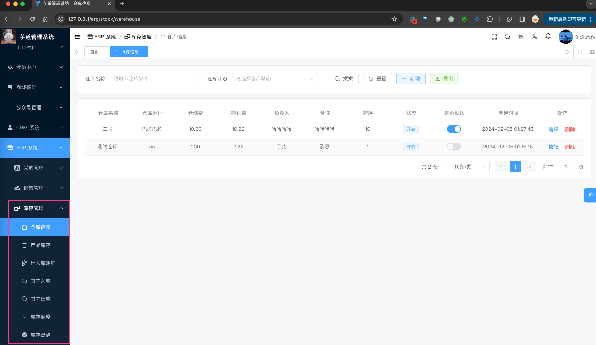
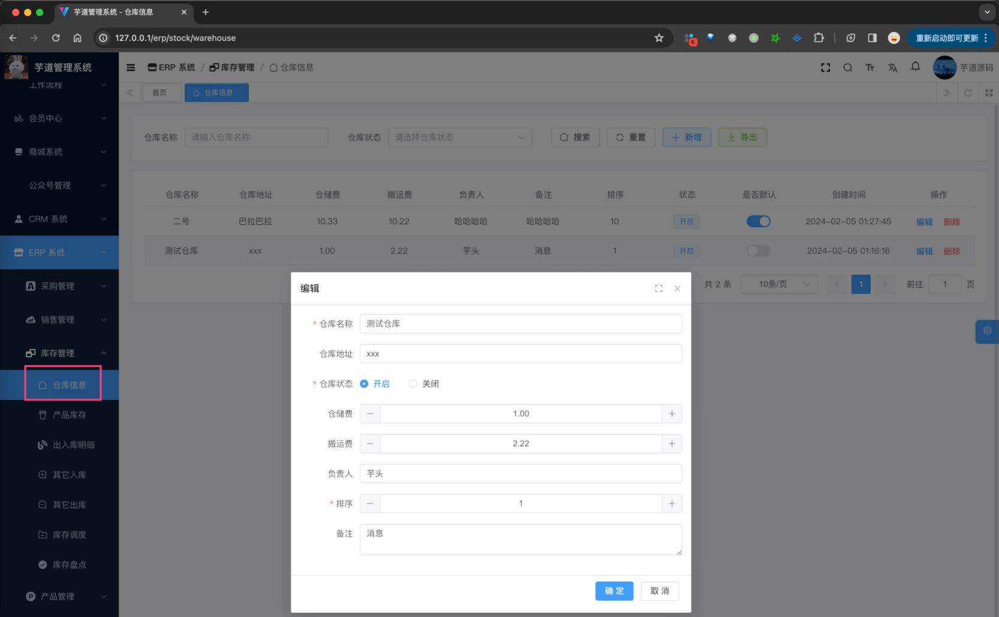
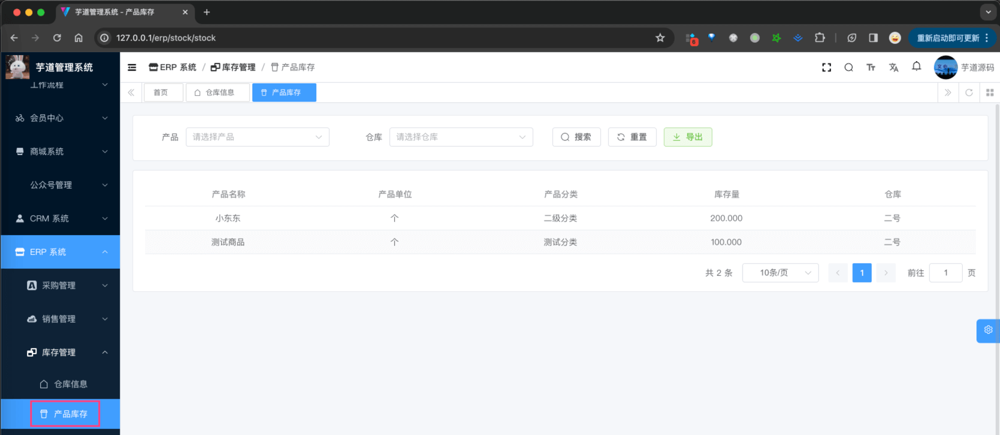
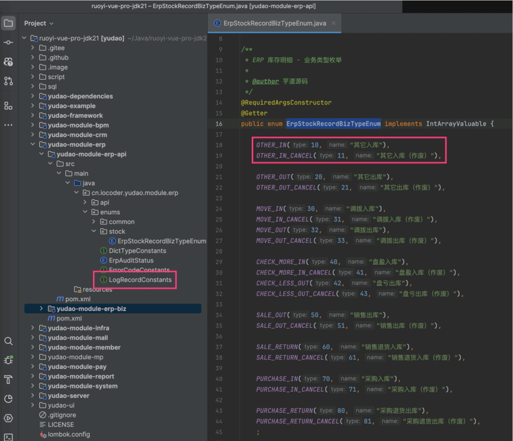
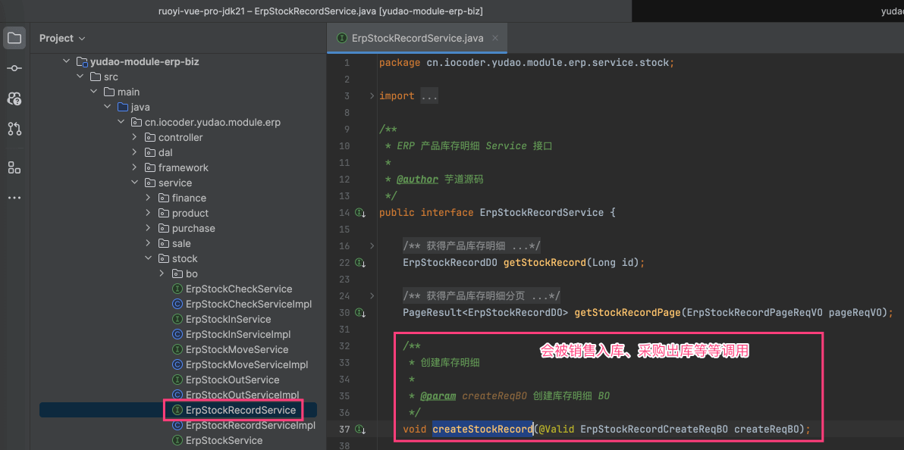
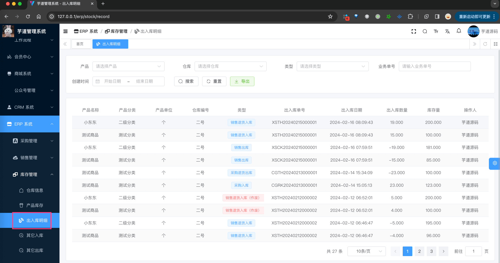

目录

# 【库存】产品库存、库存明细

库存模块，由 `yudao-module-erp-biz` 后端模块的 `stock` 包实现，主要包括如下菜单：



本文，我们主要讲解仓库、产品库存、库存明细三个功能。它们的表关系如下图所示：


## [#](#_1-仓库) 1. 仓库

仓库，由 ErpWarehouseController 提供接口。

### [#](#_1-表结构) 1. 表结构

> 省略 creator/create\_time/updater/update\_time/deleted/tenant\_id 等通用字段

```sql
CREATE TABLE `erp_warehouse` (
  `id` bigint NOT NULL AUTO_INCREMENT COMMENT '仓库编号',
  `name` varchar(20) CHARACTER SET utf8mb4 COLLATE utf8mb4_unicode_ci NOT NULL COMMENT '仓库名称',
  `address` varchar(50) CHARACTER SET utf8mb4 COLLATE utf8mb4_unicode_ci DEFAULT NULL COMMENT '仓库地址',
  `sort` bigint NOT NULL COMMENT '排序',
  `remark` varchar(100) CHARACTER SET utf8mb4 COLLATE utf8mb4_unicode_ci DEFAULT NULL COMMENT '备注',
  `principal` varchar(20) CHARACTER SET utf8mb4 COLLATE utf8mb4_unicode_ci DEFAULT NULL COMMENT '负责人',
  `warehouse_price` decimal(24,6) DEFAULT NULL COMMENT '仓储费，单位：元',
  `truckage_price` decimal(24,6) DEFAULT NULL COMMENT '搬运费，单位：元',
  `status` tinyint NOT NULL COMMENT '开启状态',
  `default_status` bit(1) DEFAULT b'0' COMMENT '是否默认',
  PRIMARY KEY (`id`)
) ENGINE=InnoDB AUTO_INCREMENT=3 DEFAULT CHARSET=utf8mb4 COLLATE=utf8mb4_unicode_ci COMMENT='ERP 仓库表';

```

都是一些信息字段，仅仅用于展示，没有什么特殊逻辑。

### [#](#_2-管理后台) 2. 管理后台

对应 \[ERP 系统 -> 库存管理 -> 仓库信息\] 菜单，对应 `yudao-ui-admin-vue3` 项目的 `@/views/erp/stock/warehouse` 目录。



## [#](#_2-产品库存) 2. 产品库存

产品库存，由 ErpProductStockController 提供接口。

### [#](#_2-1-表结构) 2.1 表结构

> 省略 creator/create\_time/updater/update\_time/deleted/tenant\_id 等通用字段

```sql
CREATE TABLE `erp_stock` (
  `id` bigint NOT NULL AUTO_INCREMENT COMMENT '编号',
  `product_id` bigint NOT NULL COMMENT '产品编号',
  `warehouse_id` bigint NOT NULL COMMENT '仓库编号',
  `count` decimal(24,6) NOT NULL COMMENT '库存数量',
  PRIMARY KEY (`id`)
) ENGINE=InnoDB AUTO_INCREMENT=5 DEFAULT CHARSET=utf8mb4 COLLATE=utf8mb4_unicode_ci COMMENT='ERP 产品库存表';

```

① `product_id` 和 `warehouse_id` 分别关联对应的产品和仓库。本质上，它就是记录一个产品在某个仓库的库存数量。

② `count` 是库存数量，注意它使用的是 `decimal` 类型，默认保留 3 位小数，并不是一个整数。

### [#](#_2-2-管理后台) 2.2 管理后台

对应 \[ERP 系统 -> 库存管理 -> 产品库存\] 菜单，对应 `yudao-ui-admin-vue3` 项目的 `@/views/erp/stock/product-stock` 目录。



## [#](#_3-库存明细) 3. 库存明细

库存明细，由 ErpStockRecordController 提供接口。

### [#](#_3-1-表结构) 3.1 表结构

> 省略 creator/create\_time/updater/update\_time/deleted/tenant\_id 等通用字段

```sql
CREATE TABLE `erp_stock_record` (
  `id` bigint NOT NULL AUTO_INCREMENT COMMENT '编号',
  `product_id` bigint NOT NULL COMMENT '产品编号',
  `warehouse_id` bigint NOT NULL COMMENT '仓库编号',
  
  `count` decimal(24,6) NOT NULL COMMENT '出入库数量',
  `total_count` decimal(24,6) NOT NULL COMMENT '总库存量',
  
  `biz_type` tinyint NOT NULL COMMENT '业务类型',
  `biz_id` bigint NOT NULL COMMENT '业务编号',
  `biz_item_id` bigint NOT NULL COMMENT '业务项编号',
  `biz_no` varchar(255) CHARACTER SET utf8mb4 COLLATE utf8mb4_unicode_ci NOT NULL COMMENT '业务单号',
  PRIMARY KEY (`id`)
) ENGINE=InnoDB AUTO_INCREMENT=41 DEFAULT CHARSET=utf8mb4 COLLATE=utf8mb4_unicode_ci COMMENT='ERP 产品库存明细表';

```

① `product_id` 和 `warehouse_id` 分别关联对应的产品和仓库。`count` 是出入库数量，`total_count` 是总库存量。

本质上，它是记录一个产品在某个仓库的库存变化（出入库）数量。其中 `count` 为正数表示入库，为负数表示出库。

② `biz_type` 是业务类型，比如采购入库、销售出库等。由 ErpStockRecordBizTypeEnum 枚举，如下图所示：



`biz_id` 和 `biz_item_id`、`biz_no` 用于关联对应的业务单据信息。

有一点要注意，每个出入库操作是可以取消的，所以在 `biz_type` 都有一个 `_CANCEL` 的对应类型。例如说采购入库 `PURCHASE_IN` 对应的取消类型是 `PURCHASE_IN_CANCEL`。此时，会有两条记录：

*   一条是 `PURCHASE_IN` 的 `count` 正数入库
*   一条是 `PURCHASE_IN_CANCEL` 的 `count` 负数出库

它的具体实现，可见 ErpStockRecordService 的 `#createStockRecord(...)` 方法，如下图所示：



### [#](#_3-2-管理后台) 3.2 管理后台

对应 \[ERP 系统 -> 库存管理 -> 库存明细\] 菜单，对应 `yudao-ui-admin-vue3` 项目的 `@/views/erp/stock/record` 目录。

