目录

# 【销售】销售订单、出库、退货

友情提示：“销售”和“采购”目前是基本一致的，只是“销售”是向“客户”卖，“采购”是从“供应商”买。

销售模块，由 `yudao-module-erp-biz` 后端模块的 `sale` 包实现，主要有销售订单、销售出库、销售退货等功能。如下图所示：

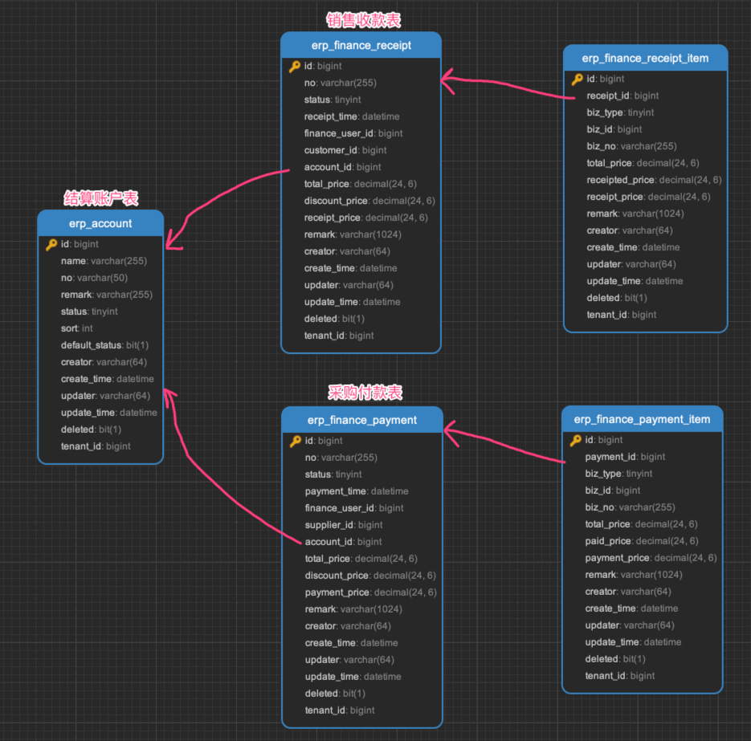

它的整体流程，如下图所示：

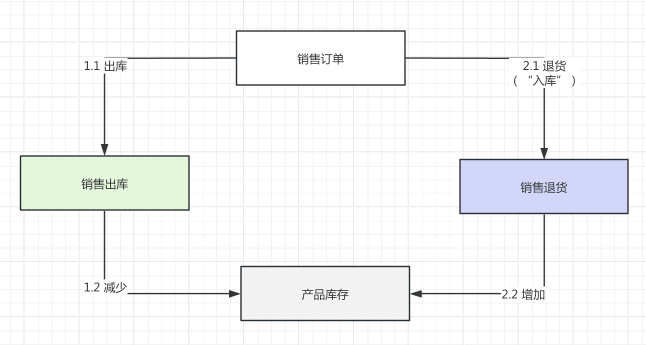

## [#](#_1-客户) 1. 客户

客户，由 ErpCustomerController 提供接口，所有销售都是针对客户进行操作的。

### [#](#_1-1-表结构) 1.1 表结构

> 省略 creator/create\_time/updater/update\_time/deleted/tenant\_id 等通用字段

```sql
CREATE TABLE `erp_customer` (
  `id` bigint NOT NULL AUTO_INCREMENT COMMENT '客户编号',
  `name` varchar(255) CHARACTER SET utf8mb4 COLLATE utf8mb4_unicode_ci NOT NULL COMMENT '客户名称',
  `contact` varchar(100) CHARACTER SET utf8mb4 COLLATE utf8mb4_unicode_ci DEFAULT NULL COMMENT '联系人',
  `mobile` varchar(30) CHARACTER SET utf8mb4 COLLATE utf8mb4_unicode_ci DEFAULT NULL COMMENT '手机号码',
  `telephone` varchar(30) CHARACTER SET utf8mb4 COLLATE utf8mb4_unicode_ci DEFAULT NULL COMMENT '联系电话',
  `email` varchar(50) CHARACTER SET utf8mb4 COLLATE utf8mb4_unicode_ci DEFAULT NULL COMMENT '电子邮箱',
  `fax` varchar(30) CHARACTER SET utf8mb4 COLLATE utf8mb4_unicode_ci DEFAULT NULL COMMENT '传真',
  `remark` varchar(255) CHARACTER SET utf8mb4 COLLATE utf8mb4_unicode_ci DEFAULT NULL COMMENT '备注',
  `status` tinyint NOT NULL COMMENT '开启状态',
  `sort` int NOT NULL COMMENT '排序',
  `tax_no` varchar(50) CHARACTER SET utf8mb4 COLLATE utf8mb4_unicode_ci DEFAULT NULL COMMENT '纳税人识别号',
  `tax_percent` decimal(24,6) DEFAULT NULL COMMENT '税率',
  `bank_name` varchar(50) CHARACTER SET utf8mb4 COLLATE utf8mb4_unicode_ci DEFAULT NULL COMMENT '开户行',
  `bank_account` varchar(50) CHARACTER SET utf8mb4 COLLATE utf8mb4_unicode_ci DEFAULT NULL COMMENT '开户账号',
  `bank_address` varchar(50) CHARACTER SET utf8mb4 COLLATE utf8mb4_unicode_ci DEFAULT NULL COMMENT '开户地址',
  PRIMARY KEY (`id` DESC)
) ENGINE=InnoDB AUTO_INCREMENT=3 DEFAULT CHARSET=utf8mb4 COLLATE=utf8mb4_unicode_ci COMMENT='ERP 客户表';

```

都是一些信息字段，仅仅用于展示，没有什么特殊逻辑。

### [#](#_1-2-管理后台) 1.2 管理后台

对应 \[ERP 系统 -> 销售管理 -> 客户信息\] 菜单，对应 `yudao-ui-admin-vue3` 项目的 `@/views/erp/sale/customer` 目录。

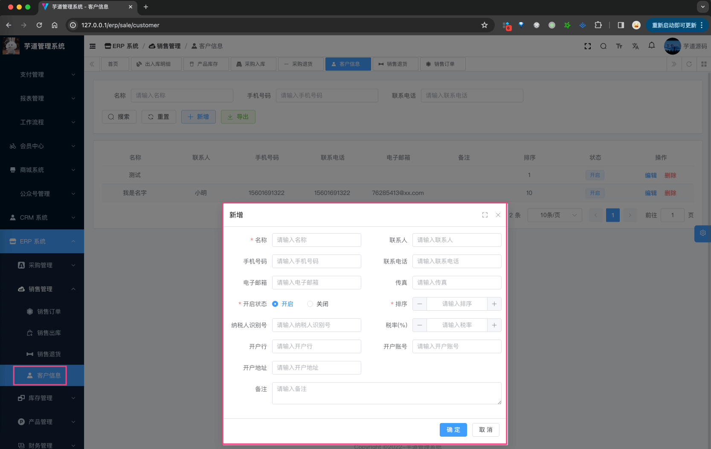

## [#](#_2-销售订单) 2. 销售订单

销售订单，由 ErpSaleOrderController 提供接口，它不会直接影响库存，只有在出库、退货等操作才会影响库存。

### [#](#_2-1-表结构) 2.1 表结构

`erp_sale_order` 表和 `erp_sale_order_items` 表，分别对应销售订单和销售订单项。

> 省略 creator/create\_time/updater/update\_time/deleted/tenant\_id 等通用字段

```sql
CREATE TABLE `erp_sale_order` (
  `id` bigint NOT NULL AUTO_INCREMENT COMMENT '编号',
  
  `no` varchar(255) COLLATE utf8mb4_unicode_ci NOT NULL COMMENT '销售单编号',
  
  `status` tinyint NOT NULL COMMENT '销售状态',
  `order_time` datetime NOT NULL COMMENT '下单时间',
  
  `customer_id` bigint NOT NULL COMMENT '客户编号',
  `account_id` bigint DEFAULT NULL COMMENT '结算账户编号',
  `sale_user_id` bigint DEFAULT NULL COMMENT '销售用户编号',
  
  `total_count` decimal(24,6) NOT NULL COMMENT '合计数量',
  `total_price` decimal(24,6) NOT NULL COMMENT '合计价格，单位：元',
  `total_product_price` decimal(24,6) NOT NULL COMMENT '合计产品价格，单位：元',
  `total_tax_price` decimal(24,6) NOT NULL COMMENT '合计税额，单位：元',
  `discount_percent` decimal(24,6) NOT NULL COMMENT '优惠率，百分比',
  `discount_price` decimal(24,6) NOT NULL COMMENT '优惠金额，单位：元',
  `deposit_price` decimal(24,6) NOT NULL DEFAULT '0.000000' COMMENT '定金金额，单位：元',
  
  `file_url` varchar(512) COLLATE utf8mb4_unicode_ci DEFAULT NULL COMMENT '附件地址',
  `remark` varchar(1024) CHARACTER SET utf8mb4 COLLATE utf8mb4_0900_ai_ci DEFAULT NULL COMMENT '备注',
  
  `out_count` decimal(24,6) NOT NULL DEFAULT '0.000000' COMMENT '销售出库数量',
  `return_count` decimal(24,6) NOT NULL DEFAULT '0.000000' COMMENT '销售退货数量',
  
  PRIMARY KEY (`id`),
  UNIQUE KEY `no` (`no`)
) ENGINE=InnoDB AUTO_INCREMENT=6 DEFAULT CHARSET=utf8mb4 COLLATE=utf8mb4_unicode_ci COMMENT='ERP 销售订单表';

```

① `no`：销售单号，一般是系统自动生成的，目前格式是 `{prefix}{yyyyMMdd}{6 位自增}`。具体可见 ErpNoRedisDAO 类。

② `status`：销售状态，统一使用 ErpAuditStatus 枚举类，只有“未审批”、“已审批”两个状态。

③ `customer_id`：客户编号，关联 `erp_customer` 表。

`account_id`：结算账户编号，关联后续的 `erp_account` 表。暂时不用关注，它用于销售的收款。

④ `total_count`、`total_price`、`total_product_price`、`total_tax_price`、`discount_percent`、`discount_price` 和 `deposit_price`：合计数量、合计价格、合计产品价格、合计税额、优惠率、优惠金额和定金金额。

⑤ `out_count`：该销售订单已经出库的数量。一个订单可以被多次销售出库，但是不能超过最大的 `total_count`，所以需要记录已经出库的数量。

⑥ `return_count`：该销售订单已经退货的数量。一个订单可以被多次销售退货，但是不能超过最大的 `total_count`，所以需要记录已经退货的数量。

* * *

```sql
CREATE TABLE `erp_sale_order_items` (
  `id` bigint NOT NULL AUTO_INCREMENT COMMENT '编号',
  
  `order_id` bigint NOT NULL COMMENT '销售订单编号',
  
  `product_id` bigint NOT NULL COMMENT '产品编号',
  
  `product_unit_id` bigint NOT NULL COMMENT '产品单位单位',
  `product_price` decimal(24,6) NOT NULL COMMENT '产品单价',
  `count` decimal(24,6) NOT NULL COMMENT '数量',
  `total_price` decimal(24,6) NOT NULL COMMENT '总价',
  `tax_percent` decimal(24,6) DEFAULT NULL COMMENT '税率，百分比',
  `tax_price` decimal(24,6) DEFAULT NULL COMMENT '税额，单位：元',
  
  `remark` varchar(1024) CHARACTER SET utf8mb4 COLLATE utf8mb4_0900_ai_ci DEFAULT NULL COMMENT '备注',
  
  `out_count` decimal(24,6) NOT NULL DEFAULT '0.000000' COMMENT '销售出库数量',
  `return_count` decimal(24,6) NOT NULL DEFAULT '0.000000' COMMENT '销售退货数量',
  
  PRIMARY KEY (`id`)
) ENGINE=InnoDB AUTO_INCREMENT=7 DEFAULT CHARSET=utf8mb4 COLLATE=utf8mb4_0900_ai_ci COMMENT='ERP 销售订单项表';

```

① `order_id`：销售订单编号，关联到上面的 `erp_sale_order` 表。

② `product_id`：产品编号。

注意，因为销售订单不直接涉及库存，所以它并没有 `warehouse_id` 字段，也就是说它不关心库存的具体仓库。

③ `product_unit_id`、`product_price`、`count`、`total_price`、`tax_percent` 和 `tax_price`：产品单位编号、产品单价、数量、总价、税率和税额。

其中 `total_price` 等于 `product_price * count + tax_price`。（额外多了税额）

④ `in_count` 和 `return_count`：同 `erp_sale_order` 表，只是它表示的是该订单“项”的出库数量和退货数量，当然它也不能超过最大的 `count`。

### [#](#_2-2-管理后台) 2.2 管理后台

对应 \[ERP 系统 -> 销售管理 -> 销售订单\] 菜单，对应 `yudao-ui-admin-vue3` 项目的 `@/views/erp/sale/order` 目录。


① 点击「新增」按钮，随便填写一些信息，点击「确认」按钮，即可新增一条销售订单。

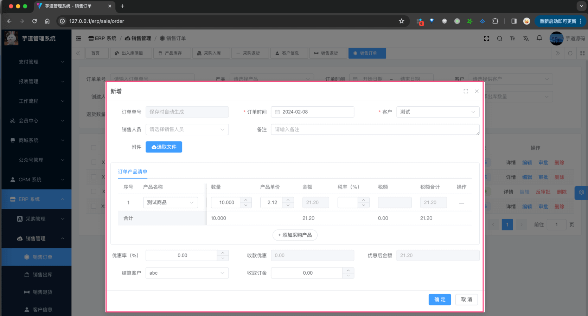

② 点击该销售订单的「审批」按钮，审批通过该销售订单，此时状态会变成“已审批”，但是并不会影响库存。

## [#](#_3-销售出库) 3. 销售出库

销售出库，由 ErpSaleOutController 提供接口，它会影响（减少）库存。总的来说，它的逻辑和 [其它出库](/erp/stock-in-out) 基本一致，只是它是针对销售的出库。

### [#](#_3-1-表结构) 3.1 表结构

`erp_sale_out` 表和 `erp_sale_out_items` 表，分别对应销售出库和销售出库项。

> 省略 creator/create\_time/updater/update\_time/deleted/tenant\_id 等通用字段

```sql
CREATE TABLE `erp_sale_out` (
  `id` bigint NOT NULL AUTO_INCREMENT COMMENT '编号',
  `no` varchar(255) CHARACTER SET utf8mb4 COLLATE utf8mb4_unicode_ci NOT NULL COMMENT '销售出库编号',
 
  `status` tinyint NOT NULL COMMENT '出库状态',
  `out_time` datetime NOT NULL COMMENT '出库时间',

  `customer_id` bigint NOT NULL COMMENT '客户编号',
  `account_id` bigint NOT NULL COMMENT '结算账户编号',
  `sale_user_id` bigint DEFAULT NULL COMMENT '销售用户编号',

  `order_id` bigint NOT NULL COMMENT '销售订单编号',
  `order_no` varchar(255) CHARACTER SET utf8mb4 COLLATE utf8mb4_unicode_ci NOT NULL COMMENT '销售订单号',
  
  `total_count` decimal(24,6) NOT NULL COMMENT '合计数量',
  `total_price` decimal(24,6) NOT NULL COMMENT '合计价格，单位：元',
  `total_product_price` decimal(24,6) NOT NULL COMMENT '合计产品价格，单位：元',
  `total_tax_price` decimal(24,6) NOT NULL COMMENT '合计税额，单位：元',
  `discount_percent` decimal(24,6) NOT NULL COMMENT '优惠率，百分比',
  `discount_price` decimal(24,6) NOT NULL COMMENT '优惠金额，单位：元',
  `other_price` decimal(24,6) NOT NULL DEFAULT '0.000000' COMMENT '其它金额，单位：元',

  `receipt_price` decimal(24,6) NOT NULL DEFAULT '0.000000' COMMENT '已收款金额，单位：元',
  
  `file_url` varchar(512) CHARACTER SET utf8mb4 COLLATE utf8mb4_unicode_ci DEFAULT NULL COMMENT '附件地址',
  `remark` varchar(1024) CHARACTER SET utf8mb4 COLLATE utf8mb4_0900_ai_ci DEFAULT NULL COMMENT '备注',
  PRIMARY KEY (`id`),
  UNIQUE KEY `no` (`no`)
) ENGINE=InnoDB AUTO_INCREMENT=15 DEFAULT CHARSET=utf8mb4 COLLATE=utf8mb4_unicode_ci COMMENT='ERP 销售出库表';

```

① `no`：销售出库编号，一般是系统自动生成的，目前格式是 `{prefix}{yyyyMMdd}{6 位自增}`。具体可见 ErpNoRedisDAO 类。

② `status`：出库状态，统一使用 ErpAuditStatus 枚举类，只有“未审批”、“已审批”两个状态。

③ `customer_id`：客户编号，关联 `erp_customer` 表。

`account_id`：结算账户编号，关联后续的 `erp_account` 表。暂时不用关注，它用于销售的收款。

④ `order_id` 和 `order_no`：销售订单编号和销售订单号，关联到上面的 `erp_sale_order` 表。

⑤ `total_count`、`total_price`、`total_product_price`、`total_tax_price`、`discount_percent`、`discount_price` 和 `other_price`：合计数量、合计价格、合计产品价格、合计税额、优惠率、优惠金额和其它金额。

其中，`total_price` 等于 `total_product_price + total_tax_price + other_price - discount_price`。

⑥ `receipt_price`：已收款金额，单位：元。暂时不用关注，它用于销售的收款。

* * *

```sql
CREATE TABLE `erp_sale_out_items` (
  `id` bigint NOT NULL AUTO_INCREMENT COMMENT '编号',
  
  `out_id` bigint NOT NULL COMMENT '销售出库编号',
  
  `order_item_id` bigint NOT NULL COMMENT '销售订单项编号',
  
  `warehouse_id` bigint NOT NULL COMMENT '仓库编号',
  `product_id` bigint NOT NULL COMMENT '产品编号',
  
  `product_unit_id` bigint NOT NULL COMMENT '产品单位单位',
  `product_price` decimal(24,6) NOT NULL COMMENT '产品单价',
  `count` decimal(24,6) NOT NULL COMMENT '数量',
  `total_price` decimal(24,6) NOT NULL COMMENT '总价',
  `tax_percent` decimal(24,6) DEFAULT NULL COMMENT '税率，百分比',
  `tax_price` decimal(24,6) DEFAULT NULL COMMENT '税额，单位：元',

  `remark` varchar(1024) CHARACTER SET utf8mb4 COLLATE utf8mb4_0900_ai_ci DEFAULT NULL COMMENT '备注',
  PRIMARY KEY (`id`)
) ENGINE=InnoDB AUTO_INCREMENT=27 DEFAULT CHARSET=utf8mb4 COLLATE=utf8mb4_0900_ai_ci COMMENT='ERP 销售出库项表';

```

① `out_id`：销售出库编号，关联到上面的 `erp_sale_out` 表。

② `order_item_id`：销售订单项编号，关联到上面的 `erp_sale_order_items` 表，因为它需要对应的 `out_count` 字段。

③ `warehouse_id` 和 `product_id`：分别关联到仓库和产品，因为它涉及到库存变更。

④ `product_unit_id`、`product_price`、`count`、`total_price`、`tax_percent` 和 `tax_price`：产品单位编号、产品单价、数量、总价、税率和税额。

其中 `total_price` 等于 `product_price * count + tax_price`。（额外多了税额）

### [#](#_3-2-管理后台) 3.2 管理后台

对应 \[ERP 系统 -> 销售管理 -> 销售出库\] 菜单，对应 `yudao-ui-admin-vue3` 项目的 `@/views/erp/sale/out` 目录。


① 点击「新增」按钮，随便填写一些信息，点击「确认」按钮，即可新增一条销售出库。

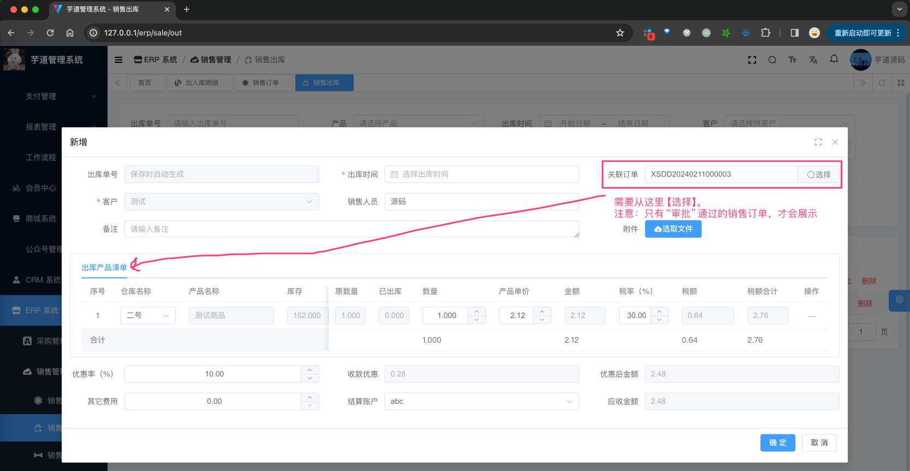

② 点击该销售出库的「审批」按钮，审批通过该销售出库，此时状态会变成“已审批”，同时会减少对应的库存、新增库存明细。如下图所示：

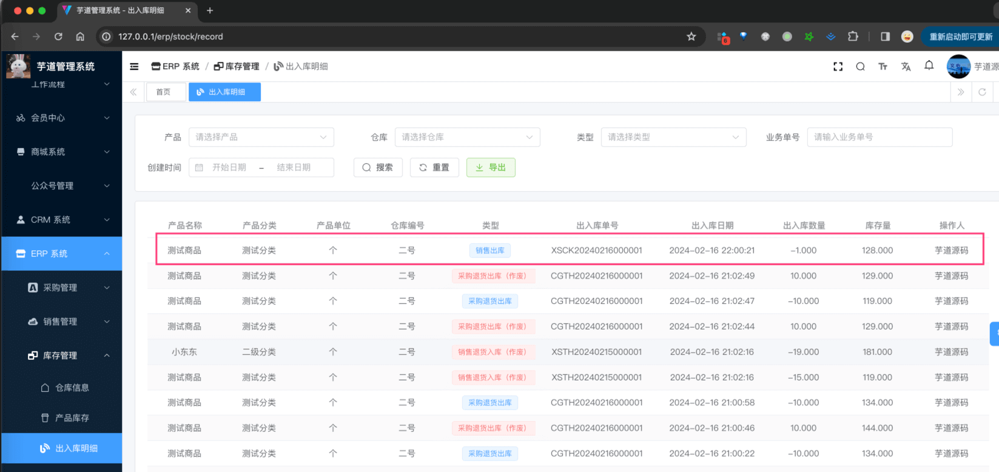

③ 点击该销售出库的「反审批」按钮，反审批该销售出库，此时状态会变成“未审批”，同时会增加对应的库存、新增库存明细。如下图所示：

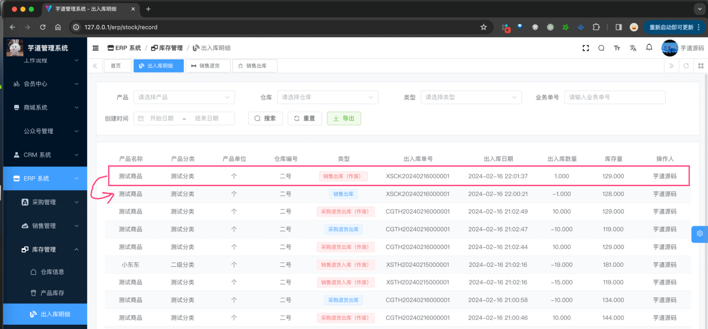

## [#](#_4-销售退货) 4. 销售退货

销售退货，由 ErpSaleReturnController 提供接口，它会影响（增加）库存。总的来说，它的逻辑和 [其它入库](/erp/stock-in-out) 基本一致，只是它是针对销售的入库。

### [#](#_4-1-表结构) 4.1 表结构

友情提示：销售退货相关的表，和销售出库相关的表结构基本一致。

`erp_sale_return` 表和 `erp_sale_return_items` 表，分别对应销售退货和销售退货项。

> 省略 creator/create\_time/updater/update\_time/deleted/tenant\_id 等通用字段

```sql
CREATE TABLE `erp_sale_return` (
  `id` bigint NOT NULL AUTO_INCREMENT COMMENT '编号',
  `no` varchar(255) CHARACTER SET utf8mb4 COLLATE utf8mb4_unicode_ci NOT NULL COMMENT '销售退货编号',
  
  `status` tinyint NOT NULL COMMENT '退货状态',
  `return_time` datetime NOT NULL COMMENT '退货时间',

  `customer_id` bigint NOT NULL COMMENT '客户编号',
  `account_id` bigint NOT NULL COMMENT '结算账户编号',
  `sale_user_id` bigint DEFAULT NULL COMMENT '销售用户编号',

  `order_id` bigint NOT NULL COMMENT '销售订单编号',
  `order_no` varchar(255) CHARACTER SET utf8mb4 COLLATE utf8mb4_unicode_ci NOT NULL COMMENT '销售订单号',
  
  `total_count` decimal(24,6) NOT NULL COMMENT '合计数量',
  `total_price` decimal(24,6) NOT NULL COMMENT '合计价格，单位：元',
  `total_product_price` decimal(24,6) NOT NULL COMMENT '合计产品价格，单位：元',
  `total_tax_price` decimal(24,6) NOT NULL COMMENT '合计税额，单位：元',
  `discount_percent` decimal(24,6) NOT NULL COMMENT '优惠率，百分比',
  `discount_price` decimal(24,6) NOT NULL COMMENT '优惠金额，单位：元',
  `other_price` decimal(24,6) NOT NULL DEFAULT '0.000000' COMMENT '其它金额，单位：元',

  `refund_price` decimal(24,6) NOT NULL DEFAULT '0.000000' COMMENT '已退款金额，单位：元',
  
  `file_url` varchar(512) CHARACTER SET utf8mb4 COLLATE utf8mb4_unicode_ci DEFAULT NULL COMMENT '附件地址',
  `remark` varchar(1024) CHARACTER SET utf8mb4 COLLATE utf8mb4_0900_ai_ci DEFAULT NULL COMMENT '备注',
  PRIMARY KEY (`id`),
  UNIQUE KEY `no` (`no`)
) ENGINE=InnoDB AUTO_INCREMENT=23 DEFAULT CHARSET=utf8mb4 COLLATE=utf8mb4_unicode_ci COMMENT='ERP 销售退货表';

```

① `no`：销售退货编号，一般是系统自动生成的，目前格式是 `{prefix}{yyyyMMdd}{6 位自增}`。具体可见 ErpNoRedisDAO 类。

② `status`：退货状态，统一使用 ErpAuditStatus 枚举类，只有“未审批”、“已审批”两个状态。

③ `customer_id`：客户编号，关联 `erp_customer` 表。

`account_id`：结算账户编号，关联后续的 `erp_account` 表。暂时不用关注，它用于销售的收款。

④ `order_id` 和 `order_no`：销售订单编号和销售订单号，关联到上面的 `erp_sale_order` 表。

⑤ `total_count`、`total_price`、`total_product_price`、`total_tax_price`、`discount_percent`、`discount_price` 和 `other_price`：合计数量、合计价格、合计产品价格、合计税额、优惠率、优惠金额和其它金额。

其中，`total_price` 等于 `total_product_price + total_tax_price + other_price - discount_price`。

【差异】⑥ `refund_price`：已退款金额，单位：元。暂时不用关注，它用于销售的收款。

* * *

```sql
CREATE TABLE `erp_sale_return_items` (
  `id` bigint NOT NULL AUTO_INCREMENT COMMENT '编号',
  
  `return_id` bigint NOT NULL COMMENT '销售退货编号',
  
  `order_item_id` bigint NOT NULL COMMENT '销售订单项编号',
  
  `warehouse_id` bigint NOT NULL COMMENT '仓库编号',
  `product_id` bigint NOT NULL COMMENT '产品编号',
  
  `product_unit_id` bigint NOT NULL COMMENT '产品单位单位',
  `product_price` decimal(24,6) NOT NULL COMMENT '产品单价',
  `count` decimal(24,6) NOT NULL COMMENT '数量',
  `total_price` decimal(24,6) NOT NULL COMMENT '总价',
  `tax_percent` decimal(24,6) DEFAULT NULL COMMENT '税率，百分比',
  `tax_price` decimal(24,6) DEFAULT NULL COMMENT '税额，单位：元',

  `remark` varchar(1024) CHARACTER SET utf8mb4 COLLATE utf8mb4_0900_ai_ci DEFAULT NULL COMMENT '备注',
  PRIMARY KEY (`id`)
) ENGINE=InnoDB AUTO_INCREMENT=43 DEFAULT CHARSET=utf8mb4 COLLATE=utf8mb4_0900_ai_ci COMMENT='ERP 销售退货项表';

```

① `return_id`：销售退货编号，关联到上面的 `erp_sale_return` 表。

② `order_item_id`：销售订单项编号，关联到上面的 `erp_sale_order_items` 表，因为它需要对应的 `return_count` 字段。

③ `warehouse_id` 和 `product_id`：分别关联到仓库和产品，因为它涉及到库存变更。

④ `product_unit_id`、`product_price`、`count`、`total_price`、`tax_percent` 和 `tax_price`：产品单位编号、产品单价、数量、总价、税率和税额。

其中 `total_price` 等于 `product_price * count + tax_price`。（额外多了税额）

### [#](#_4-2-管理后台) 4.2 管理后台

对应 \[ERP 系统 -> 销售管理 -> 销售退货\] 菜单，对应 `yudao-ui-admin-vue3` 项目的 `@/views/erp/sale/return` 目录。

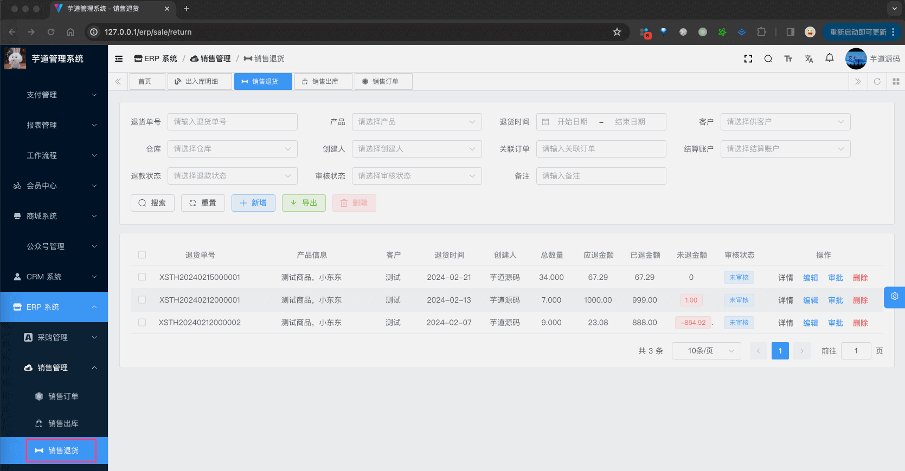

① 点击「新增」按钮，随便填写一些信息，点击「确认」按钮，即可新增一条销售退货。

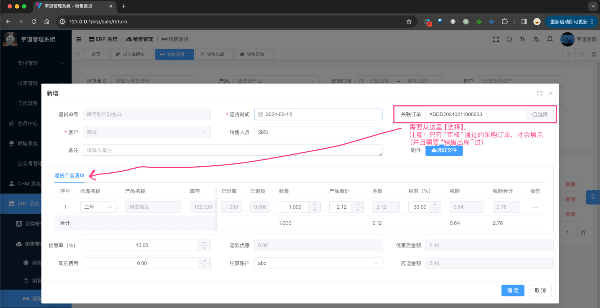

② 点击该销售退货的「审批」按钮，审批通过该销售退货，此时状态会变成“已审批”，同时会增加对应的库存、新增库存明细。如下图所示：

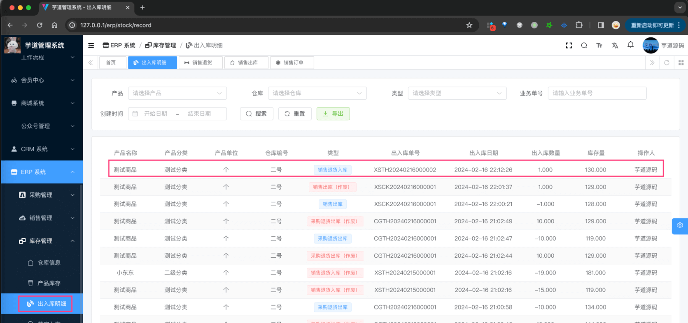

③ 点击该销售退货的「反审批」按钮，反审批该销售退货，此时状态会变成“未审批”，同时会减少对应的库存、新增库存明细。如下图所示：

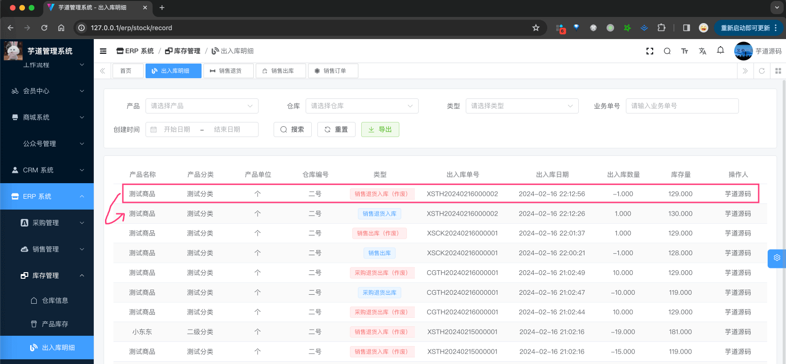

## [#](#_5-销售收款) 5. 销售收款

参见 [《【财务】采购付款、销售收款》](/erp/finance-payment-receipt/) 文档。