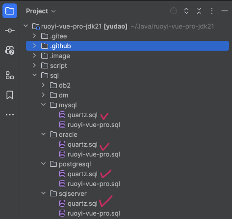
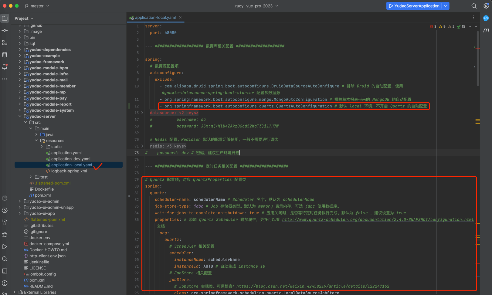
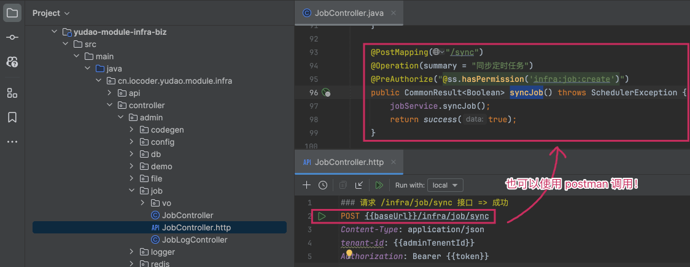
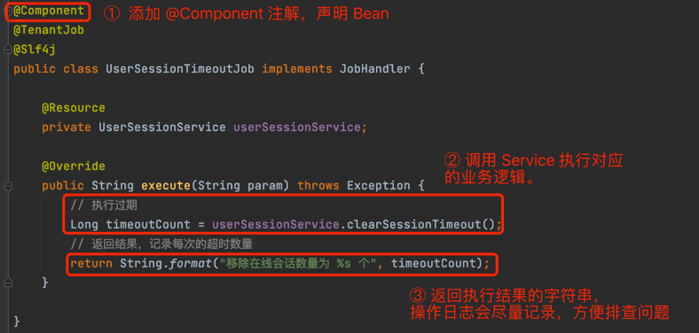
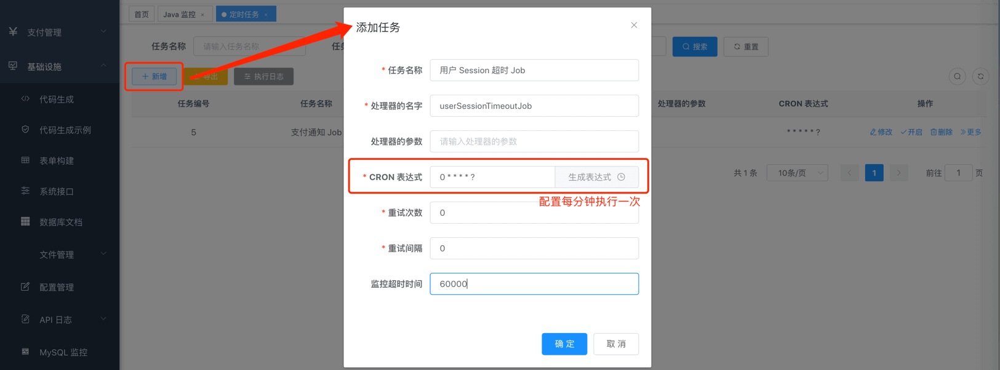
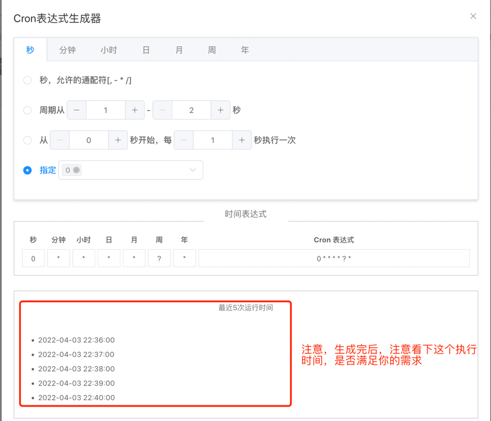
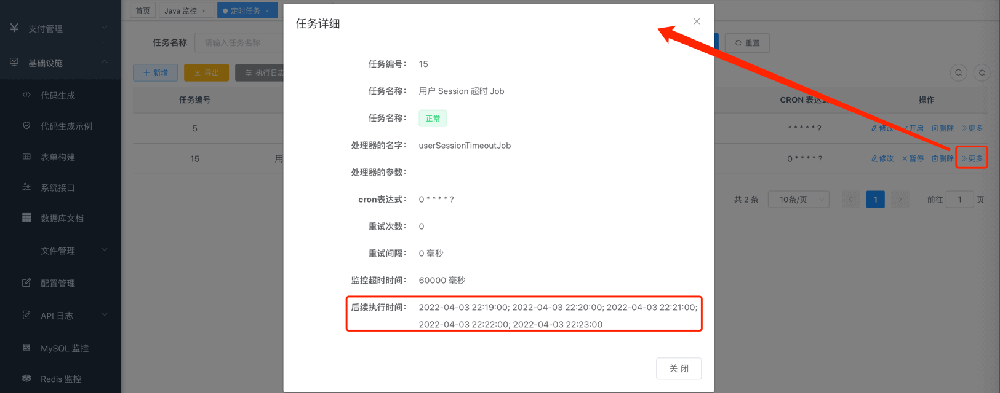
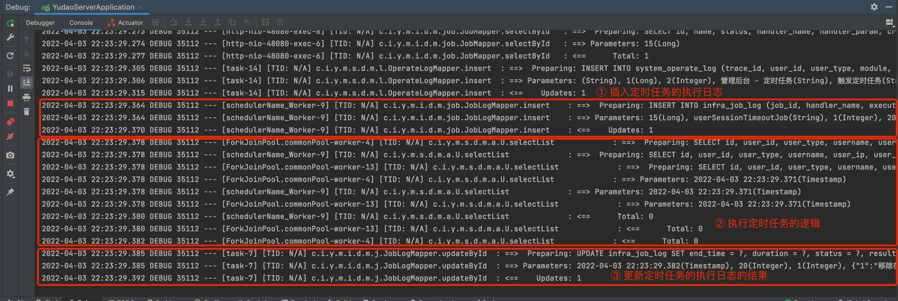
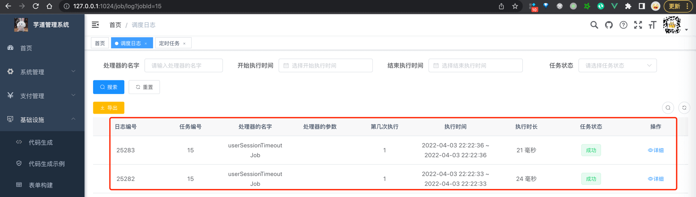

目录

# 定时任务

定时任务的使用场景主要如下：

*   时间驱动处理场景：每分钟扫描超时支付的订单，活动状态刷新，整点发送优惠券。
*   批量处理数据：按月批量统计报表数据，批量更新短信状态，实时性要求不高。

年度最佳定时任务：每个月初的工资单的推送！！！

如果你对定时任务了解不多，可以后续阅读 [《芋道 Spring Boot 定时任务入门》 (opens new window)](http://www.iocoder.cn/Spring-Boot/Job/?yudao) 文章。

项目基于 Quartz + MySQL 实现分布式定时任务，并提供 \[基础设施 -> 定时任务\] 菜单，进行定时任务的统一管理，支持动态控制任务的添加、修改、开启、暂停、删除、执行一次等操作。


*   [`yudao-spring-boot-starter-job` (opens new window)](https://github.com/YunaiV/ruoyi-vue-pro/blob/master/yudao-framework/yudao-spring-boot-starter-job/) 技术组件：基于 Quartz 框架的封装，提供简便的 [JobHandler (opens new window)](https://github.com/YunaiV/ruoyi-vue-pro/blob/master/yudao-framework/yudao-spring-boot-starter-job/src/main/java/cn/iocoder/yudao/framework/quartz/core/handler/JobHandler.java) 接入，任务的执行、重试，执行日志的记录。
*   `yudao-module-infra` 的 [`job` (opens new window)](https://github.com/YunaiV/ruoyi-vue-pro/blob/master/yudao-module-infra/yudao-module-infra-biz/src/main/java/cn/iocoder/yudao/module/infra/service/job/) 业务模块，提供任务的动态管理，执行日志的存储。

## [#](#_1-如何开启) 1. 如何开启？

① 导入 `sql` 目录下，对应数据库的 `quartz.sql` 文件，初始化 Quartz 表结构。如下图所示：



② 在 [`application-local.yaml` (opens new window)](https://github.com/YunaiV/ruoyi-vue-pro/blob/master/yudao-server/src/main/resources/application-local.yaml#L66-L93) 配置文件中，通过 `spring.quartz` 配置项，设置 Quartz 使用 MySQL 实现集群。如下图所示：



考虑到 `local` 本地和 `dev` 测试环境使用相同的数据库，如果 `local` 也跑定时任务，可能会影响 `dev` 测试环境的执行。所以默认配置下，`local` 禁用了定时任务。

重要！！！如果你要开启 `local` 的定时任务，可以删除 `- org.springframework.boot.autoconfigure.quartz.QuartzAutoConfiguration` 那一行即可开启。

③ 启动项目后，调用 JobController 提供的 `#syncJob()` 接口，将 `infra_job` 表的任务同步到 Quartz 中。如下图所示：



## [#](#_2-实战案例) 2. 实战案例

以用户 Session 超时的定时任务举例子，讲解在项目中使用定时任务。

### [#](#_2-1-引入依赖) 2.1 引入依赖

在 `yudao-module-system-biz` 模块中，引入 `yudao-spring-boot-starter-job` 技术组件。如下所示：

```xml
<dependency>
    <groupId>cn.iocoder.boot</groupId>
    <artifactId>yudao-spring-boot-starter-job</artifactId>
</dependency>

```

### [#](#_2-2-编写-job-类) 2.2 编写 Job 类

每个 `yudao-module-xxx-biz` 模块的 `job` 包，用于定义定时任务的 Job 类。

因此，在 `yudao-module-system-biz` 模块的 `job` 包下，创建 [UserSessionTimeoutJob (opens new window)](https://github.com/YunaiV/ruoyi-vue-pro/blob/master/yudao-module-system/yudao-module-system-biz/src/main/java/cn/iocoder/yudao/module/system/job/auth/UserSessionTimeoutJob.java) 类，实现 [JobHandler (opens new window)](https://github.com/YunaiV/ruoyi-vue-pro/blob/master/yudao-framework/yudao-spring-boot-starter-job/src/main/java/cn/iocoder/yudao/framework/quartz/core/handler/JobHandler.java#L8) 接口，执行用户 Session 超时 Job。如下图所示：



疑问：为什么添加 @TenantJob 注解？

声明 [`@TenantJob` (opens new window)](https://github.com/YunaiV/ruoyi-vue-pro/blob/master/yudao-framework/yudao-spring-boot-starter-biz-tenant/src/main/java/cn/iocoder/yudao/framework/tenant/core/job/TenantJob.java) 注解在 Job 类上，实现**并行**遍历每个租户，执行定时任务的逻辑。

更多多租户的内容，可见 [《开发指南 —— SaaS 多租户》 (opens new window)](https://doc.iocoder.cn/saas-tenant/) 文档。

### [#](#_2-3-配置任务) 2.3 配置任务

① 点击 \[新增\] 按钮，填写定时任务 UserSessionTimeoutJob 的信息。如下图所示：



*   处理器的名字：对应的 Spring Bean 名字。例如说 UserSessionTimeoutJob 对应 userSessionTimeoutJob
    
*   Cron 表达式：执行周期，可通过 \[生成表达式\] 功能，进行生成 
    
*   重试次数、重试间隔：执行失败后，立即重试的次数以及重试的间隔时间
    
*   超时时间监控：执行超过该时间后，发送告警邮件给开发【暂不支持，未来实现】
    

常用的 Cron 表达式如下：

```bash
0 0 10,14,16 * * ? 每天上午 10 点，下午 2 点、4 点 
0 0/30 9-17 * * ? 朝九晚五工作时间内，每半小时 
0 0 12 ? * WED 表示每个星期三中午 12 点 
0 0 12 * * ? 每天中午 12 点触发 
0 15 10 ? * * 每天上午 10:15 触发 
0 15 10 * * ? 每天上午 10:15 触发 
0 15 10 * * ? * 每天上午 10:15 触发 
0 15 10 * * ? 2005 2005 年的每天上午 10:15 触发 
0 * 14 * * ? 在每天下午 2 点到下午 2:59 期间，每 1 分钟触发 
0 0/5 14 * * ? 在每天下午 2 点到下午 2:55 期间，每 5 分钟触发 
0 0/5 14,18 * * ? 在每天下午 2 点到 2:55 期间和下午 6 点到 6:55 期间，每 5 分钟触发 
0 0-5 14 * * ? 在每天下午 2 点到下午 2:05 期间，每 1 分钟触发 
0 10,44 14 ? 3 WED 每年三月的星期三的下午 2:10 和 2:44 触发 
0 15 10 ? * MON-FRI 周一至周五的上午 10:15 触发 
0 15 10 15 * ? 每月15日上午 10:15 触发 
0 15 10 L * ? 每月最后一日的上午 10:15 触发 
0 15 10 ? * 6L 每月的最后一个星期五上午 10:15 触发 
0 15 10 ? * 6L 2002-2005 2002 年至 2005 年，每月的最后一个星期五上午 10:15 触发 
0 15 10 ? * 6#3 每月的第三个星期五上午 10:15 触发

```

② 点击 \[更多 -> 任务详情\] 按钮，可以查看任务的基础信息、后续的执行时间。如下图所示：



### [#](#_2-4-测试任务) 2.4 测试任务

① 点击 \[更多 -> 执行一次\] 按钮，立即执行一次 UserSessionTimeoutJob 定时任务。可以在 IDEA 控制台看到输出，如下图所示：



② 点击 \[更多 -> 调度日志\] 按钮，可以查看到 UserSessionTimeoutJob 的执行日志。如下图所示：

