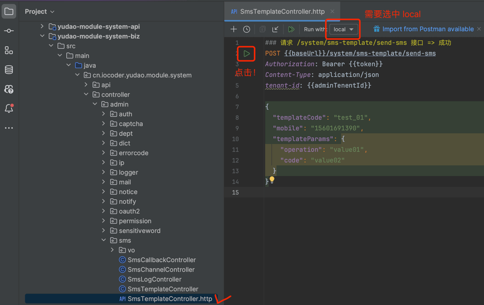

目录

# 消息队列（Kafka）

## [#](#kafka-spring) Kafka-Spring

[`yudao-spring-boot-starter-mq` (opens new window)](https://github.com/YunaiV/ruoyi-vue-pro/blob/master/yudao-framework/yudao-spring-boot-starter-mq/) 技术组件，基于 Kafka 实现分布式消息队列。

如果你对 Kafka 不太了解，可以看看 [《芋道 Spring Boot 消息队列 Kafka 入门》 (opens new window)](https://www.iocoder.cn/Spring-Boot/Kafka/?yudao) 文档。

如何安装一个 Kafka 服务？

参考 [《芋道 Kafka 极简入门 》 (opens new window)](https://www.iocoder.cn/Kafka/install/?yudao) 文档。

## [#](#_2-使用示例) 2. 使用示例

以【短信发送】举例子，改造使用 Kafka 作为消息队列。

## [#](#_2-0-引入依赖与配置) 2.0 引入依赖与配置

① 在 `yudao-module-system-biz` 模块中，引入 `yudao-spring-boot-starter-mq` 技术组件。如下所示：

```xml
<dependency>
    <groupId>cn.iocoder.boot</groupId>
    <artifactId>yudao-spring-boot-starter-mq</artifactId>
</dependency>

```

② 修改 `yudao-spring-boot-starter-mq` 的 `pom.xml` 文件，引入 `spring-kafka` 依赖。如下所示：

```xml
<!-- 实际只要删除  <optional>true</optional> 部分即可 -->
<dependency>
    <groupId>org.springframework.kafka</groupId>
    <artifactId>spring-kafka</artifactId>
</dependency>

```

记得需要手动在 IDEA 刷新下 Maven 依赖。

③ 修改 `application.xml` 配置文件，添加 Kafka 全局配置。如下所示：

```yaml
spring:
  # Kafka 配置项，对应 KafkaProperties 配置类
  kafka:
    # Kafka Producer 配置项
    producer:
      acks: 1 # 0-不应答。1-leader 应答。all-所有 leader 和 follower 应答。
      retries: 3 # 发送失败时，重试发送的次数
      value-serializer: org.springframework.kafka.support.serializer.JsonSerializer # 消息的 value 的序列化
    # Kafka Consumer 配置项
    consumer:
      auto-offset-reset: earliest # 设置消费者分组最初的消费进度为 earliest 。可参考博客 https://blog.csdn.net/lishuangzhe7047/article/details/74530417 理解
      value-deserializer: org.springframework.kafka.support.serializer.JsonDeserializer
      properties:
        spring.json.trusted.packages: '*'
    # Kafka Consumer Listener 监听器配置
    listener:
      missing-topics-fatal: false # 消费监听接口监听的主题不存在时，默认会报错。所以通过设置为 false ，解决报错

```

ps：默认已经添加，无需操作。

④ 修改 `application-local.xml` 配置文件，添加 Kafka `bootstrap-servers` 配置。如下所示：

```yaml
spring:
  # Kafka 配置项，对应 KafkaProperties 配置类
  kafka:
    bootstrap-servers: 127.0.0.1:9092 # 指定 Kafka Broker 地址，可以设置多个，以逗号分隔

```

ps：默认已经添加，无需操作。

### [#](#_2-1-message-消息) 2.1 Message 消息

在 `message` 包下，修改 SmsSendMessage 类，短信发送消息。代码如下：

```java
@Data
public class SmsSendMessage implements Serializable {

    public static final String TOPIC = "SEND_MESSAGE_TOPIC"; // 重点：需要增加消息对应的 Topic

    /**
     * 短信日志编号
     */
    @NotNull(message = "短信日志编号不能为空")
    private Long logId;
    /**
     * 手机号
     */
    @NotNull(message = "手机号不能为空")
    private String mobile;
    /**
     * 短信渠道编号
     */
    @NotNull(message = "短信渠道编号不能为空")
    private Long channelId;
    /**
     * 短信 API 的模板编号
     */
    @NotNull(message = "短信 API 的模板编号不能为空")
    private String apiTemplateId;
    /**
     * 短信模板参数
     */
    private List<KeyValue<String, Object>> templateParams;

}

```

### [#](#_2-2-smsproducer-生产者) 2.2 SmsProducer 生产者

在 `producer` 包下，修改 SmsProducer 类，Sms 短信相关消息的生产者。代码如下：

```java
@Slf4j
@Component
public class SmsProducer {

    @Resource
    private KafkaTemplate<Object, Object> kafkaTemplate; // 重点：注入 KafkaTemplate 对象

    /**
     * 发送 {@link SmsSendMessage} 消息
     *
     * @param logId 短信日志编号
     * @param mobile 手机号
     * @param channelId 渠道编号
     * @param apiTemplateId 短信模板编号
     * @param templateParams 短信模板参数
     */
    public void sendSmsSendMessage(Long logId, String mobile,
                                   Long channelId, String apiTemplateId, List<KeyValue<String, Object>> templateParams) {
        SmsSendMessage message = new SmsSendMessage().setLogId(logId).setMobile(mobile);
        message.setChannelId(channelId).setApiTemplateId(apiTemplateId).setTemplateParams(templateParams);
        kafkaTemplate.send(SmsSendMessage.TOPIC, message); // 重点：使用 KafkaTemplate 发送消息
    }

}

```

### [#](#_2-3-smssendconsumer-消费者) 2.3 SmsSendConsumer 消费者

在 `consumer` 包下，修改 SmsSendConsumer 类，SmsSendMessage 的消费者。代码如下：

```java
@Component
@Slf4j
public class SmsSendConsumer {

    @Resource
    private SmsSendService smsSendService;

    @KafkaListener(topics = SmsSendMessage.TOPIC, // 重点：添加 @KafkaListener 注解，实现消息的消费
        groupId = SmsSendMessage.TOPIC + "_CONSUMER") 
    public void onMessage(SmsSendMessage message) {
        log.info("[onMessage][消息内容({})]", message);
        smsSendService.doSendSms(message);
    }

}

```

### [#](#_2-4-简单测试) 2.4 简单测试

① Debug 启动后端项目，可以在 SmsProducer 和 SmsSendConsumer 上面打上断点，稍微调试下。

② 打开 `SmsTemplateController.http` 文件，使用 IDEA httpclient 发起请求，发送短信。如下图所示：



如果 IDEA 控制台看到 `[onMessage][消息内容` 日志内容，说明消息的发送和消费成功。