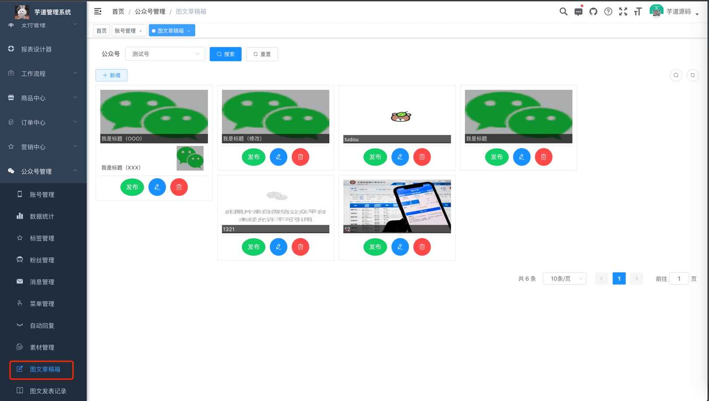
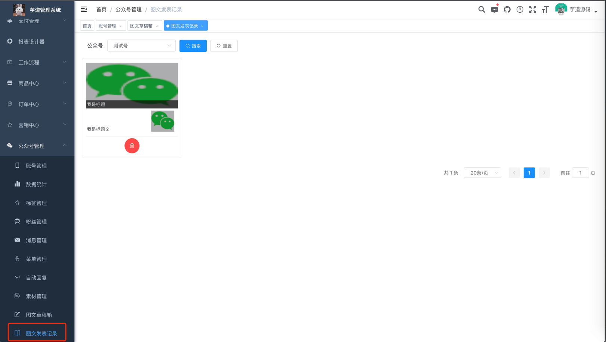

目录

# 公众号图文

本章节，讲解公众号图文的相关内容，包括两部分：

① 在 \[公众号管理 -> 图文草稿箱\] 菜单中，创建一个图文草稿。如下图所示：

② 点击【发布】按钮，将图文草稿发布到公众号，成为一个图文记录，展示在 \[公众号管理 -> 图文发表记录\] 菜单中。如下图所示：

## [#](#_1-表结构) 1. 表结构

暂无，全部基于微信公众号提供的 API 接口。

*   图文草稿箱：[《微信公众号官方文档 —— 草稿箱》 (opens new window)](https://developers.weixin.qq.com/doc/offiaccount/Draft_Box/Add_draft.html)
*   图文发表记录：[《微信公众号官方文档 —— 发布能力》 (opens new window)](https://developers.weixin.qq.com/doc/offiaccount/Publish/Publish.html)

## [#](#_2-图文草稿箱界面) 2. 图文草稿箱界面

*   前端：[/@views/mp/draft (opens new window)](https://github.com/yudaocode/yudao-ui-admin-vue2/blob/master/src/views/mp/draft/index.vue)
*   后端：[MpDraftController (opens new window)](https://github.com/YunaiV/ruoyi-vue-pro/blob/master/yudao-module-mp/yudao-module-mp-biz/src/main/java/cn/iocoder/yudao/module/mp/controller/admin/news/MpDraftController.java)

## [#](#_3-图文发表记录界面) 3. 图文发表记录界面

*   前端：[/@views/mp/freePublish (opens new window)](https://github.com/yudaocode/yudao-ui-admin-vue2/blob/master/src/views/mp/freePublish/index.vue)
*   后端：[MpFreePublishController (opens new window)](https://github.com/YunaiV/ruoyi-vue-pro/blob/master/yudao-module-mp/yudao-module-mp-biz/src/main/java/cn/iocoder/yudao/module/mp/controller/admin/news/MpFreePublishController.java)