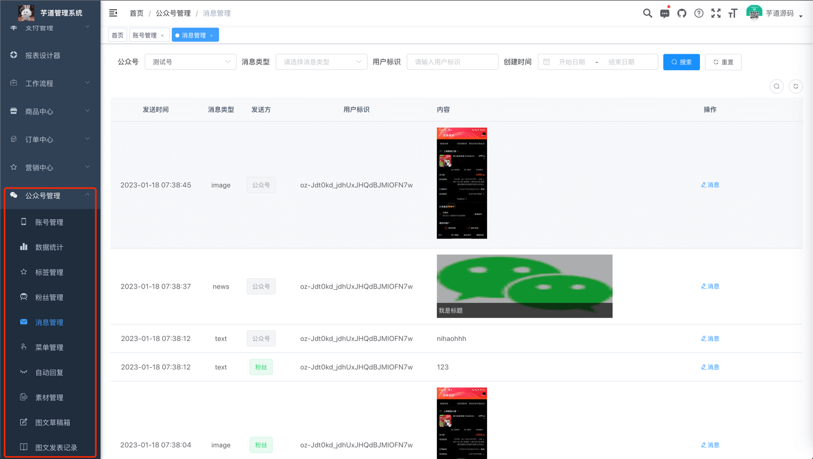
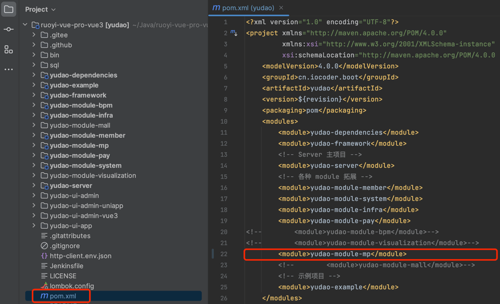
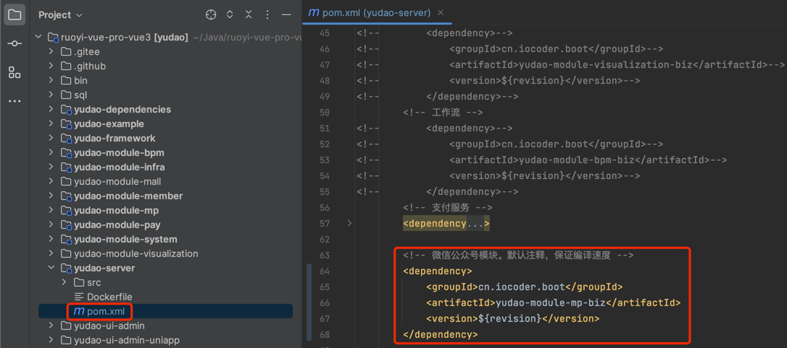
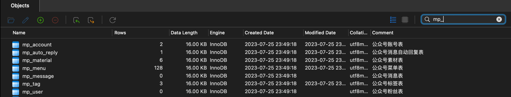
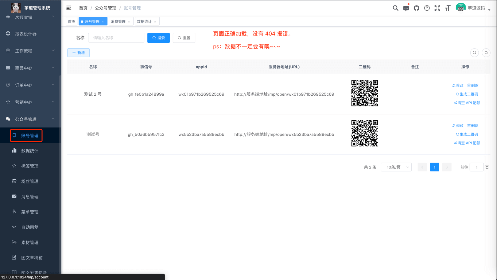

目录

# 功能开启

[微信公众号 (opens new window)](https://developers.weixin.qq.com/doc/offiaccount/Getting_Started/Overview.html)的功能，由 [`yudao-module-mp` (opens new window)](https://github.com/YunaiV/ruoyi-vue-pro/blob/master/yudao-module-mp/) 模块实现，对应前端代码为 [`@/views/mp` (opens new window)](https://github.com/yudaocode/yudao-ui-admin-vue3/tree/master/src/views/mp) 目录。

主要包括如下 10 个功能（菜单）：

功能

描述

账号管理

配置接入的微信公众号，可支持多个公众号

数据统计

统计公众号的用户增减、累计用户、消息概况、接口分析等数据

粉丝管理

查看已关注、取关的粉丝列表，可对粉丝进行同步、打标签等操作

消息管理

查看粉丝发送的消息列表，可主动回复粉丝消息

自动回复

自动回复粉丝发送的消息，支持关注回复、消息回复、关键字回复

标签管理

对公众号的标签进行创建、查询、修改、删除等操作

菜单管理

自定义公众号的菜单，也可以从公众号同步菜单

素材管理

管理公众号的图片、语音、视频等素材，支持在线播放语音、视频

图文草稿箱

新增常用的图文素材到草稿箱，可发布到公众号

图文发表记录

查看已发布成功的图文素材，支持删除操作

考虑到编译速度，默认 `yudao-module-mp` 模块是关闭的，需要手动开启。步骤如下：

*   第一步，开启 `yudao-module-mp` 模块
*   第二步，导入公众号的 SQL 数据库脚本
*   第三步，重启后端项目，确认功能是否生效

## [#](#_1-第一步-开启模块) 1. 第一步，开启模块

① 修改根目录的 [`pom.xml` (opens new window)](https://github.com/YunaiV/ruoyi-vue-pro/blob/master/pom.xml) 文件，取消 `yudao-module-mp` 模块的注释。如下图所示：

② 修改 `yudao-server` 目录的 [`pom.xml` (opens new window)](https://github.com/YunaiV/ruoyi-vue-pro/blob/master/yudao-server/pom.xml) 文件，引入 `yudao-module-mp` 模块。如下图所示：

③ 点击 IDEA 右上角的【Reload All Maven Projects】，刷新 Maven 依赖。如下图所示：

## [#](#_2-第二步-导入-sql) 2. 第二步，导入 SQL

点击 [`mp-2024-01-05.sql.zip` (opens new window)](https://t.zsxq.com/15fQYbLxU) 下载附件，解压出 SQL 文件，然后导入到数据库中。 如下图所示：

友情提示：↑↑↑ mp.sql 是可以点击下载的！ ↑↑↑

以 `mp_` 作为前缀的表，就是公众号模块的表。

## [#](#_3-第三步-重启项目) 3. 第三步，重启项目

重启后端项目，然后访问前端的公众号菜单，确认功能是否生效。如下图所示：

至此，我们就成功开启了公众号的功能 🙂