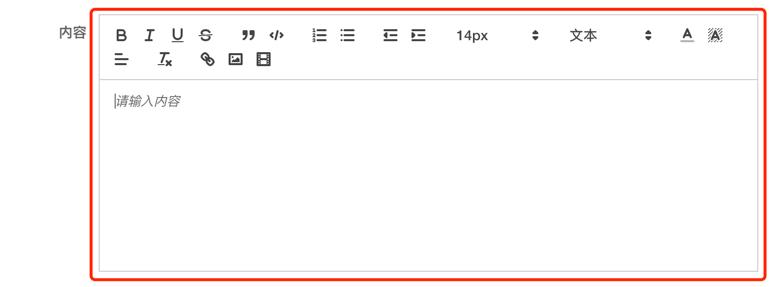
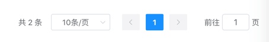
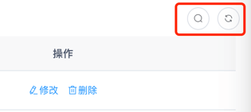

目录

# 字典数据

本小节，讲解前端如何使用 \[系统管理 -> 字典管理\] 菜单的字典数据，例如说字典数据的下拉框、单选 / 多选按钮、高亮展示等等。


## [#](#_1-全局缓存) 1. 全局缓存

用户登录成功后，前端会从后端获取到全量的字典数据，缓存在 store 中。如下图所示：



这样，前端在使用到字典数据时，无需重复请求后端，提升用户体验。

不过，缓存暂时未提供刷新，所以在字典数据发生变化时，需要用户刷新浏览器，进行重新加载。

## [#](#_2-dict-type) 2. DICT\_TYPE

在 [`dict.js` (opens new window)](https://github.com/yudaocode/yudao-ui-admin-vue2/blob/master/src/utils/dict.js#L8-L58) 文件中，使用 `DICT_TYPE` 枚举了字典的 KEY。如下图所示：



后续如果有新的字典 KEY，需要你自己进行添加。

## [#](#_3-dicttag-字典标签) 3. DictTag 字典标签

[`<dict-tag />` (opens new window)](https://github.com/yudaocode/yudao-ui-admin-vue2/blob/master/src/components/DictTag/index.vue) 组件，翻译字段对应的字典展示文本，并根据 `colorType`、`cssClass` 进行高亮。使用示例如下：

```html
<!--
    type: 字典 KEY
    value: 字典值
-->
<dict-tag :type="DICT_TYPE.SYSTEM_LOGIN_TYPE" :value="row.logType" />

```



## [#](#_4-字典工具类) 4. 字典工具类

在 [`dict.js` (opens new window)](https://github.com/yudaocode/yudao-ui-admin-vue2/blob/master/src/utils/dict.js#L8-L58) 文件中，提供了字典工具类，方法如下：

```js
// 获取 dictType 对应的数据字典数组
export function getDictDatas(dictType) { /** 省略代码 */ }

// 获得 dictType + value 对应的字典展示文本
export function getDictDataLabel(dictType, value) { /** 省略代码 */ }

```

结合 Element UI 的表单组件，使用示例如下：

```html
<!-- radio 单选框 -->
<el-radio v-for="dict in this.getDictDatas(DICT_TYPE.COMMON_STATUS)"
                      :key="dict.value" :label="parseInt(dict.value)">{{dict.label}}</el-radio>

<!-- select 下拉框 -->
<el-select v-model="form.code" placeholder="请选择渠道编码" clearable>
    <el-option v-for="dict in this.getDictDatas(DICT_TYPE.SYSTEM_SMS_CHANNEL_CODE)"
               :key="dict.value" :label="dict.label" :value="dict.value"/>
</el-select>

```