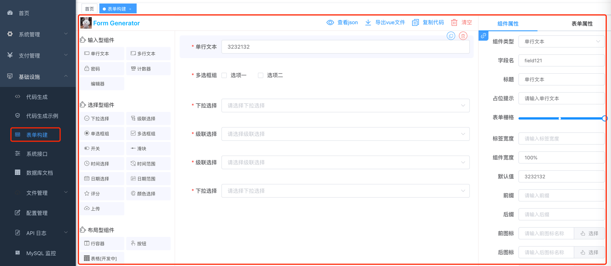
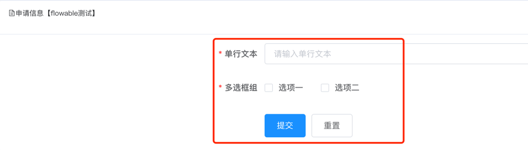
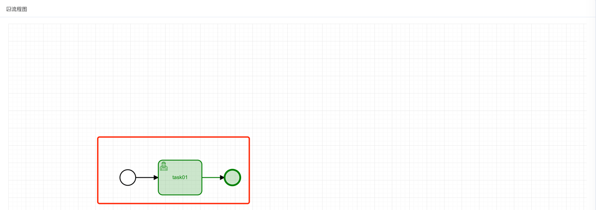
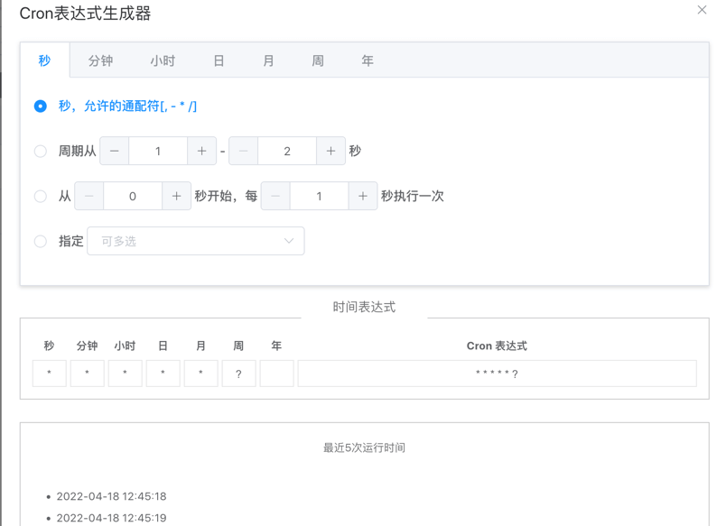
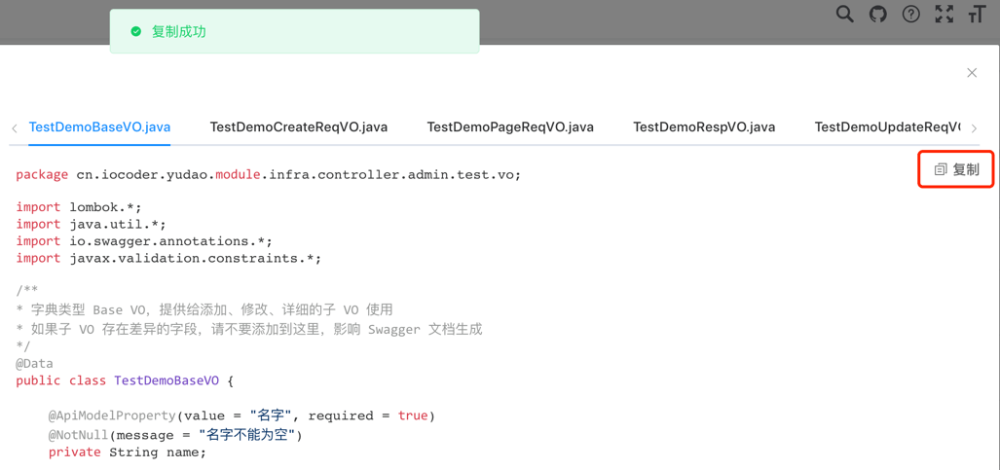

目录

# 系统组件

## [#](#_1-引入三方组件) 1. 引入三方组件

除了 Element UI 组件以及项目内置的系统组件，有时还需要引入其它[三方组件 (opens new window)](https://www.npmjs.com/)。

### [#](#_1-1-如何安装) 1.1 如何安装

这里，以引入 [vue-count-to (opens new window)](https://www.npmjs.com/package/vue-count-to) 为例。在终端输入下面的命令完成安装：

```bash
## 加上 --save 参数，会自动添加依赖到 package.json 中去。
npm install vue-count-to --save

```

### [#](#_1-2-如何注册) 1.2 如何注册

Vue 注册组件有两种方式：全局注册、局部注册。

#### [#](#_1-2-1-局部注册) 1.2.1 局部注册

在对应的 Vue 页面中，使用 `components` 属性来注册组件。代码如下：

```html
<template>
  <countTo :startVal='startVal' :endVal='endVal' :duration='3000'></countTo>
</template>

<script>
import countTo from 'vue-count-to';
export default {
  components: { countTo }, // components 属性
  data () {
    return {
      startVal: 0,
      endVal: 2017
    }
  }
}
</script>

```

#### [#](#_1-2-2-全局注册) 1.2.2 全局注册

① 在 [`main.js` (opens new window)](https://github.com/yudaocode/yudao-ui-admin-vue2/blob/master/src/main.js) 中，全局注册组件。代码如下：

```js
import countTo from 'vue-count-to'
Vue.component('countTo', countTo)

```

② 在对应的 Vue 页面中，直接使用组件，无需注册。代码如下：

```html
<template>
  <countTo :startVal='startVal' :endVal='endVal' :duration='3000'></countTo>
</template>

```

## [#](#_2-系统组件) 2. 系统组件

项目使用到的相关组件。

### [#](#_2-1-基础框架组件) 2.1 基础框架组件

[`element-ui` (opens new window)](https://github.com/ElemeFE/element)

[`vue-element-admin` (opens new window)](https://github.com/PanJiaChen/vue-element-admin)

### [#](#_2-2-树形选择组件) 2.2 树形选择组件

[`vue-treeselect` (opens new window)](https://github.com/riophae/vue-treeselect)

在 [`menu/index.vue` (opens new window)](https://github.com/yudaocode/yudao-ui-admin-vue2/blob/master/src/views/system/menu/index.vue#L68-L71) 的使用案例：

```html
<el-form-item label="上级菜单">
  <treeselect v-model="form.parentId" :options="menuOptions" :normalizer="normalizer" :show-count="true"
              placeholder="选择上级菜单"/>
</el-form-item>

```


### [#](#_2-3-表格分页组件) 2.3 表格分页组件

[`el-pagination` (opens new window)](https://element.eleme.io/#/zh-CN/component/pagination)，二次封装成 [`pagination` (opens new window)](https://github.com/yudaocode/yudao-ui-admin-vue2/blob/master/src/components/Pagination/index.vue) 组件。

在 [`notice/index.vue` (opens new window)](https://github.com/yudaocode/yudao-ui-admin-vue2/blob/master/src/views/system/notice/index.vue#L57-L60) 的使用案例：

```html
<pagination v-show="total>0" :total="total" :page.sync="queryParams.pageNo" :limit.sync="queryParams.pageSize"
            @pagination="getList"/>

```


### [#](#_2-4-工具栏右侧组件) 2.4 工具栏右侧组件

[`right-toolbar` (opens new window)](https://github.com/yudaocode/yudao-ui-admin-vue2/blob/master/src/components/RightPanel/index.vue)

在 [`notice/index.vue` (opens new window)](https://github.com/yudaocode/yudao-ui-admin-vue2/blob/master/src/views/system/notice/index.vue#L26) 的使用案例：

```html
<right-toolbar :showSearch.sync="showSearch" @queryTable="getList"></right-toolbar>

```


### [#](#_2-5-文件上传组件) 2.5 文件上传组件

[`file-upload` (opens new window)](https://github.com/yudaocode/yudao-ui-admin-vue2/blob/master/src/components/FileUpload/index.vue)

### [#](#_2-6-图片上传组件) 2.6 图片上传组件

图片上传组件 [`image-upload` (opens new window)](https://github.com/yudaocode/yudao-ui-admin-vue2/blob/master/src/components/ImageUpload/index.vue)

图片预览组件 [`image-preview` (opens new window)](https://github.com/yudaocode/yudao-ui-admin-vue2/blob/master/src/components/ImagePreview/index.vue)

### [#](#_2-7-富文本编辑器) 2.7 富文本编辑器

[`quill` (opens new window)](https://github.com/quilljs/quill)，二次封装成 [Editor (opens new window)](https://github.com/yudaocode/yudao-ui-admin-vue2/blob/master/src/components/Editor/index.vue) 组件。

在 [`notice/index.vue` (opens new window)](https://github.com/yudaocode/yudao-ui-admin-vue2/blob/master/src/views/system/notice/index.vue#L94-L96) 的使用案例：

```html
<el-form-item label="内容">
  <editor v-model="form.content" :min-height="192"/>
</el-form-item>

```


### [#](#_2-8-表单设计组件) 2.8 表单设计组件

① 表单设计组件 [`form-generator` (opens new window)](https://github.com/JakHuang/form-generator)

在 [`build/index.vue` (opens new window)](https://github.com/yudaocode/yudao-ui-admin-vue2/blob/master/src/views/infra/build/index.vue) 中使用，效果如下图：



② 表单展示组件 [`parser` (opens new window)](https://github.com/yudaocode/yudao-ui-admin-vue2/blob/master/src/components/parser/Parser.vue)，基于 [`form-generator` (opens new window)](https://github.com/JakHuang/form-generator) 封装。

在 [`processInstance/create.vue` (opens new window)](https://github.com/yudaocode/yudao-ui-admin-vue2/blob/master/src/views/system/notice/index.vue#L94-L96) 的使用案例：

```html
<parser :key="new Date().getTime()" :form-conf="detailForm" @submit="submitForm" />

```



### [#](#_2-9-工作流组件) 2.9 工作流组件

[`bpmn-process-designer` (opens new window)](https://gitee.com/MiyueSC/bpmn-process-designer)，二次封装成 [`bpmnProcessDesigner` (opens new window)](https://github.com/yudaocode/yudao-ui-admin-vue2/blob/master/src/components/bpmnProcessDesigner/) 工作流设计组件

① 工作流设计组件 [`my-process-designer` (opens new window)](https://github.com/yudaocode/yudao-ui-admin-vue2/blob/master/src/components/bpmnProcessDesigner/package/designer/ProcessDesigner.vue)，在 [`bpm/model/modelEditor.vue` (opens new window)](https://github.com/yudaocode/yudao-ui-admin-vue2/blob/master/src/views/bpm/model/modelEditor.vue) 中使用案例：

```html
<!-- 流程设计器，负责绘制流程等 -->
<my-process-designer :key="`designer-${reloadIndex}`" v-model="xmlString" v-bind="controlForm"
  keyboard ref="processDesigner" @init-finished="initModeler"
  @save="save"/>

<!-- 流程属性器，负责编辑每个流程节点的属性 -->
<my-properties-panel :key="`penal-${reloadIndex}`" :bpmn-modeler="modeler" :prefix="controlForm.prefix" class="process-panel"
  :model="model" />

```


② 工作流展示组件 [`my-process-viewer` (opens new window)](https://github.com/yudaocode/yudao-ui-admin-vue2/blob/master/src/components/bpmnProcessDesigner/package/designer/ProcessViewer.vue)，在 [`bpm/model/modelEditor.vue` (opens new window)](https://github.com/yudaocode/yudao-ui-admin-vue2/blob/master/src/views/bpm/processInstance/detail.vue#L84-L85) 中使用案例：

```html
<my-process-viewer key="designer" v-model="bpmnXML" v-bind="bpmnControlForm" :activityData="activityList"
            :processInstanceData="processInstance" :taskData="tasks" />

```



### [#](#_2-10-cron-表达式组件) 2.10 Cron 表达式组件

[`vue-crontab` (opens new window)](https://github.com/small-stone/vCrontab)，二次封装成 [`crontab` (opens new window)](https://github.com/yudaocode/yudao-ui-admin-vue2/blob/master/src/components/Crontab/index.vue) 组件。

在 [`job/index.vue` (opens new window)](https://github.com/yudaocode/yudao-ui-admin-vue2/blob/master/src/views/infra/job/index.vue#L122-L124) 的使用案例：

```html
<crontab @hide="openCron=false" @fill="crontabFill" :expression="expression"></crontab>

```



### [#](#_2-11-内容复制组件) 2.11 内容复制组件

[`clipboard` (opens new window)](https://github.com/zenorocha/clipboard.js)，使用可见 [文档 (opens new window)](https://panjiachen.github.io/vue-element-admin-site/zh/feature/component/clipboard.html)。

在 [`codegen/index.vue` (opens new window)](https://github.com/yudaocode/yudao-ui-admin-vue2/blob/master/src/views/infra/codegen/index.vue#L70-L78) 的使用案例：

```html
<el-link :underline="false" icon="el-icon-document-copy" style="float:right"
         v-clipboard:copy="item.code" 
         v-clipboard:success="clipboardSuccess">
    复制
</el-link>

```



## [#](#_3-其它推荐组件) 3. 其它推荐组件

推荐一些其它组件，可自己引入后使用。

*   Tree Table 树形表格：[使用文档 (opens new window)](https://panjiachen.github.io/vue-element-admin-site/zh/feature/component/tree-table.html)
*   Excel 前端直接导出：[使用文档 (opens new window)](https://panjiachen.github.io/vue-element-admin-site/zh/feature/component/excel.html)
*   CodeMirror 代码编辑器：[使用文档 (opens new window)](https://github.com/codemirror/CodeMirror)
*   wangEditor 文本编辑器：[使用文档 (opens new window)](https://www.wangeditor.com/)
*   mavonEditor Markdown 编辑器：[使用文档 (opens new window)](https://github.com/hinesboy/mavonEditor)

## [#](#_4-自定义组件) 4. 自定义组件

在 [`@/components` (opens new window)](https://github.com/yudaocode/yudao-ui-admin-vue2/tree/master/src/components) 目录下，创建 `.vue` 文件，在通过 `components` 进行注册即可。

### [#](#_4-1-创建使用) 4.1 创建使用

新建一个简单的 `a` 组件来举例子。

① 在 `@/components/` 目录下，创建 `test` 文件，再创建 `a.vue` 文件。代码如下：

```js
<!-- 子组件 -->
<template>
  <div>这是a组件</div>
</template>

```

② 在其它 Vue 页面，导入并注册后使用。代码如下：

```html
<!-- 父组件 -->
<template>
  <div style="text-align: center; font-size: 20px">
    测试页面
    <testa></testa> <!-- 3. 使用 -->
  </div>
</template>

<script>
import a from "@/components/a"; // 1. 引入
export default {
  components: { testa: a } // 2. 注册
};
</script>

```

### [#](#_4-2-组件通信) 4.2 组件通信

基于上述的 `a` 示例组件，讲解父子组件如何通信。

① 子组件通过 `props` 属性，来接收父组件传递的值。代码如下：

```html
<!-- 子组件 -->
<template>
    <div>这是a组件 name:{{ name }}</div>
</template>

<script>
    export default {
        props: { // 1. props 的 name 进行接收
            name: {
                type: String,
                default: ""
            },
        }
    };
</script>

<!-- 父组件 -->
<template>
  <div style="text-align: center; font-size: 20px">
    测试页面
    <testa :name="name"></testa> <!-- 2. :name 传入 -->
  </div>
</template>

<script>
import a from "@/components/a";

export default {
  components: { testa: a },
  data() {
    return {
      name: "芋道"
    };
  },
};
</script>

```

② 子组件通过 `$emit` 方法，让父组件监听到自定义事件。代码如下：

```html
<!-- 子组件 -->
<template>
  <div>
    这是a组件 name:{{ name }}
    <button @click="click">发送</button>
  </div>
</template>

<script>
export default {
  props: {
    name: {
      type: String,
      default: ""
    },
  },
  data() {
    return {
      message: "我是来自子组件的消息"
    };
  },
  methods: {
    click() {
      this.$emit("ok", this.message); // 1. $emit 方法，通知 ok 事件，message 是参数
    },
  },
};
</script>

<!-- 父组件 -->
<template>
    <div style="text-align: center; font-size: 20px">
        测试页面
        <testa :name="name" @ok="ok"></testa>
        子组件传来的值 : {{ message }}
    </div>
</template>

<script>
import a from "@/components/a";

export default {
    components: { testa: a },
    data() {
        return {
            name: "芋道",
            message: ""
        };
    },
    methods: {
        ok(message) { // 2. 声明 ok 方法，监听 ok 自定义事件
            this.message = message;
        },
    },
};
</script>

```