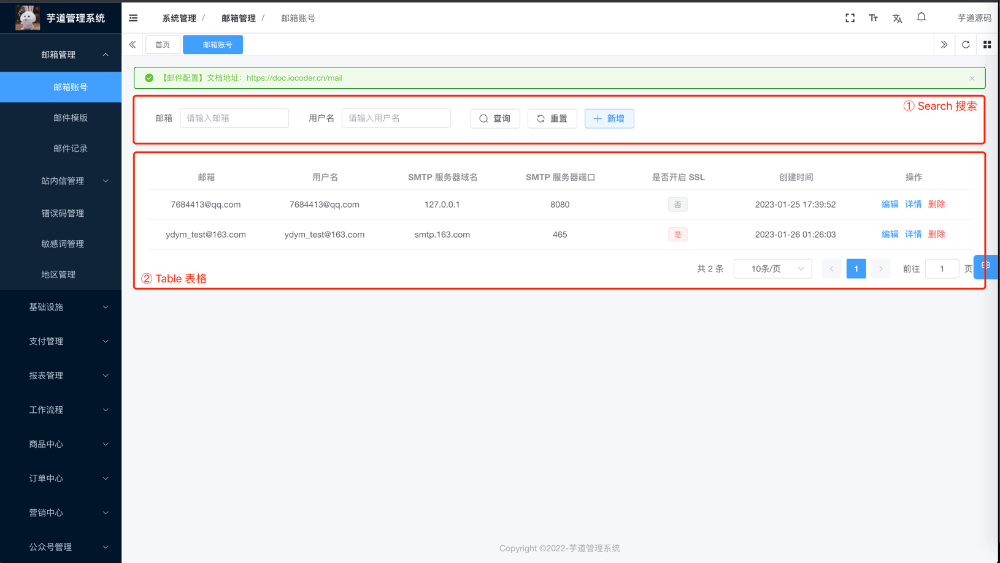
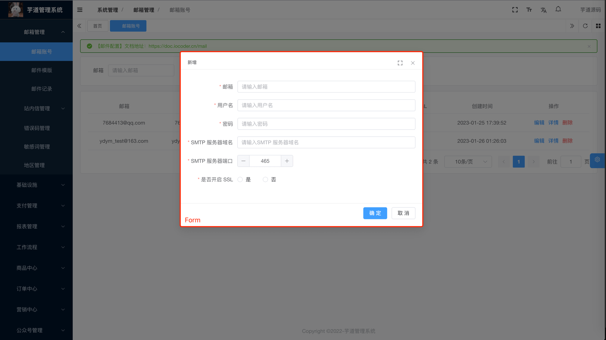
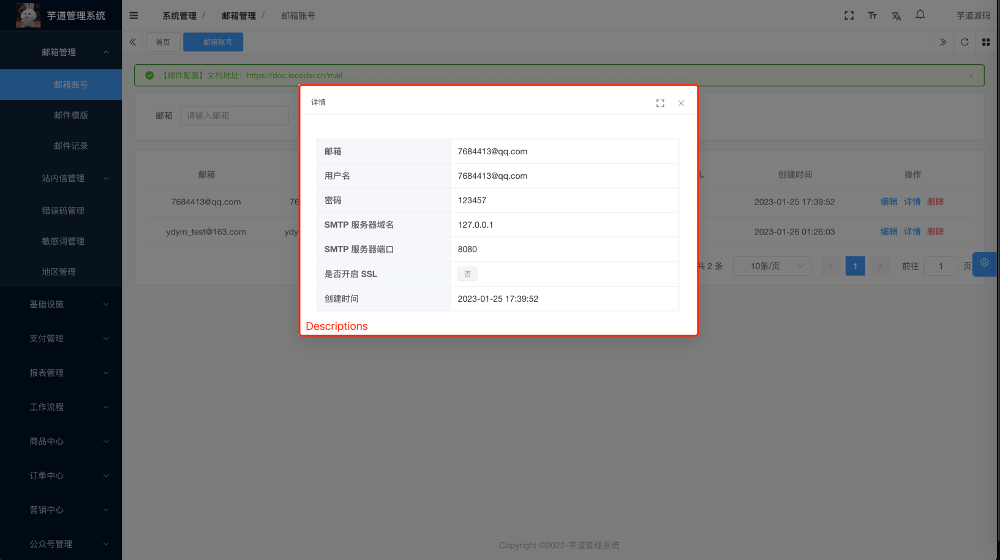
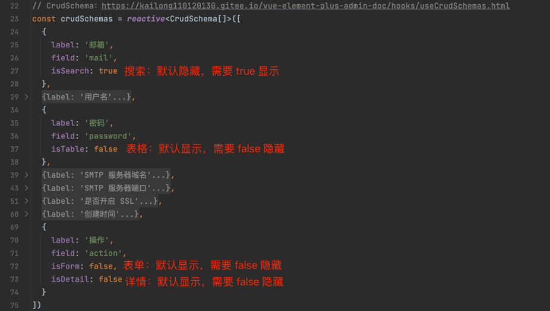
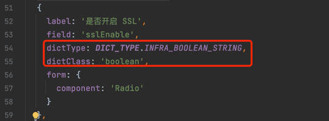
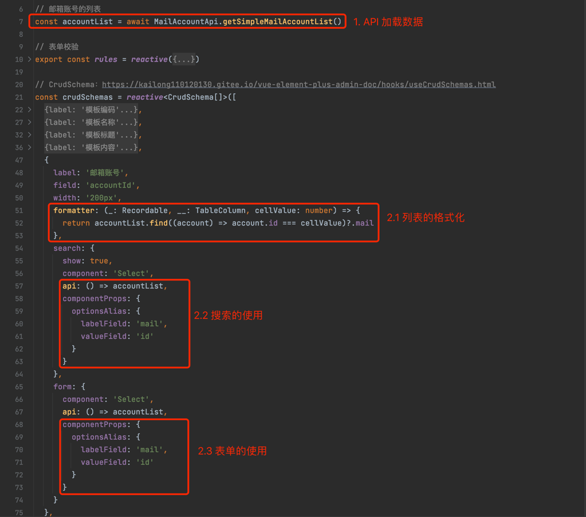
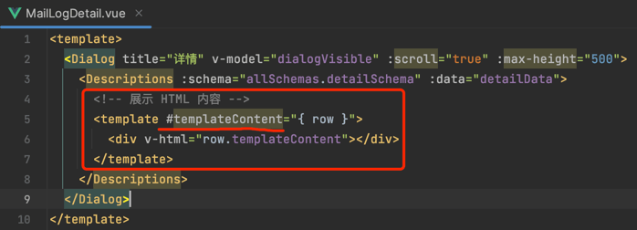

目录

# CRUD 组件

友情提示：

CRUD 组件，比较适合开发简单的 CRUD 功能。如果是复杂的功能，使用起来会比较困难。所以一般情况下，我们还是建议使用 Element Plus 的原生组件。

管理后台的功能，一般就是 CRUD 增删改查，可以拆分 3 个部分：“列表”、“新增/修改”、“详情”，如下图所示：

部分

组件

示例

列表

Search + Table



新增 / 修改

Form



详情

Descriptions



## [#](#_1-基础组件) 1. 基础组件

涉及到 4 个前端基础组件，如下所示：

组件

文档

[Search (opens new window)](https://github.com/yudaocode/yudao-ui-admin-vue3/blob/master/src/components/Search/src/Search.vue)

[查询组件 (opens new window)](https://element-plus-admin-doc.cn/components/search.html)

[Table (opens new window)](https://github.com/yudaocode/yudao-ui-admin-vue3/blob/master/src/components/Table/src/Table.vue)

[表格组件 (opens new window)](https://element-plus-admin-doc.cn/components/table.html)

[Form (opens new window)](https://github.com/yudaocode/yudao-ui-admin-vue3/blob/master/src/components/Form/src/Form.vue)

[表单组件 (opens new window)](https://element-plus-admin-doc.cn/components/form.html)

[Descriptions (opens new window)](https://github.com/yudaocode/yudao-ui-admin-vue3/blob/master/src/components/Descriptions/src/Descriptions.vue)

[描述组件 (opens new window)](https://element-plus-admin-doc.cn/components/descriptions.html)

## [#](#_2-crud-组件) 2. CRUD 组件

由于以上 4 个组件都需要 Schema 或者 `columns` 的字段，如果每个组件都写一遍的话，会造成大量重复代码，所以提供 useCrudSchemas 来进行统一的数据生成。

① useCrudSchemas：位于 [src/hooks/web/useCrudSchemas.ts (opens new window)](https://github.com/yudaocode/yudao-ui-admin-vue3/blob/master/src/hooks/web/useCrudSchemas.ts) 内

② useCrudSchemas 可以理解成一个 JSON 配置，示例如下：

useCrudSchemas 示例

```js
<script setup lang="ts">
import { CrudSchema, useCrudSchemas } from '@/hooks/web/useCrudSchemas'

const crudSchemas = reactive<CrudSchema[]>([
    {
        field: 'index',
        label: t('tableDemo.index'),
        type: 'index',
        form: {
            show: false
        },
        detail: {
            show: false
        }
    },
    {
        field: 'title',
        label: t('tableDemo.title'),
        search: {
            show: true
        },
        form: {
            colProps: {
                span: 24
            }
        },
        detail: {
            span: 24
        }
    },
    {
        field: 'author',
        label: t('tableDemo.author')
    },
    {
        field: 'display_time',
        label: t('tableDemo.displayTime'),
        form: {
            component: 'DatePicker',
            componentProps: {
                type: 'datetime',
                valueFormat: 'YYYY-MM-DD HH:mm:ss'
            }
        }
    },
    {
        field: 'importance',
        label: t('tableDemo.importance'),
        formatter: (_: Recordable, __: TableColumn, cellValue: number) => {
            return h(
                ElTag,
                {
                    type: cellValue === 1 ? 'success' : cellValue === 2 ? 'warning' : 'danger'
                },
                () =>
                    cellValue === 1
                        ? t('tableDemo.important')
                        : cellValue === 2
                            ? t('tableDemo.good')
                            : t('tableDemo.commonly')
            )
        },
        form: {
            component: 'Select',
            componentProps: {
                options: [
                    {
                        label: '重要',
                        value: 3
                    },
                    {
                        label: '良好',
                        value: 2
                    },
                    {
                        label: '一般',
                        value: 1
                    }
                ]
            }
        }
    },
    {
        field: 'pageviews',
        label: t('tableDemo.pageviews'),
        form: {
            component: 'InputNumber',
            value: 0
        }
    },
    {
        field: 'content',
        label: t('exampleDemo.content'),
        table: {
            show: false
        },
        form: {
            component: 'Editor',
            colProps: {
                span: 24
            }
        },
        detail: {
            span: 24
        }
    },
    {
        field: 'action',
        width: '260px',
        label: t('tableDemo.action'),
        form: {
            show: false
        },
        detail: {
            show: false
        }
    }
])

const { allSchemas } = useCrudSchemas(crudSchemas)
</script>

```

③ 字段的详细说明，可见 [useCrudSchemas 文档 (opens new window)](https://element-plus-admin-doc.cn/hooks/useCrudSchemas.html)。

## [#](#_3-实战案例) 3. 实战案例

项目的 \[系统管理 -> 邮箱管理\] 相关的功能，都使用 CRUD 实现，你可以自己去学习。

功能

代码

邮箱账号

[src/views/system/mail/account (opens new window)](https://github.com/yudaocode/yudao-ui-admin-vue3/blob/master/src/views/system/mail/account/)

邮箱模版

[src/views/system/mail/template (opens new window)](https://github.com/yudaocode/yudao-ui-admin-vue3/blob/master/src/views/system/mail/template/)

邮箱记录

[src/views/system/mail/log (opens new window)](https://github.com/yudaocode/yudao-ui-admin-vue3/blob/master/src/views/system/mail/log/)

## [#](#_4-常见问题) 4. 常见问题
### [#](#_4-1-如何隐藏某个字段) 4.1 如何隐藏某个字段？

如 `formSchema` 不需要 `field` 为 `createTime` 的字段，可以使用 `form: { show: false }` 或 `isForm: false` 进行过滤，其他组件同理。



### [#](#_4-2-如何使用数据字典) 4.2 如何使用数据字典？

设置 `dictType` 字典的类型，和 `dictClass` 字典的数据类型。



### [#](#_4-3-如何使用-api-获取数据) 4.3 如何使用 API 获取数据？

使用 `api` 来获取接口数据，需要主动 `return` 数据。



### [#](#_4-4-如何结合-slot-自定义) 4.4 如何结合 Slot 自定义？

如果想要自定义，可以结合 Slot 来实现。具体有哪些 Slot，阅读对应基础组件的文档。

