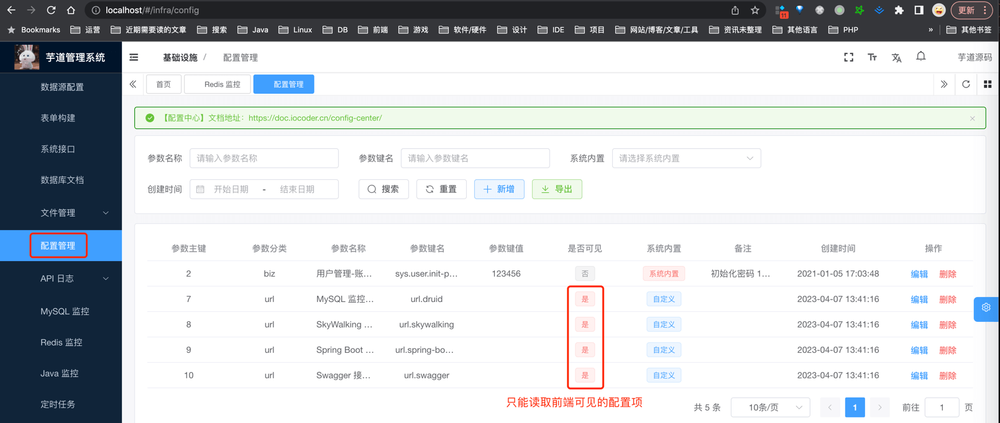
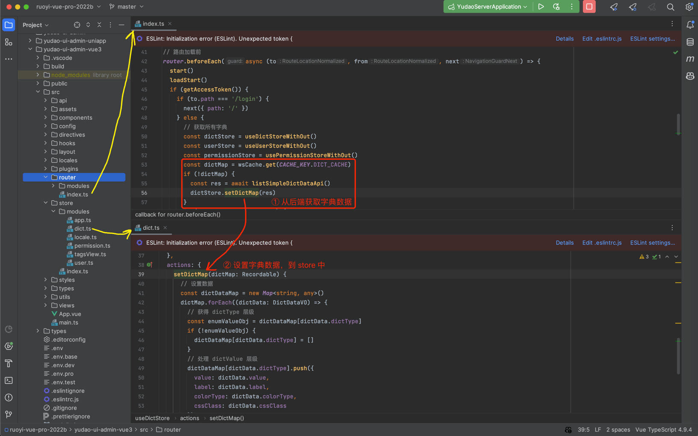
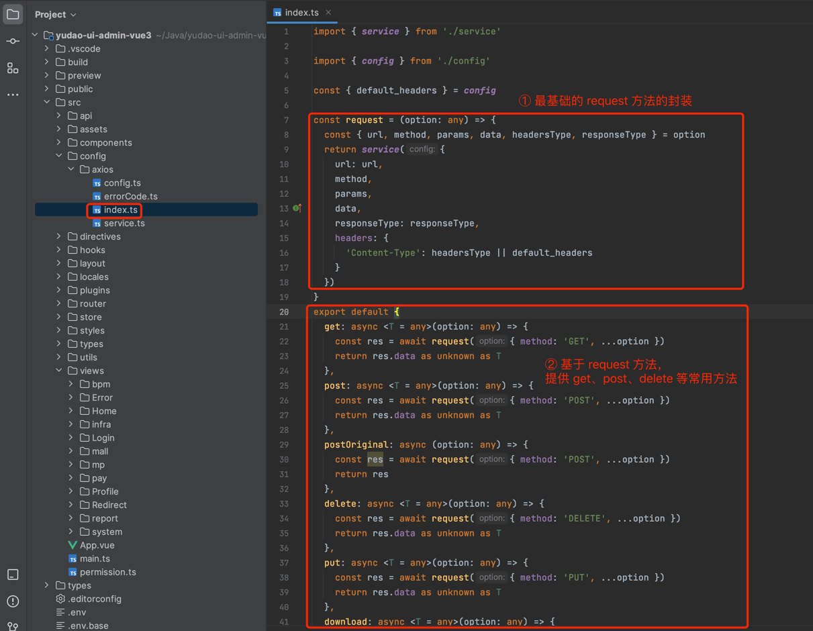
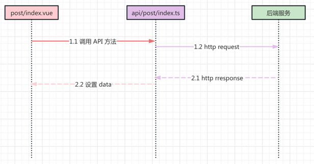
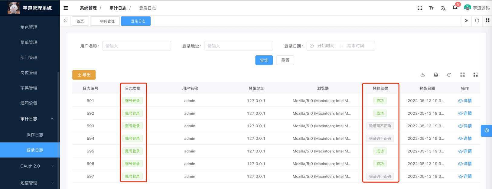
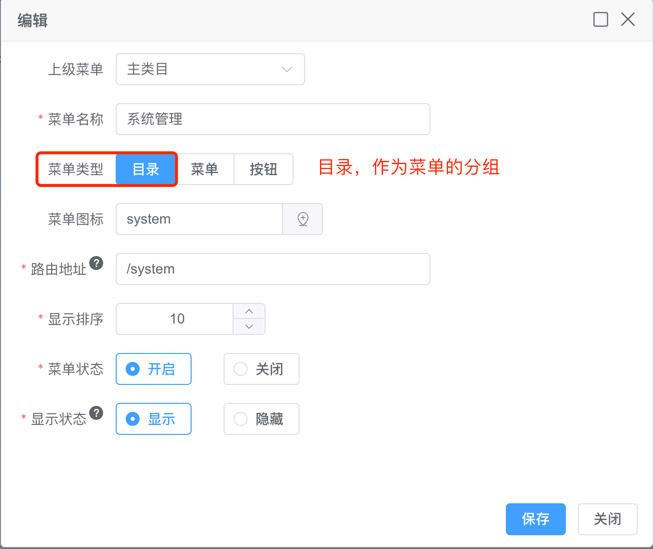
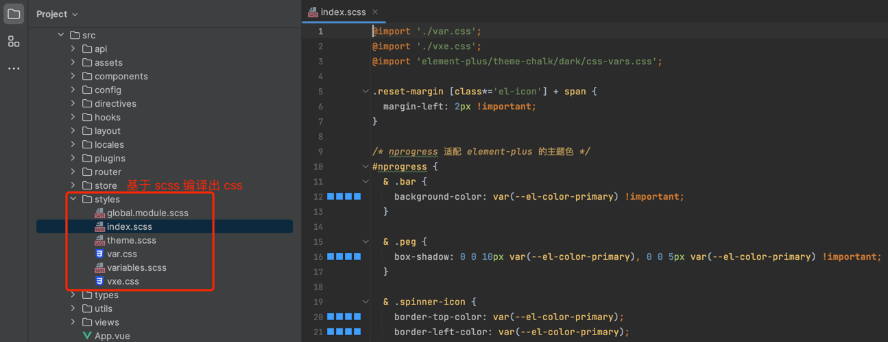
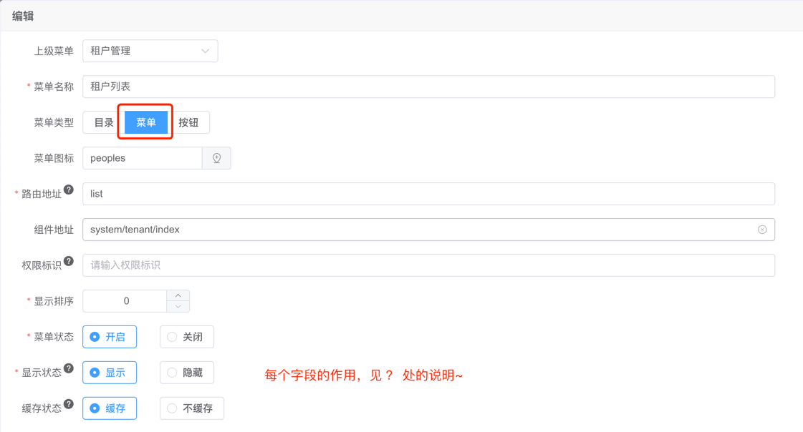

目录

# 开发规范

## [#](#_0-实战案例) 0. 实战案例

本小节，提供大家开发管理后台的功能时，最常用的普通列表、树形列表、新增与修改的表单弹窗、详情表单弹窗的实战案例。

### [#](#_0-1-普通列表) 0.1 普通列表

可参考 \[系统管理 -> 岗位管理\] 菜单：

*   API 接口：[`/src/api/system/post/index.ts` (opens new window)](https://github.com/yudaocode/yudao-ui-admin-vue3/blob/master/src/api/system/post/index.ts)
*   列表界面：[`/src/views/system/post/index.vue` (opens new window)](https://github.com/yudaocode/yudao-ui-admin-vue3/blob/master/src/views/system/post/index.vue)
*   表单界面：[`/src/views/system/post/PostForm.vue` (opens new window)](https://github.com/yudaocode/yudao-ui-admin-vue3/blob/master/src/views/system/post/PostForm.vue)

为什么界面拆成列表和表单两个 Vue 文件？

每个 Vue 文件，只实现一个功能，更简洁，维护性更好，Git 代码冲突概率低。

### [#](#_0-2-树形列表) 0.2 树形列表

可参考 \[系统管理 -> 部门管理\] 菜单：

*   API 接口：[`/src/api/system/dept/index.ts` (opens new window)](https://github.com/yudaocode/yudao-ui-admin-vue3/blob/master/src/api/system/dept/index.ts)
*   列表界面：[`/src/views/system/dept/index.vue` (opens new window)](https://github.com/yudaocode/yudao-ui-admin-vue3/blob/master/src/views/system/dept/index.vue)
*   表单界面：[`/src/views/system/dept/DeptForm.vue` (opens new window)](https://github.com/yudaocode/yudao-ui-admin-vue3/blob/master/src/views/system/dept/DeptForm.vue)

### [#](#_0-3-高性能列表) 0.3 高性能列表

可参考 \[系统管理 -> 地区管理\] 菜单，对应 [`/src/views/system/area/index.vue` (opens new window)](https://github.com/yudaocode/yudao-ui-admin-vue3/blob/master/src/views/system/area/index.vue) 列表界面

基于 [Virtualized Table 虚拟化表格 (opens new window)](https://element-plus.org/zh-CN/component/table-v2.html) 实现，解决一屏里超过 1000 条数据记录时，就会出现卡顿等性能问题。

### [#](#_0-4-详情弹窗) 0.4 详情弹窗

可参考 \[基础设施 -> API 日志 -> 访问日志\] 菜单，对应 [`/src/views/infra/apiAccessLog/ApiAccessLogDetail.vue` (opens new window)](https://github.com/yudaocode/yudao-ui-admin-vue3/blob/master/src/views/infra/apiAccessLog/ApiAccessLogDetail.vue) 详情弹窗

## [#](#_1-view-页面) 1. view 页面

在 [`@views` (opens new window)](https://github.com/yudaocode/yudao-ui-admin-vue3/blob/master/src/views/) 目录下，每个模块对应一个目录，它的所有功能的 `.vue` 都放在该目录里。



一般来说，一个路由对应一个 `index.vue` 文件。

## [#](#_2-api-请求) 2. api 请求

在 [`@/api` (opens new window)](https://github.com/yudaocode/yudao-ui-admin-vue3/tree/master/src/api) 目录下，每个模块对应一个 `index.ts` API 文件。



*   API 方法：会调用 `request` 方法，发起对后端 RESTful API 的调用。
*   `interface` 类型：定义了 API 的请求参数和返回结果的类型，对应后端的 VO 类型。

### [#](#_2-1-请求封装) 2.1 请求封装

[`/src/config/axios/index.ts` (opens new window)](https://github.com/yudaocode/yudao-ui-admin-vue3/blob/master/src/config/axios/service.ts) 基于 [axios (opens new window)](http://axios-js.com/zh-cn/docs/index.html) 封装，统一处理 GET、POST 方法的请求参数、请求头，以及错误提示信息等。



#### [#](#_2-1-1-创建-axios-实例) 2.1.1 创建 axios 实例

*   `baseURL` 基础路径
*   `timeout` 超时时间，默认为 30000 毫秒

实现代码 /src/config/axios/service.ts

```typescript
import axios from 'axios'

const { result_code, base_url, request_timeout } = config

// 创建 axios 实例
const service: AxiosInstance = axios.create({
    baseURL: base_url, // api 的 base_url
    timeout: request_timeout, // 请求超时时间
    withCredentials: false // 禁用 Cookie 等信息
})

```
#### [#](#_2-1-2-request-拦截器) 2.1.2 Request 拦截器

*   【重点】`Authorization`、`tenant-id` 请求头
*   GET 请求参数的拼接

实现代码 /src/config/axios/service.ts

```typescript
import axios, {
    AxiosInstance,
    AxiosRequestHeaders,
    AxiosResponse,
    AxiosError,
    InternalAxiosRequestConfig
} from 'axios'

import { getAccessToken, getTenantId } from '@/utils/auth'

const tenantEnable = import.meta.env.VITE_APP_TENANT_ENABLE

service.interceptors.request.use(
    (config: InternalAxiosRequestConfig) => {
        // 是否需要设置 token
        let isToken = (config!.headers || {}).isToken === false
        whiteList.some((v) => {
            if (config.url) {
                config.url.indexOf(v) > -1
                return (isToken = false)
            }
        })
        if (getAccessToken() && !isToken) {
            (config as Recordable).headers.Authorization = 'Bearer ' + getAccessToken() // 让每个请求携带自定义token
        }
        // 设置租户
        if (tenantEnable && tenantEnable === 'true') {
            const tenantId = getTenantId()
            if (tenantId) (config as Recordable).headers['tenant-id'] = tenantId
        }
        const params = config.params || {}
        const data = config.data || false
        if (
            config.method?.toUpperCase() === 'POST' &&
            (config.headers as AxiosRequestHeaders)['Content-Type'] ===
        'application/x-www-form-urlencoded'
    ) {
            config.data = qs.stringify(data)
        }
        // get参数编码
        if (config.method?.toUpperCase() === 'GET' && params) {
            let url = config.url + '?'
            for (const propName of Object.keys(params)) {
                const value = params[propName]
                if (value !== void 0 && value !== null && typeof value !== 'undefined') {
                    if (typeof value === 'object') {
                        for (const val of Object.keys(value)) {
                            const params = propName + '[' + val + ']'
                            const subPart = encodeURIComponent(params) + '='
                            url += subPart + encodeURIComponent(value[val]) + '&'
                        }
                    } else {
                        url += `${propName}=${encodeURIComponent(value)}&`
                    }
                }
            }
            // 给 get 请求加上时间戳参数，避免从缓存中拿数据
            // const now = new Date().getTime()
            // params = params.substring(0, url.length - 1) + `?_t=${now}`
            url = url.slice(0, -1)
            config.params = {}
            config.url = url
        }
        return config
    },
    (error: AxiosError) => {
        // Do something with request error
        console.log(error) // for debug
        Promise.reject(error)
    }
)

```
#### [#](#_2-1-3-response-拦截器) 2.1.3 Response 拦截器

*   访问令牌 AccessToken 过期时，使用刷新令牌 RefreshToken 刷新，获得新的访问令牌
*   刷新令牌失败（过期）时，跳回首页进行登录
*   请求失败，Message 错误提示

实现代码 /src/config/axios/service.ts

```typescript
import axios, {
    AxiosInstance,
    AxiosRequestHeaders,
    AxiosResponse,
    AxiosError,
    InternalAxiosRequestConfig
} from 'axios'
import { ElMessage, ElMessageBox, ElNotification } from 'element-plus'

import { getAccessToken, getRefreshToken, removeToken, setToken } from '@/utils/auth'

// 需要忽略的提示。忽略后，自动 Promise.reject('error')
const ignoreMsgs = [
    '无效的刷新令牌', // 刷新令牌被删除时，不用提示
    '刷新令牌已过期' // 使用刷新令牌，刷新获取新的访问令牌时，结果因为过期失败，此时需要忽略。否则，会导致继续 401，无法跳转到登出界面
]
// 是否显示重新登录
export const isRelogin = { show: false }
import errorCode from './errorCode'

import { resetRouter } from '@/router'
import { useCache } from '@/hooks/web/useCache'

service.interceptors.response.use(
    async (response: AxiosResponse<any>) => {
        const { data } = response
        const config = response.config
        if (!data) {
            // 返回“[HTTP]请求没有返回值”;
            throw new Error()
        }
        const { t } = useI18n()
        // 未设置状态码则默认成功状态
        const code = data.code || result_code
        // 二进制数据则直接返回
        if (
            response.request.responseType === 'blob' ||
            response.request.responseType === 'arraybuffer'
        ) {
            return response.data
        }
        // 获取错误信息
        const msg = data.msg || errorCode[code] || errorCode['default']
        if (ignoreMsgs.indexOf(msg) !== -1) {
            // 如果是忽略的错误码，直接返回 msg 异常
            return Promise.reject(msg)
        } else if (code === 401) {
            // 如果未认证，并且未进行刷新令牌，说明可能是访问令牌过期了
            if (!isRefreshToken) {
                isRefreshToken = true
                // 1. 如果获取不到刷新令牌，则只能执行登出操作
                if (!getRefreshToken()) {
                    return handleAuthorized()
                }
                // 2. 进行刷新访问令牌
                try {
                    const refreshTokenRes = await refreshToken()
                    // 2.1 刷新成功，则回放队列的请求 + 当前请求
                    setToken((await refreshTokenRes).data.data)
                    config.headers!.Authorization = 'Bearer ' + getAccessToken()
                    requestList.forEach((cb: any) => {
                        cb()
                    })
                    requestList = []
                    return service(config)
                } catch (e) {
                    // 为什么需要 catch 异常呢？刷新失败时，请求因为 Promise.reject 触发异常。
                    // 2.2 刷新失败，只回放队列的请求
                    requestList.forEach((cb: any) => {
                        cb()
                    })
                    // 提示是否要登出。即不回放当前请求！不然会形成递归
                    return handleAuthorized()
                } finally {
                    requestList = []
                    isRefreshToken = false
                }
            } else {
                // 添加到队列，等待刷新获取到新的令牌
                return new Promise((resolve) => {
                    requestList.push(() => {
                        config.headers!.Authorization = 'Bearer ' + getAccessToken() // 让每个请求携带自定义token 请根据实际情况自行修改
                        resolve(service(config))
                    })
                })
            }
        } else if (code === 500) {
            ElMessage.error(t('sys.api.errMsg500'))
            return Promise.reject(new Error(msg))
        } else if (code === 901) {
            ElMessage.error({
                offset: 300,
                dangerouslyUseHTMLString: true,
                message:
                    '<div>' +
                    t('sys.api.errMsg901') +
                    '</div>' +
                    '<div> &nbsp; </div>' +
                    '<div>参考 https://doc.iocoder.cn/ 教程</div>' +
                    '<div> &nbsp; </div>' +
                    '<div>5 分钟搭建本地环境</div>'
            })
            return Promise.reject(new Error(msg))
        } else if (code !== 200) {
            if (msg === '无效的刷新令牌') {
                // hard coding：忽略这个提示，直接登出
                console.log(msg)
            } else {
                ElNotification.error({ title: msg })
            }
            return Promise.reject('error')
        } else {
            return data
        }
    },
    (error: AxiosError) => {
        console.log('err' + error) // for debug
        let { message } = error
        const { t } = useI18n()
        if (message === 'Network Error') {
            message = t('sys.api.errorMessage')
        } else if (message.includes('timeout')) {
            message = t('sys.api.apiTimeoutMessage')
        } else if (message.includes('Request failed with status code')) {
            message = t('sys.api.apiRequestFailed') + message.substr(message.length - 3)
        }
        ElMessage.error(message)
        return Promise.reject(error)
    }
)

const refreshToken = async () => {
    axios.defaults.headers.common['tenant-id'] = getTenantId()
    return await axios.post(base_url + '/system/auth/refresh-token?refreshToken=' + getRefreshToken())
}
const handleAuthorized = () => {
    const { t } = useI18n()
    if (!isRelogin.show) {
        isRelogin.show = true
        ElMessageBox.confirm(t('sys.api.timeoutMessage'), t('common.confirmTitle'), {
            confirmButtonText: t('login.relogin'),
            cancelButtonText: t('common.cancel'),
            type: 'warning'
        })
            .then(() => {
                const { wsCache } = useCache()
                resetRouter() // 重置静态路由表
                wsCache.clear()
                removeToken()
                isRelogin.show = false
                window.location.href = '/'
            })
            .catch(() => {
                isRelogin.show = false
            })
    }
    return Promise.reject(t('sys.api.timeoutMessage'))
}

```
### [#](#_2-2-交互流程) 2.2 交互流程

一个完整的前端 UI 交互到服务端处理流程，如下图所示：



继续以 \[系统管理 -> 岗位管理\] 菜单为例，查看它是如何读取岗位列表的。代码如下：

```typescript
// ① api/system/post/index.ts
import request from '@/config/axios'

// 查询岗位列表
export const getPostPage = async (params: PageParam) => {
  return await request.get({ url: '/system/post/page', params })
}

// ② views/system/post/index.vue
<script setup lang="tsx">
const loading = ref(true) // 列表的加载中
const total = ref(0) // 列表的总页数
const list = ref([]) // 列表的数据
const queryParams = reactive({
    pageNo: 1,
    pageSize: 10,
    code: '',
    name: '',
    status: undefined
})

/** 查询岗位列表 */
const getList = async () => {
    loading.value = true
    try {
        const data = await PostApi.getPostPage(queryParams)
        list.value = data.list
        total.value = data.total
    } finally {
        loading.value = false
    }
}
</script>

```

## [#](#_3-component-组件) 3. component 组件
### [#](#_3-1-全局组件) 3.1 全局组件

在 [`@/components` (opens new window)](https://github.com/yudaocode/yudao-ui-admin-vue3/blob/master/src/components/) 目录下，实现**全局**组件，被所有模块所公用。

例如说，富文本编辑器、各种各搜索组件、封装的分页组件等等。



### [#](#_3-2-模块内组件) 3.2 模块内组件

每个模块的业务组件，可实现在 `views` 目录下，自己模块的目录的 `components` 目录下，避免单个 `.vue` 文件过大，降低维护成功。

例如说，`@/views/pay/app/components/xxx.vue`：



## [#](#_4-style-样式) 4. style 样式

① 在 [`@/styles` (opens new window)](https://github.com/yudaocode/yudao-ui-admin-vue3/tree/master/src/styles) 目录下，实现**全局**样式，被所有页面所公用。



② 每个 `.vue` 页面，可在 `<style />` 标签中添加样式，注意需要添加 `scoped` 表示只作用在当前页面里，避免造成全局的样式污染。



更多也可以看看如下两篇文档：

*   [《vue-element-plus-admin —— 项目配置「样式配置」》 (opens new window)](https://element-plus-admin-doc.cn/guide/settings.html#%E6%A0%B7%E5%BC%8F%E9%85%8D%E7%BD%AE)
*   [《vue-element-plus-admin —— 样式》 (opens new window)](https://element-plus-admin-doc.cn/guide/design.html)

## [#](#_5-项目规范) 5. 项目规范

可参考 [《vue-element-plus-admin —— 项目规范》 (opens new window)](https://element-plus-admin-doc.cn/dep/lint.html) 文档。