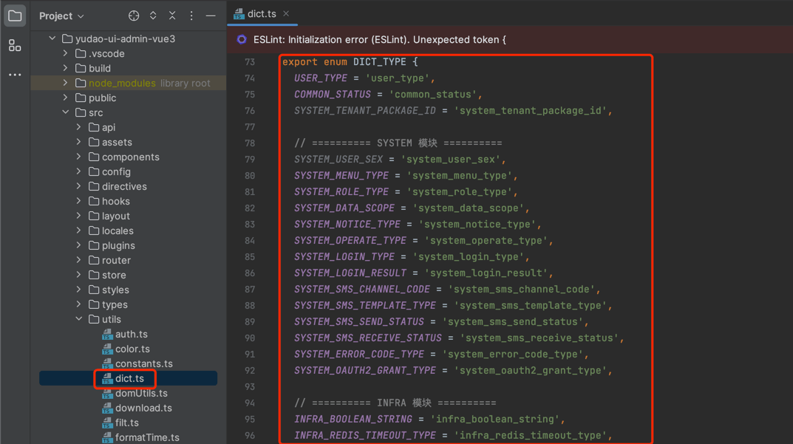
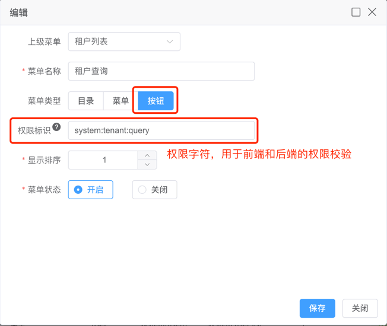
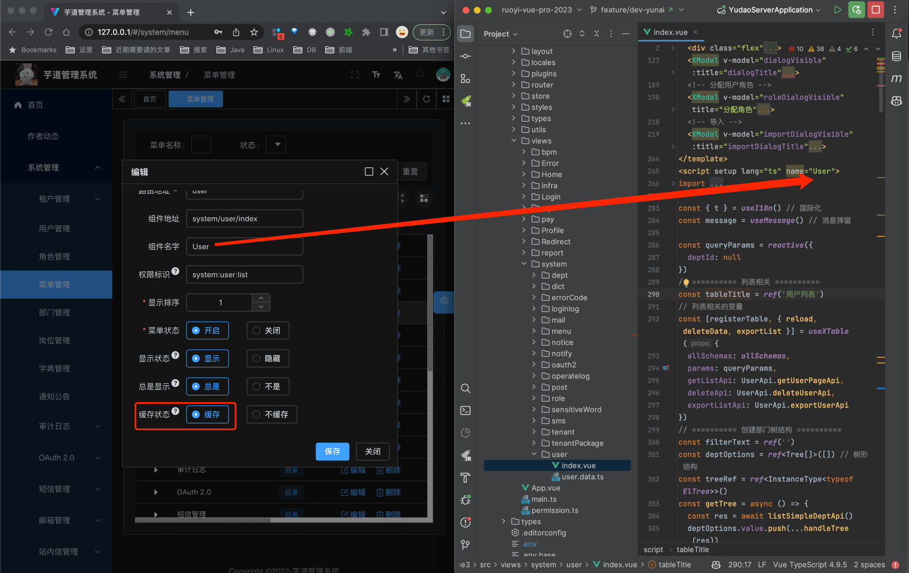

目录

# 菜单路由

前端项目基于 vue-element-plus-admin 实现，它的 [路由和侧边栏 (opens new window)](https://element-plus-admin-doc.cn/guide/router.html) 是组织起一个后台应用的关键骨架。

侧边栏和路由是绑定在一起的，所以你只有在 [@/router/index.js (opens new window)](https://github.com/yudaocode/yudao-ui-admin-vue3/blob/master/src/router/index.ts) 下面配置对应的路由，侧边栏就能动态的生成了，大大减轻了手动重复编辑侧边栏的工作量。

当然，这样就需要在配置路由的时候，遵循一些约定的规则。

## [#](#_1-路由配置) 1. 路由配置

首先，我们了解一下本项目配置路由时，提供了哪些配置项：

```typescript
/**
* redirect: noredirect        当设置 noredirect 的时候该路由在面包屑导航中不可被点击
* name:'router-name'          设定路由的名字，一定要填写不然使用<keep-alive>时会出现各种问题
* meta : {
    hidden: true              当设置 true 的时候该路由不会再侧边栏出现 如404，login等页面(默认 false)

    alwaysShow: true          当你一个路由下面的 children 声明的路由大于1个时，自动会变成嵌套的模式，
                              只有一个时，会将那个子路由当做根路由显示在侧边栏，
                              若你想不管路由下面的 children 声明的个数都显示你的根路由，
                              你可以设置 alwaysShow: true，这样它就会忽略之前定义的规则，
                              一直显示根路由(默认 false)

    title: 'title'            设置该路由在侧边栏和面包屑中展示的名字

    icon: 'svg-name'          设置该路由的图标

    noCache: true             如果设置为true，则不会被 <keep-alive> 缓存(默认 false)

    breadcrumb: false         如果设置为false，则不会在breadcrumb面包屑中显示(默认 true)

    affix: true               如果设置为true，则会一直固定在tag项中(默认 false)

    noTagsView: true          如果设置为true，则不会出现在tag中(默认 false)

    activeMenu: '/dashboard'  显示高亮的路由路径

    followAuth: '/dashboard'  跟随哪个路由进行权限过滤

    canTo: true               设置为true即使hidden为true，也依然可以进行路由跳转(默认 false)
  }
**/

```

## [#](#_1-1-普通示例) 1.1 普通示例

注意事项：

*   整个项目所有路由 `name` 不能重复
*   所有的多级路由最终都会转成二级路由，所以不能内嵌子路由
*   除了 `layout` 对应的 `path` 前面需要加 `/`，其余子路由都不要以 `/` 开头

```json
{
  path: '/level',
  component: Layout,
  redirect: '/level/menu1/menu1-1/menu1-1-1',
  name: 'Level',
  meta: {
    title: t('router.level'),
    icon: 'carbon:skill-level-advanced'
  },
  children: [
    {
      path: 'menu1',
      name: 'Menu1',
      component: getParentLayout(),
      redirect: '/level/menu1/menu1-1/menu1-1-1',
      meta: {
        title: t('router.menu1')
      },
      children: [
        {
          path: 'menu1-1',
          name: 'Menu11',
          component: getParentLayout(),
          redirect: '/level/menu1/menu1-1/menu1-1-1',
          meta: {
            title: t('router.menu11'),
            alwaysShow: true
          },
          children: [
            {
              path: 'menu1-1-1',
              name: 'Menu111',
              component: () => import('@/views/Level/Menu111.vue'),
              meta: {
                title: t('router.menu111')
              }
            }
          ]
        },
        {
          path: 'menu1-2',
          name: 'Menu12',
          component: () => import('@/views/Level/Menu12.vue'),
          meta: {
            title: t('router.menu12')
          }
        }
      ]
    },
    {
      path: 'menu2',
      name: 'Menu2Demo',
      component: () => import('@/views/Level/Menu2.vue'),
      meta: {
        title: t('router.menu2')
      }
    }
  ]
}

```

### [#](#_1-2-外链示例) 1.2 外链示例

只需要将 `path` 设置为需要跳转的 HTTP 地址即可。

```json
{
  path: '/external-link',
  component: Layout,
  meta: {
    name: 'ExternalLink'
  },
  children: [
    {
      path: 'https://www.iocoder.cn',
      meta: { name: 'Link', title: '芋道源码' }
    }
  ]
}

```

## [#](#_2-路由) 2. 路由

项目的路由分为两种：静态路由、动态路由。

### [#](#_2-1-静态路由) 2.1 静态路由

静态路由，代表那些不需要动态判断权限的路由，如登录页、404、个人中心等通用页面。

在 [@/router/modules/remaining.ts (opens new window)](https://github.com/yudaocode/yudao-ui-admin-vue3/tree/master/src/router/modules/remaining.ts) 的 `remainingRouter`，就是配置对应的公共路由。如下图所示：


### [#](#_2-2-动态路由) 2.2 动态路由

动态路由，代表那些需要根据用户动态判断权限，并通过 [addRoutes (opens new window)](https://router.vuejs.org/guide/advanced/dynamic-routing.html#adding-routes) 动态添加的页面，如用户管理、角色管理等功能页面。

在用户登录成功后，会触发 [`@/store/modules/permission.ts` (opens new window)](https://github.com/yudaocode/yudao-ui-admin-vue3/blob/master/src/store/modules/permission.ts#L35-L66) 请求后端的菜单 RESTful API 接口，获取用户**有权限**的菜单列表，并转化添加到路由中。如下图所示：


友情提示：

1.  动态路由可以在 \[系统管理 -> 菜单管理\] 进行新增和修改操作，请求的后端 RESTful API 接口是 [`/admin-api/system/auth/get-permission-info` (opens new window)](https://github.com/YunaiV/ruoyi-vue-pro/blob/master/yudao-module-system/yudao-module-system-biz/src/main/java/cn/iocoder/yudao/module/system/controller/admin/auth/AuthController.java#L107-L110)
2.  动态路由在生产环境下会默认使用路由懒加载，实现方式参考 [import.meta.glob('../views/\*\*/\*.{vue,tsx}') (opens new window)](https://github.com/yudaocode/yudao-ui-admin-vue3/blob/master/src/utils/routerHelper.ts#L6) 方法的判断

补充说明：

最新的代码，部分逻辑重构到 [`@/permission.ts` (opens new window)](https://github.com/yudaocode/yudao-ui-admin-vue3/blob/master/src/permission.ts#L44-L48)

### [#](#_2-3-路由跳转) 2.3 路由跳转

使用 `router.push` 方法，可以实现跳转到不同的页面。

```typescript
const { push } = useRouter()

// 简单跳转
push('/job/job-log');

// 跳转页面并设置请求参数，使用 `query` 属性
push('/bpm/process-instance/detail?id=' + row.processInstance.id)

```

## [#](#_3-菜单管理) 3. 菜单管理

项目的菜单在 \[系统管理 -> 菜单管理\] 进行管理，支持**无限**层级，提供目录、菜单、按钮三种类型。如下图所示：



菜单可在 \[系统管理 -> 角色管理\] 被分配给角色。如下图所示：


### [#](#_3-1-新增目录) 3.1 新增目录

① 大多数情况下，目录是作为菜单的【分类】：


② 目录也提供实现【外链】的能力：


### [#](#_3-2-新增菜单) 3.2 新增菜单


### [#](#_3-3-新增按钮) 3.3 新增按钮



## [#](#_4-权限控制) 4. 权限控制

前端通过权限控制，隐藏用户没有权限的按钮等，实现功能级别的权限。

友情提示：前端的权限控制，主要是提升用户体验，避免操作后发现没有权限。

最终在请求到后端时，还是会进行一次权限的校验。

### [#](#_4-1-v-haspermi-指令) 4.1 v-hasPermi 指令

[`v-hasPermi` (opens new window)](https://github.com/yudaocode/yudao-ui-admin-vue3/blob/master/src/directives/permission/hasPermi.ts) 指令，基于权限字符，进行权限的控制。

```html
<!-- 单个 -->
<el-button v-hasPermi="['system:user:create']">存在权限字符串才能看到</el-button>

<!-- 多个，满足任一一个即可 -->
<el-button v-hasPermi="['system:user:create', 'system:user:update']">包含权限字符串才能看到</el-button>

```

### [#](#_4-2-v-hasrole-指令) 4.2 v-hasRole 指令

[`v-hasRole` (opens new window)](https://github.com/yudaocode/yudao-ui-admin-vue3/blob/master/src/directives/permission/hasRole.ts) 指令，基于角色标识，机进行的控制。

```html
<!-- 单个 -->
<el-button v-hasRole="['admin']">管理员才能看到</el-button>

<!-- 多个，满足任一一个即可 -->
<el-button v-hasRole="['role1', 'role2']">包含角色才能看到</el-button>

```

### [#](#_4-3-结合-v-if-指令) 4.3 结合 v-if 指令

在某些情况下，它是不适合使用 `v-hasPermi` 或 `v-hasRole` 指令，如元素标签组件。此时，只能通过手动设置 `v-if`，通过使用全局权限判断函数，用法是基本一致的。

```html
<template>
  <el-tabs>
    <el-tab-pane v-if="checkPermi(['system:user:create'])" label="用户管理" name="user">用户管理</el-tab-pane>
    <el-tab-pane v-if="checkPermi(['system:user:create', 'system:user:update'])" label="参数管理" name="menu">参数管理</el-tab-pane>
    <el-tab-pane v-if="checkRole(['admin'])" label="角色管理" name="role">角色管理</el-tab-pane>
    <el-tab-pane v-if="checkRole(['admin','common'])" label="定时任务" name="job">定时任务</el-tab-pane>
   </el-tabs>
</template>

<script>
import { checkPermi, checkRole } from "@/utils/permission"; // 权限判断函数

export default{
   methods: {
    checkPermi,
    checkRole
  }
}
</script>

```

## [#](#_5-页面缓存) 5. 页面缓存

开启缓存有 2 个条件

*   路由设置 `name`，且不能重复
*   路由对应的组件加上 `name`，与路由设置的 `name` 保持一致

友情提示：页面缓存是什么？

简单来说，Tab 切换时，开启页面缓存的 Tab 保持原本的状态，不进行刷新。

详细可见 [Vue 文档 —— KeepAlive (opens new window)](https://vuejs.org/guide/built-ins/keep-alive.html)

### [#](#_5-1-静态路由的示例) 5.1 静态路由的示例

① router 路由的 `name` 声明如下：

```js
{
    path: 'menu2',
    name: 'Menu2',
    component: () => import('@/views/Level/Menu2.vue'),
    meta: {
        title: t('router.menu2')
    }
}

```

② view component 的 `name` 声明如下：

```js
<script setup lang="ts">
    defineOptions({
    name: 'Menu2'
})
</script>

```

注意：

`keep-alive` 生效的前提是：需要将路由的 `name` 属性及对应的页面的 `name` 设置成一样。

因为：`include -` 字符串或正则表达式，只有名称匹配的组件会被缓存

### [#](#_5-2-动态路由的示例) 5.2 动态路由的示例

