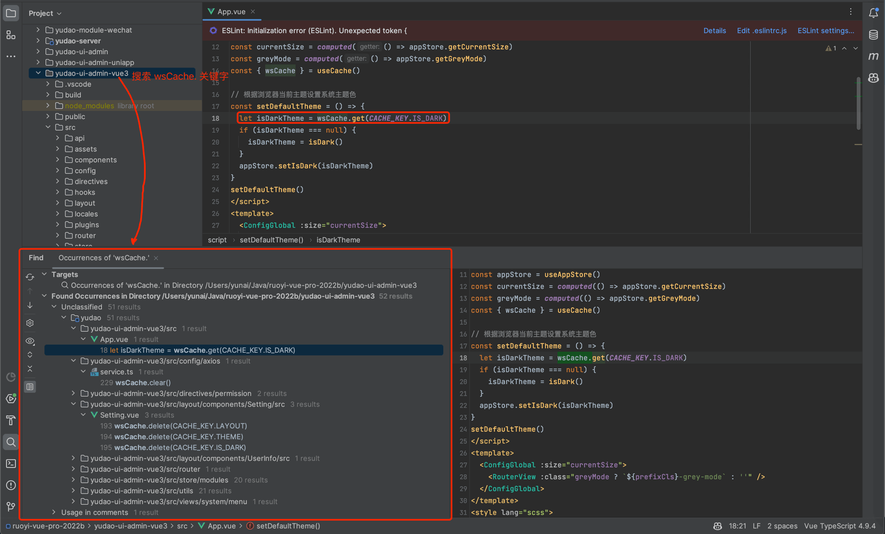
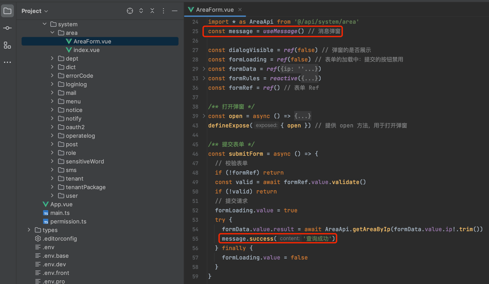
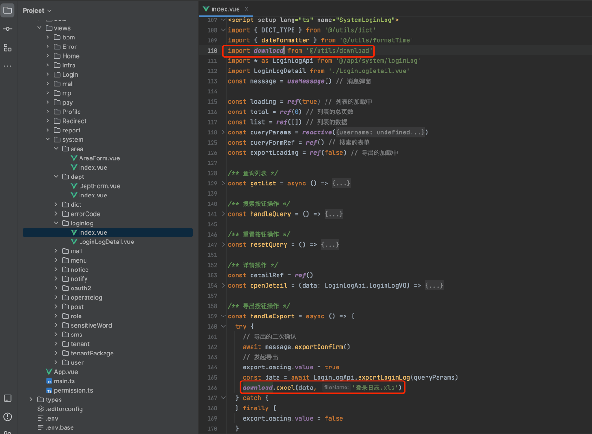

目录

# 通用方法

本小节，分享前端项目的常用方法。

## [#](#_1-缓存配置) 1. 缓存配置

友情提示：

该小节，基于 [《vue element plus admin —— 项目配置「缓存配置 」》 (opens new window)](https://element-plus-admin-doc.cn/guide/settings.html#%E7%BC%93%E5%AD%98%E9%85%8D%E7%BD%AE) 的内容修改。

### [#](#_1-1-说明) 1.1 说明

在项目中，你可以看到很多地方都使用了 `wsCache.set` 或者 `wsCache.get`，这是基于 [web-storage-cache (opens new window)](https://github.com/wuchangming/web-storage-cache) 进行封装，采用 `hook` 的形式。

该插件对HTML5 `localStorage` 和 `sessionStorage` 进行了扩展，添加了超时时间，序列化方法。可以直接存储 `json` 对象，同时可以非常简单的进行超时时间的设置。

本项目默认是采用 `sessionStorage` 的存储方式，如果更改，可以直接在 [useCache.ts (opens new window)](https://github.com/yudaocode/yudao-ui-admin-vue3/blob/master/src/hooks/web/useCache.ts) 中把 `type: CacheType = 'sessionStorage'` 改为 `type: CacheType = 'localStorage'`，这样项目中的所有用到的地方，都会变成该方式进行数据存储。

如果只想单个更改，可以传入存储类型 `const { wsCache } = useCache('localStorage')`，既可只适用当前存储对象。

注意：

更改完默认存储方式后，需要清除浏览器缓存并重新登录，以免造成不可描述的问题。

### [#](#_1-2-示例) 1.2 示例

## [#](#_2-message-对象) 2. `message` 对象
### [#](#_2-1-说明) 2.1 说明

`message` 对象，由 [src/hooks/web/useMessage.ts (opens new window)](https://github.com/yudaocode/yudao-ui-admin-vue3/blob/master/src/hooks/web/useMessage.ts) 实现，基于 ElMessage、ElMessageBox、ElNotification 封装，用于做消息提示、通知提示、对话框提醒、二次确认等。

### [#](#_2-2-示例) 2.2 示例

## [#](#_3-download-对象) 3. `download` 对象
### [#](#_3-1-说明) 3.1 说明

`$download` 对象，由 [`util/download.ts` (opens new window)](https://github.com/yudaocode/yudao-ui-admin-vue3/blob/master/src/utils/download.ts) 实现，用于 Excel、Word、Zip、HTML 等类型的文件下载。

### [#](#_3-2-示例) 3.2 示例

