目录

# OAuth 2.0（SSO 单点登录)

## [#](#oauth-2-0-是什么) OAuth 2.0 是什么？

OAuth 2.0 的概念讲解，可以阅读如下三篇文章：

*   [《理解 OAuth 2.0》 (opens new window)](https://www.iocoder.cn/Fight/ruanyifeng-oauth_2_0/?self)
*   [《OAuth 2.0 的一个简单解释》 (opens new window)](https://www.iocoder.cn/Fight/ruanyifeng-oauth_design/?self)
*   [《OAuth 2.0 的四种方式》 (opens new window)](https://www.iocoder.cn/Fight/ruanyifeng-oauth-grant-types/?self)

重点是理解 **授权码模式** 和 **密码模式**，它们是最常用的两种授权模式。

本文，我们也会基于它们，分别实现 SSO 单点登录。

## [#](#oauth-2-0-授权模式的选择) OAuth 2.0 授权模式的选择？

授权模式的选择，其实非常简单，总结起来就是一张图：

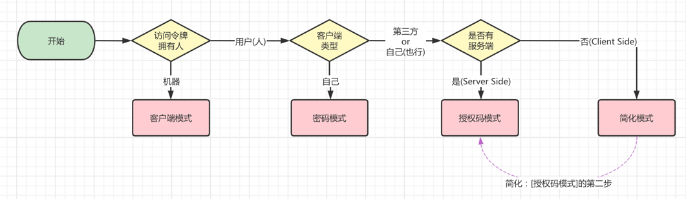

问题一：什么场景下，使用客户端模式（Client Credentials）？

如果令牌拥有者是**机器**的情况下，那就使用客户端模式。 例如说：

*   开发了一个开放平台，提供给其它外部服务调用
*   开发了一个 RPC 服务，提供给其它内部服务调用

实际的案例，我们接入微信公众号时，会使用 `appid` 和 `secret` 参数，[获取 Access token (opens new window)](https://developers.weixin.qq.com/doc/offiaccount/Basic_Information/Get_access_token.html) 访问令牌。

问题二：什么场景下，使用密码模式（Resource Owner Password Credentials）？

接入的 Client 客户端，是属于**自己**的情况下，可以使用密码模式。 例如说：

*   客户端是你自己公司的 App 或网页，然后授权服务也是你公司的

不过，如果客户端是**第三方**的情况下，使用密码模式的话，该客户端是可以拿到用户的账号、密码，存在安全的风险，此时可以考虑使用授权码或简化模式。

问题三：什么场景下，使用授权码模式（Authorization Code）？

接入的 Client 客户端，是属于**第三方**的情况下，可以使用授权码模式。例如说：

*   客户端是你自己公司的 App 或网页，作为第三方，接入 [微信 (opens new window)](https://developers.weixin.qq.com/doc/offiaccount/OA_Web_Apps/Wechat_webpage_authorization.html)、[QQ (opens new window)](https://wiki.connect.qq.com/oauth2-0%E7%AE%80%E4%BB%8B)、[钉钉 (opens new window)](https://open.dingtalk.com/document/mobile-app-guide/mobile-application-access) 等等进行 OAuth 2.0 登录

当然，如果客户端是**自己**的情况下，也可以采用授权码模式。例如说：

*   客户端是腾讯旗下的各种游戏，可使用微信、QQ，接入 [微信 (opens new window)](https://developers.weixin.qq.com/doc/offiaccount/OA_Web_Apps/Wechat_webpage_authorization.html)、[QQ (opens new window)](https://wiki.connect.qq.com/oauth2-0%E7%AE%80%E4%BB%8B) 等等进行 OAuth 2.0 登录
*   客户端是公司内的各种管理后台（ERP、OA、CRM 等），跳转到统一的 SSO 单点登录，使用授权码模式进行授权

问题四：什么场景下，使用简化模式（Implicit）？

简化模式，**简化** 的是授权码模式的流程的 **第二步**，差异在于：

*   授权码模式：授权完成后，获得的是 code 授权码，需要 Server Side 服务端使用该授权码，再向授权服务器获取 Access Token 访问令牌
*   简化模式：授权完成后，Client Side 客户端直接获得 Access Token 访问令牌

暂时没有特别好的案例，感兴趣可以看看如下文档，也可以不看：

*   [《QQ OAuth 2.0 开发指定 —— 开发攻略\_Client-side》 (opens new window)](https://wiki.connect.qq.com/%e5%bc%80%e5%8f%91%e6%94%bb%e7%95%a5_client-side)
*   [《百度 OAuth —— Implicit Grant 授权》 (opens new window)](http://developer.baidu.com/wiki/index.php?title=docs/oauth/implicit)

问题五：该项目中，使用了哪些授权模式？

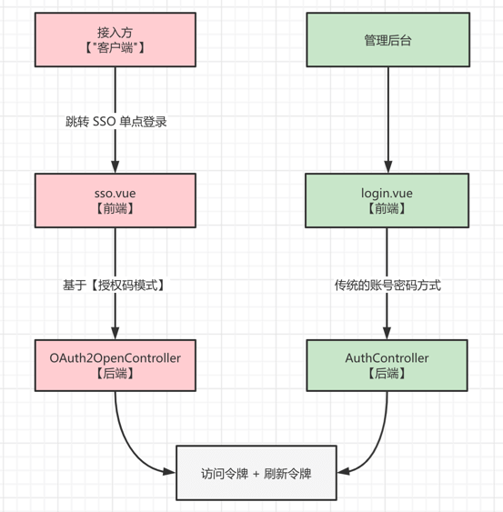

如上图所示，分成 **外部授权** 和 **内部登录** 两种方式。

① 红色的“外部授权”：基于【授权码模式】，实现 SSO 单点登录，将用户授权给接入的客户端。客户端可以是内部的其它管理系统，也可以是外部的第三方。

② 绿色的“内部登录”：管理后台的登录接口，还是采用传统的 [`/admin-api/system/auth/login` (opens new window)](https://github.com/YunaiV/ruoyi-vue-pro/blob/master/yudao-module-system/yudao-module-system-biz/src/main/java/cn/iocoder/yudao/module/system/controller/admin/auth/AuthController.java#L61-L67) 账号密码登录，并没有使用【密码模式】，主要考虑降低大家的学习成本，如果没有将用户授权给其它系统的情况下，这样做已经可以很好的满足业务的需要。当然，这里也可以将管理后台作为一个客户端，使用【密码模式】进行授权。

另外，考虑到 OAuth 2.0 使用的访问令牌 + 刷新令牌可以提供更好的安全性，所以即使是传统的账号密码登录，也复用了它作为令牌的实现。

## [#](#oauth-2-0-技术选型) OAuth 2.0 技术选型？

实现 OAuth 2.0 的功能，一般采用 [Spring Security OAuth (opens new window)](https://spring.io/projects/spring-security-oauth) 或 [Spring Authorization Server (opens new window)](https://spring.io/projects/spring-authorization-server)(SAS) 框架，前者已废弃，被后者所替代。但是使用它们，会面临三大问题：

*   学习成本大：SAS 是新出的框架，入门容易精通难，引入项目中需要花费 1-2 周深入学习
*   排查问题难：使用碰到问题时，往往需要调试到源码层面，团队只有个别人具备这种能力
*   定制成本高：根据业务需要，想要在 SAS 上定制功能，对源码要有不错的掌控力，难度可能过大

⚔ 因此，项目参考多个 OAuth 2.0 框架，**自研**实现 OAuth 2.0 的功能，具备学习成本小、排查问题容易、定制成本低的优点，支持多种授权模式，并内置 SSO 单点登录的功能。

友情提示：具备一定规模的互联网公司，基本不会直接采用 Spring Security OAuth 或 Spring Authorization Server 框架，也是采用自研的方式，更好的满足自身的业务需求与技术拓展。

🙂 另外，通过学习项目的 OAuth 2.0 实现，可以进一步加深对 OAuth 2.0 的理解，知其然、知其所以然！

最终实现的整体架构，如下图所示：

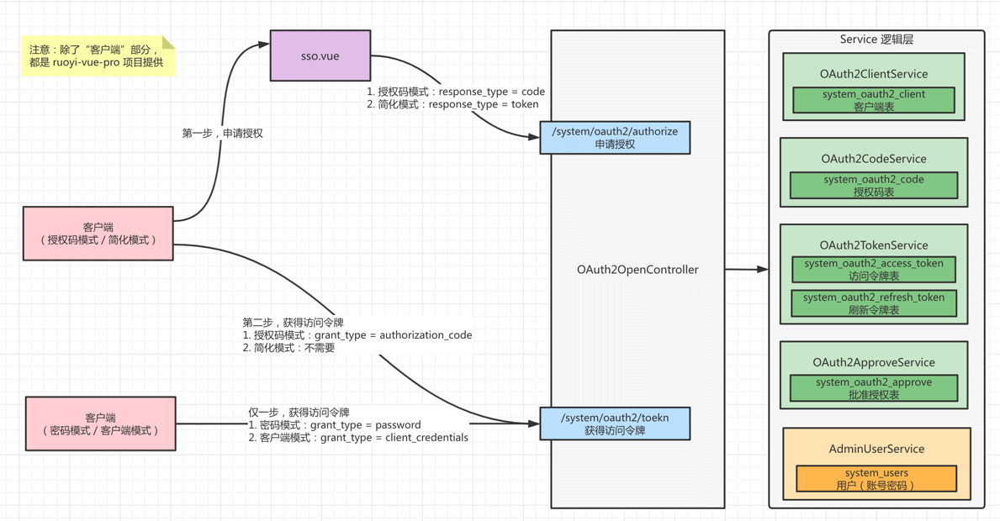

详细的代码实现，我们在视频中进行讲解。

## [#](#如何实现-sso-单点登录) 如何实现 SSO 单点登录？
### [#](#实战一-基于授权码模式-实现-sso-单点登录) 实战一：基于授权码模式，实现 SSO 单点登录

示例代码见 [https://gitee.com/yudaocode/yudao-demo/tree/master/yudao-sso-demo-by-code (opens new window)](https://gitee.com/yudaocode/yudao-demo/tree/master/yudao-sso-demo-by-code) 地址，整体流程如下图所示：


具体的使用流程如下：

**① 第一步**，分别启动 `ruoyi-vue-pro` 项目的前端和后端。

**② 第二步**，访问 [系统管理 -> OAuth 2.0 -> 应用管理 (opens new window)](http://127.0.0.1:1024/system/oauth2/oauth2/application) 菜单，新增一个应用（客户端），信息如下图：

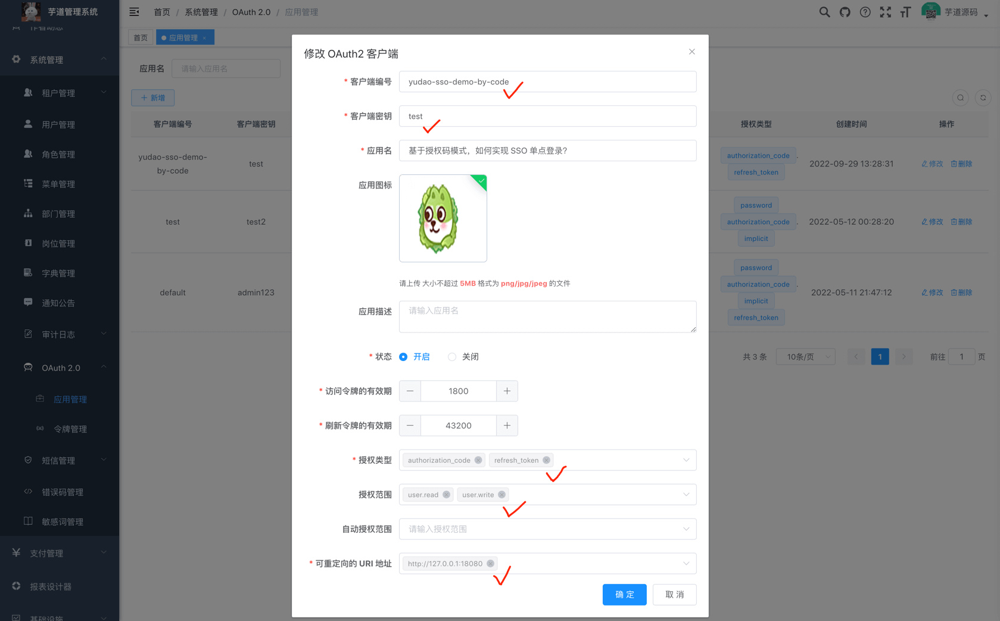

*   客户端编号：`yudao-sso-demo-by-code`
*   客户端密钥：`test`
*   应用名：`基于授权码模式，如何实现 SSO 单点登录？`
*   授权类型：`authorization_code`、`refresh_token`
*   授权范围：`user.read`、`user.write`
*   可重定向的 URI 地址：`http://127.0.0.1:18080`

ps：如果已经有这个客户端，可以不用新增。

**③ 第三步**，运行 [SSODemoApplication (opens new window)](https://gitee.com/yudaocode/yudao-demo/blob/master/yudao-sso-demo-by-code/src/main/java/cn/iocoder/yudao/ssodemo/SSODemoApplication.java) 类，启动接入方的项目，它已经包含前端和后端部分。启动成功的日志如下：

友情提示：如果你使用的是 Vue3 + element-plus 的前端项目，一定要操作！！！

需要把 yudao-sso-demo-by-code 的 `index.html` 文件中的 `http://127.0.0.1:1024` 改成 `http://127.0.0.1:8080`！！！否则在后续的“授权回调”时，会跳转失败噢！！！

```bash
2022-10-01 21:24:35.572  INFO 60265 --- [           main] o.s.b.w.embedded.tomcat.TomcatWebServer  : Tomcat started on port(s): 18080 (http) with context path ''

```

**④ 第四步**，浏览器访问 [http://127.0.0.1:18080/index.html (opens new window)](http://127.0.0.1:18080/index.html) 地址，进入接入方的 index.html 首页。因为暂未登录，可以点击「跳转」按钮，跳转到 `ruoyi-vue-pro` 项目的 SSO 单点登录页。

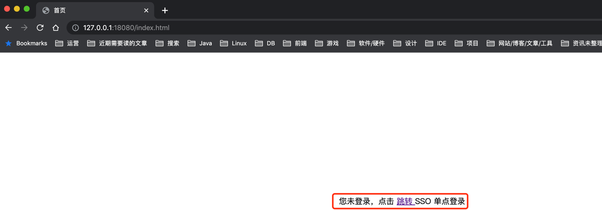

疑问：为什么没有跳转到 SSO 单点登录页，而是跳转到 ruoyi-vue-pro 项目的登录页？

因为在 `ruoyi-vue-pro` 项目也未登录，所以先跳转到该项目的登录页，使用账号密码进行登录。登录完成后，会跳转回 SSO 单点登录页，继续完成 OAuth 2.0 的授权流程。

**⑤ 第五步**，勾选 "访问你的个人信息" 和 "修改你的个人信息"，点击「同意授权」按钮，完成 code 授权码的申请。

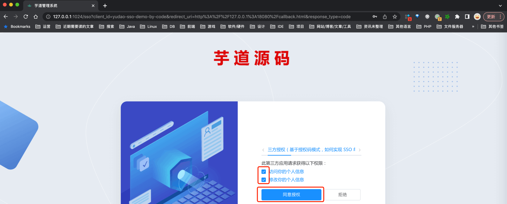

**⑥ 第六步**，完成授权后，会跳转到接入方的 callback.html 回调页，并在 URL 上可以看到 code 授权码。

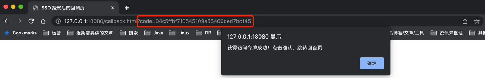

**⑦ 第七步**，点击「确认」按钮，接入方的前端会使用 code 授权码，向接入方的后端获取 accessToken 访问令牌。

而接入方的后端，使用接收到的 code 授权码，通过调用 `ruoyi-vue-pro` 项目的后端，获取到 accessToken 访问令牌，并最终返回给接入方的前端。

**⑧ 第八步**，在接入方的前端拿到 accessToken 访问令牌后，跳转回自己的 index.html 首页，并进一步从 `ruoyi-vue-pro` 项目获取到该用户的昵称等个人信息。后续，你可以执行「修改昵称」、「刷新令牌」、「退出登录」等操作。

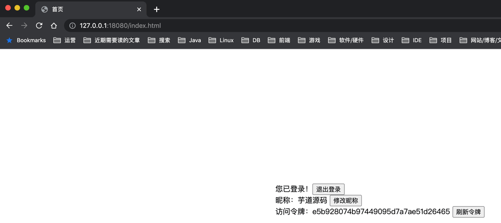

* * *

示例代码的具体实现，与详细的解析，可以观看如下视频：

*   [02、基于授权码模式，如何实现 SSO 单点登录？ (opens new window)](https://t.zsxq.com/06fUne6yZ)
*   [03、请求时，如何校验 accessToken 访问令牌？ (opens new window)](https://t.zsxq.com/06iuNRvjM)
*   [04、访问令牌过期时，如何刷新 Token 令牌？ (opens new window)](https://t.zsxq.com/06jAqFimu)
*   [05、登录成功后，如何获得用户信息？ (opens new window)](https://t.zsxq.com/06ne6e6aE)
*   [06、退出时，如何删除 Token 令牌？ (opens new window)](https://t.zsxq.com/06fUJIUfq)

### [#](#实战二-基于密码模式-实现-sso-登录) 实战二：基于密码模式，实现 SSO 登录

示例代码见 [https://gitee.com/yudaocode/yudao-demo/tree/master/yudao-sso-demo-by-password (opens new window)](https://gitee.com/yudaocode/yudao-demo/tree/master/yudao-sso-demo-by-password) 地址，整体流程如下图所示：

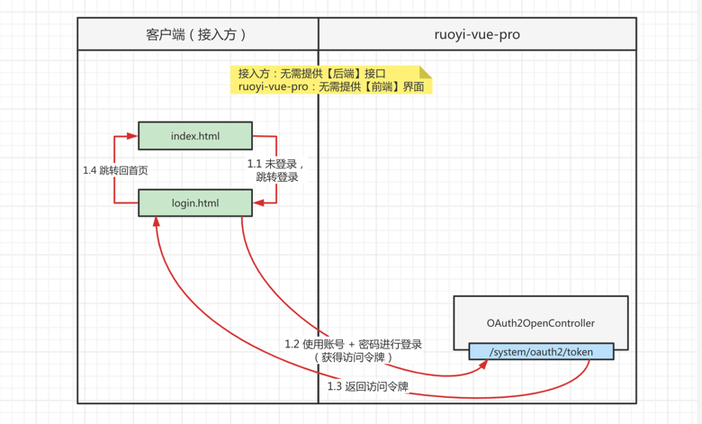

具体的使用流程如下：

**① 第一步**，分别启动 `ruoyi-vue-pro` 项目的前端和后端。注意，前端需要使用 Vue2 版本，因为 Vue3 版本暂时没有实现 SSO 页面。

**② 第二步**，访问 [系统管理 -> OAuth 2.0 -> 应用管理 (opens new window)](http://127.0.0.1:1024/system/oauth2/oauth2/application) 菜单，新增一个应用（客户端），信息如下图：

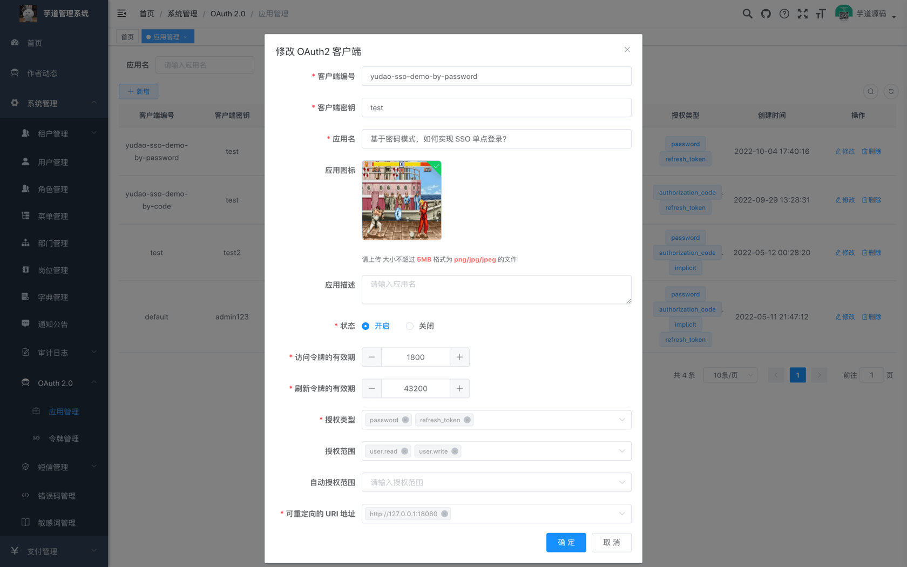

*   客户端编号：`yudao-sso-demo-by-password`
*   客户端密钥：`test`
*   应用名：`基于密码模式，如何实现 SSO 单点登录？`
*   授权类型：`password`、`refresh_token`
*   授权范围：`user.read`、`user.write`
*   可重定向的 URI 地址：`http://127.0.0.1:18080`

ps：如果已经有这个客户端，可以不用新增。

**③ 第三步**，运行 [SSODemoApplication (opens new window)](https://gitee.com/yudaocode/yudao-demo/blob/master/yudao-sso-demo-by-password/src/main/java/cn/iocoder/yudao/ssodemo/SSODemoApplication.java) 类，启动接入方的项目，它已经包含前端和后端部分。启动成功的日志如下：

```bash
2022-10-04 21:24:35.572  INFO 60265 --- [           main] o.s.b.w.embedded.tomcat.TomcatWebServer  : Tomcat started on port(s): 18080 (http) with context path ''

```

**④ 第四步**，浏览器访问 [http://127.0.0.1:18080/index.html (opens new window)](http://127.0.0.1:18080/index.html) 地址，进入接入方的 index.html 首页。因为暂未登录，可以点击「跳转」按钮，跳转到 login.html 登录页。

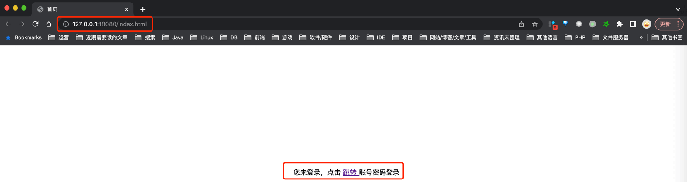

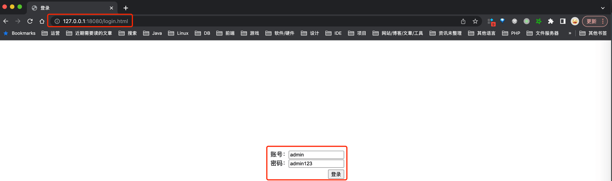

**⑤ 第五步**，点击「登录」按钮，调用 `ruoyi-vue-pro` 项目的后端，获取到 accessToken 访问令牌，完成登录操作。

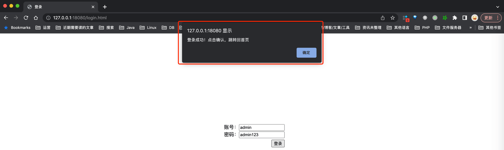

**⑥ 第六步**，登录完成后，跳转回自己的 index.html 首页，并进一步从 `ruoyi-vue-pro` 项目获取到该用户的昵称等个人信息。后续，你可以执行「修改昵称」、「刷新令牌」、「退出登录」等操作。

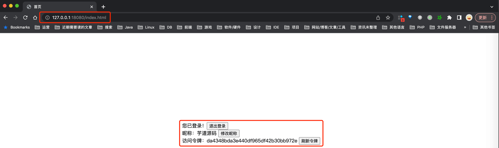

* * *

示例代码的具体实现，与详细的解析，可以观看如下视频：

*   [07、基于密码模式，如何实现 SSO 单点登录？ (opens new window)](https://t.zsxq.com/06rrrzBAu)

## [#](#oauth-2-0-表结构) OAuth 2.0 表结构

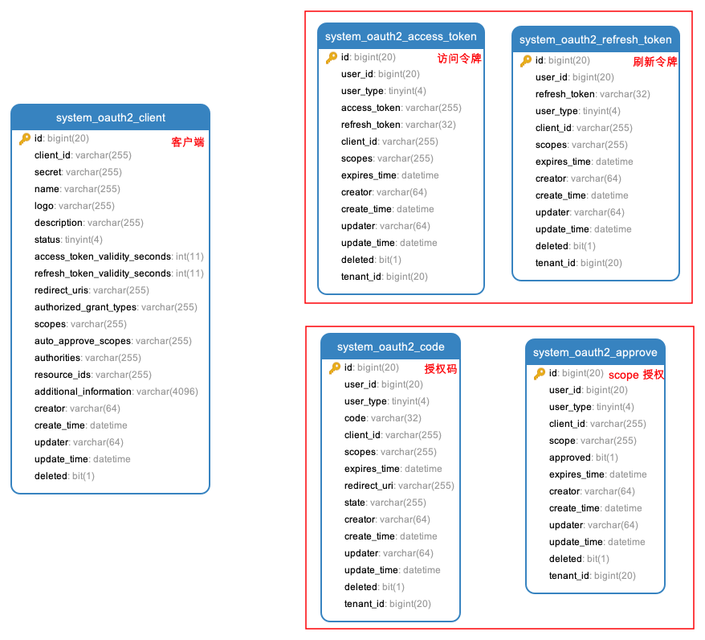

每个表的具体设计，与详细的解析，可以观看如下视频：

*   [08、如何实现客户端的管理？ (opens new window)](https://t.zsxq.com/06ubEmeII)
*   [09、单点登录界面，如何进行初始化？ (opens new window)](https://t.zsxq.com/06qjm2rbQ)
*   [10、单点登录界面，如何进行【手动】授权？ (opens new window)](https://t.zsxq.com/06AEQfA2j)
*   [11、单点登录界面，如何进行【自动】授权？ (opens new window)](https://t.zsxq.com/06JIQvrrN)
*   [12、基于【授权码】模式，如何获得 Token 令牌？ (opens new window)](https://t.zsxq.com/06jEQZNfE)
*   [13、基于【密码】模式，如何获得 Token 令牌？ (opens new window)](https://t.zsxq.com/06aEynUZF)
*   [14、如何校验、刷新、删除访问令牌？ (opens new window)](https://t.zsxq.com/06MbM3n2v)