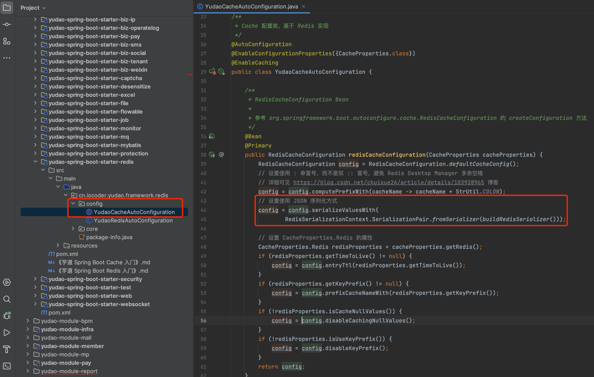
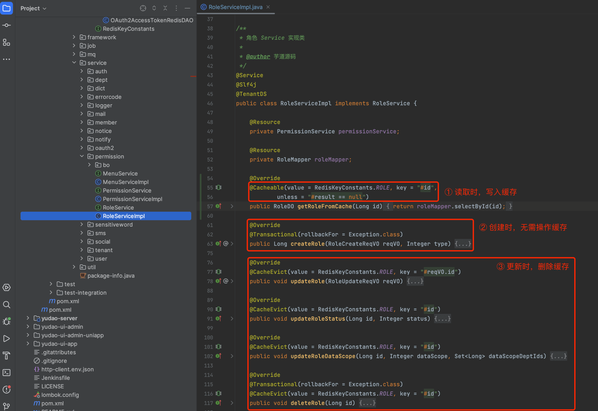
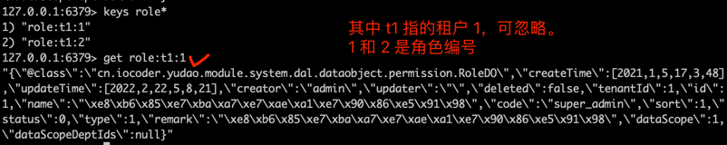
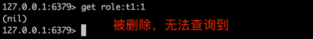
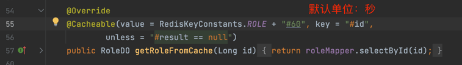
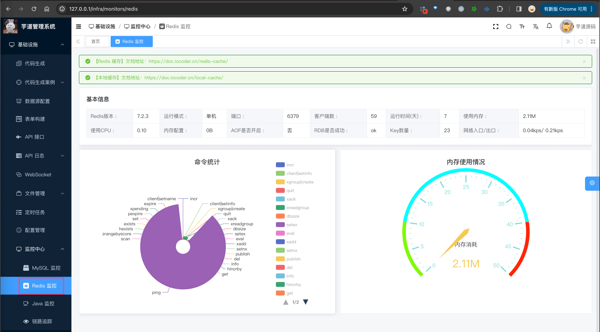

目录

# Redis 缓存

[`yudao-spring-boot-starter-redis` (opens new window)](https://github.com/YunaiV/ruoyi-vue-pro/blob/master/yudao-framework/yudao-spring-boot-starter-redis/) 技术组件，使用 Redis 实现缓存的功能，它有 2 种使用方式：

*   编程式缓存：基于 Spring Data Redis 框架的 RedisTemplate 操作模板
*   声明式缓存：基于 Spring Cache 框架的 `@Cacheable` 等等注解

## [#](#_1-编程式缓存) 1. 编程式缓存

友情提示：

如果你未学习过 Spring Data Redis 框架，可以后续阅读 [《芋道 Spring Boot Redis 入门》 (opens new window)](http://www.iocoder.cn/Spring-Boot/Redis/?yudao) 文章。

```xml
<dependency>
    <groupId>org.redisson</groupId>
    <artifactId>redisson-spring-boot-starter</artifactId>
</dependency>

```

由于 Redisson 提供了分布式锁、队列、限流等特性，所以使用它作为 Spring Data Redis 的客户端。

### [#](#_1-1-spring-data-redis-配置) 1.1 Spring Data Redis 配置

① 在 [`application-local.yaml` (opens new window)](https://github.com/YunaiV/ruoyi-vue-pro/blob/master/yudao-server/src/main/resources/application-local.yaml#L60-L64) 配置文件中，通过 `spring.redis` 配置项，设置 Redis 的配置。如下图所示：


② 在 [YudaoRedisAutoConfiguration (opens new window)](https://github.com/YunaiV/ruoyi-vue-pro/blob/master/yudao-framework/yudao-spring-boot-starter-redis/src/main/java/cn/iocoder/yudao/framework/redis/config/YudaoRedisAutoConfiguration.java) 配置类，设置使用 JSON 序列化 value 值。如下图所示：


### [#](#_1-2-实战案例) 1.2 实战案例

以访问令牌 Access Token 的缓存来举例子，讲解项目中是如何使用 Spring Data Redis 框架的。


#### [#](#_1-2-1-引入依赖) 1.2.1 引入依赖

在 `yudao-module-system-biz` 模块中，引入 `yudao-spring-boot-starter-redis` 技术组件。如下所示：

```xml
<dependency>
    <groupId>cn.iocoder.boot</groupId>
    <artifactId>yudao-spring-boot-starter-redis</artifactId>
</dependency>

```

#### [#](#_1-2-2-oauth2accesstokendo) 1.2.2 OAuth2AccessTokenDO

新建 [OAuth2AccessTokenDO (opens new window)](https://github.com/YunaiV/ruoyi-vue-pro/blob/master/yudao-module-system/yudao-module-system-biz/src/main/java/cn/iocoder/yudao/module/system/dal/dataobject/oauth2/OAuth2AccessTokenDO.java) 类，访问令牌 Access Token 类。代码如下：


友情提示：

*   ① 如果值是【简单】的 String 或者 Integer 等类型，无需创建数据实体。
*   ② 如果值是【复杂对象】时，建议在 `dal/dataobject` 包下，创建对应的数据实体。

#### [#](#_1-2-3-rediskeyconstants) 1.2.3 RedisKeyConstants

为什么要定义 Redis Key 常量？

每个 `yudao-module-xxx` 模块，都有一个 RedisKeyConstants 类，定义该模块的 Redis Key 的信息。目的是，避免 Redis Key 散落在 Service 业务代码中，像对待数据库的表一样，对待每个 Redis Key。通过这样的方式，如果我们想要了解一个模块的 Redis 的使用情况，只需要查看 RedisKeyConstants 类即可。

在 `yudao-module-system` 模块的 [RedisKeyConstants (opens new window)](https://github.com/YunaiV/ruoyi-vue-pro/blob/master/yudao-module-system/yudao-module-system-biz/src/main/java/cn/iocoder/yudao/module/system/dal/redis/RedisKeyConstants.java) 类中，新建 OAuth2AccessTokenDO 对应的 Redis Key 定义 `OAUTH2_ACCESS_TOKEN`。如下图所示：


#### [#](#_1-2-4-oauth2accesstokenredisdao) 1.2.4 OAuth2AccessTokenRedisDAO

新建 [OAuth2AccessTokenRedisDAO (opens new window)](https://github.com/YunaiV/ruoyi-vue-pro/blob/master/yudao-module-system/yudao-module-system-biz/src/main/java/cn/iocoder/yudao/module/system/dal/redis/oauth2/OAuth2AccessTokenRedisDAO.java) 类，是 OAuth2AccessTokenDO 的 RedisDAO 实现。代码如下：


#### [#](#_1-2-5-oauth2tokenserviceimpl) 1.2.5 OAuth2TokenServiceImpl

在 [OAuth2TokenServiceImpl (opens new window)](https://github.com/YunaiV/ruoyi-vue-pro/blob/master/yudao-module-system/yudao-module-system-biz/src/main/java/cn/iocoder/yudao/module/system/service/oauth2/OAuth2TokenServiceImpl.java) 中，只要注入 OAuth2AccessTokenRedisDAO Bean，非常简洁干净的进行 OAuth2AccessTokenDO 的缓存操作，无需关心具体的实现。代码如下：


## [#](#_2-声明式缓存) 2. 声明式缓存

友情提示：

如果你未学习过 Spring Cache 框架，可以后续阅读 [《芋道 Spring Boot Cache 入门》 (opens new window)](http://www.iocoder.cn/Spring-Boot/Cache/?yudao) 文章。

```xml
<dependency>
    <groupId>org.springframework.boot</groupId>
    <artifactId>spring-boot-starter-cache</artifactId>
</dependency>

```

相比来说 Spring Data Redis 编程式缓存，Spring Cache 声明式缓存的使用更加便利，一个 `@Cacheable` 注解即可实现缓存的功能。示例如下：

```java
@Cacheable(value = "users", key = "#id")
UserDO getUserById(Integer id);

```

### [#](#_2-1-spring-cache-配置) 2.1 Spring Cache 配置

① 在 [`application.yaml` (opens new window)](https://github.com/YunaiV/ruoyi-vue-pro/blob/master/yudao-server/src/main/resources/application.yaml#L60-L64) 配置文件中，通过 `spring.redis` 配置项，设置 Redis 的配置。如下图所示：


② 在 [YudaoCacheAutoConfiguration (opens new window)](https://github.com/YunaiV/ruoyi-vue-pro/blob/master/yudao-framework/yudao-spring-boot-starter-redis/src/main/java/cn/iocoder/yudao/framework/redis/config/YudaoCacheAutoConfiguration.java) 配置类，设置使用 JSON 序列化 value 值。如下图所示：



### [#](#_2-2-常见注解) 2.2 常见注解
#### [#](#_2-2-1-cacheable-注解) 2.2.1 @Cacheable 注解

[`@Cacheable` (opens new window)](https://github.com/spring-projects/spring-framework/blob/main/spring-context/src/main/java/org/springframework/cache/annotation/Cacheable.java) 注解：添加在方法上，缓存方法的执行结果。执行过程如下：

*   1）首先，判断方法执行结果的缓存。如果有，则直接返回该缓存结果。
*   2）然后，执行方法，获得方法结果。
*   3）之后，根据是否满足缓存的条件。如果满足，则缓存方法结果到缓存。
*   4）最后，返回方法结果。

#### [#](#_2-2-2-cacheput-注解) 2.2.2 @CachePut 注解

[`@CachePut` (opens new window)](https://github.com/spring-projects/spring-framework/blob/main/spring-context/src/main/java/org/springframework/cache/annotation/CachePut.java) 注解，添加在方法上，缓存方法的执行结果。不同于 `@Cacheable` 注解，它的执行过程如下：

*   1）首先，执行方法，获得方法结果。也就是说，无论是否有缓存，都会执行方法。
*   2）然后，根据是否满足缓存的条件。如果满足，则缓存方法结果到缓存。
*   3）最后，返回方法结果。

#### [#](#_2-2-3-cacheevict-注解) 2.2.3 @CacheEvict 注解

[`@CacheEvict` (opens new window)](https://github.com/spring-projects/spring-framework/blob/master/spring-context/src/main/java/org/springframework/cache/annotation/CacheEvict.java) 注解，添加在方法上，删除缓存。

### [#](#_2-3-实战案例) 2.3 实战案例

在 [RoleServiceImpl (opens new window)](https://github.com/YunaiV/ruoyi-vue-pro/blob/master/yudao-module-system/yudao-module-system-biz/src/main/java/cn/iocoder/yudao/module/system/service/permission/RoleServiceImpl.java) 中，使用 Spring Cache 实现了 Role 角色缓存，采用【被动读】的方案。原因是：



*   【被动读】相对能够保证 Redis 与 MySQL 的一致性
*   绝大数数据不需要放到 Redis 缓存中，采用【主动写】会将非必要的数据进行缓存

友情提示：

如果你未学习过 MySQL 与 Redis 一致性的问题，可以后续阅读 [《Redis 与 MySQL 双写一致性如何保证？ 》 (opens new window)](https://www.iocoder.cn/Fight/How-Redis-and-MySQL-double-write-consistency-guarantee/?yudao) 文章。

① 执行 `#getRoleFromCache(...)` 方法，从 MySQL 读取数据后，向 Redis 写入缓存。如下图所示：



② 执行 `#updateRole(...)` 或 `#deleteRole(...)` 方法，在更新或者删除 MySQL 数据后，从 Redis 删除缓存。如下图所示：



补充说明：

如果你在多个项目里，使用了 Redis 想通 db 的话，可以通过 `spring.cache.redis.key-prefix` 解决，可见 [https://gitee.com/zhijiantianya/ruoyi-vue-pro/pulls/998/ (opens new window)](https://gitee.com/zhijiantianya/ruoyi-vue-pro/pulls/998/)

### [#](#_2-4-过期时间) 2.4 过期时间

Spring Cache 默认使用 `spring.cache.redis.time-to-live` 配置项，设置缓存的过期时间，项目默认为 1 小时。

如果你想自定义过期时间，可以在 `@Cacheable` 注解中的 `cacheNames` 属性中，添加 `#{过期时间}` 后缀，单位是秒。如下图所示：



实现的原来，参考 [《Spring @Cacheable 扩展支持自定义过期时间 》 (opens new window)](https://juejin.cn/post/7102222578026020871) 文章。

## [#](#_3-redis-监控) 3. Redis 监控

`yudao-module-infra` 的 [`redis` (opens new window)](https://github.com/YunaiV/ruoyi-vue-pro/blob/master/yudao-module-infra/yudao-module-infra-biz/src/main/java/cn/iocoder/yudao/module/infra/controller/admin/redis/RedisController.java) 模块，提供了 Redis 监控的功能。

点击 \[基础设施 -> 监控中心 -> Redis 监控\] 菜单，可以查看到 Redis 的基础信息、命令统计、内存信息。如下图所示：

