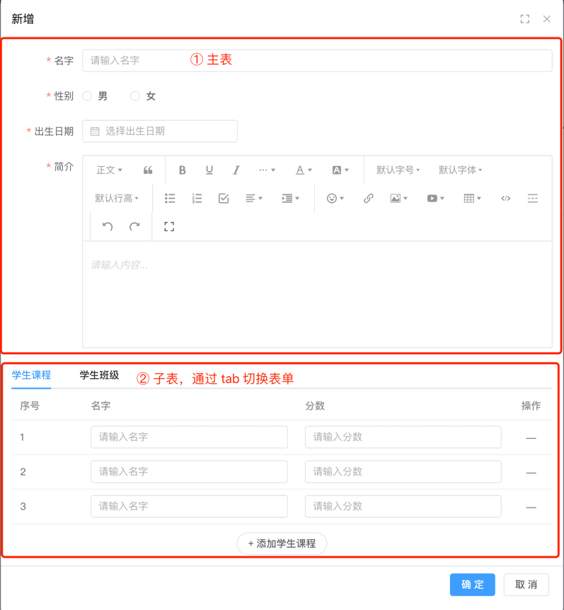
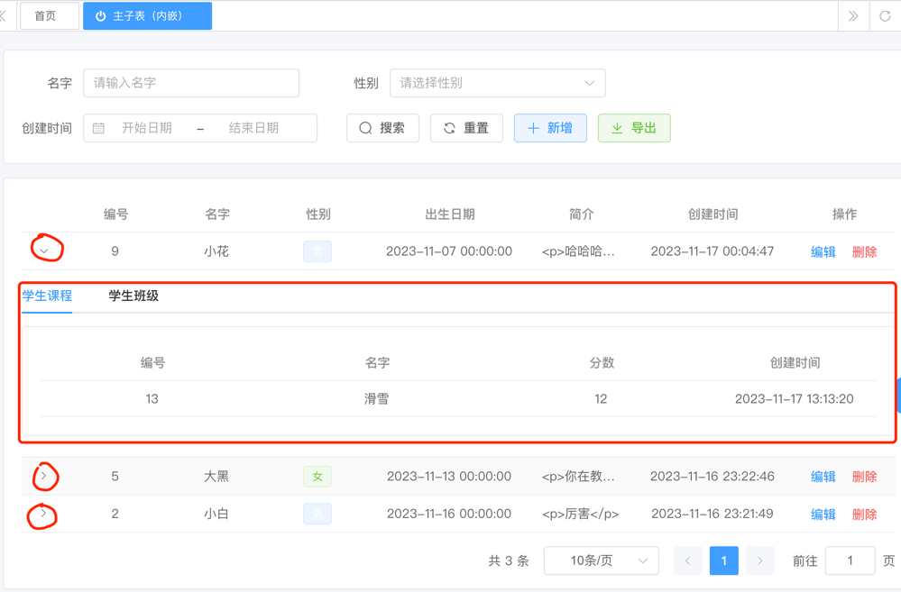
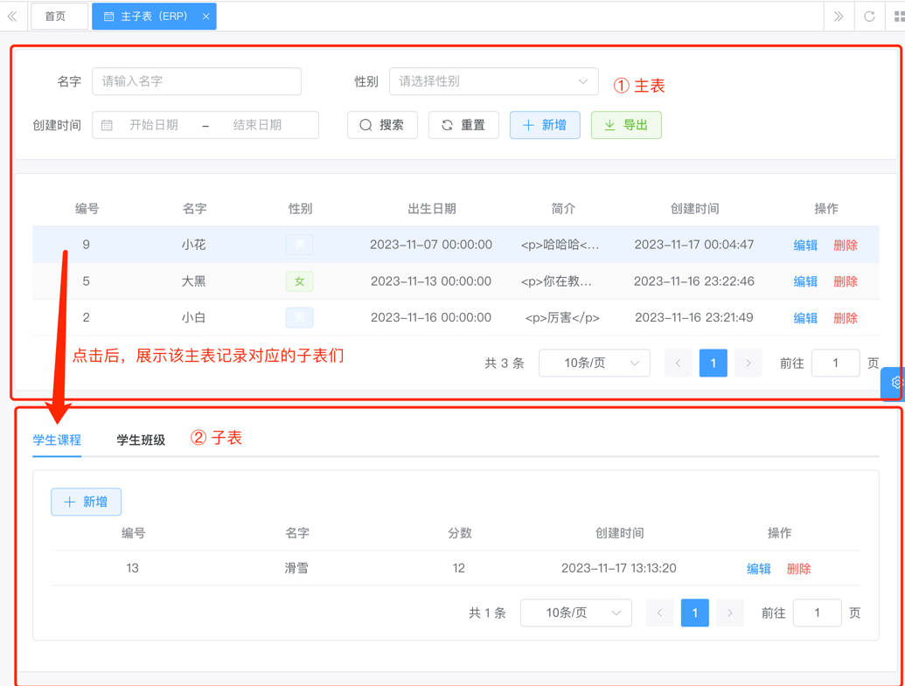
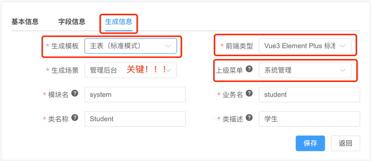
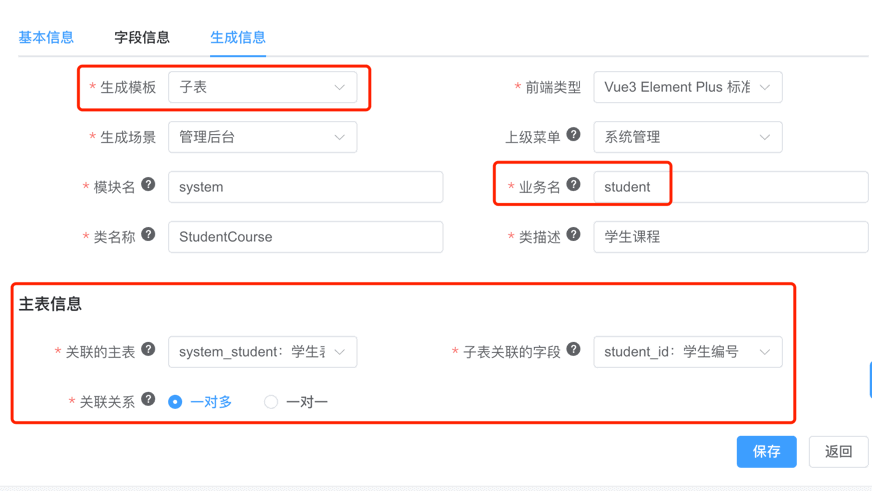
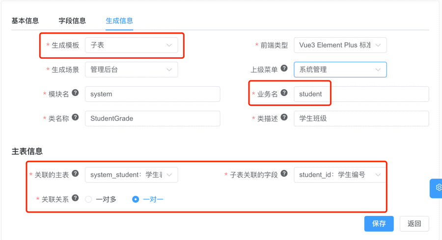

目录

# 代码生成【主子表】

友情提示：

本文接 [《代码生成【单表】》](/new-feature/)，请务必先阅读。因为重复的内容，本文会不再赘述！

主子表，指的是一个主表，被多个子表所关联，关联的关系是一对一或一对多。

例如说：主表是【学生】，子表可以是：

*   子表是【成绩】，两者是“一对多”的关系，一个学生可以有多个成绩。
*   子表是【班级】，两者是“一对一”的关系，一个学生只能有一个班级。

下面，我们将演示“主子表”的使用，基于代码生成器，在 `yudao-module-system` 模块中，开发一个【**学生**】的功能。

友情提示：

目前只有 yudao-ui-admin-vue3 支持主子表，yudao-ui-admin-vue2、yudao-ui-admin-vben 正在适配中！

## [#](#_0-主子表模式) 0. 主子表模式

针对不同的交互模式，项目提供了三种主子表模式：标准、ERP、内嵌。

### [#](#_0-1-标准模式) 0.1 标准模式

对应 \[基础设施 -> 代码生成案例 -> 主子表（标准）\] 菜单。

在新增和修改时，主表和子表在一个弹窗表单中，一起提交。如下图所示：



### [#](#_0-2-内嵌模式) 0.2 内嵌模式

对应 \[基础设施 -> 代码生成案例 -> 主子表（内嵌）\] 菜单。

在「标准模式」的基础之上，列表 **内嵌** 子表的列表。如下图所示：



### [#](#_0-3-erp-模式) 0.3 ERP 模式

对应 \[基础设施 -> 代码生成案例 -> 主子表（ERP）\] 菜单。

主表和子表，独立列表，也独立表单。如下图所示：



## [#](#_1-数据库表结构设计) 1. 数据库表结构设计

① 设计 **主表** 的数据库表名为 `system_student` 学生表，其建表语句如下：

```sql
CREATE TABLE `system_student` (
  `id` bigint NOT NULL AUTO_INCREMENT COMMENT '编号',
  `name` varchar(100) CHARACTER SET utf8mb4 COLLATE utf8mb4_unicode_ci NOT NULL DEFAULT '' COMMENT '名字',
  `birthday` datetime NOT NULL COMMENT '出生日期',
  `description` varchar(255) CHARACTER SET utf8mb4 COLLATE utf8mb4_0900_ai_ci NOT NULL COMMENT '简介',
  `creator` varchar(64) CHARACTER SET utf8mb4 COLLATE utf8mb4_unicode_ci DEFAULT '' COMMENT '创建者',
  `create_time` datetime NOT NULL DEFAULT CURRENT_TIMESTAMP COMMENT '创建时间',
  `updater` varchar(64) CHARACTER SET utf8mb4 COLLATE utf8mb4_unicode_ci DEFAULT '' COMMENT '更新者',
  `update_time` datetime NOT NULL DEFAULT CURRENT_TIMESTAMP ON UPDATE CURRENT_TIMESTAMP COMMENT '更新时间',
  `deleted` bit(1) NOT NULL DEFAULT b'0' COMMENT '是否删除',
  `tenant_id` bigint NOT NULL DEFAULT '0' COMMENT '租户编号',
  PRIMARY KEY (`id`) USING BTREE
) ENGINE=InnoDB AUTO_INCREMENT=10 DEFAULT CHARSET=utf8mb4 COLLATE=utf8mb4_unicode_ci COMMENT='学生表';

```

② 设计 **子表** 的数据库表名为 `system_student_course` 学生课程表，其建表语句如下：

```sql
CREATE TABLE `system_student_course` (
  `id` bigint NOT NULL AUTO_INCREMENT COMMENT '编号',
  `student_id` bigint NOT NULL COMMENT '学生编号',
  `name` varchar(100) CHARACTER SET utf8mb4 COLLATE utf8mb4_unicode_ci NOT NULL DEFAULT '' COMMENT '名字',
  `score` tinyint NOT NULL COMMENT '分数',
  `creator` varchar(64) CHARACTER SET utf8mb4 COLLATE utf8mb4_unicode_ci DEFAULT '' COMMENT '创建者',
  `create_time` datetime NOT NULL DEFAULT CURRENT_TIMESTAMP COMMENT '创建时间',
  `updater` varchar(64) CHARACTER SET utf8mb4 COLLATE utf8mb4_unicode_ci DEFAULT '' COMMENT '更新者',
  `update_time` datetime NOT NULL DEFAULT CURRENT_TIMESTAMP ON UPDATE CURRENT_TIMESTAMP COMMENT '更新时间',
  `deleted` bit(1) NOT NULL DEFAULT b'0' COMMENT '是否删除',
  `tenant_id` bigint NOT NULL DEFAULT '0' COMMENT '租户编号',
  PRIMARY KEY (`id`) USING BTREE
) ENGINE=InnoDB AUTO_INCREMENT=14 DEFAULT CHARSET=utf8mb4 COLLATE=utf8mb4_unicode_ci COMMENT='学生课程表';

```

它和主表的关系是一对多，一个学生可以有多个课程，通过 `student_id` 字段进行关联。

③ 设计 **子表** 的数据表名为 `system_student_grade` 学生班级表，其建表语句如下：

```sql
CREATE TABLE `system_student_grade` (
  `id` bigint NOT NULL AUTO_INCREMENT COMMENT '编号',
  `student_id` bigint NOT NULL COMMENT '学生编号',
  `name` varchar(100) CHARACTER SET utf8mb4 COLLATE utf8mb4_unicode_ci NOT NULL DEFAULT '' COMMENT '名字',
  `teacher` varchar(255) COLLATE utf8mb4_unicode_ci NOT NULL COMMENT '班主任',
  `creator` varchar(64) CHARACTER SET utf8mb4 COLLATE utf8mb4_unicode_ci DEFAULT '' COMMENT '创建者',
  `create_time` datetime NOT NULL DEFAULT CURRENT_TIMESTAMP COMMENT '创建时间',
  `updater` varchar(64) CHARACTER SET utf8mb4 COLLATE utf8mb4_unicode_ci DEFAULT '' COMMENT '更新者',
  `update_time` datetime NOT NULL DEFAULT CURRENT_TIMESTAMP ON UPDATE CURRENT_TIMESTAMP COMMENT '更新时间',
  `deleted` bit(1) NOT NULL DEFAULT b'0' COMMENT '是否删除',
  `tenant_id` bigint NOT NULL DEFAULT '0' COMMENT '租户编号',
  PRIMARY KEY (`id`) USING BTREE
) ENGINE=InnoDB AUTO_INCREMENT=10 DEFAULT CHARSET=utf8mb4 COLLATE=utf8mb4_unicode_ci COMMENT='学生班级表';

```

它和主表的关系是一对一，一个学生只能有一个班级，通过 `student_id` 字段进行关联。

## [#](#_2-代码生成) 2. 代码生成
### [#](#_2-1-导入表) 2.1 导入表

点击 \[基础设施 -> 代码生成\] 菜单，点击 \[基于 DB 导入\] 按钮，选择 `system_student`、`system_student_course`、`system_student_grade` 表，后点击 \[确认\] 按钮。

### [#](#_2-2-编辑配置-主表) 2.2 编辑配置（主表）

点击 `system_student` 所在行的 \[编辑\] 按钮，修改生成配置。后操作如下：



*   将【生成模版】设置为【主表（标准模式）】。🔥最最关键的步骤！
*   将【上级菜单】设置为【系统管理】。
*   将【前端类型】设置为“前端项目”对应的“前端类型”。例如说，我们这里演示的是 `yudao-ui-admin-vue3` 前端项目，则选择了【Vue3 Element Plus 标准模版】。

### [#](#_2-3-编辑配置-子表) 2.3 编辑配置（子表）

① 点击 `system_student_course` 所在行的 \[编辑\] 按钮，修改生成配置。后操作如下：



*   将【生成模版】设置为【子表】。🔥最最关键的步骤！
*   业务名：一般建议和【主表】保持一致，所以这里改成了 `student`。
*   主表信息：将【关联的主表】设置为 `system_student` 表，将【子表关联的字段】设置为 `student_id` 字段，将【关联关系】设置为“一对多”。

② 点击 `system_student_grade` 所在行的 \[编辑\] 按钮，修改生成配置。后操作如下：



*   （同上）将【生成模版】设置为【子表】。🔥最最关键的步骤！
*   （同上）业务名：一般建议和【主表】保持一致，所以这里改成了 `student`。
*   （基本同上，关联关系不同）主表信息：将【关联的主表】设置为 `system_student` 表，将【子表关联的字段】设置为 `student_id` 字段，将【关联关系】设置为“一对一”。

### [#](#_2-4-预览代码) 2.4 预览代码

点击 `system_student` 所在行的 \[预览\] 按钮，在线预览生成的代码，检查是否符合预期。

### [#](#_2-5-生成代码) 2.5 生成代码

点击 `system_student` 所在行的 \[生成\] 按钮，生成代码。

# [#](#_3-代码运行) 3. 代码运行

和 [《代码生成【单表】》](/new-feature/) 的「3. 代码运行」一致，就不重复赘述。