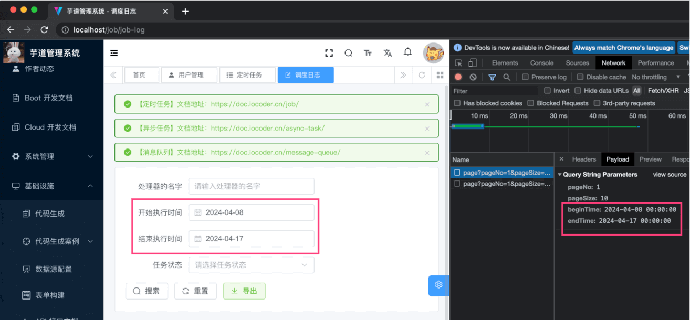
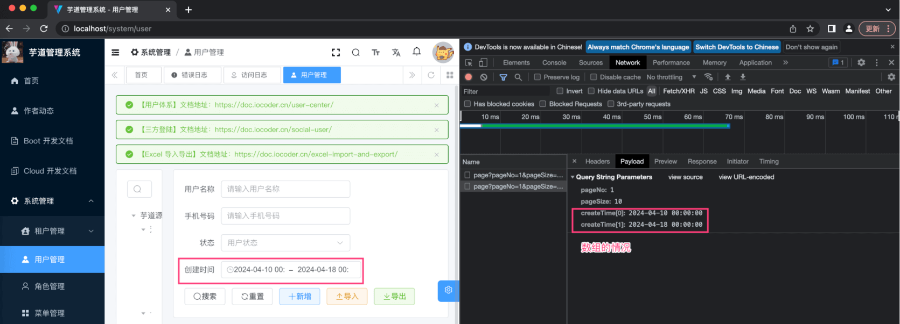
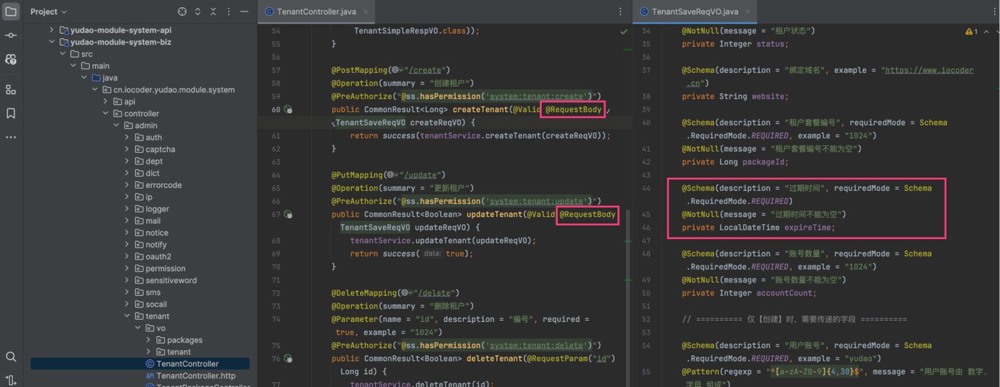
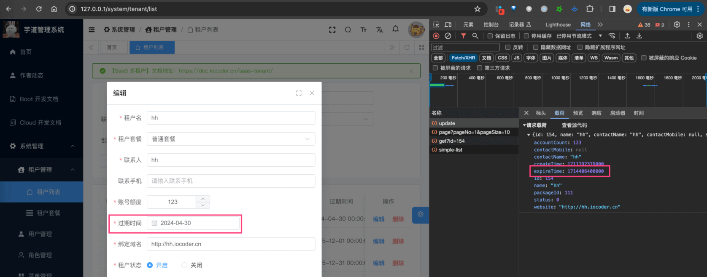
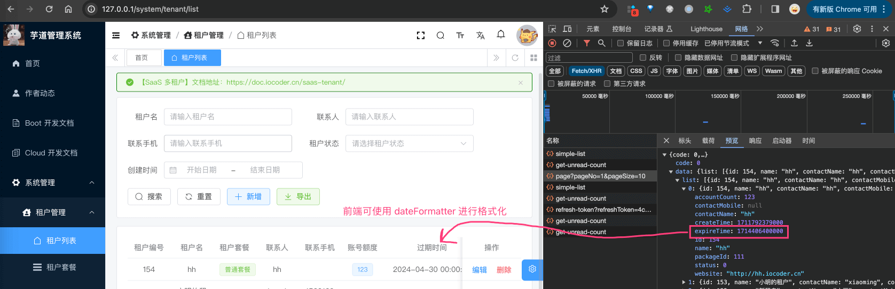
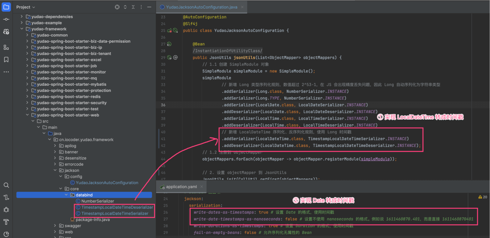
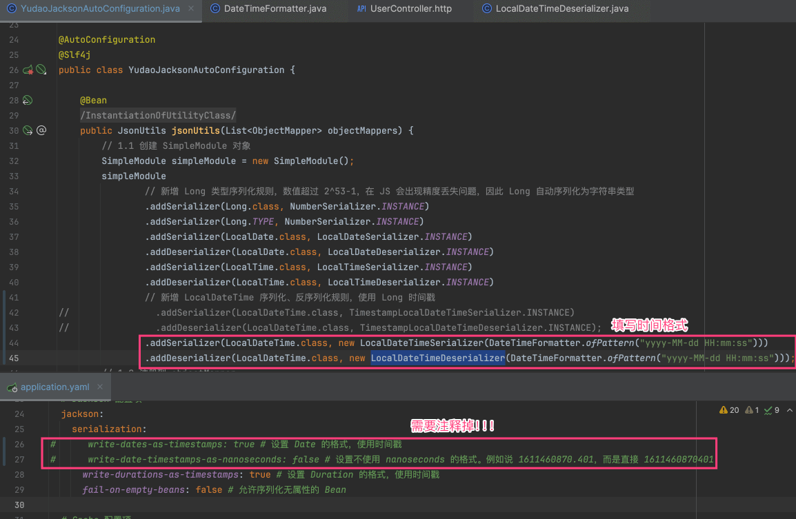

目录

# 参数校验、时间传参

项目使用 [Hibernate Validator (opens new window)](https://hibernate.org/validator/) 框架，对 RESTful API 接口进行参数的校验，以保证最终数据入库的正确性。例如说，用户注册时，会校验手机格式的正确性，密码非弱密码。

如果参数校验不通过，会抛出 ConstraintViolationException 异常，被全局的[异常处理](/exception)捕获，返回“请求参数不正确”的响应。示例如下：

```json
{
  "code": 400,
  "data": null,
  "msg": "请求参数不正确:密码不能为空"
}

```

## [#](#_1-参数校验注解) 1. 参数校验注解

Validator 内置了 20+ 个参数校验注解，整理成常用与不常用的注解。

### [#](#_1-1-常用注解) 1.1 常用注解

注解

功能

`@NotBlank`

只能用于字符串不为 `null` ，并且字符串 `#trim()` 以后 length 要大于 0

`@NotEmpty`

集合对象的元素不为 0 ，即集合不为空，也可以用于字符串不为 `null`

`@NotNull`

不能为 `null`

`@Pattern(value)`

被注释的元素必须符合指定的正则表达式

`@Max(value)`

该字段的值只能小于或等于该值

`@Min(value)`

该字段的值只能大于或等于该值

`@Range(min=, max=)`

检被注释的元素必须在合适的范围内

`@Size(max, min)`

检查该字段的 `size` 是否在 `min` 和 `max` 之间，可以是字符串、数组、集合、Map 等

`@Length(max, min)`

被注释的字符串的大小必须在指定的范围内。

`@AssertFalse`

被注释的元素必须为 `true`

`@AssertTrue`

被注释的元素必须为 `false`

`@Email`

被注释的元素必须是电子邮箱地址

`@URL(protocol=,host=,port=,regexp=,flags=)`

被注释的字符串必须是一个有效的 URL

### [#](#_1-2-不常用注解) 1.2 不常用注解

注解

功能

`@Null`

必须为 `null`

`@DecimalMax(value)`

被注释的元素必须是一个数字，其值必须小于等于指定的最大值

`@DecimalMin(value)`

被注释的元素必须是一个数字，其值必须大于等于指定的最小值

`@Digits(integer, fraction)`

被注释的元素必须是一个数字，其值必须在可接受的范围内

`@Positive`

判断正数

`@PositiveOrZero`

判断正数或 0

`@Negative`

判断负数

`@NegativeOrZero`

判断负数或 0

`@Future`

被注释的元素必须是一个将来的日期

`@FutureOrPresent`

判断日期是否是将来或现在日期

`@Past`

检查该字段的日期是在过去

`@PastOrPresent`

判断日期是否是过去或现在日期

`@SafeHtml`

判断提交的 HTML 是否安全。例如说，不能包含 JavaScript 脚本等等

## [#](#_2-参数校验使用) 2. 参数校验使用

只需要三步，即可开启参数校验的功能。

〇 第零步，引入参数校验的 [`spring-boot-starter-validation` (opens new window)](https://mvnrepository.com/artifact/org.springframework.boot/spring-boot-starter-validation) 依赖。**一般不需要做**，项目默认已经引入。

① 第一步，在需要参数校验的类上，添加 [`@Validated` (opens new window)](https://github.com/spring-projects/spring-framework/blob/main/spring-context/src/main/java/org/springframework/validation/annotation/Validated.java) 注解，例如说 Controller、Service 类。代码如下：

```java
// Controller 示例
@Validated
public class AuthController {}

// Service 示例，一般放在实现类上
@Service
@Validated
public class AdminAuthServiceImpl implements AdminAuthService {}

```

② 第二步（情况一）如果方法的参数是 Bean 类型，则在方法参数上添加 [`@Valid` (opens new window)](https://docs.oracle.com/javaee/7/api/javax/validation/Valid.html) 注解，并在 Bean 类上添加参数校验的注解。代码如下：

```java
// Controller 示例
@Validated
public class AuthController {

    @PostMapping("/login")
    public CommonResult<AuthLoginRespVO> login(@RequestBody @Valid AuthLoginReqVO reqVO) {}
    
}
// Service 示例，一般放在接口上
public interface AdminAuthService {
    
    String login(@Valid AuthLoginReqVO reqVO, String userIp, String userAgent);
}

// Bean 类的示例。一般建议添加参数注解到属性上。原因：采用 Lombok 后，很少使用 getter 方法
public class AuthLoginReqVO {

    @NotEmpty(message = "登录账号不能为空")
    @Length(min = 4, max = 16, message = "账号长度为 4-16 位")
    @Pattern(regexp = "^[A-Za-z0-9]+$", message = "账号格式为数字以及字母")
    private String username;

    @NotEmpty(message = "密码不能为空")
    @Length(min = 4, max = 16, message = "密码长度为 4-16 位")
    private String password;
    
}

```

② 第二步（情况二）如果方法的参数是普通类型，则在方法参数上直接添加参数校验的注解。代码如下：

```java
// Controller 示例
@Validated
public class DictDataController {

    @GetMapping(value = "/get")
    public CommonResult<DictDataRespVO> getDictData(@RequestParam("id") @NotNull(message = "编号不能为空") Long id) {}
    
}

// Service 示例，一般放在接口上
public interface DictDataService {

    DictDataDO getDictData(@NotNull(message = "编号不能为空") Long id);
    
}

```

③ 启动项目，模拟调用 RESTful API 接口，少填写几个参数，看看参数校验是否生效。

疑问：Controller 做了参数校验后，Service 是否需要做参数校验？

是需要的。Service 可能会被别的 Service 进行调用，也会存在参数不正确的情况，所以必须进行参数校验。

## [#](#_3-自定义注解) 3. 自定义注解

如果 Validator 内置的参数校验注解不满足需求时，我们也可以**自定义**参数校验的注解。

在项目的 [`yudao-common` (opens new window)](https://github.com/YunaiV/ruoyi-vue-pro/blob/master/yudao-framework/yudao-common/) 的 [`validation` (opens new window)](https://github.com/YunaiV/ruoyi-vue-pro/blob/master/yudao-framework/yudao-common/src/main/java/cn/iocoder/yudao/framework/common/validation/) 包下，就自定义了多个参数校验的注解，以 [`@Mobile` (opens new window)](https://github.com/YunaiV/ruoyi-vue-pro/blob/master/yudao-framework/yudao-common/src/main/java/cn/iocoder/yudao/framework/common/validation/Mobile.java) 注解来举例，它提供了手机格式的校验。

① 第一步，新建 `@Mobile` 注解，并设置自定义校验器为 [MobileValidator (opens new window)](https://github.com/YunaiV/ruoyi-vue-pro/blob/master/yudao-framework/yudao-common/src/main/java/cn/iocoder/yudao/framework/common/validation/MobileValidator.java) 类。代码如下：

```java
@Target({
        ElementType.METHOD,
        ElementType.FIELD,
        ElementType.ANNOTATION_TYPE,
        ElementType.CONSTRUCTOR,
        ElementType.PARAMETER,
        ElementType.TYPE_USE
})
@Retention(RetentionPolicy.RUNTIME)
@Documented
@Constraint(
        validatedBy = MobileValidator.class // 设置校验器
)
public @interface Mobile {

    String message() default "手机号格式不正确";

    Class<?>[] groups() default {};

    Class<? extends Payload>[] payload() default {};

}

```

② 第二步，新建 [MobileValidator (opens new window)](https://github.com/YunaiV/ruoyi-vue-pro/blob/master/yudao-framework/yudao-common/src/main/java/cn/iocoder/yudao/framework/common/validation/MobileValidator.java) 校验器。代码如下：

```java
public class MobileValidator implements ConstraintValidator<Mobile, String> {

    @Override
    public void initialize(Mobile annotation) {
    }

    @Override
    public boolean isValid(String value, ConstraintValidatorContext context) {
        // 如果手机号为空，默认不校验，即校验通过
        if (StrUtil.isEmpty(value)) {
            return true;
        }
        // 校验手机
        return ValidationUtils.isMobile(value);
    }

}

```

③ 第三步，在需要手机格式校验的参数上添加 `@Mobile` 注解。示例代码如下：

```java
public class AppAuthLoginReqVO {

    @NotEmpty(message = "手机号不能为空")
    @Mobile // <=== here
    private String mobile;

}

```

## [#](#_4-更多使用文档) 4. 更多使用文档

更多关于 Validator 的使用，可以系统阅读 [《芋道 Spring Boot 参数校验 Validation 入门 》 (opens new window)](https://www.iocoder.cn/Spring-Boot/Validation/?yudao) 文章。

例如说，手动参数校验、分组校验、国际化 i18n 等等。

## [#](#_5-时间传参) 5. 时间传参
### [#](#_5-1-query-时间传参) 5.1 Query 时间传参

Query 时间传参，指的是 `GET` 请求、或者 `POST` 的 form-data 请求。

① 后端接收时间参数时，需要添加 SpringMVC 的 `@DateTimeFormat` 注解，并设置时间格式。例如说：

```java
// JobLogPageReqVO.java
@DateTimeFormat(pattern = FORMAT_YEAR_MONTH_DAY_HOUR_MINUTE_SECOND)
private LocalDateTime beginTime;

// UserPageReqVO.java
@DateTimeFormat(pattern = FORMAT_YEAR_MONTH_DAY_HOUR_MINUTE_SECOND)
private LocalDateTime[] createTime;

```

② 前端传递时间参数时，需要时间格式为 `yyyy-MM-dd HH:mm:ss`，和上面的 `FORMAT_YEAR_MONTH_DAY_HOUR_MINUTE_SECOND` 对应。例如说前端 `yudao-ui-admin-vue3` 项目：

*   `views/infra/job/logger/index.vue` 的 `beginTime` 或 `endTime` 参数 
    
*   `views/system/user/index.vue` 的 `createTime` 参数 
    

### [#](#_5-2-request-body-时间传参) 5.2 Request Body 时间传参

Request Body 时间传参，指的是 `Post`、`PUT` 等请求，通过 JSON 格式。

① 后端接收时间参数时，需要添加 SpringMVC 的 `@RequestBody` 注解，使用 LocalDateTime 属性进行接收。例如说：



② 前端传递时间参数时，需要时间格式为 Long 时间戳。例如说：

*   `views/system/tenant/TenantForm.vue` 的 `expireTime` 参数



### [#](#_5-3-response-body-时间响应) 5.3 Response Body 时间响应

JSON 返回的时间，使用 LocalDateTime 定义属性，会被序列化为 Long 时间戳进行相应。

例如说 TenantRespVO 的 `createTime` 属性，效果如下图：



### [#](#_5-4-如何自定义-json-时间格式) 5.4 如何自定义 JSON 时间格式？
#### [#](#_5-4-1-为什么使用-long-时间戳呢) 5.4.1 为什么使用 Long 时间戳呢？

每个项目希望展示的时间格式可能不同，有希望 `yyyy-MM-dd HH:mm:ss`，也有希望 `yyyy/MM/dd HH:mm:ss`，又或者是其它。

而 Long 时间戳是比较标准的，没有任何“产品需求”的味道，所以使用它。 至于业务希望展示成什么样子，可以通过前端封装统一的 format 方法去实现，更加规范。

它是通过 LocalDateTime 自定义的 TimestampLocalDateTimeSerializer 和 TimestampLocalDateTimeDeserializer 实现，之后进行如下配置：



#### [#](#_5-4-1-全局配置时间格式) 5.4.1 全局配置时间格式

如果你想 JSON 全局配置成 `yyyy-MM-dd HH:mm:ss` 或其它时间格式，通过使用 Jackson 内置的 LocalDateTimeSerializer 和 LocalDateTimeDeserializer 即可，如下图所示：



#### [#](#_5-4-2-局部配置时间格式) 5.4.2 局部配置时间格式

如果只是部分 VO 的字段想自定义 `yyyy-MM-dd HH:mm:ss` 或其它时间格式，可通过 Jackson 内置的 `@JsonFormat` 注解，如下所示：

```java
// UserRespVO.java

@JsonSerialize(using = LocalDateTimeSerializer.class) // 序列化（响应）
@JsonDeserialize(using = LocalDateDeserializer.class) // 反序列化（请求）
@JsonFormat(pattern = "yyyy-MM-dd HH:mm:ss")
private LocalDateTime createTime;

```