目录

# 文件存储（上传下载）

项目支持将文件上传到三类存储器：

1.  兼容 S3 协议的对象存储：支持 MinIO、腾讯云 COS、七牛云 Kodo、华为云 OBS、亚马逊 S3 等等。
2.  磁盘存储：本地、FTP 服务器、SFTP 服务器。
3.  数据库存储：MySQL、Oracle、PostgreSQL、SQL Server 等等。

技术选型？

*   优先，✔ 推荐方案 1。如果无法使用云服务，可以自己搭建一个 MinIO 服务。参见 [《芋道 Spring Boot 对象存储 MinIO 入门 》 (opens new window)](https://www.iocoder.cn/Spring-Boot/MinIO/?yudao) 文章。
*   其次，推荐方案 3。数据库的主从机制可以实现高可用，备份也方便，少量小文件问题不大。
*   最后，× 不推荐方案 2。主要是实现高可用比较困难，无法实现故障转移。

## [#](#_1-快速入门) 1. 快速入门

本小节，我们来添加个文件配置，并使用它上传下载文件。

### [#](#_1-1-新增配置) 1.1 新增配置

① 打开 \[基础设施 -> 文件管理 -> 文件配置\] 菜单，进入文件配置的界面。

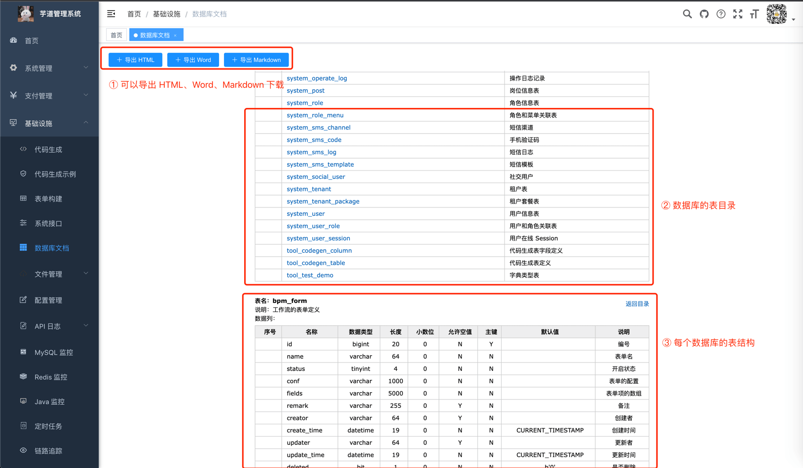

② 点击 \[新增\] 按钮，选择存储器为【S3 对象存储器】，并填写七牛云的配置。如下图：

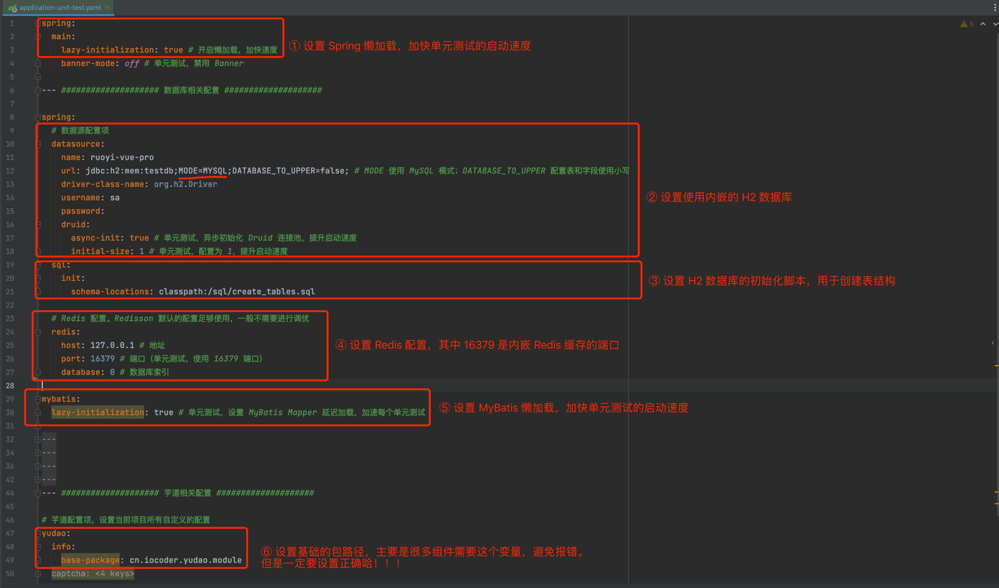

*   节点地址：s3.cn-south-1.qiniucs.com
*   存储 bucket：ruoyi-vue-pro
*   accessKey：3TvrJ70gl2Gt6IBe7\_IZT1F6i\_k0iMuRtyEv4EyS
*   accessSecret：wd0tbVBYlp0S-ihA8Qg2hPLncoP83wyrIq24OZuY
*   自定义域名：http://test.yudao.iocoder.cn

友善的眼神！

上述七牛云的配置，是艿艿为了大家方便体验，请勿在测试或生产环境体验。

③ 添加完后，点击该配置所在行的 \[测试\] 按钮，测试配置是否正确。

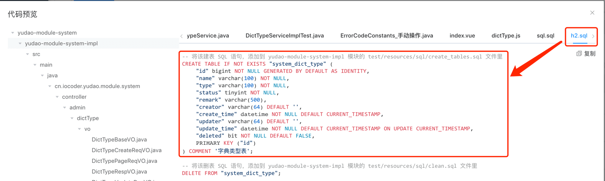

④ 测试通过后，点击该配置所在行的 \[主配置\] 按钮，设置它为**默认**的配置，后续使用它进行文件的上传。

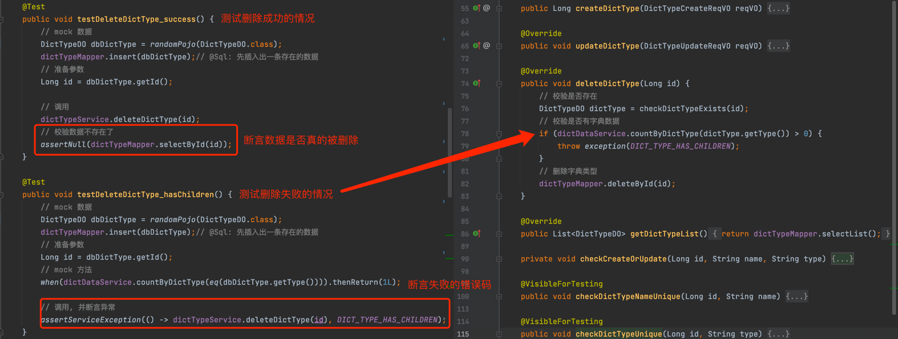

### [#](#_1-2-上传文件) 1.2 上传文件

① 点击 \[基础设施 -> 文件管理 -> 文件列表\] 菜单，进入文件列表的界面。

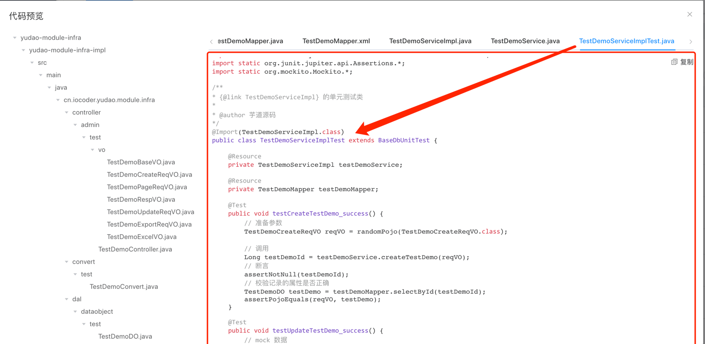

② 点击 \[上传文件\] 按钮，选择要上传的文件。

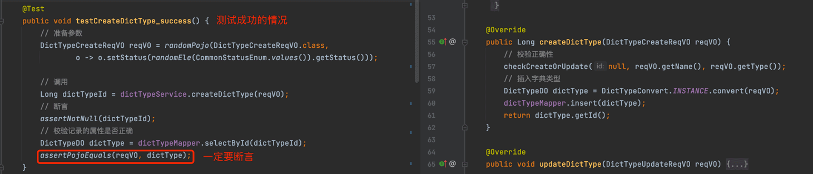

③ 上传完成后，如果想要删除，可点击该文件所在行的 \[删除\] 按钮。


## [#](#_2-文件上传) 2. 文件上传

项目提供了 2 种文件上传的方式，分别适合前端、后端使用。

### [#](#_2-1-方式一-前端上传) 2.1 方式一：前端上传

[FileController (opens new window)](https://github.com/YunaiV/ruoyi-vue-pro/blob/master/yudao-module-infra/yudao-module-infra-biz/src/main/java/cn/iocoder/yudao/module/infra/controller/admin/file/FileController.java) 提供了 `/admin-api/infra/file/upload` RESTful API，用于前端直接上传文件。

```java
// FileController.java

@PostMapping("/upload")
@Operation(summary = "上传文件")
public CommonResult<String> uploadFile(FileUploadReqVO uploadReqVO) throws Exception {
    MultipartFile file = uploadReqVO.getFile();
    String path = uploadReqVO.getPath();
    return success(fileService.createFile(file.getOriginalFilename(), path,
        IoUtil.readBytes(file.getInputStream())));
}

```

前端上传文件的代码如何实现，可见：

*   文件列表，文件上传 [`index.vue` (opens new window)](https://github.com/yudaocode/yudao-ui-admin-vue2/blob/master/src/views/infra/file/index.vue#L59-L76)
*   个人中心，头像修改 [`userAvatar.vue` (opens new window)](https://github.com/yudaocode/yudao-ui-admin-vue2/blob/master/src/views/system/user/profile/userAvatar.vue#L122-L135)

### [#](#_2-2-方式二-后端上传) 2.2 方式二：后端上传

`yudao-module-infra` 的 [FileApi (opens new window)](https://github.com/YunaiV/ruoyi-vue-pro/blob/master/yudao-module-infra/yudao-module-infra-api/src/main/java/cn/iocoder/yudao/module/infra/api/file/FileApi.java) 提供了 `#createFile(...)` 方法，用于后端需要上传文件的逻辑。

```java
// FileApi.java

/**
 * 保存文件，并返回文件的访问路径
 *
 * @param path 文件路径
 * @param content 文件内容
 * @return 文件路径
 */
String createFile(String path, byte[] content);

```

例如说，个人中心修改头像时，需要进行头像的上传。如下图所示：

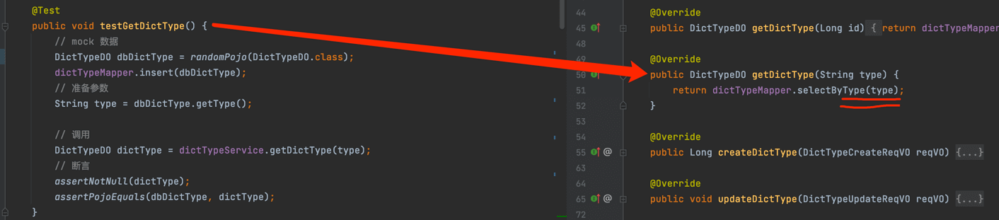

注意，需要使用到后端上传的 Maven 模块，需要引入 `yudao-module-infra-api` 依赖。例如说 `yudao-module-system-biz` 模块的 `pom.xml` 文件，引用如下：

```xml
<dependency>
    <groupId>cn.iocoder.boot</groupId>
    <artifactId>yudao-module-infra-api</artifactId>
    <version>${revision}</version>
</dependency>

```

## [#](#_3-文件下载) 3. 文件下载

文件上传成功后，返回的是**完整的 URL 访问路径**，例如说 [http://test.yudao.iocoder.cn/822aebded6e6414e912534c6091771a4.jpg (opens new window)](http://test.yudao.iocoder.cn/822aebded6e6414e912534c6091771a4.jpg) 。

不同的文件存储器，返回的 URL 路径的规则是不同的：

① 当存储器是【S3 对象存储】时，支持 HTTP 访问，所以直接使用 S3 对象存储返回的 URL 路径即可。

② 当存储器是【数据库】【本地磁盘】等时，它们只支持存储，所以需要 [FileController (opens new window)](https://github.com/YunaiV/ruoyi-vue-pro/blob/master/yudao-module-infra/yudao-module-infra-biz/src/main/java/cn/iocoder/yudao/module/infra/controller/admin/file/FileController.java) 提供的 `/admin-api/infra/file/{configId}/get/{path}` RESTful API，读取文件内容后返回。

```java
// FileController.java

@GetMapping("/{configId}/get/**")
@PermitAll
@Operation(summary = "下载文件")
@Parameter(name = "configId", description = "配置编号",  required = true)
public void getFileContent(HttpServletRequest request,
                           HttpServletResponse response,
                           @PathVariable("configId") Long configId) throws Exception {
    // 获取请求的路径
    String path = StrUtil.subAfter(request.getRequestURI(), "/get/", false);
    if (StrUtil.isEmpty(path)) {
        throw new IllegalArgumentException("结尾的 path 路径必须传递");
    }

    // 读取内容
    byte[] content = fileService.getFileContent(configId, path);
    if (content == null) {
        log.warn("[getFileContent][configId({}) path({}) 文件不存在]", configId, path);
        response.setStatus(HttpStatus.NOT_FOUND.value());
        return;
    }
    ServletUtils.writeAttachment(response, path, content);
}

```

## [#](#_4-文件客户端) 4. 文件客户端

在 `yudao-module-infra-biz` 模块中，它的 [`framework/file` (opens new window)](https://github.com/YunaiV/ruoyi-vue-pro/blob/master/yudao-module-infra/yudao-module-infra-biz/src/main/java/cn/iocoder/yudao/module/infra/framework/file/package-info.java) 包下，定义了 [FileClient (opens new window)](https://github.com/YunaiV/ruoyi-vue-pro/blob/master/yudao-module-infra/yudao-module-infra-biz/src/main/java/cn/iocoder/yudao/module/infra/framework/file/core/client/FileClient.java) 接口，抽象了文件客户端的方法。代码如下所示：

```java
public interface FileClient {

    /**
     * 获得客户端编号
     *
     * @return 客户端编号
     */
    Long getId();

    /**
     * 上传文件
     *
     * @param content 文件流
     * @param path 相对路径
     * @return 完整路径，即 HTTP 访问地址
     */
    String upload(byte[] content, String path);

    /**
     * 删除文件
     *
     * @param path 相对路径
     */
    void delete(String path);

    /**
     * 获得文件的内容
     *
     * @param path 相对路径
     * @return 文件的内容
     */
    byte[] getContent(String path);

}

```

FileClient 有 5 个实现类，使用不同存储器进行文件的上传与下载。UML 类图如所示：

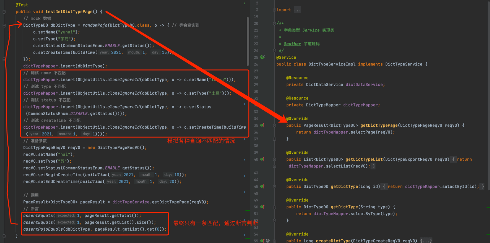

文件上传的调用的 UML 时序图如下所示：

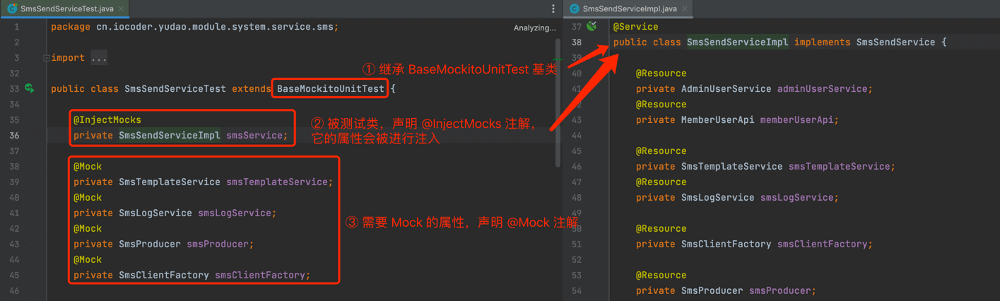

## [#](#_5-s3-对象存储的配置) 5. S3 对象存储的配置

做的不错的云存储服务，都是兼容 S3 协议的。如何获取对应的 S3 配置，艿艿整理到了 [S3FileClientConfig (opens new window)](https://github.com/YunaiV/ruoyi-vue-pro/blob/master/yudao-module-infra/yudao-module-infra-biz/src/main/java/cn/iocoder/yudao/module/infra/framework/file/core/client/FileClientConfig.java) 配置类。

有一点要注意，云存储服务的 Bucket 需要设置为**公共读**，不然 URL 无法访问到文件。

并且，最好使用自定义域名，方便迁移到不同的云存储服务。

## [#](#_6-前端直传-s3-存储【推荐】) 6. 前端直传 S3 存储【推荐】

友情提示：目前仅 yudao-ui-admin-vue3 前端项目支持，Vue3 + Element Plus 版本

前面小节的文件上传，都是 `前端 => 后端 => S3 存储器` 的方式。这种方式，有一个问题，就是文件的流量会经过后端，如果后端的服务器带宽不够，就会影响文件的上传速度。例如说：上传文件有 10MB，后端服务器带宽只有 1MB，那么上传文件就需要 10 秒。如果多个人上传文件，就会导致后端服务器的带宽被占满。

因此，更加推荐采用 `前端 => S3 存储器` 的方式，即前端直传 S3 存储器。这样，文件的流量不会经过后端，上传速度会更快。例如说：上传文件有 10MB，用户的带宽有 100MB，那么上传文件就需要 0.1 秒。

下面，我们以七牛云的配置为例，演示如何在前端直传 S3 存储器。当然，其它阿里云、腾讯云、华为云等等都是类似的。

### [#](#_6-1-新增-s3-配置) 6.1 新增 S3 配置

在 \[基础设施 -> 文件管理 -> 文件配置\] 菜单，新增一个 S3 对象存储器的配置，填写七牛云的配置，并设置它为**默认**的配置。结果如下图所示：

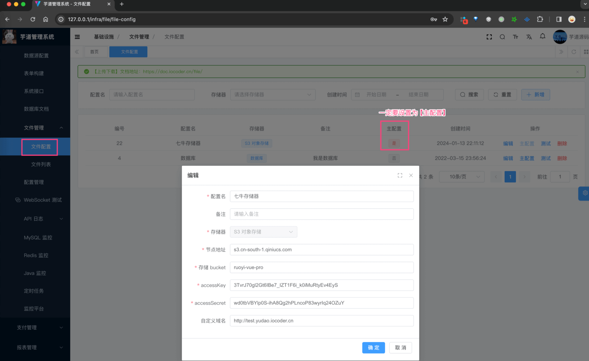

实际上，这个步骤和「2.1 新增步骤」是一样的哈！

### [#](#_6-2-配置-s3-跨域) 6.2 配置 S3 跨域

友情提示：这个步骤，是为了解决前端直传 S3 存储器的跨域问题。

*   七牛云的跨域配置：参见 [《设置跨域资源共享 》 (opens new window)](https://developer.qiniu.com/kodo/6094/set-cors)
*   阿里云的跨域配置：参见 [《阿里云 OSS 设置跨域访问》 (opens new window)](https://developer.aliyun.com/article/1168029)
*   腾讯云的跨域配置：参见 [《设置跨域访问》 (opens new window)](https://cloud.tencent.com/document/product/436/13318)

如下是七牛云的跨域配置截图：

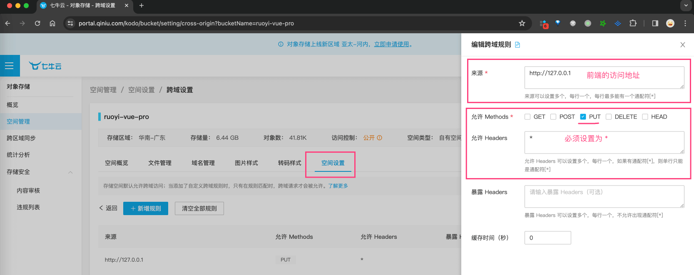

### [#](#_6-3-配置前端直传) 6.3 配置前端直传

修改 `yudao-ui-admin-vue3` 前端项目的配置文件的 `VITE_UPLOAD_TYPE` 为 `client` 前端直传模式。例如说，你是本地环境，则修改 `.env.local` 文件，如下图所示：

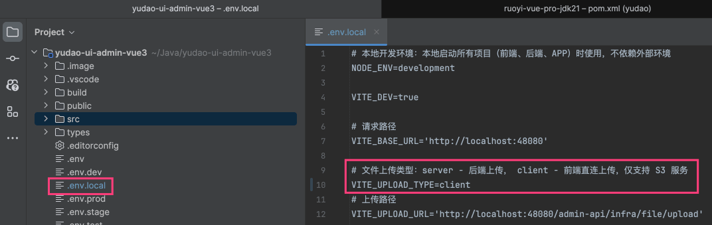

### [#](#_6-4-测试上传文件) 6.4 测试上传文件

点击 \[基础设施 -> 文件管理 -> 文件列表\] 菜单，测试上传文件。结果如下图所示：

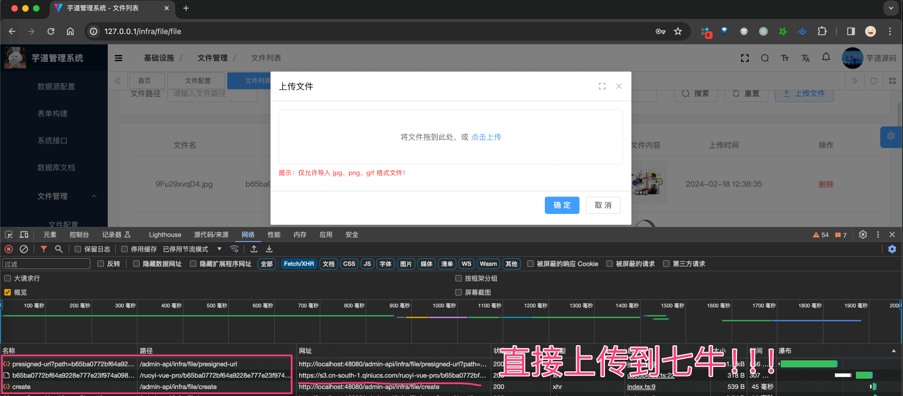

具体的代码实现：

*   前端：`src/components/UploadFile/src/useUpload.ts` 文件
*   后端：FileController 的 `/presigned-url` RESTful API