目录

# 新建模块

本章节，将介绍如何新建名字为 `yudao-module-demo` 的示例模块，并添加 RESTful API 接口。

虽然内容看起来比较长，是因为艿艿写的比较详细，大量截图，保姆级教程！其实只有五个步骤，保持耐心，跟着艿艿一点点来。🙂 完成之后，你会对整个 [项目结构](/project-intro/) 有更充分的了解。

## [#](#👍-相关视频教程) 👍 相关视频教程

*   [从零开始 06：如何 5 分钟，创建一个新模块？ (opens new window)](https://t.zsxq.com/07EUrZrNV)

## [#](#_1-新建-demo-模块) 1. 新建 demo 模块

① 选择 File -> New -> Module 菜单，如下图所示：

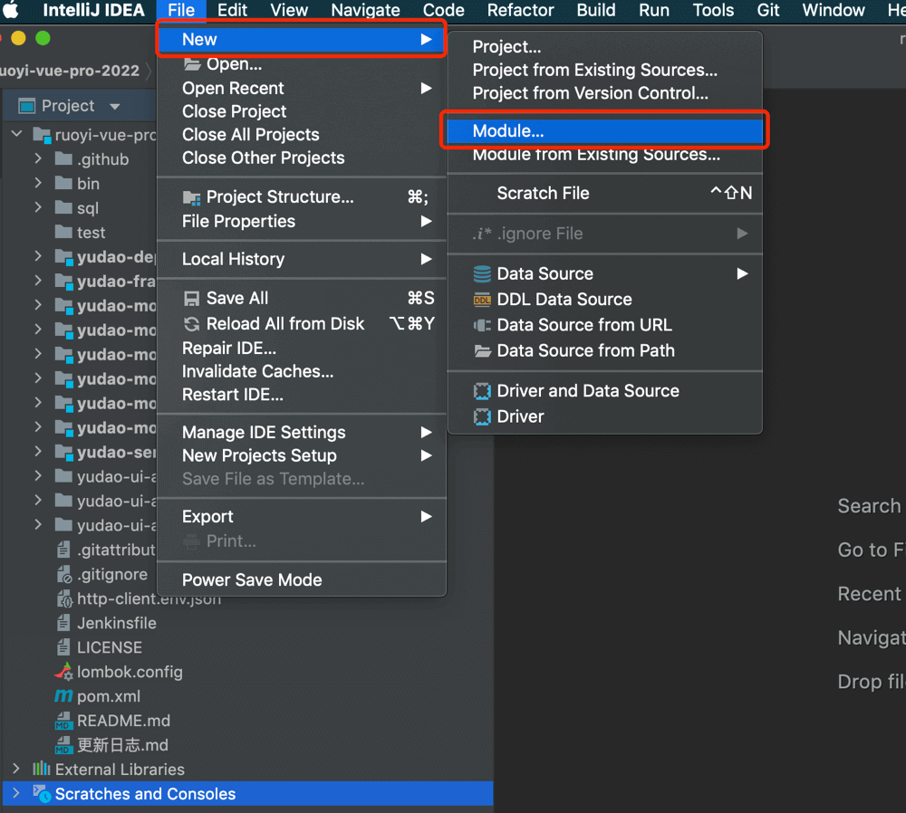

② 选择 Maven 类型，并点击 Next 按钮，如下图所示：


③ 选择父模块为 `yudao`，输入名字为 `yudao-module-demo`，并点击 Finish 按钮，如下图所示：

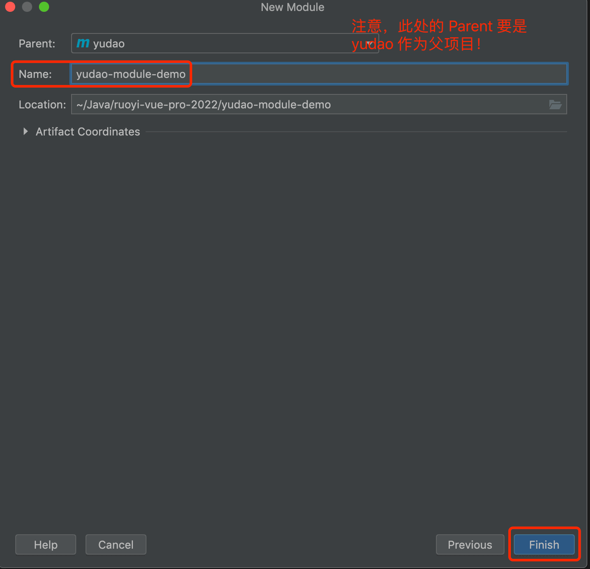

④ 打开 `yudao-module-demo` 模块，删除 src 文件，如下图所示：

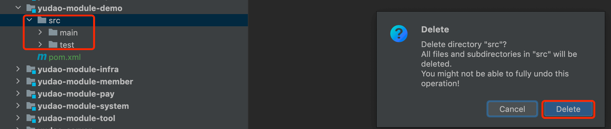

⑤ 打开 `yudao-module-demo` 模块的 `pom.xml` 文件，修改内容如下：

提示

`<!-- -->` 部分，只是注释，不需要写到 XML 中。

```xml
<?xml version="1.0" encoding="UTF-8"?>
<project xmlns="http://maven.apache.org/POM/4.0.0"
         xmlns:xsi="http://www.w3.org/2001/XMLSchema-instance"
         xsi:schemaLocation="http://maven.apache.org/POM/4.0.0 http://maven.apache.org/xsd/maven-4.0.0.xsd">
    <parent>
        <artifactId>yudao</artifactId>
        <groupId>cn.iocoder.boot</groupId>
        <version>${revision}</version> <!-- 1. 修改 version 为 ${revision} -->
    </parent>
    <modelVersion>4.0.0</modelVersion>

    <artifactId>yudao-module-demo</artifactId>
    <packaging>pom</packaging> <!-- 2. 新增 packaging 为 pom -->

    <name>${project.artifactId}</name> <!-- 3. 新增 name 为 ${project.artifactId} -->
    <description> <!-- 4. 新增 description 为该模块的描述 -->
        demo 模块，主要实现 XXX、YYY、ZZZ 等功能。
    </description>

</project>

```

## [#](#_2-新建-demo-api-子模块) 2. 新建 demo-api 子模块

① 新建 `yudao-module-demo-api` 子模块，整个过程和“新建 demo 模块”是一致的，如下图所示：


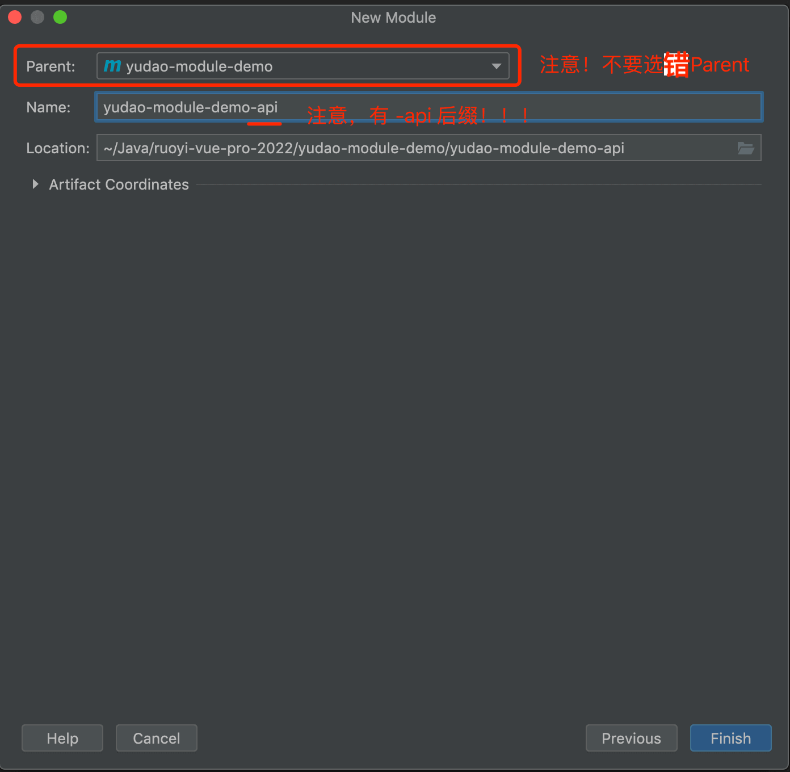

② 打开 `yudao-module-demo-api` 模块的 `pom.xml` 文件，修改内容如下：

```xml
<?xml version="1.0" encoding="UTF-8"?>
<project xmlns="http://maven.apache.org/POM/4.0.0"
         xmlns:xsi="http://www.w3.org/2001/XMLSchema-instance"
         xsi:schemaLocation="http://maven.apache.org/POM/4.0.0 http://maven.apache.org/xsd/maven-4.0.0.xsd">
    <parent>
        <artifactId>yudao-module-demo</artifactId>
        <groupId>cn.iocoder.boot</groupId>
        <version>${revision}</version> <!-- 1. 修改 version 为 ${revision} -->
    </parent>
    <modelVersion>4.0.0</modelVersion>
    <artifactId>yudao-module-demo-api</artifactId>
    <packaging>jar</packaging> <!-- 2. 新增 packaging 为 jar -->

    <name>${project.artifactId}</name> <!-- 3. 新增 name 为 ${project.artifactId} -->
    <description> <!-- 4. 新增 description 为该模块的描述 -->
        demo 模块 API，暴露给其它模块调用
    </description>

    <dependencies>  <!-- 5. 新增 yudao-common 依赖 -->
        <dependency>
            <groupId>cn.iocoder.boot</groupId>
            <artifactId>yudao-common</artifactId>
        </dependency>
    </dependencies>

</project>

```

③ 【可选】新建 `cn.iocoder.yudao.module.demo` **基础**包，其中 `demo` 为模块名。之后，新建 `api` 和 `enums` 包。如下图所示：

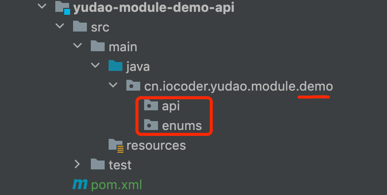

## [#](#_3-新建-demo-biz-子模块) 3. 新建 demo-biz 子模块

① 新建 `yudao-module-demo-biz` 子模块，整个过程和“新建 demo 模块”也是一致的，如下图所示：


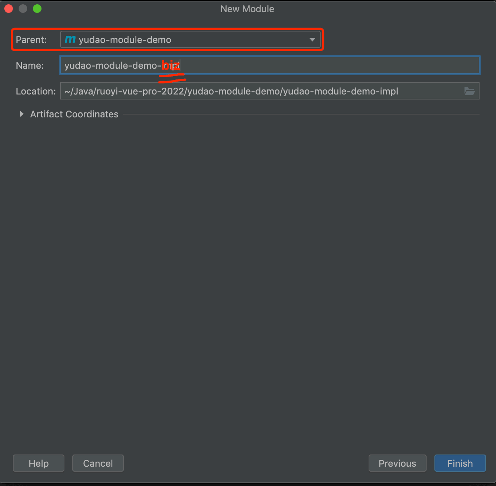

② 打开 `yudao-module-demo-biz` 模块的 `pom.xml` 文件，修改成内容如下：

```xml
<?xml version="1.0" encoding="UTF-8"?>
<project xmlns="http://maven.apache.org/POM/4.0.0"
         xmlns:xsi="http://www.w3.org/2001/XMLSchema-instance"
         xsi:schemaLocation="http://maven.apache.org/POM/4.0.0 http://maven.apache.org/xsd/maven-4.0.0.xsd">
    <parent>
        <artifactId>yudao-module-demo</artifactId>
        <groupId>cn.iocoder.boot</groupId>
        <version>${revision}</version> <!-- 1. 修改 version 为 ${revision} -->
    </parent>
    <modelVersion>4.0.0</modelVersion>
    <packaging>jar</packaging> <!-- 2. 新增 packaging 为 jar -->

    <artifactId>yudao-module-demo-biz</artifactId>

    <name>${project.artifactId}</name> <!-- 3. 新增 name 为 ${project.artifactId} -->
    <description> <!-- 4. 新增 description 为该模块的描述 -->
        demo 模块，主要实现 XXX、YYY、ZZZ 等功能。
    </description>

    <dependencies>  <!-- 5. 新增依赖，这里引入的都是比较常用的业务组件、技术组件 -->
        <dependency>
            <groupId>cn.iocoder.boot</groupId>
            <artifactId>yudao-module-demo-api</artifactId>
            <version>${revision}</version>
        </dependency>

        <!-- Web 相关 -->
        <dependency>
            <groupId>cn.iocoder.boot</groupId>
            <artifactId>yudao-spring-boot-starter-web</artifactId>
        </dependency>

        <dependency>
            <groupId>cn.iocoder.boot</groupId>
            <artifactId>yudao-spring-boot-starter-security</artifactId>
        </dependency>

        <!-- DB 相关 -->
        <dependency>
            <groupId>cn.iocoder.boot</groupId>
            <artifactId>yudao-spring-boot-starter-mybatis</artifactId>
        </dependency>

        <!-- Test 测试相关 -->
        <dependency>
            <groupId>cn.iocoder.boot</groupId>
            <artifactId>yudao-spring-boot-starter-test</artifactId>
        </dependency>
    </dependencies>
    
</project>

```

③ 【必选】新建 `cn.iocoder.yudao.module.demo` **基础**包，其中 `demo` 为模块名。之后，新建 `controller.admin` 和 `controller.user` 等包。如下图所示：


④ 打开 Maven 菜单，点击刷新按钮，让引入的 Maven 依赖生效。如下图所示：

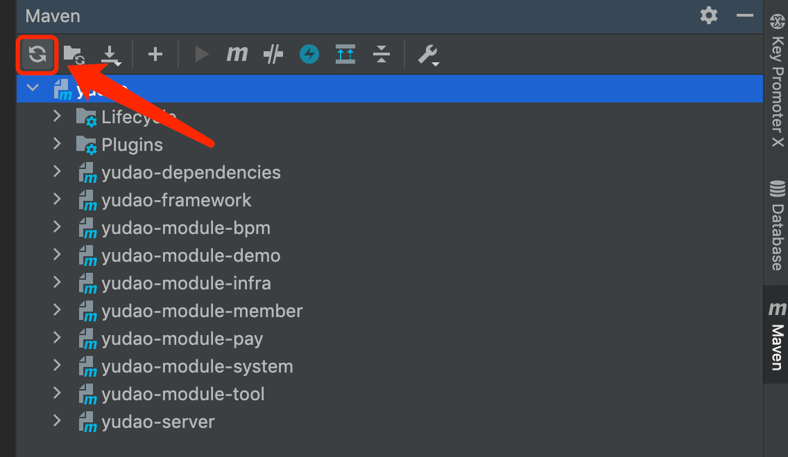

## [#](#_4-新建-restful-api-接口) 4. 新建 RESTful API 接口

① 在 `controller.admin` 包，新建一个 DemoTestController 类，并新建一个 `/demo/test/get` 接口。代码如下：

```java
package cn.iocoder.yudao.module.demo.controller.admin;

import cn.iocoder.yudao.framework.common.pojo.CommonResult;
import io.swagger.v3.oas.annotations.tags.Tag;
import io.swagger.v3.oas.annotations.Operation;
import org.springframework.validation.annotation.Validated;
import org.springframework.web.bind.annotation.GetMapping;
import org.springframework.web.bind.annotation.RequestMapping;
import org.springframework.web.bind.annotation.RestController;

import static cn.iocoder.yudao.framework.common.pojo.CommonResult.success;

@Tag(name = "管理后台 - Test")
@RestController
@RequestMapping("/demo/test")
@Validated
public class DemoTestController {

    @GetMapping("/get")
    @Operation(summary = "获取 test 信息")
    public CommonResult<String> get() {
        return success("true");
    }

}

```

**注意**，`/demo` 是该模块所有 RESTful API 的基础路径，`/test` 是 Test 功能的基础路径。

① 在 `controller.app` 包，新建一个 AppDemoTestController 类，并新建一个 `/demo/test/get` 接口。代码如下：

```java
package cn.iocoder.yudao.module.demo.controller.app;

import cn.iocoder.yudao.framework.common.pojo.CommonResult;
import io.swagger.v3.oas.annotations.tags.Tag;
import io.swagger.v3.oas.annotations.Operation;
import org.springframework.validation.annotation.Validated;
import org.springframework.web.bind.annotation.GetMapping;
import org.springframework.web.bind.annotation.RequestMapping;
import org.springframework.web.bind.annotation.RestController;

import static cn.iocoder.yudao.framework.common.pojo.CommonResult.success;

@Tag(name = "用户 App - Test")
@RestController
@RequestMapping("/demo/test")
@Validated
public class AppDemoTestController {

    @GetMapping("/get")
    @Operation(summary = "获取 test 信息")
    public CommonResult<String> get() {
        return success("true");
    }

}

```

在 Controller 的命名上，额外增加 **App** 作为前缀，一方面区分是管理后台还是用户 App 的 Controller，另一方面避免 Spring Bean 的名字冲突。

可能你会奇怪，这里我们定义了两个 `/demo/test/get` 接口，会不会存在重复导致冲突呢？答案，当然是并不会。原因是：

*   `controller.admin` 包下的接口，默认会增加 `/admin-api`，即最终的访问地址是 `/admin-api/demo/test/get`
*   `controller.app` 包下的接口，默认会增加 `/app-api`，即最终的访问地址是 `/app-api/demo/test/get`

## [#](#_5-引入-demo-模块) 5. 引入 demo 模块

① 在 `yudao-server` 模块的 `pom.xml` 文件，引入 `yudao-module-demo-biz` 子模块，并点击 Maven 刷新。如下图所示：

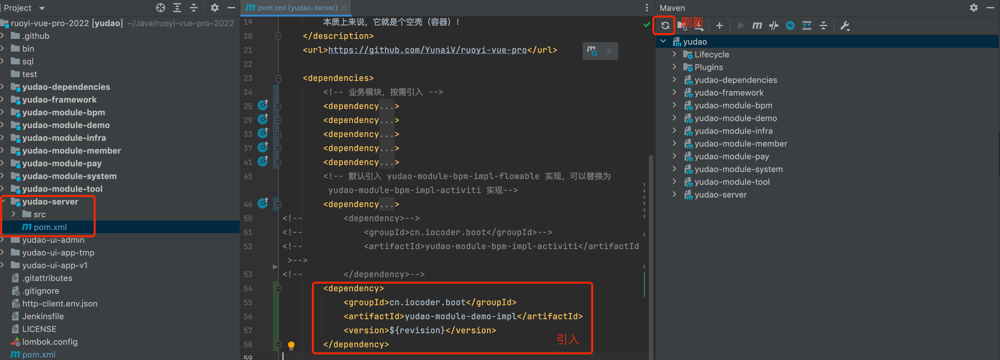

② 运行 YudaoServerApplication 类，将后端项目进行启动。启动完成后，使用浏览器打开 [http://127.0.0.1:48080/doc.html (opens new window)](http://127.0.0.1:48080/doc.html) 地址，进入 Swagger 接口文档。

③ 打开“管理后台 - Test”接口，进行 `/admin-api/demo/test/get` 接口的调试，如下图所示：


④ 打开“用户 App - Test”接口，进行 `/app-api/demo/test/get` 接口的调试，如下图所示：

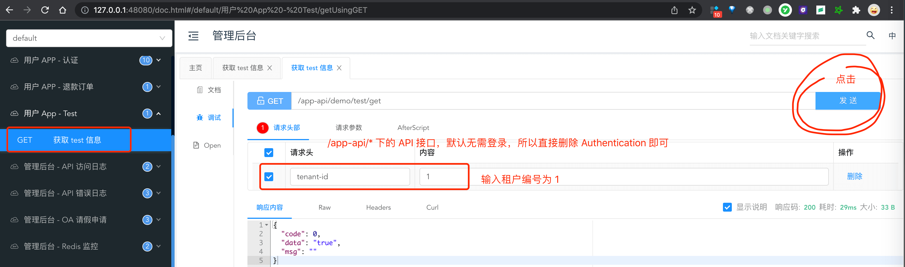

## [#](#_6-访问接口返回-404) 6. 访问接口返回 404？

请检查，你新建的模块的 `package` 包名是不是在 `cn.iocoder.yudao.module` 下！

如果不是，修改 [YudaoServerApplication (opens new window)](https://github.com/YunaiV/ruoyi-vue-pro/blob/master/yudao-server/src/main/java/cn/iocoder/yudao/server/YudaoServerApplication.java) 类，增加新建的模块的 `package` 包名。例如说：

```java
@SpringBootApplication(scanBasePackages = {"${yudao.info.base-package}.server", "${yudao.info.base-package}.module",
    "xxx.yyy.zzz"}) // xxx.yyy.zzz 是你新建的模块的 `package` 包名

```

## [#](#_7-补充说明) 7. 补充说明
### [#](#_7-1-接口分组) 7.1 接口分组

如果你想 Swagger 有该模块的接口分组，则需要新建 GroupedOpenApi Bean。如下图所示：

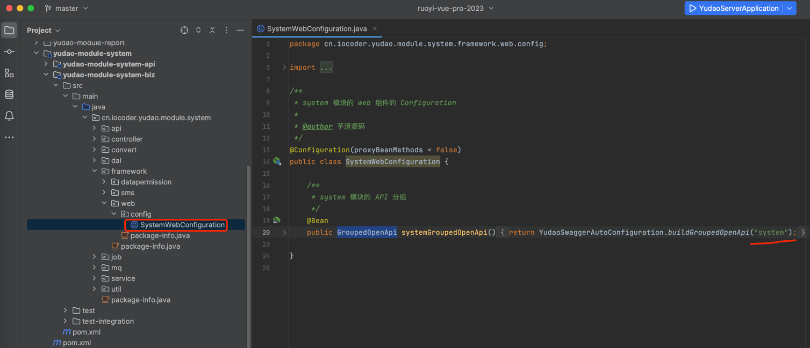

### [#](#_7-2-mybatis-日志) 7.2 MyBatis 日志

如果你希望新模块的 MyBatis 查询会打印 SQL 日志，需要在 `logging.level` 配置对应的 Logger。如下图所示：

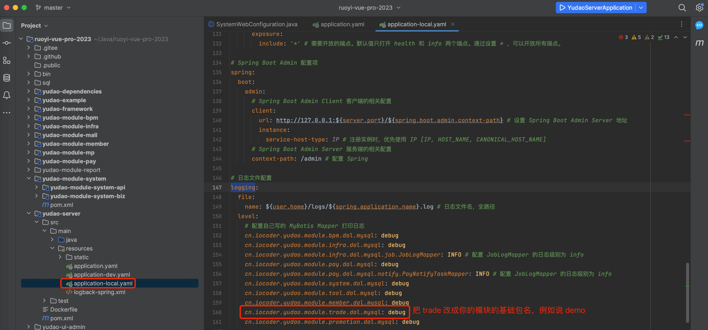