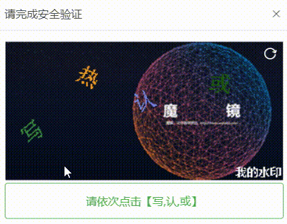
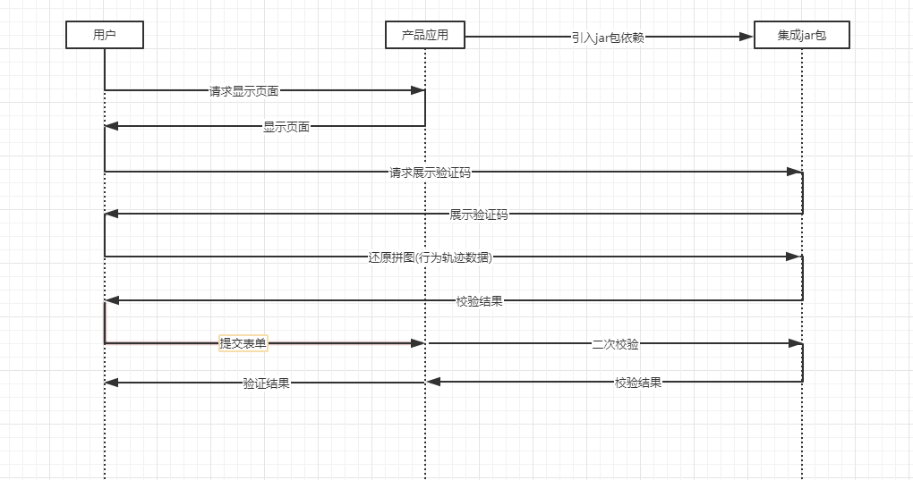

目录

# 验证码

项目基于 [AJ-Captcha (opens new window)](https://gitee.com/anji-plus/captcha) 实现行为验证码，包含滑动拼图、文字点选两种方式，UI 支持弹出和嵌入两种方式。如下图所示：

滑动拼图

文字点选




疑问：为什么采用行为验证码？

相比传统的「传统字符型验证码」的“展示验证码-填写字符-比对答案”的流程来说，「行为验证码」的“展示验证码-操作-比对答案”的流程，用户只需要使用鼠标产生指定的行为轨迹，不需要键盘手动输入，用户体验更好，更加难以被机器识别，更加安全可靠。

## [#](#_1-交互流程) 1. 交互流程



*   ① 用户访问应用页面，请求显示行为验证码
*   ② 用户按照提示要求完成验证码拼图/点击
*   ③ 用户提交表单，前端将第二步的输出一同提交到后台
*   ④ 验证数据随表单提交到后台后，后台需要调用 [captchaService.verification (opens new window)](https://gitee.com/anji-plus/captcha/blob/master/core/captcha/src/main/java/com/anji/captcha/service/CaptchaService.java#L39-44) 做二次校验
*   ⑤ 第 4 步返回校验通过/失败到产品应用后端，再返回到前端

## [#](#_2-如何关闭验证码) 2. 如何关闭验证码

管理后台的登录界面，默认开启验证码。如果需要关闭验证码，操作如下：

① 后端的 `application-local.yaml` 配置文件中，将 [`yudao.captcha.enable` (opens new window)](https://github.com/YunaiV/ruoyi-vue-pro/blob/master/yudao-server/src/main/resources/application-local.yaml#L225-L227) 设置为 `false`。

② 如果前端使用 `yudao-ui-admin-vue2` 项目，将环境对应的 `.env` 配置文件中，将 [`VUE_APP_DOC_ENABLE` (opens new window)](https://github.com/yudaocode/yudao-ui-admin-vue2/blob/master/.env.local#L17-L18) 设置为 `false`。

如果前端使用 `yudao-ui-admin-vue3` 项目，将环境对应的 `.env` 配置文件中，将 [`VITE_APP_CAPTCHA_ENABLE` (opens new window)](https://github.com/yudaocode/yudao-ui-admin-vue3/blob/master/.env#L13-L14) 设置为 `false`。

ps：如果你不知道环境对应的 `.env` 配置文件是哪个，就全部改成 `false` 吧！

## [#](#_3-接入场景) 3. 接入场景
### [#](#_3-1-后端接入) 3.1 后端接入

`yudao-module-system-biz` 模块，默认在 [`pom.xml` (opens new window)](https://github.com/YunaiV/ruoyi-vue-pro/blob/master/yudao-module-system/yudao-module-system-biz/pom.xml#L104-L107)) 已经引入 `spring-boot-starter-captcha-plus` 依赖，代码如下：

> 由于 AJ-Captcha 对 Spring Boot 3.X 版本的支持还不完善，所以使用 [captcha-plus (opens new window)](https://github.com/xingyuv/captcha-plus) 替代，它是基于 AJ-Captcha 进行增强。

```xml
<dependency>
    <groupId>cn.iocoder.boot</groupId>
    <artifactId>yudao-spring-boot-starter-captcha</artifactId>
</dependency>

```

② 验证码的配置，在 [`application.yaml` (opens new window)](https://github.com/YunaiV/ruoyi-vue-pro/blob/master/yudao-server/src/main/resources/application.yaml#L64-L81) 配置文件中，配置项如下：

```yaml
aj:
  captcha:
    jigsaw: classpath:images/jigsaw # 滑动验证，底图路径，不配置将使用默认图片；以 classpath: 开头，取 resource 目录下路径
    pic-click: classpath:images/pic-click # 滑动验证，底图路径，不配置将使用默认图片；以 classpath: 开头，取 resource 目录下路径
    cache-type: redis # 缓存 local/redis...
    cache-number: 1000 # local 缓存的阈值,达到这个值，清除缓存
    timing-clear: 180 # local定时清除过期缓存(单位秒),设置为0代表不执行
    type: blockPuzzle # 验证码类型 default两种都实例化。 blockPuzzle 滑块拼图 clickWord 文字点选
    water-mark: 芋道源码 # 右下角水印文字(我的水印)，可使用 https://tool.chinaz.com/tools/unicode.aspx 中文转 Unicode，Linux 可能需要转 unicode
    interference-options: 0 # 滑动干扰项(0/1/2)
    req-frequency-limit-enable: false # 接口请求次数一分钟限制是否开启 true|false
    req-get-lock-limit: 5 # 验证失败 5 次，get接口锁定
    req-get-lock-seconds: 10 # 验证失败后，锁定时间间隔
    req-get-minute-limit: 30 # get 接口一分钟内请求数限制
    req-check-minute-limit: 60 # check 接口一分钟内请求数限制
    req-verify-minute-limit: 60 # verify 接口一分钟内请求数限制

```

如果你想修改验证码的 **图片**，修改 [resources/images (opens new window)](https://github.com/YunaiV/ruoyi-vue-pro/tree/master/yudao-module-system/yudao-module-system-biz/src/main/resources/images) 目录即可。

③ 验证码的使用，可以参考 [CaptchaController (opens new window)](https://github.com/YunaiV/ruoyi-vue-pro/blob/master/yudao-module-system/yudao-module-system-biz/src/main/java/cn/iocoder/yudao/module/system/controller/admin/captcha/CaptchaController.java) 和 [AuthController (opens new window)](https://github.com/YunaiV/ruoyi-vue-pro/blob/master/yudao-module-system/yudao-module-system-biz/src/main/java/cn/iocoder/yudao/module/system/controller/admin/auth/AuthController.java#L61-L67) 两个类的实现代码。

### [#](#_3-2-vue2-x-管理后台) 3.2 Vue2.X 管理后台

① 验证码组件：[Verifition (opens new window)](https://github.com/yudaocode/yudao-ui-admin-vue2/blob/master/src/components/Verifition/)

② 登录界面的接入：[login.vue (opens new window)](https://github.com/yudaocode/yudao-ui-admin-vue2/blob/master/src/views/login.vue#L91-L93)

```vue
<!-- 图形验证码 -->
<Verify ref="verify" :captcha-type="'blockPuzzle'" :img-size="{width:'400px',height:'200px'}"
        @success="handleLogin" />

```

### [#](#_3-3-vue3-x-管理后台) 3.3 Vue3.X 管理后台

① 验证码组件：[Verifition (opens new window)](https://github.com/yudaocode/yudao-ui-admin-vue3/blob/master/src/components/Verifition/)

② 登录界面的接入：[LoginForm.vue (opens new window)](https://github.com/yudaocode/yudao-ui-admin-vue3/blob/master/src/views/Login/components/LoginForm.vue#L77-L83)

```vue
<Verify
    ref="verify"
    mode="pop"
    :captchaType="captchaType"
    :imgSize="{ width: '400px', height: '200px' }"
    @success="handleLogin"
/>

```

### [#](#_3-4-uni-app-用户-app) 3.4 uni-app 用户 App

① 验证码组件：[verifition (opens new window)](https://github.com/yudaocode/yudao-ui-admin-uniapp/tree/master/components/verifition)

② 登录界面的接入：[login.vue (opens new window)](https://github.com/yudaocode/yudao-ui-admin-uniapp/blob/master/pages/login.vue#L17-L18)

```vue
<Verify @success="pwdLogin" :mode="'pop'" :captchaType="'blockPuzzle'"
        :imgSize="{ width: '330px', height: '155px' }" ref="verify"></Verify>

```