目录

# 【交易】交易订单

## [#](#_1-表结构) 1. 表结构

交易订单，由 `yudao-module-trade-biz` 后端模块的 `order` 包实现，分成三个表：


*   `trade_order` 订单主表
*   `trade_order_item` 订单项子表
*   `trade_order_log` 订单日志表

### [#](#_1-订单表) 1. 订单表

> 省略 creator/create\_time/updater/update\_time/deleted/tenant\_id 等通用字段

```sql
CREATE TABLE `trade_order`  (
  `id` bigint NOT NULL AUTO_INCREMENT COMMENT '订单编号',
  `no` varchar(32) CHARACTER SET utf8mb4 COLLATE utf8mb4_bin NOT NULL COMMENT '订单流水号',
    
  `type` int NOT NULL DEFAULT 0 COMMENT '订单类型',
  `seckill_activity_id` bigint NULL DEFAULT NULL COMMENT '秒杀活动编号',
  `bargain_activity_id` bigint NULL DEFAULT NULL COMMENT '砍价活动编号',
  `bargain_record_id` bigint NULL DEFAULT NULL COMMENT '砍价记录编号',
  `combination_activity_id` bigint NULL DEFAULT NULL COMMENT '拼团活动编号',
  `combination_head_id` bigint NULL DEFAULT NULL COMMENT '拼团团长编号',
  `combination_record_id` bigint NULL DEFAULT NULL COMMENT '拼团记录编号',

  `user_id` bigint UNSIGNED NOT NULL COMMENT '用户编号',    
  `terminal` int NOT NULL COMMENT '订单来源终端',
  `user_ip` varchar(30) CHARACTER SET utf8mb4 COLLATE utf8mb4_bin NOT NULL DEFAULT '' COMMENT '用户 IP',
    
  `status` int NOT NULL DEFAULT 0 COMMENT '订单状态',
  `cancel_type` int NULL DEFAULT NULL COMMENT '取消类型',
  `comment_status` bit(1) NOT NULL DEFAULT b'0' COMMENT '是否评价',
  `cancel_time` datetime NULL DEFAULT NULL COMMENT '订单取消时间',
  `finish_time` datetime NULL DEFAULT NULL COMMENT '订单完成时间',

  `user_remark` varchar(200) CHARACTER SET utf8mb4 COLLATE utf8mb4_bin NULL DEFAULT NULL COMMENT '用户备注',
  `product_count` int NOT NULL COMMENT '购买的商品数量',
  `remark` varchar(200) CHARACTER SET utf8mb4 COLLATE utf8mb4_bin NULL DEFAULT NULL COMMENT '商家备注',
  
  `brokerage_user_id` bigint NULL DEFAULT NULL COMMENT '推广人编号',
  
  `pay_order_id` bigint NULL DEFAULT NULL COMMENT '支付订单编号',
  `pay_status` bit(1) NOT NULL DEFAULT b'0' COMMENT '是否已支付：[0:未支付 1:已经支付过]',
  `pay_time` datetime NULL DEFAULT NULL COMMENT '订单支付时间',
  `pay_channel_code` varchar(16) CHARACTER SET utf8mb4 COLLATE utf8mb4_bin NULL DEFAULT NULL COMMENT '支付成功的支付渠道',
    
  `total_price` int NOT NULL DEFAULT 0 COMMENT '商品原价（总），单位：分',
  `discount_price` int NOT NULL DEFAULT 0 COMMENT '订单优惠（总），单位：分',
  `delivery_price` int NOT NULL DEFAULT 0 COMMENT '运费金额，单位：分',
  `adjust_price` int NOT NULL DEFAULT 0 COMMENT '订单调价（总），单位：分',
  `pay_price` int NOT NULL DEFAULT 0 COMMENT '应付金额（总），单位：分',
  `coupon_price` int NOT NULL DEFAULT 0 COMMENT '优惠劵减免金额，单位：分',
  `point_price` int NOT NULL DEFAULT 0 COMMENT '积分抵扣的金额',
  `vip_price` int NOT NULL DEFAULT 0 COMMENT 'VIP 减免金额，单位：分',

  `coupon_id` bigint UNSIGNED NULL DEFAULT NULL COMMENT '优惠劵编号',
  `use_point` int NOT NULL DEFAULT 0 COMMENT '使用的积分',
  `give_point` int NOT NULL DEFAULT 0 COMMENT '赠送的积分',

  `refund_status` tinyint NOT NULL DEFAULT 0 COMMENT '售后状态',
  `refund_point` int NOT NULL DEFAULT 0 COMMENT '退还的使用的积分',
  `refund_price` int NOT NULL DEFAULT 0 COMMENT '退款金额，单位：分',

  `delivery_type` tinyint NOT NULL COMMENT '配送类型',
  `logistics_id` bigint NULL DEFAULT NULL COMMENT '发货物流公司编号',
  `logistics_no` varchar(64) CHARACTER SET utf8mb4 COLLATE utf8mb4_bin NULL DEFAULT NULL COMMENT '物流公司单号',
  `delivery_time` datetime NULL DEFAULT NULL COMMENT '发货时间',
  `receive_time` datetime NULL DEFAULT NULL COMMENT '收货时间',
  `receiver_name` varchar(20) CHARACTER SET utf8mb4 COLLATE utf8mb4_bin NOT NULL COMMENT '收件人名称',
  `receiver_mobile` varchar(20) CHARACTER SET utf8mb4 COLLATE utf8mb4_bin NOT NULL COMMENT '收件人手机',
  `receiver_area_id` int NULL DEFAULT NULL COMMENT '收件人地区编号',
  `receiver_detail_address` varchar(255) CHARACTER SET utf8mb4 COLLATE utf8mb4_bin NULL DEFAULT NULL COMMENT '收件人详细地址',
  `pick_up_store_id` bigint NULL DEFAULT NULL COMMENT '自提门店编号',
  `pick_up_verify_code` varchar(64) CHARACTER SET utf8mb4 COLLATE utf8mb4_bin NULL DEFAULT NULL COMMENT '自提核销码',

  PRIMARY KEY (`id`) USING BTREE
) ENGINE = InnoDB AUTO_INCREMENT = 128 CHARACTER SET = utf8mb4 COLLATE = utf8mb4_bin COMMENT = '交易订单表';

```

字段还是非常多的，我们来分块来看看。

① `no` 字段：订单流水号，主要展示给用户看，由 TradeNoRedisDAO 的 `#generate(...)` 方法生成。

而 `id` 字段是数据库自增的订单编号，系统内部使用，一般不展示给用户查看。

② `type` 字段：订单类型，使用 TradeOrderTypeEnum 枚举，目前有 4 种类型的订单：

*   普通：一般情况下的订单，未参与秒杀、砍价、拼团活动
*   秒杀：参与秒杀活动，会关联 `seckill_activity_id` 字段
*   砍价：参与砍价活动，会关联 `bargain_activity_id`、`bargain_record_id` 字段
*   拼团：参与拼团活动，会关联 `combination_activity_id`、`combination_head_id`、`combination_record_id` 字段

③ 【用户】`user_id`、`terminal`、`user_ip` 字段：下单的用户信息。

④ 【状态】`status` 字段：订单状态，由 TradeOrderStatusEnum 枚举，流转状态如下图：

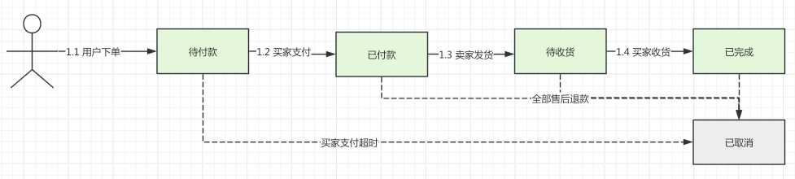

`cancel_type` 字段：取消类型，标记 `status` 为“已取消”的原因，由 TradeOrderCancelTypeEnum 枚举，例如说：超时未支付、退款关闭、买家取消。

`comment_status` 字段：订单是否评价。目的是，uni-app 筛选未评价的订单列表，也有商城系统会该字段融合到 `status` 作为“待评价”状态。

⑤ 【支付】`pay_status` 字段：是否已支付。由于订单可以全部退款变成“已关闭”状态，所以需要 `pay_status` 区分该订单实际是否发生过支付。

`pay_order_id` 字段：关联的支付中心的支付单号。对支付中心还不了解的同学，可以阅读下 [《支付手册》](/pay/build/) 文档。

⑥ 【价格】各种价格字段，最终使用 `pay_price` 字段进行支付，分类如下：

*   `+` 收钱：`total_price`、`delivery_price`
*   `-` 优惠：`discount_price`、`coupon_price`、`point_price`、`vip_price`
*   `?` 改价：`adjust_price`

价格字段拆的这些细，主要是 uni-app 或者管理后台需要展示，同时我们也需要搞清楚一个订单的具体价格明细。

⑦ 【营销】`coupon_id`、`use_point`、`give_point` 字段：优惠劵、积分相关信息。

⑧ 【退款】`refund_status` 字段：订单的整体售后（退款）状态，由 TradeOrderRefundStatusEnum 枚举，有 3 种状态：未退款、部分退款、全部退款。如果全部退款，则订单 `status` 变成“已关闭”。

`refund_point`、`refund_price` 字段：退款的积分、金额。

⑨ 【配送】`delivery_type` 字段：配送类型，由 DeliveryTypeEnum 枚举，有 2 种类型：

*   快递发货：使用 `logistics_id`、`logistics_no`、`receiver_name`、`receiver_mobile`、`receiver_area_id`、`receiver_detail_address` 字段
*   用户自提：使用 `pick_up_store_id`、`pick_up_verify_code` 字段

⑩ 各种 `_time` 结尾的字段，就是各种阶段、操作的时间，满足业务查询、统计需求。

### [#](#_1-2-订单项表) 1.2 订单项表

> 省略 creator/create\_time/updater/update\_time/deleted/tenant\_id 等通用字段

```sql
CREATE TABLE `trade_order_item`  (
  `id` bigint NOT NULL AUTO_INCREMENT COMMENT '订单项编号',
  
  `user_id` bigint UNSIGNED NOT NULL COMMENT '用户编号',
  `order_id` bigint UNSIGNED NOT NULL COMMENT '订单编号',
  `cart_id` bigint UNSIGNED NULL DEFAULT NULL COMMENT '购物车项编号',
  
  `spu_id` bigint UNSIGNED NOT NULL COMMENT '商品 SPU 编号',
  `spu_name` varchar(255) CHARACTER SET utf8mb4 COLLATE utf8mb4_bin NOT NULL COMMENT '商品 SPU 名称',
  `sku_id` bigint UNSIGNED NOT NULL COMMENT '商品 SKU 编号',
  `properties` json NULL COMMENT '商品属性数组，JSON 格式',
  `pic_url` varchar(200) CHARACTER SET utf8mb4 COLLATE utf8mb4_bin NULL DEFAULT NULL COMMENT '商品图片',
  `count` int NOT NULL COMMENT '购买数量',
  
  `comment_status` bit(1) NOT NULL DEFAULT b'0' COMMENT '是否评价',
  
  `price` int NOT NULL DEFAULT 0 COMMENT '商品原价（单），单位：分',
  `discount_price` int NOT NULL DEFAULT 0 COMMENT '商品级优惠（总），单位：分',
  `delivery_price` int NOT NULL DEFAULT 0 COMMENT '运费金额，单位：分',
  `adjust_price` int NOT NULL DEFAULT 0 COMMENT '订单调价（总），单位：分',
  `pay_price` int NOT NULL DEFAULT 0 COMMENT '子订单实付金额（总），不算主订单分摊金额，单位：分',
  `coupon_price` int NOT NULL DEFAULT 0 COMMENT '优惠劵减免金额，单位：分',
  `point_price` int NOT NULL DEFAULT 0 COMMENT '积分抵扣的金额',
  `vip_price` int NOT NULL DEFAULT 0 COMMENT 'VIP 减免金额，单位：分',
  
  `use_point` int NOT NULL DEFAULT 0 COMMENT '使用的积分',
  `give_point` int NOT NULL DEFAULT 0 COMMENT '赠送的积分',

  `after_sale_id` bigint UNSIGNED NULL DEFAULT NULL COMMENT '售后订单编号',
  `after_sale_status` int NOT NULL DEFAULT 0 COMMENT '售后状态',
  PRIMARY KEY (`id`) USING BTREE
) ENGINE = InnoDB AUTO_INCREMENT = 124 CHARACTER SET = utf8mb4 COLLATE = utf8mb4_bin COMMENT = '交易订单明细表';

```

字段也是非常多，但是和订单表类似，我们也来分块来看看。

① 【用户】`user_id` 字段：对应的用户编号。

② 【订单】`order_id` 字段：关联的订单编号。

③ 【商品】`spu_id`、`spu_name`、`sku_id`、`properties`、`pic_url`、`count` 字段：商品 SPU、SKU 相关信息。用户下单的每个 SKU 会对应一条 `trade_order_item` 记录。

④ 【状态】`comment_status` 字段：订单项是否评价。

⑤ 【价格】`price`、`discount_price`、`delivery_price`、`adjust_price`、`pay_price`、`coupon_price`、`point_price`、`vip_price` 字段：订单项的价格信息。

⑥ 【营销】`use_point`、`give_point` 字段：订单项的积分信息。

⑦ 【售后】`after_sale_id`、`after_sale_status` 字段：订单项的售后信息。每个订单项只能发起一次售后，所以这里只有一个 `after_sale_id` 字段。

### [#](#_1-3-订单日志表) 1.3 订单日志表

> 省略 creator/create\_time/updater/update\_time/deleted/tenant\_id 等通用字段

```sql
CREATE TABLE `trade_order_log`  (
  `id` bigint NOT NULL AUTO_INCREMENT COMMENT '日志主键',
  `user_id` bigint NOT NULL COMMENT '用户编号',
  `user_type` tinyint NOT NULL DEFAULT 0 COMMENT '用户类型',
  `order_id` bigint NOT NULL COMMENT '订单号',
  `before_status` tinyint NULL DEFAULT NULL COMMENT '操作前状态',
  `after_status` tinyint NULL DEFAULT NULL COMMENT '操作后状态',
  `operate_type` int NOT NULL DEFAULT 0 COMMENT '操作类型',
  `content` varchar(2000) CHARACTER SET utf8mb4 COLLATE utf8mb4_unicode_ci NOT NULL DEFAULT '' COMMENT '操作内容',
  PRIMARY KEY (`id`) USING BTREE
) ENGINE = InnoDB AUTO_INCREMENT = 8602 CHARACTER SET = utf8mb4 COLLATE = utf8mb4_unicode_ci COMMENT = '交易订单日志';

```

每次订单状态变更，都会记录一条日志，方便后续查询、统计。

通过 `@TradeOrderLog` 注解，基于 Spring AOP 实现记录，具体可以看看 TradeOrderLogAspect 类。

## [#](#_2-订单流程) 2. 订单流程

本小节，我们按照订单的 `结算 => 提交 => 支付 => 发货 => 收货 => 评价` 流程，来看看订单的各个阶段。

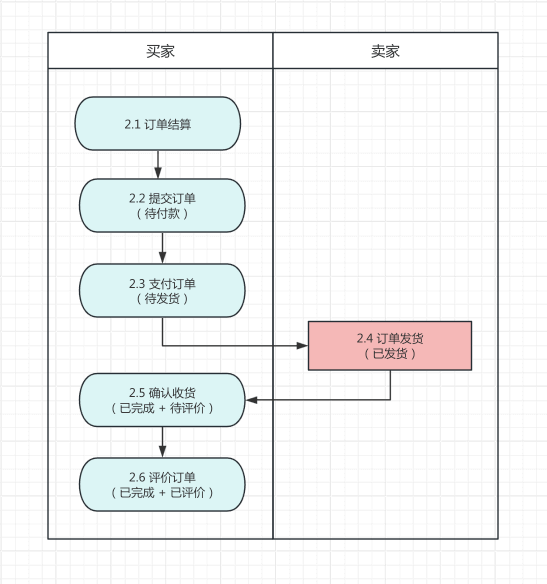

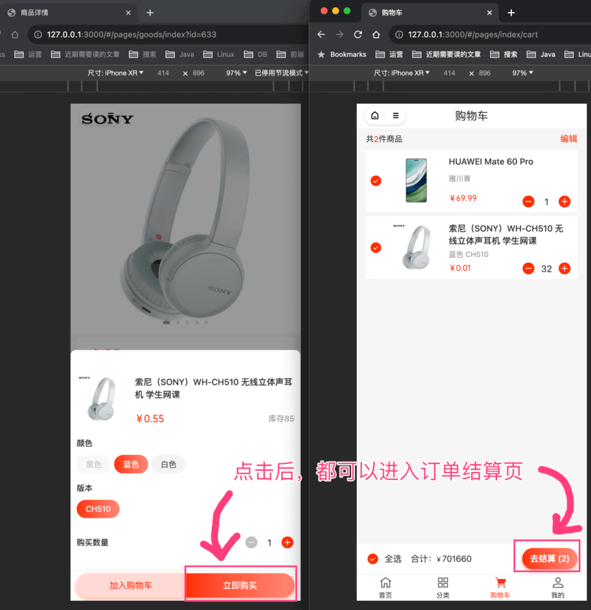

### [#](#_2-1-结算【买家】) 2.1 结算【买家】

① 前端对应 `yudao-mall-uniapp` 项目的 `pages/order/confirm.vue` 页面，如下图所示：

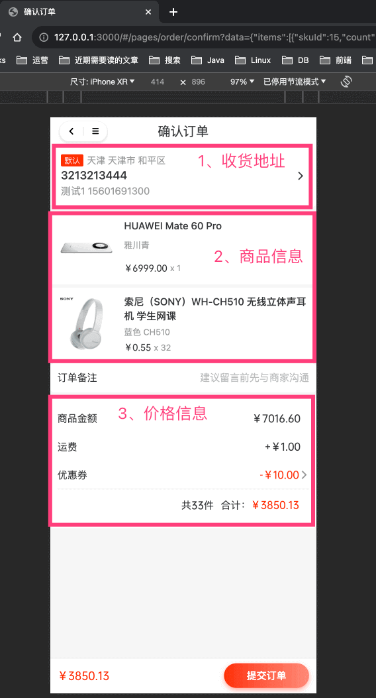

② 后端对应 AppTradeOrderController 的 `#settlementOrder(...)` 提供的“获得订单结算信息”接口，核心的价格计算通过 TradePriceCalculator 实现。如下图所示：

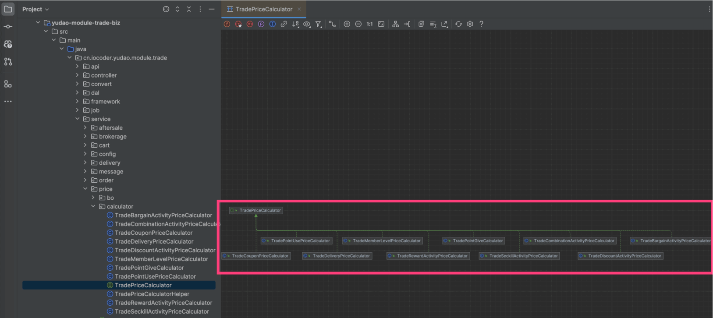

TradePriceCalculator 只是一个接口，它有多个实现类，满足不同的价格计算组合：

*   优惠劵：TradeCouponPriceCalculator
*   运费：TradeDeliveryPriceCalculator
*   积分：TradePointUsePriceCalculator、TradePointGiveCalculator
*   VIP：TradeMemberLevelPriceCalculator
*   限时折扣：TradeDiscountActivityPriceCalculator
*   满减送：TradeRewardActivityPriceCalculator
*   拼团：TradeCombinationActivityPriceCalculator
*   秒杀：TradeSeckillActivityPriceCalculator
*   砍价：TradeBargainActivityPriceCalculator

### [#](#_2-2-提交【买家】) 2.2 提交【买家】

点击「提交订单」按钮后，会调用 AppTradeOrderController 的 `#submitOrder(...)` 提供的“提交订单”接口，插入一条 `trade_order`、多条 `trade_order_item` 记录。

订单状态：待支付

由于这个过程中会涉及到很多业务，所以我们把它们抽象成一个又一个 TradeOrderHandler 实现，如下图所示：

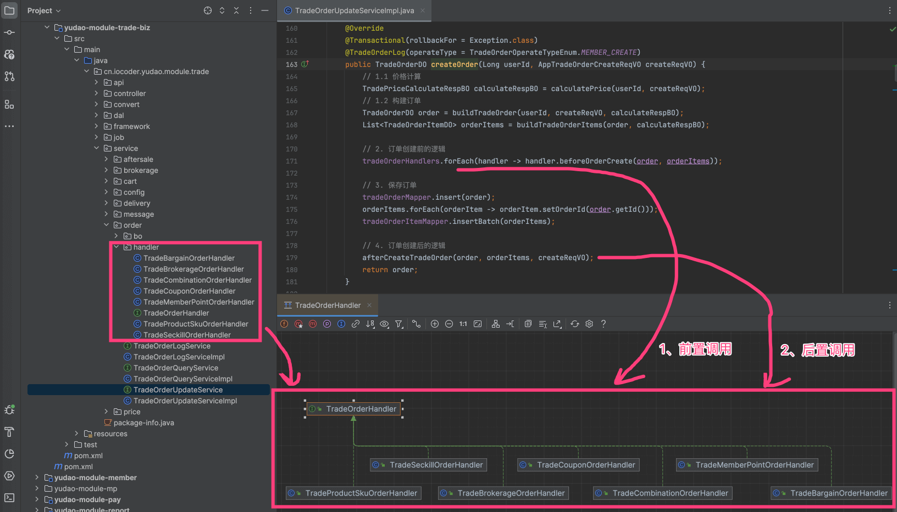

*   库存扣减：TradeProductSkuOrderHandler
*   积分扣减：TradeMemberPointOrderHandler
*   优惠劵使用：TradeCouponOrderHandler
*   订单分销：TradeBrokerageOrderHandler
*   拼团处理：TradeCombinationOrderHandler
*   秒杀处理：TradeSeckillOrderHandler
*   砍价处理：TradeBargainOrderHandler

### [#](#_2-3-支付【买家】) 2.3 支付【买家】

① 订单提交成功后，会进入支付页面，如下图所示：

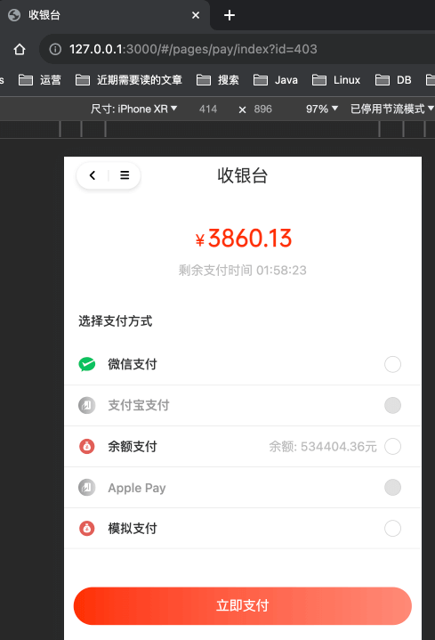

这块已经在 [《微信公众号支付接入》](/pay/wx-pub-pay-demo/)、[《微信小程序支付接入》](/pay/wx-lite-pay-demo/) 文档中介绍过了，这里就不再赘述。

② 支付成功后，【支付中心】会回调 AppTradeOrderController 的 `#updateOrderPaid(...)` 提供的“支付成功回调”接口，更新 `trade_order` 为已支付（待发货）。

订单状态：待发货（已支付）

③ 支付成功后，【前端】会跳转到“支付结果”页面，对应 `yudao-mall-uniapp` 项目的 `pages/pay/result.vue` 页面。如下图所示：

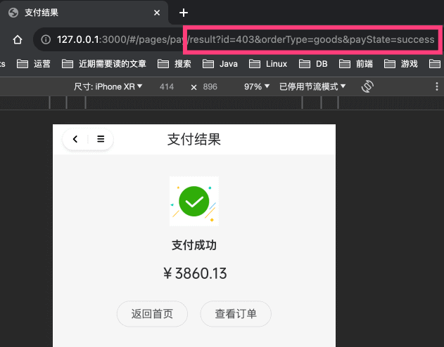

④ 点击「查看订单」按钮，进入我的订单列表，对应 `yudao-mall-uniapp` 项目的 `pages/order/list.vue` 页面。如下图所示：

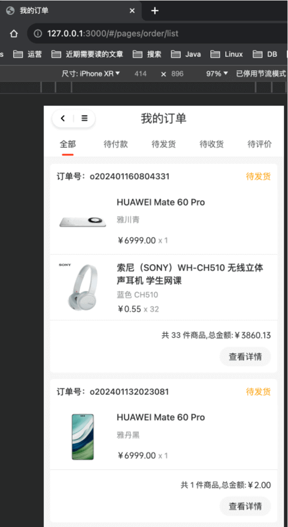

⑤ 点击某个订单，进入订单详情，对应 `yudao-mall-uniapp` 项目的 `pages/order/detail.vue` 页面。如下图所示：

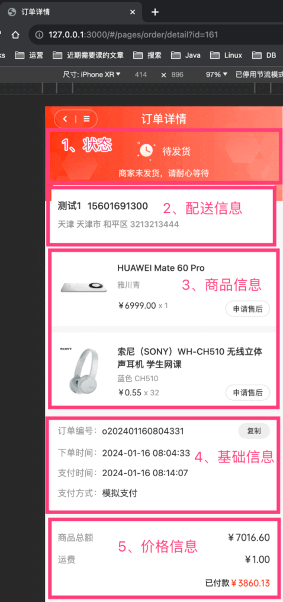

此时，需要等待卖家发货。

### [#](#_2-4-发货【卖家】) 2.4 发货【卖家】

① 卖家可以在订单列表进行发货，对应 \[商城系统 -> 订单中心 -> 订单列表\] 菜单，对应 `yudao-ui-admin-vue3` 项目的 `@/views/trade/order` 目录。如下图所示：

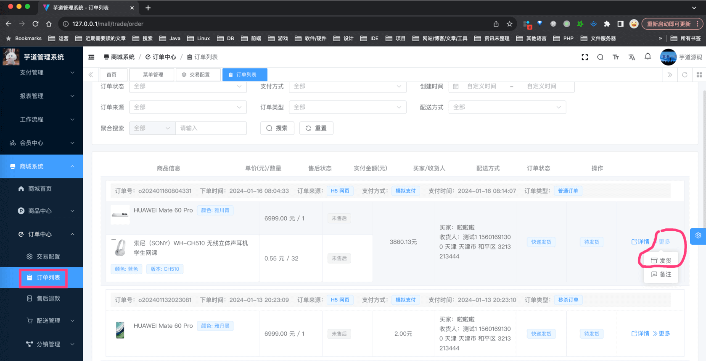

当然，也可以在订单详情页进行发货，点击「详情」按钮进入，对应 `yudao-ui-admin-vue3` 项目的 `@/views/trade/order/detail.vue` 文件。如下图所示：

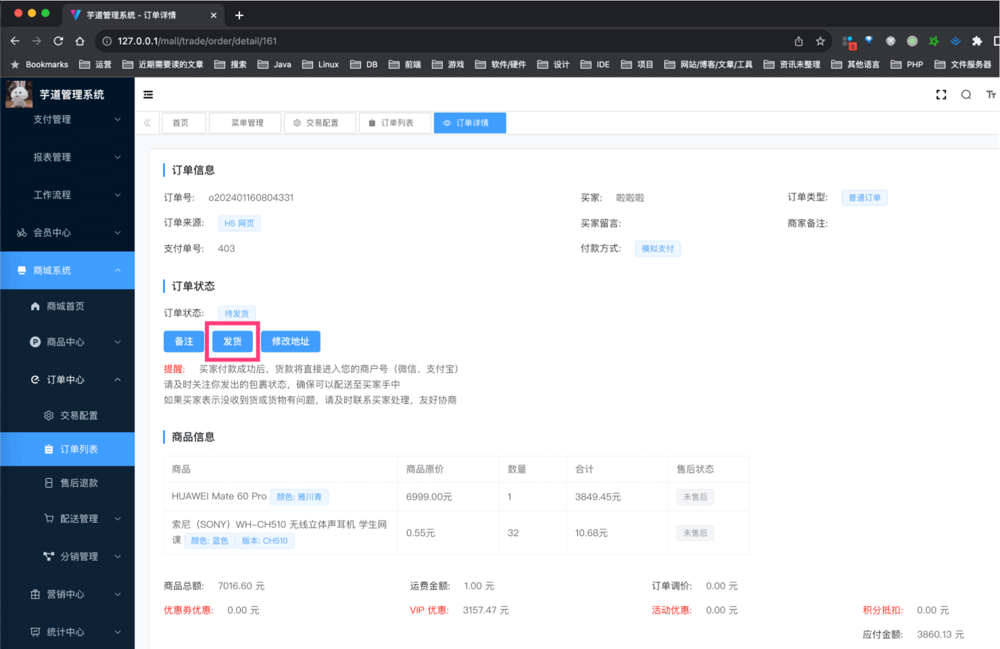

② 卖家点击「发货」按钮，进入发货页面，对应 `yudao-ui-admin-vue3` 项目的 `@/views/trade/order/delivery.vue` 文件。如下图所示：

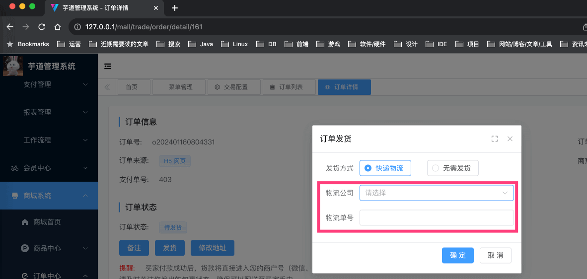

这里，我们选择物流公司为“申通快递”，并输入物流单号为“777168349863987”（因为它有真实物流数据），点击「确定」按钮，完成发货，更新 `trade_order` 为已发货（待收货）。

订单状态：已发货（待收货）

ps：微信小程序的发货，可以使用订阅消息功能，具体可以后面看看 [《微信小程序订阅消息》](/member/weixin-lite-subscribe-message/) 文档。

### [#](#_2-5-收货【买家】) 2.5 收货【买家】

① 买家点击「查看物流」按钮，进入物流详情页，对应 `yudao-mall-uniapp` 项目的 `pages/order/express/log.vue` 页面。如下图所示：

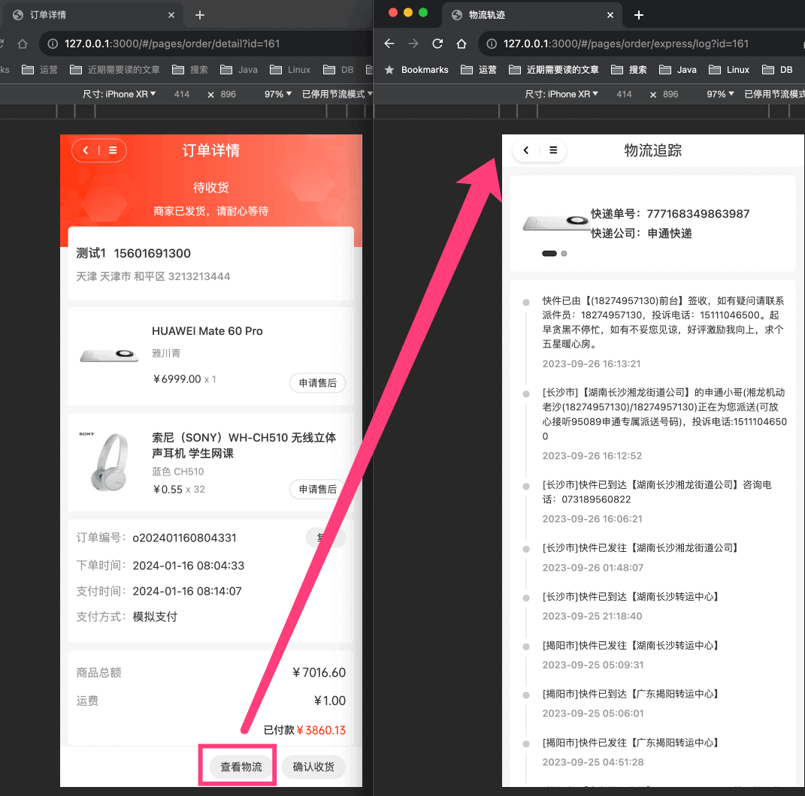

② 物流信息，由 AppTradeOrderController 的 `#getOrderExpressTrackList(...)` 提供的“获得交易订单的物流轨迹”接口。它的核心实现由 ExpressClient 实现，如下图所示：

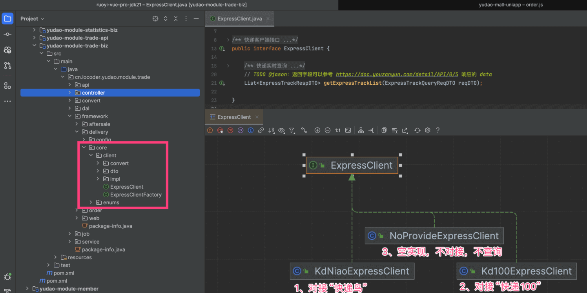

*   KdNiaoExpressClient：对接快递鸟的客户端，官方文档 [https://www.kdniao.com/api-follow (opens new window)](https://www.kdniao.com/api-follow)
*   Kd100ExpressClient：对接快递 100 的客户端，官方文档 [https://api.kuaidi100.com/document/ (opens new window)](https://api.kuaidi100.com/document/)

具体使用哪个客户端，可修改 `application.yaml` 配置文件的 `yudao.trade.express.client` 配置项。如下图所示：

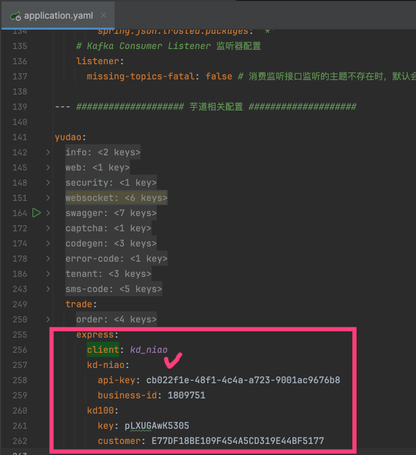

另外，如果使用快递鸟的话，要注意 8001 是免费套餐，1002 是付费套餐，可见 [https://t.zsxq.com/GcSDL (opens new window)](https://t.zsxq.com/GcSDL) 讨论。

③ 回到订单详情页，点击「确认收货」按钮，完成收货，更新 `trade_order` 为已完成。

订单状态：已完成（未评价）


### [#](#_2-6-评价【买家】) 2.6 评价【买家】

① 买家点击「评价」按钮，进入评价页，这块已经在 [《【商品】商品评价》](/mall/product-comment/) 文档中介绍过了，这里就不再赘述。

评价接口由 AppTradeOrderController 的 `#createOrderItemComment(...)` 所提供的“创建交易订单项的评价”接口。

② 评价成功后，更新 `trade_order` 为已评价。

订单状态：已完成（已评价）

至此，订单流程结束~可以试着多多 debug 调试整个流程，并不复杂噢。