目录

# 【交易】分销返佣

分销返佣，是指商城中，用户通过分享商品链接，或者通过分享二维码，帮助商家推广商品，当有用户通过分享的链接或者二维码购买商品时，分享者可以获得一定的佣金。

它可以分成三部分：分销用户、分销记录、分销提现。最终存储表结构如下：


## [#](#_1-分销用户) 1. 分销用户

由 `yudao-module-trade-biz` 后端模块的 `brokerage` 包的 BrokerageUserService 实现。

### [#](#_1-1-表结构) 1.1 表结构

> 省略 creator/create\_time/updater/update\_time/deleted/tenant\_id 等通用字段

```sql
CREATE TABLE `trade_brokerage_user` (
  `id` bigint NOT NULL AUTO_INCREMENT COMMENT '用户编号',
  `brokerage_enabled` bit(1) NOT NULL DEFAULT b'1' COMMENT '是否成为推广员',
  `brokerage_time` datetime DEFAULT NULL COMMENT '成为分销员时间',
  
  `bind_user_id` bigint DEFAULT NULL COMMENT '推广员编号',
  `bind_user_time` datetime DEFAULT NULL COMMENT '推广员绑定时间',
  
  `brokerage_price` int NOT NULL DEFAULT '0' COMMENT '可用佣金',
  `frozen_price` int NOT NULL DEFAULT '0' COMMENT '冻结佣金',
  PRIMARY KEY (`id`) USING BTREE
) ENGINE=InnoDB AUTO_INCREMENT=249 DEFAULT CHARSET=utf8mb4 COLLATE=utf8mb4_unicode_ci COMMENT='分销用户';

```

① 【自身】`id` 字段：用户编号，对应会员用户（买家）表的 `id` 字段。因为要存储分佣的绑定关系，所以每个用户都会在这个表有个记录。

`brokerage_enabled` 字段：是否成为分销用户。只有为 `true` 的用户才能进行分销。

② 【上级】`bind_user_id` 字段：推广员编号，自己对应的上级，或者说是由哪个用户分销用户推广来的，后续订单佣金算他的。

③ 【佣金】`brokerage_price`、`frozen_price` 字段：可用佣金、冻结佣金。

### [#](#_1-2-管理后台) 1.2 管理后台

对应 \[商城系统 -> 订单中心 -> 分销管理 -> 分销用户\] 菜单，对应 `yudao-ui-admin-vue3` 项目的 `views/mall/trade/brokerage/user` 目录。如下图所示：

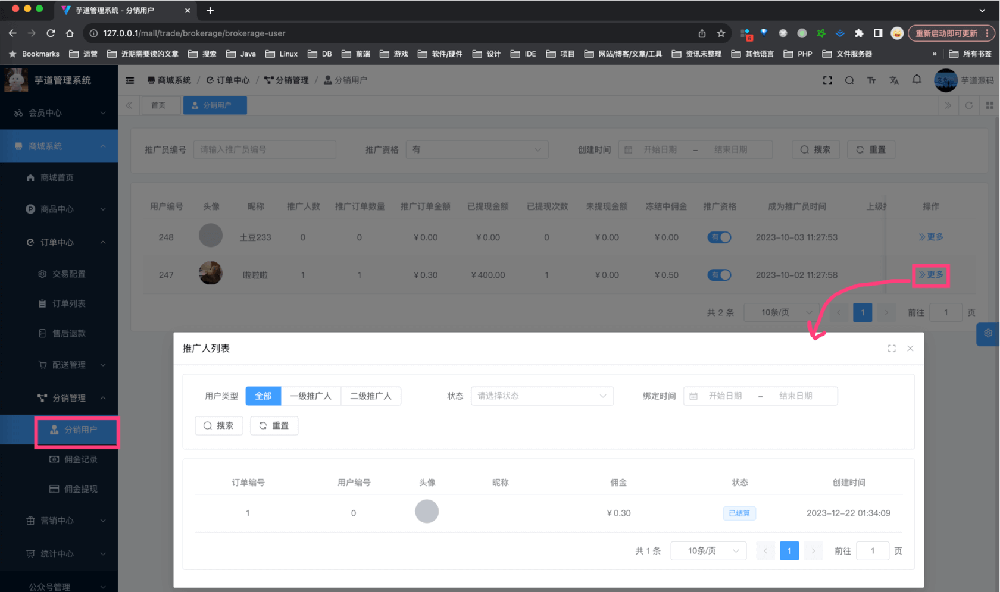

可以查看分销用户的推广人、推广订单，也可以修改它的上级推广人。

### [#](#_1-3-移动端) 1.3 移动端

对应 uni-app \[我的 -> 分销中心\] 菜单，对应 `yudao-mall-unipp` 项目的 `yudao-mall-uniapp/pages/commission` 目录。如下图所示：

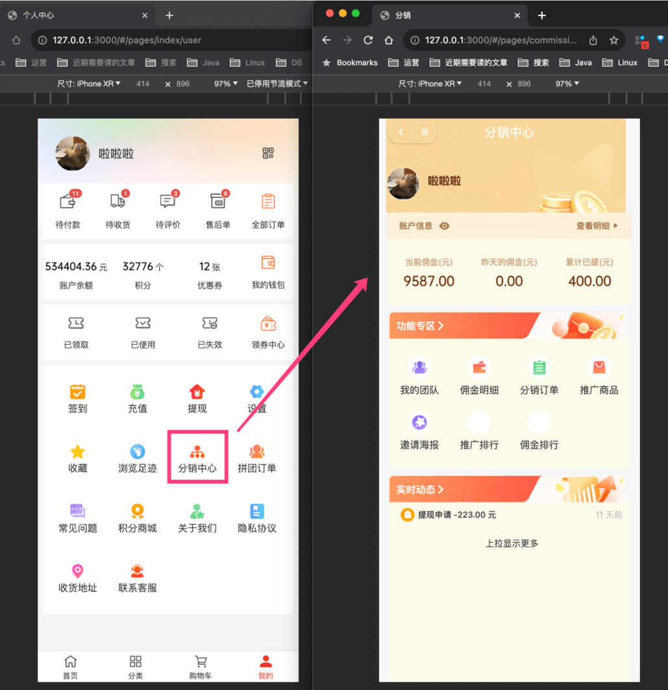

在 \[我的团队\] 中，可以查看自己的下级分销用户，以及下级分销用户的推广订单，对应 `pages/commission/team.vue` 文件。如下图所示：

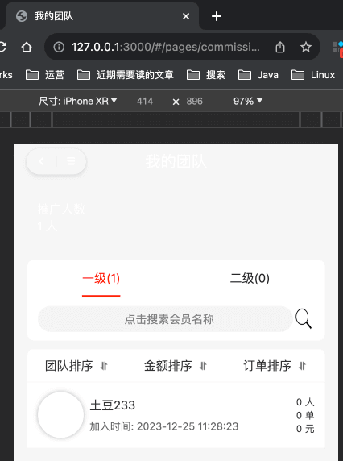

### [#](#_1-4-怎么成为分销用户) 1.4 怎么成为分销用户？

① 方式一：在“分销模式”为“人人分销”时，新用户通过邀请链接注册，则注册完成后会往 `trade_brokerage_user` 表插入数据，从而成为分销员。

1、老用户，在【分销中心】界面，点击【邀请海报】，复制邀请链接，分享给新用户。如下图所示：

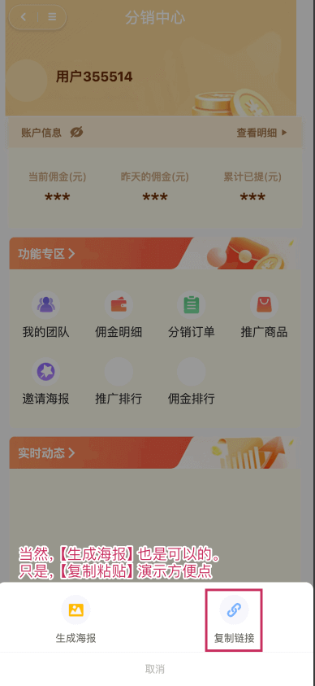

友情提示：

在微信小程序里，可以使用小程序码，具体可以后面看看 [《微信小程序码》](/member/weixin-lite-qrcode/) 文档。

2、新用户，点击该链接，注册新用户。

3、老用户，在【分销中心】界面，点击【我的团队】，可以查看到该新用户。如下图所示：

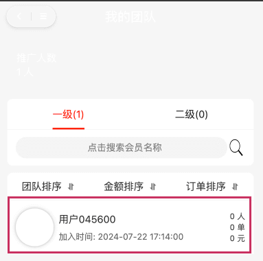

* * *

② 方式二：在“分销模式”为“人人分销”时，并且用户不是通过邀请，则新用户首次在 uni-app 打开【分销中心】时，会往 `trade_brokerage_user` 表插入数据，从而成为分销员。

## [#](#_2-分销记录) 2. 分销记录

由 `yudao-module-trade-biz` 后端模块的 `brokerage` 包的 BrokerageRecordService 实现。

### [#](#_2-1-表结构) 2.1 表结构

> 省略 creator/create\_time/updater/update\_time/deleted/tenant\_id 等通用字段

```sql
CREATE TABLE `trade_brokerage_record` (
  `id` int NOT NULL AUTO_INCREMENT COMMENT '编号',
  
  `user_id` bigint NOT NULL COMMENT '用户编号',
  `source_user_id` bigint NOT NULL DEFAULT '0' COMMENT '来源用户编号',
  `source_user_level` int NOT NULL DEFAULT '0' COMMENT '来源用户等级',
  
  `biz_id` varchar(64) CHARACTER SET utf8mb4 COLLATE utf8mb4_unicode_ci NOT NULL DEFAULT '' COMMENT '业务编号',
  `biz_type` tinyint NOT NULL DEFAULT '0' COMMENT '业务类型：1-订单，2-提现',
  `title` varchar(64) CHARACTER SET utf8mb4 COLLATE utf8mb4_unicode_ci NOT NULL DEFAULT '' COMMENT '标题',
  `description` varchar(500) CHARACTER SET utf8mb4 COLLATE utf8mb4_unicode_ci NOT NULL DEFAULT '' COMMENT '说明',
  
  `price` int NOT NULL DEFAULT '0' COMMENT '金额',
  `total_price` int NOT NULL DEFAULT '0' COMMENT '当前总佣金',
  `status` tinyint NOT NULL DEFAULT '0' COMMENT '状态：0-待结算，1-已结算，2-已取消',
  `frozen_days` int NOT NULL DEFAULT '0' COMMENT '冻结时间（天）',
  `unfreeze_time` datetime DEFAULT NULL COMMENT '解冻时间',

  PRIMARY KEY (`id`) USING BTREE,
  KEY `idx_user_id` (`user_id`) USING BTREE COMMENT '用户编号',
  KEY `idx_biz` (`biz_type`,`biz_id`) USING BTREE COMMENT '业务',
  KEY `idx_status` (`status`) USING BTREE COMMENT '状态'
) ENGINE=InnoDB AUTO_INCREMENT=8 DEFAULT CHARSET=utf8mb4 COLLATE=utf8mb4_unicode_ci COMMENT='佣金记录';

```

① `id` 字段：编号，自增主键。目前佣金每次发生变化时，都会生成一条记录，例如说订单分佣、佣金提现等等。

② 【分销关系】`user_id` 字段：用户编号，对应分销用户表的 `id` 字段。

`source_user_id` 字段：来源用户编号，例如说，订单分佣时，就是订单的买家编号。`source_user_level` 字段：来源用户等级，例如说，一级分佣、二级分佣。如下图所示：

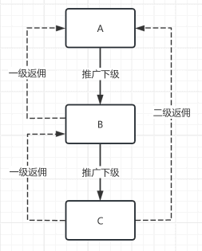

*   上下级关系：A 推广 B，B 推广了 C
*   A 购买商品：自己没有返佣
*   B 购买商品：A 获得一级返佣
*   C 购买商品：B 获得一级返佣，A 获得二级返佣

③ 【业务】`biz_id`、`biz_type` 字段：业务编号、业务类型（由 BrokerageRecordBizTypeEnum 枚举）。`title`、`description` 字段：标题、说明，主要用于展示。

例如说，订单分佣时，`biz_type` 为 1，`biz_id` 为订单编号。具体 TradeBrokerageOrderHandler 处理器，订单被支付时，会生成分佣记录。

疑问：B 已经是 A 的下级了，为什么下单支付后，没有分销记录？

有一种可能性，计算的分佣金额为 0，所以没有生成分销记录。例如说：[https://t.zsxq.com/e4aSR (opens new window)](https://t.zsxq.com/e4aSR)

④ 【佣金】`price`、`total_price` 字段：分佣金额、当前总佣金。每个商品的佣金，可以全局设置，也可以自定设置，如下图所示：

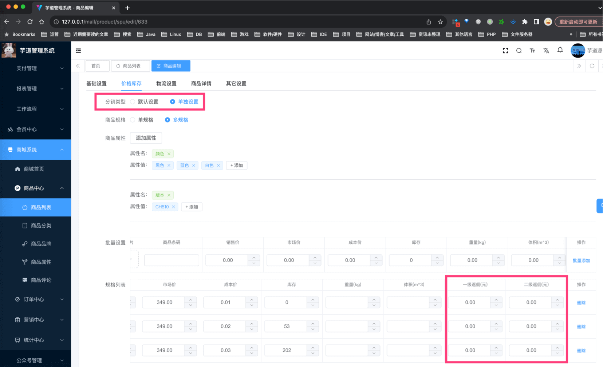

友情提示：分销商品，后续会从商品管理中解耦出来，单独管理，单独表存储。

⑤ 【状态】`status` 字段：状态，由 BrokerageRecordStatusEnum 枚举，目前就待结算（冻结）、已结算（生效）、已取消（失效）三种状态。

`frozen_days` 字段：冻结时间（天），例如说，订单分佣时，可以设置冻结时间，冻结时间内，佣金不可提现。解冻通过 BrokerageRecordUnfreezeJob 定时任务实现。

### [#](#_2-2-管理后台) 2.2 管理后台

对应 \[商城系统 -> 订单中心 -> 分销管理 -> 佣金记录\] 菜单，对应 `yudao-ui-admin-vue3` 项目的 `views/mall/trade/brokerage/recrod` 目录。如下图所示：

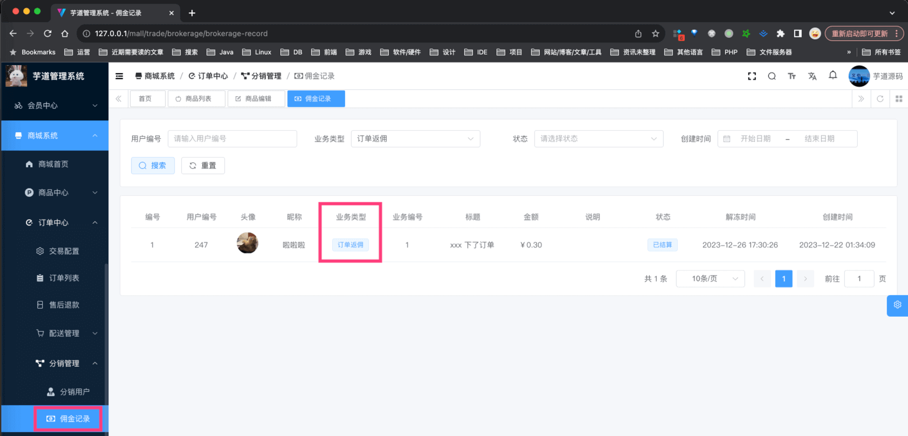

### [#](#_2-3-移动端) 2.3 移动端

在 \[分销订单\] 中，可以查看自己的分销订单，对应 `pages/commission/order.vue` 文件。如下图所示：

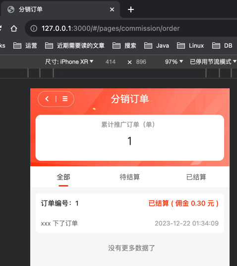

## [#](#_3-分销提现) 3. 分销提现

由 `yudao-module-trade-biz` 后端模块的 `brokerage` 包的 BrokerageWithdrawService 实现。

### [#](#_3-1-表结构) 3.1 表结构

```sql
CREATE TABLE `trade_brokerage_withdraw` (
  `id` bigint NOT NULL AUTO_INCREMENT COMMENT '编号',
  
  `user_id` bigint NOT NULL COMMENT '用户编号',
  
  `price` int NOT NULL DEFAULT '0' COMMENT '提现金额',
  `fee_price` int NOT NULL DEFAULT '0' COMMENT '提现手续费',
  `total_price` int NOT NULL DEFAULT '0' COMMENT '当前总佣金',
 
  `type` tinyint NOT NULL DEFAULT '0' COMMENT '提现类型：1-钱包；2-银行卡；3-微信；4-支付宝',
  `name` varchar(64) CHARACTER SET utf8mb4 COLLATE utf8mb4_unicode_ci DEFAULT NULL COMMENT '真实姓名',
  `account_no` varchar(64) CHARACTER SET utf8mb4 COLLATE utf8mb4_unicode_ci DEFAULT NULL COMMENT '账号',
  `bank_name` varchar(100) CHARACTER SET utf8mb4 COLLATE utf8mb4_unicode_ci DEFAULT NULL COMMENT '银行名称',
  `bank_address` varchar(200) CHARACTER SET utf8mb4 COLLATE utf8mb4_unicode_ci DEFAULT NULL COMMENT '开户地址',
  `account_qr_code_url` varchar(512) CHARACTER SET utf8mb4 COLLATE utf8mb4_unicode_ci DEFAULT NULL COMMENT '收款码',
  
  `status` tinyint NOT NULL DEFAULT '0' COMMENT '状态：0-审核中，10-审核通过 20-审核不通过；预留：11 - 提现成功；21-提现失败',
  `audit_reason` varchar(128) CHARACTER SET utf8mb4 COLLATE utf8mb4_unicode_ci DEFAULT NULL COMMENT '审核驳回原因',
  `audit_time` datetime DEFAULT NULL COMMENT '审核时间',
  
  PRIMARY KEY (`id`) USING BTREE,
  KEY `idx_user_id` (`user_id`) USING BTREE COMMENT '用户编号',
  KEY `idx_audit_status` (`status`) USING BTREE COMMENT '状态'
) ENGINE=InnoDB AUTO_INCREMENT=11 DEFAULT CHARSET=utf8mb4 COLLATE=utf8mb4_unicode_ci COMMENT='佣金提现';

```

字段虽然比较多，但是都比较简单，就不一一介绍了，只挑选部分重点的。

① `type` 字段，提现类型，由 BrokerageWithdrawTypeEnum 枚举，目前支持钱包、银行卡、微信、支付宝。具体需要填写哪些字段，可见 AppBrokerageWithdrawCreateReqVO 类的注释。

② `status` 字段，提现状态，由 BrokerageWithdrawStatusEnum 枚举，可以分成三个阶段：分佣用户申请、管理员审核（通过、不通过）、管理员打款（成功、失败）。

疑问：为什么提现成功、失败是“预留”？

由于【支付中心】的“转账”功能还没开发完成，所以暂时不支持线上的该操作，仅仅预留，你可以先自己实现~

### [#](#_3-2-管理后台) 3.2 管理后台

对应 \[商城系统 -> 订单中心 -> 分销管理 -> 佣金提现\] 菜单，对应 `yudao-ui-admin-vue3` 项目的 `views/mall/trade/brokerage/withdraw` 目录。如下图所示：

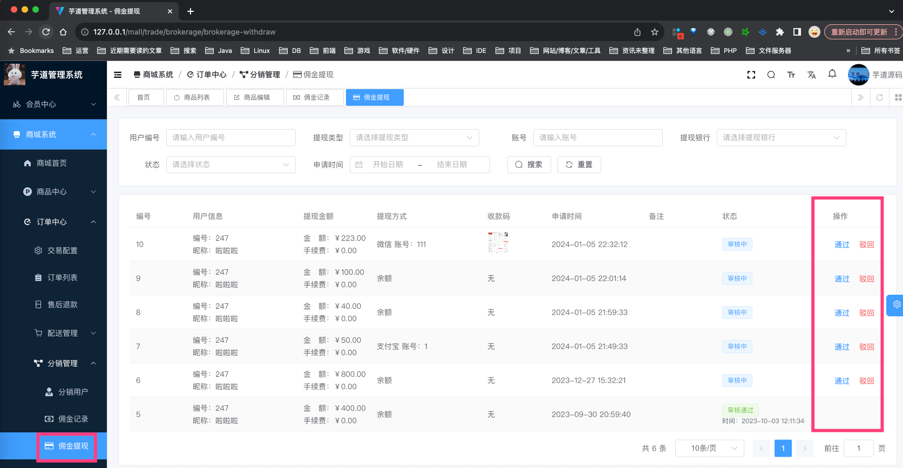

### [#](#_3-2-移动端) 3.2 移动端

① 在 \[佣金明细\] 中，可以查看自己的提现记录，对应 `pages/commission/wallet.vue` 文件。如下图所示：

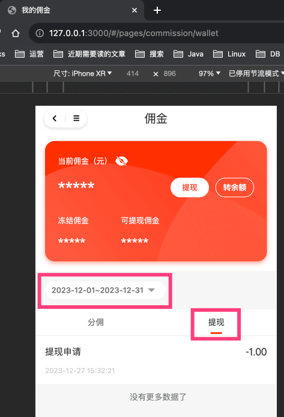

② 点击「提现」按钮，可以申请提现，对应 `pages/commission/withdraw.vue` 文件。如下图所示：

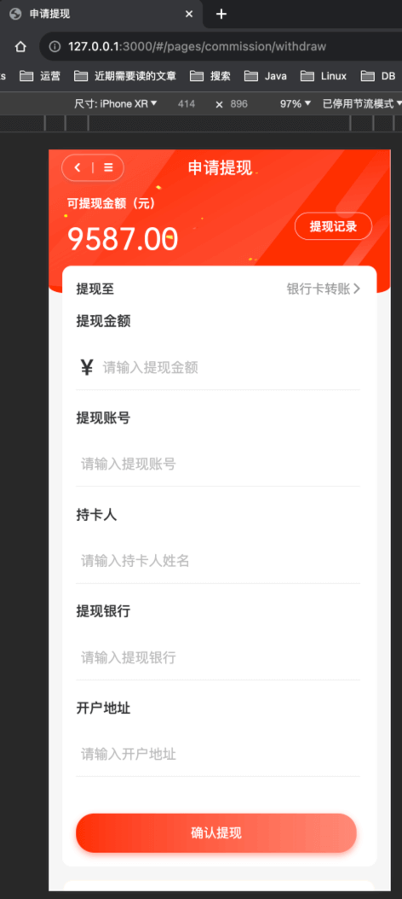

## [#](#_4-分佣配置) 4. 分佣配置

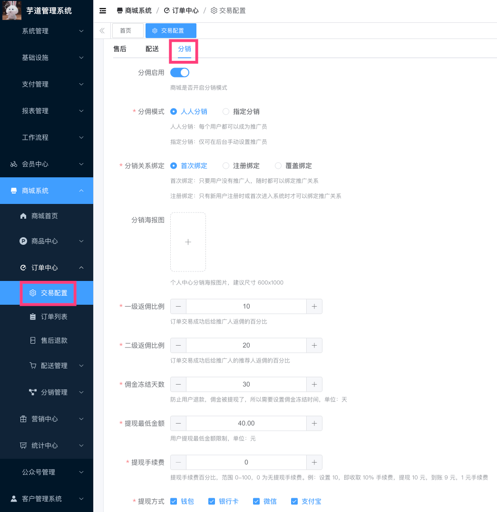

*   SQL 对应 `trade_config` 表的 `brokerage_` 开头的字段。
*   前端对应 `yudao-ui-admin-vue3` 项目的 `views/mall/trade/config/index.vue` 目录
*   后端对应 `yudao-module-trade-biz` 项目的 TradeConfigController 类