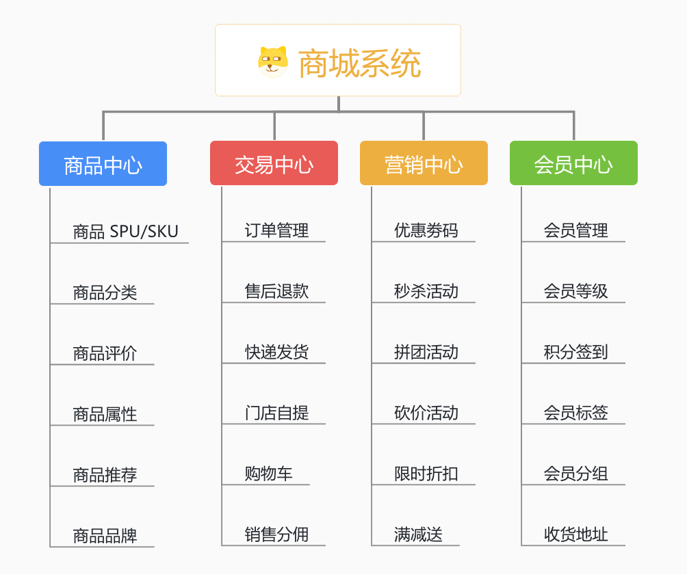
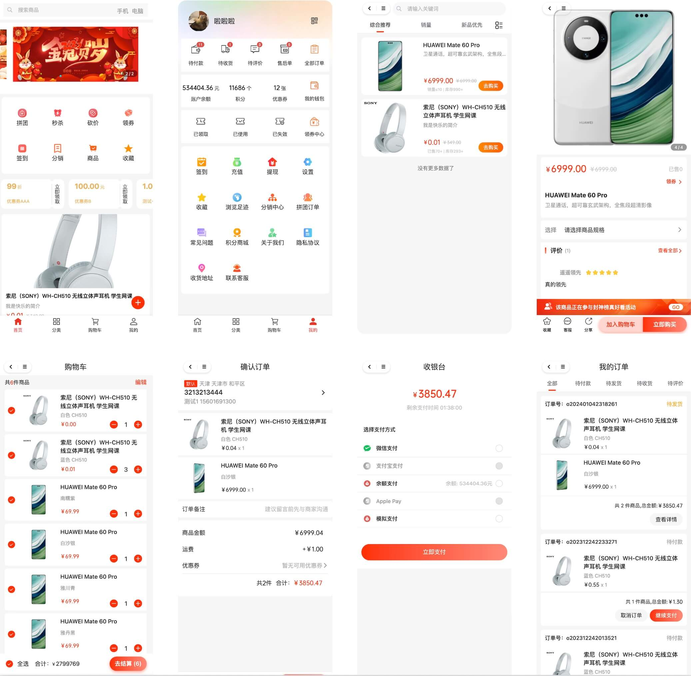
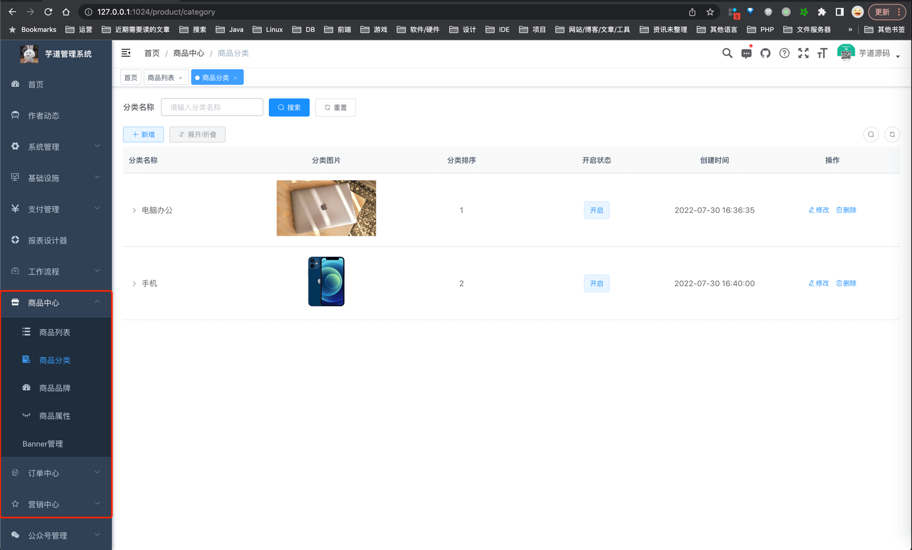
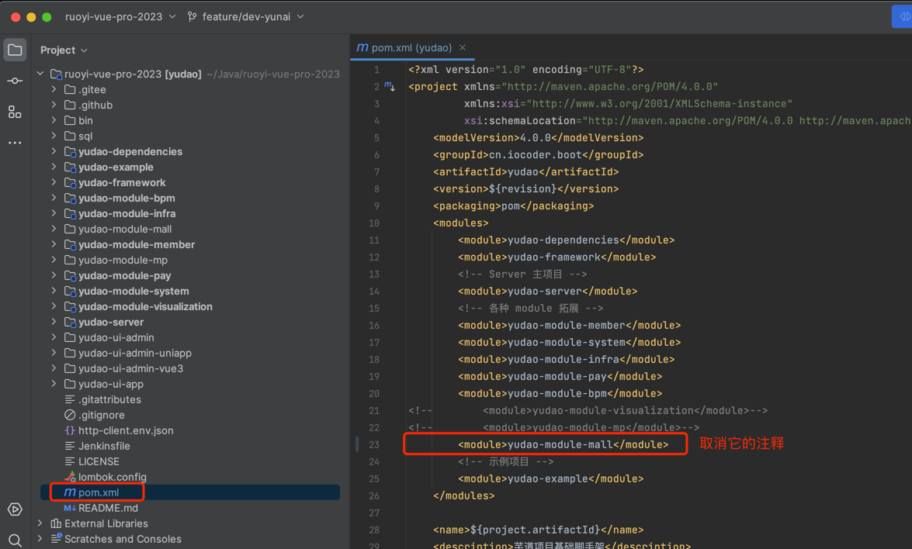
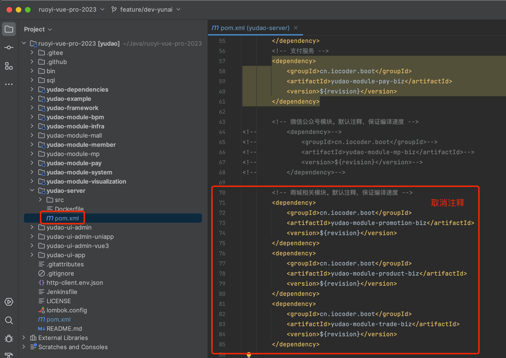
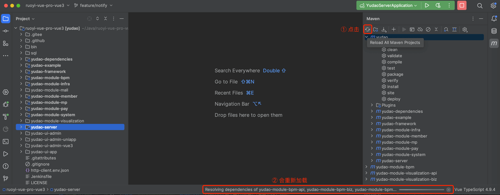

目录

# 功能开启

项目地址：

*   uni-app 商城前端，已经基于 Vue3 重构，对应 [https://gitee.com/yudaocode/yudao-mall-uniapp (opens new window)](https://gitee.com/yudaocode/yudao-mall-uniapp) 仓库的 `master` 分支
*   管理后台，请使用 [https://gitee.com/yudaocode/yudao-ui-admin-vue3 (opens new window)](https://gitee.com/yudaocode/yudao-ui-admin-vue3) 仓库的 `master` 分支
*   后端项目，请使用 [https://gitee.com/zhijiantianya/ruoyi-vue-pro (opens new window)](https://gitee.com/zhijiantianya/ruoyi-vue-pro) 仓库的 `master`（JDK8） 或 `master-jdk17`（JDK17/21） 分支

商城的功能，由三部分代码组成：

*   后端实现，对应 [`yudao-module-mall` (opens new window)](https://github.com/YunaiV/ruoyi-vue-pro/blob/master/yudao-module-mall/) 模块
*   管理后台，对应 [`@/views/mall` (opens new window)](https://github.com/yudaocode/yudao-ui-admin-vue3/tree/master/src/views/mall) 目录
*   用户前台，对应 [https://github.com/yudaocode/yudao-mall-uniapp (opens new window)](https://github.com/yudaocode/yudao-mall-uniapp) 项目

## [#](#_1-功能介绍) 1. 功能介绍

主要拆分四大模块：商品中心、交易中心、营销中心、会员中心。如下图所示：

## [#](#_2-后端开启) 2. 后端开启

友情提示：

① 商城使用到支付，所以需要参考 [《支付手册》](/pay/build) 文档，将支付功能开启。

② 商城使用到会员，所以需要参考 [《会员手册》](/member/build) 文档，将会员功能开启。

考虑到编译速度，默认 `yudao-module-mall` 模块是关闭的，需要手动开启。步骤如下：

*   第一步，开启 `yudao-module-mall` 模块
*   第二步，导入商城的 SQL 数据库脚本
*   第三步，重启后端项目，确认功能是否生效

### [#](#_2-1-开启模块) 2.1 开启模块

① 修改根目录的 [`pom.xml` (opens new window)](https://github.com/YunaiV/ruoyi-vue-pro/blob/master/pom.xml) 文件，取消 `yudao-module-mall` 模块的注释。如下图所示：

② 修改 `yudao-server` 目录的 [`pom.xml` (opens new window)](https://github.com/YunaiV/ruoyi-vue-pro/blob/master/yudao-server/pom.xml) 文件，引入 `yudao-module-mall` 模块。如下图所示：

③ 点击 IDEA 右上角的【Reload All Maven Projects】，刷新 Maven 依赖。如下图所示：

### [#](#_2-2-第二步-导入-sql) 2.2 第二步，导入 SQL

点击 [`mall-2024-01-17.sql.zip` (opens new window)](https://t.zsxq.com/15mDotnaB) 下载附件，解压出 SQL 文件，然后导入到数据库中。

友情提示：↑↑↑ mall.sql 是可以点击下载的！ ↑↑↑

### [#](#_2-3-第三步-重启项目) 2.3 第三步，重启项目

重启后端项目，然后访问前端的商城菜单，确认功能是否生效。如下图所示：

至此，我们就成功开启了商城的功能 🙂

常见问题：

① 为什么会报 Cannot resolve cn.iocoder.boot:yudao-module-member-api:2.2.0-jdk8-snapshot 错误？

参见 [https://t.zsxq.com/QvNHv (opens new window)](https://t.zsxq.com/QvNHv) 解决。

## [#](#_3-前端开启) 3. 前端开启

参考 [《快速启动（前端项目）》](/quick-start-front/) 文档的「2. uni-app 商城移动端」小节。

## [#](#_4-推荐阅读) 4. 推荐阅读

微信公众号相关：

*   [《微信公众号登录》](/member/weixin-mp-login/)
*   [《微信公众号支付接入》](/pay/wx-pub-pay-demo/)

微信小程序相关：

*   [《微信小程序登录》](/member/weixin-lite-login/)
*   [《微信小程序支付接入》](/pay/wx-lite-pay-demo/)

## [#](#_5-部署说明) 5. 部署说明
### [#](#_5-1-静态资源) 5.1 静态资源

在 `.env` 配置文件中，有 `SHOPRO_STATIC_URL` 配置项，用于配置商城的静态资源地址，默认是 `http://test.yudao.iocoder.cn`。

部署时，你必须改成你自己的静态资源地址，不然会导致商城的静态资源无法加载。

① 将 [https://gitee.com/yudaocode/yudao-demo/tree/2d0024ad71489e5b263ca1cec07e82abdc61d45f/yudao-static/mall (opens new window)](https://gitee.com/yudaocode/yudao-demo/tree/2d0024ad71489e5b263ca1cec07e82abdc61d45f/yudao-static/mall) 的 `static` 目录下的图片，上传到你的静态资源服务器的 `static` 目录上。

如果你使用七牛 CDN，可以使用 [Kodo Browser (opens new window)](https://developer.qiniu.com/kodo/5972/kodo-browser) 批量上传。

② 将 `SHOPRO_STATIC_URL` 配置项，改成你的静态资源地址。

③ 重启前端项目，并通过 Chrome 开发者工具的【Network】标签页，查看是不是你的静态资源地址。