目录

# 【交易】售后退款

## [#](#_1-表结构) 1. 表结构

售后退款，由 `yudao-module-trade-biz` 后端模块的 `aftersale` 包实现，分成二个表：


*   `trade_after_sale_`：售后订单表
*   `trade_after_sale_log`：售后订单日志表

### [#](#_1-1-售后订单表) 1.1 售后订单表

> 省略 creator/create\_time/updater/update\_time/deleted/tenant\_id 等通用字段

```sql
CREATE TABLE `trade_after_sale` (
  `id` bigint NOT NULL AUTO_INCREMENT COMMENT '售后编号',
  `no` varchar(32) CHARACTER SET utf8mb4 COLLATE utf8mb4_bin NOT NULL COMMENT '售后单号',
  `user_id` bigint unsigned NOT NULL COMMENT '用户编号',
  
  `type` tinyint DEFAULT NULL COMMENT '售后类型',

  `status` int NOT NULL DEFAULT '0' COMMENT '售后状态',
  `way` tinyint NOT NULL COMMENT '售后方式',
  
  `refund_price` int NOT NULL DEFAULT '0' COMMENT '退款金额，单位：分',
  `apply_reason` varchar(255) CHARACTER SET utf8mb4 COLLATE utf8mb4_bin NOT NULL COMMENT '申请原因',
  `apply_description` varchar(255) CHARACTER SET utf8mb4 COLLATE utf8mb4_bin DEFAULT NULL COMMENT '补充描述',
  `apply_pic_urls` varchar(255) CHARACTER SET utf8mb4 COLLATE utf8mb4_bin DEFAULT NULL COMMENT '补充凭证图片',
  
  `order_id` bigint unsigned NOT NULL COMMENT '订单编号',
  `order_no` varchar(32) CHARACTER SET utf8mb4 COLLATE utf8mb4_bin NOT NULL COMMENT '订单流水号',
  `order_item_Id` bigint unsigned NOT NULL COMMENT '订单项编号',
  
  `spu_id` bigint unsigned NOT NULL COMMENT '商品 SPU 编号',
  `spu_name` varchar(255) CHARACTER SET utf8mb4 COLLATE utf8mb4_bin NOT NULL COMMENT '商品 SPU 名称',
  `sku_id` bigint unsigned NOT NULL COMMENT '商品 SKU 编号',
  `properties` json DEFAULT NULL COMMENT '商品属性数组，JSON 格式',
  `pic_url` varchar(200) CHARACTER SET utf8mb4 COLLATE utf8mb4_bin DEFAULT NULL COMMENT '商品图片',
  `count` int NOT NULL COMMENT '购买数量',
  
  `audit_time` datetime DEFAULT CURRENT_TIMESTAMP COMMENT '审批时间',
  `audit_user_id` bigint unsigned DEFAULT NULL COMMENT '审批人',
  `audit_reason` varchar(255) CHARACTER SET utf8mb4 COLLATE utf8mb4_bin DEFAULT NULL COMMENT '审批备注',
  
  `logistics_id` bigint DEFAULT NULL COMMENT '退货物流公司编号',
  `logistics_no` varchar(64) CHARACTER SET utf8mb4 COLLATE utf8mb4_bin DEFAULT NULL COMMENT '退货物流单号',
  `delivery_time` datetime DEFAULT NULL COMMENT '退货时间',
  `receive_time` datetime DEFAULT NULL COMMENT '收货时间',
  `receive_reason` varchar(255) CHARACTER SET utf8mb4 COLLATE utf8mb4_bin DEFAULT NULL COMMENT '收货备注',
  
  `pay_refund_id` bigint unsigned DEFAULT NULL COMMENT '支付退款编号',
  `refund_time` datetime DEFAULT CURRENT_TIMESTAMP COMMENT '退款时间',

  PRIMARY KEY (`id`) USING BTREE
) ENGINE=InnoDB AUTO_INCREMENT=23 DEFAULT CHARSET=utf8mb4 COLLATE=utf8mb4_bin COMMENT='售后订单';

```

字段还是非常多的，我们来分块来看看。

① `no` 字段：售后单号，主要展示给用户看，由 TradeNoRedisDAO 的 `#generate(...)` 方法生成。

而 `id` 字段是数据库自增的订单编号，系统内部使用，一般不展示给用户查看。

② 【类型】`type` 字段：售后类型，由 AfterSaleTypeEnum 枚举，分成两种类型：

*   售中退款：交易完成【前】买家申请退款
*   售后退款：交易完成【后】买家申请退款

③ 【状态】`status` 字段：订单状态，由 AfterSaleStatusEnum 枚举，流转状态如下图：

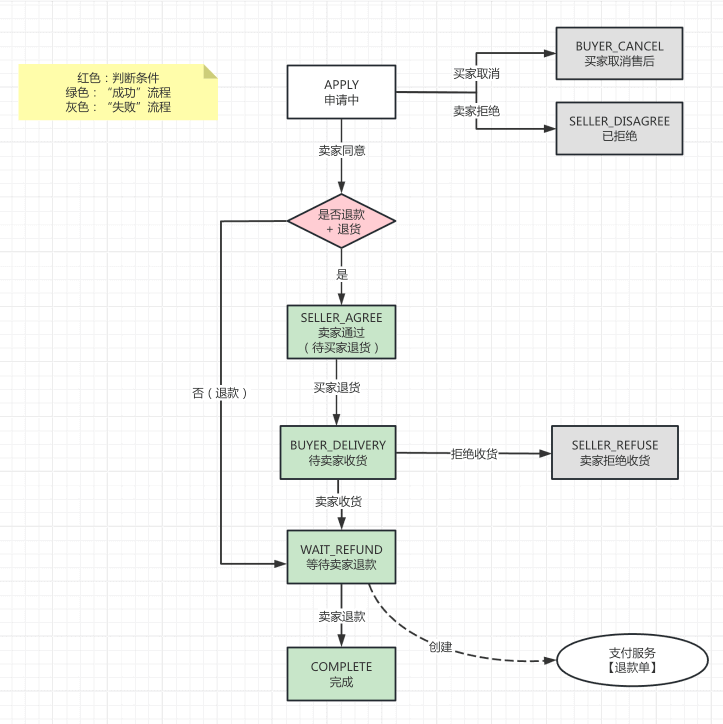

`way` 字段：售后方式，由 AfterSaleWayEnum 枚举，分成两种方式：仅退款、退货退款。如上图所示，退款会多 SELLER\_AGREE、BUYER\_DELIVERY 两个动作。

④ 【申请】`refund_price`、`apply_reason`、`apply_description`、`apply_pic_urls` 字段：买家发起售后的基本信息。

⑤ 【订单】`order_id`、`order_no`、`order_item_Id` 字段：关联的订单项信息，一个 `trade_order_item` 可以发起多次售后，同一时间只允许一个，并且最终只能有一个成功。

如果你希望一个售后订单可以退多个订单项，需要自己加个 `trade_after_sale_item` 表，将部分【订单信息】【商品信息】挪过去。

⑥ 【商品】`spu_id`、`sku_id`、`count` 字段：关联的商品信息。冗余的 `spu_name`、`pic_url`、`properties` 字段，是为了方便查询。

⑦ 【审核】`audit_time`、`audit_user_id`、`audit_reason` 字段：卖家审核的信息。

⑧ 【退货】`logistics_id`、`logistics_no`、`delivery_time` 字段：买家退货的信息。

`receive_time`、`receive_reason` 字段：卖家收货的信息。

⑨ 【退款】`pay_refund_id`、`refund_time` 字段：退款的信息。 其中，`pay_refund_id` 关联的支付中心的退款单号。对支付中心还不了解的同学，可以阅读下 [《支付手册》](/pay/build/) 文档。

### [#](#_1-2-售后订单日志表) 1.2 售后订单日志表

> 省略 creator/create\_time/updater/update\_time/deleted/tenant\_id 等通用字段

```sql
CREATE TABLE `trade_after_sale_log` (
  `id` bigint NOT NULL AUTO_INCREMENT COMMENT '编号',
  `user_id` bigint NOT NULL COMMENT '用户编号',
  `user_type` tinyint NOT NULL COMMENT '用户类型',
  `after_sale_id` bigint NOT NULL COMMENT '售后编号',
  `before_status` tinyint DEFAULT NULL COMMENT '售后状态（之前）',
  `after_status` tinyint NOT NULL COMMENT '售后状态（之后）',
  `operate_type` tinyint NOT NULL COMMENT '操作类型',
  `content` varchar(512) CHARACTER SET utf8mb4 COLLATE utf8mb4_bin NOT NULL COMMENT '操作明细',
  PRIMARY KEY (`id`) USING BTREE
) ENGINE=InnoDB AUTO_INCREMENT=32 DEFAULT CHARSET=utf8mb4 COLLATE=utf8mb4_bin COMMENT='售后订单日志';

```

每次售后状态变更，都会记录一条日志，方便后续查询、统计。

通过 `@AfterSaleLog` 注解，基于 Spring AOP 实现记录，具体可以看看 AfterSaleLogAspect 类。

## [#](#_2-售后流程) 2. 售后流程

本小节，我们按照售后的 `申请 => 审批 => 退货 => 收货 => 退款` 流程，来看看售后的各个阶段。

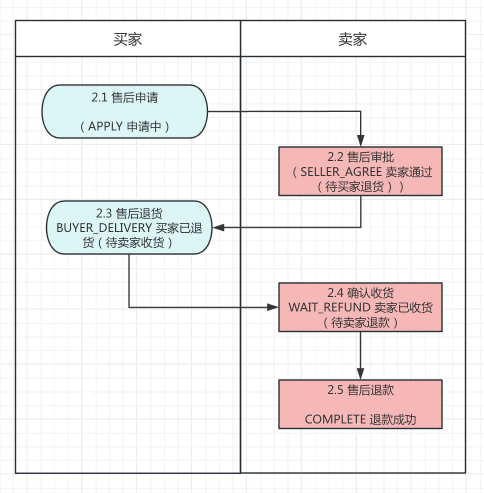

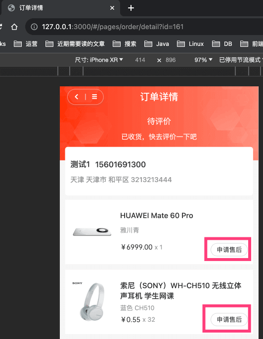

### [#](#_2-1-申请【买家】) 2.1 申请【买家】

① 点击「申请售后」按钮，进入售后页面，对应前端 `yudao-mall-uniapp` 项目的 `pages/order/aftersale/apply.vue` 页面，如下图所示：

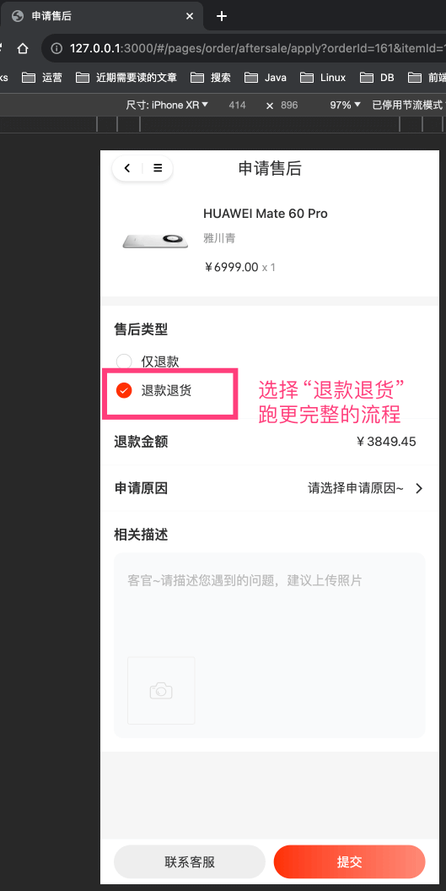

另外，可选的“申请原因”，可在 `trade_config` 表的 `after_sale_refund_reasons`、`after_sale_return_reasons` 字段配置。

② 点击「提交」按钮，调用后端对应 AppAfterSaleController 的 `#createAfterSale(...)` 提供的“申请售后”接口，插入 `trade_after_sale` 表一条记录，状态为 `APPLY` 申请中。

售后状态：APPLY 申请中

③ 发起成功后，进入售后列表页面，对应前端 `yudao-mall-uniapp` 项目的 `pages/order/aftersale/list.vue` 页面，如下图所示：

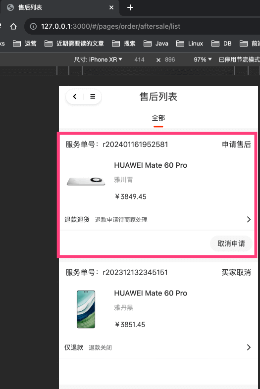

④ 点击第一条售后记录，进入售后详情页面，对应前端 `yudao-mall-uniapp` 项目的 `pages/order/aftersale/detail.vue` 页面，如下图所示：

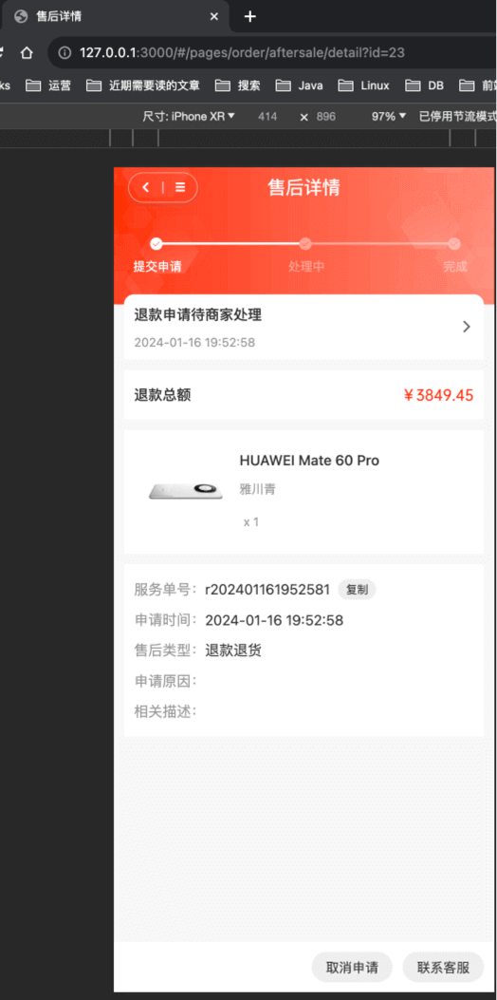

此时，买家只能等待卖家审核，或者取消售后。

### [#](#_2-2-审批【卖家】) 2.2 审批【卖家】

① 卖家可以在售后列表进行审批，对应 \[商城系统 -> 订单中心 -> 售后退款\] 菜单，对应 `yudao-ui-admin-vue3` 项目的 `@/views/trade/afterSale` 目录。如下图所示：

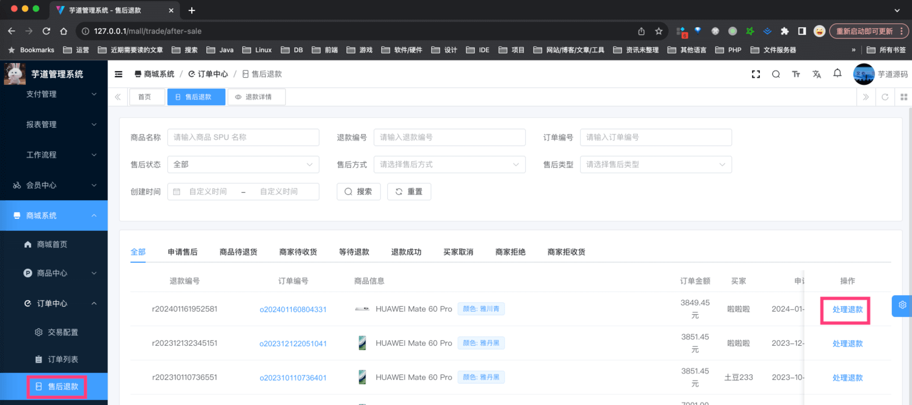

② 点击第一条售后记录的「处理退款」按钮，进入售后详情页面，对应 `yudao-ui-admin-vue3` 项目的 `@/views/trade/afterSale/detail` 目录，如下图所示：


③ 点击「同意售后」按钮，调用后端对应 AfterSaleController 的 `#agreeAfterSale(...)` 提供的“同意售后”接口，更新 `trade_after_sale` 表的状态为 `SELLER_AGREE` 卖家通过（待买家退货）。

售后状态：SELLER\_AGREE 卖家通过（待买家退货）

### [#](#_2-3-退货【买家】) 2.3 退货【买家】

① 点击「填写退货」按钮，进入退货页面，对应前端 `yudao-mall-uniapp` 项目的 `pages/order/aftersale/return-delivery.vue` 页面，如下图所示：

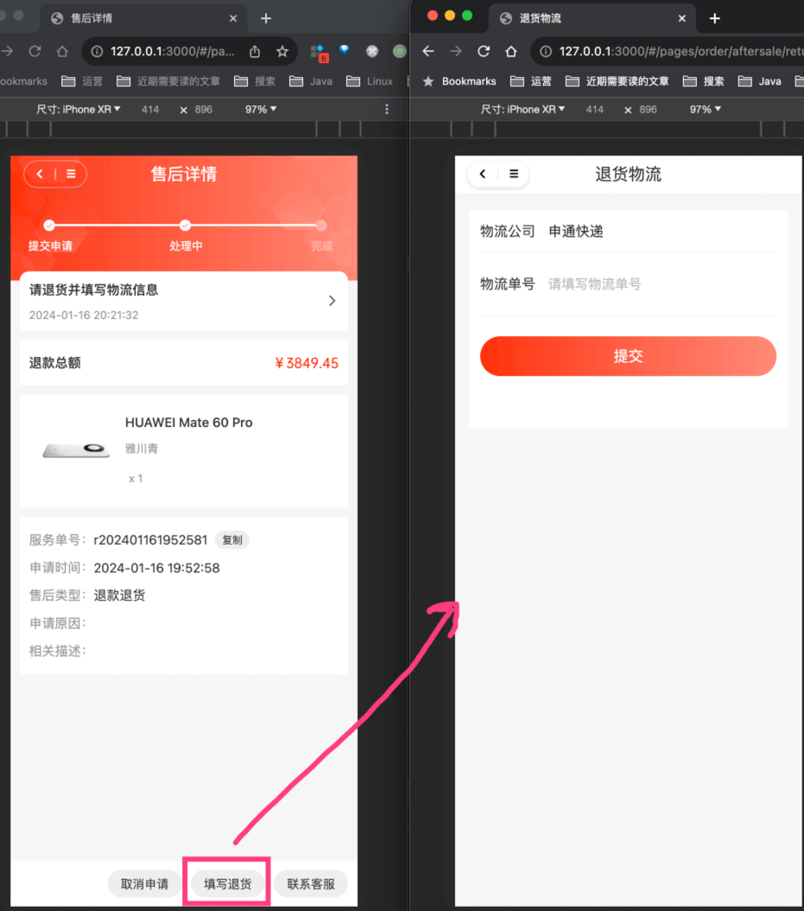

② 点击「提交」按钮，调用后端对应 AppAfterSaleController 的 `#deliveryAfterSale(...)` 提供的“退回货物”接口，更新 `trade_after_sale` 表的状态为 `BUYER_DELIVERY` 买家已退货（待卖家收货）。

售后状态：BUYER\_DELIVERY 买家已退货（待卖家收货）

### [#](#_2-4-收货【卖家】) 2.4 收货【卖家】

点击「确认收货」按钮，调用后端对应 AfterSaleController 的 `#receiveAfterSale(...)` 提供的“确认收货”接口，更新 `trade_after_sale` 表的状态为 `WAIT_REFUND` 卖家已收货（待卖家退款）。

售后状态：WAIT\_REFUND 卖家已收货（待卖家退款）

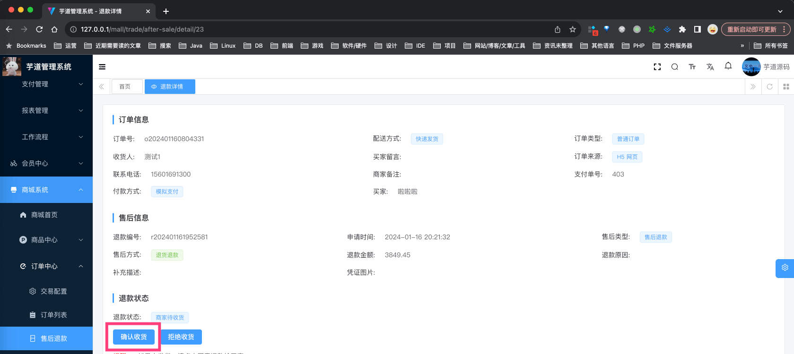

### [#](#_2-5-退款【卖家】) 2.5 退款【卖家】

① 点击「确认退款」按钮，调用后端对应 AfterSaleController 的 `#refundAfterSale(...)` 提供的“确认退款”接口，更新 `trade_after_sale` 表的状态为 `COMPLETE` 退款成功。

售后状态：COMPLETE 退款成功

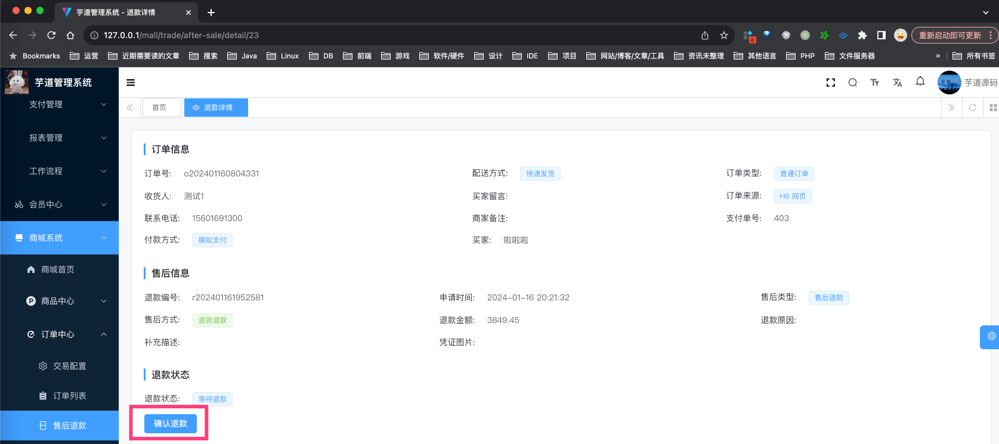

该接口的内部实现，主要是调用支付中心的退款接口，具体可以看看 [《21.支付宝、微信退款接入》](/pay/refund-demo/) 文档。

② 在真正退款到卖家的支付宝、微信账户后（退款是个异步过程），支付中心会回调 AfterSaleController 的 `#updateAfterRefund(...)` 提供的“更新售后订单为已退款”接口，目前仅仅打印日志，可以按需拓展。

至此，售后流程结束~可以试着多多 debug 调试整个流程，并不复杂噢。

## [#](#_3-售后配置) 3. 售后配置

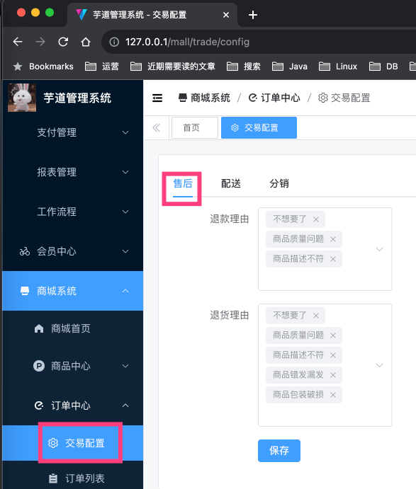

*   SQL 对应 `trade_config` 表的 `after_sale_` 开头的字段。
*   前端对应 `yudao-ui-admin-vue3` 项目的 `views/mall/trade/config/index.vue` 目录
*   后端对应 `yudao-module-trade-biz` 项目的 TradeConfigController 类