目录

# 【商品】商品 SPU 与 SKU

> 参考 [《产品 SKU 是什么意思？与之相关的还有哪些？》 (opens new window)](https://www.zhihu.com/question/19841574) 整理

## [#](#_1-表结构) 1. 表结构

商品 SPU 与 SKU，由 `yudao-module-product-biz` 后端模块的 `spu`、`sku` 包实现，分成商品 SPU 和商品 SKU 两个表。


### [#](#_1-1-商品-sku) 1.1 商品 SKU

**SKU：Stock Keeping Unit**

中文翻译为库存单位。SKU 从库存视角，以库存进出为单位，可以是件、瓶、箱等等。

例如，iPhone 手机，按照规格( 颜色 + 内存 )可以组合出如下多个 SKU ：

SKU

颜色

内存

A

白色

16G

B

白色

64G

C

黑色

16G

D

黑色

64G

可以看出，颜色（白色、黑色）与内存（16G、64G）组合排列出四种 iPhone SKU。

最终 SKU 表结构如下：

> 省略 creator/create\_time/updater/update\_time/deleted/tenant\_id 等通用字段

```sql
CREATE TABLE `product_sku` (
  `id` bigint NOT NULL AUTO_INCREMENT COMMENT '主键',
  
  `spu_id` bigint NOT NULL COMMENT 'spu编号',
  
  `properties` varchar(512) CHARACTER SET utf8mb4 COLLATE utf8mb4_unicode_ci DEFAULT NULL COMMENT '属性数组，JSON 格式 [{propertId: , valueId: }, {propertId: , valueId: }]',
  
  `price` int NOT NULL DEFAULT '-1' COMMENT '商品价格，单位：分',
  `market_price` int DEFAULT NULL COMMENT '市场价，单位：分',
  `cost_price` int NOT NULL DEFAULT '-1' COMMENT '成本价，单位： 分',
  `bar_code` varchar(64) CHARACTER SET utf8mb4 COLLATE utf8mb4_unicode_ci DEFAULT NULL COMMENT 'SKU 的条形码',
  `pic_url` varchar(256) CHARACTER SET utf8mb4 COLLATE utf8mb4_unicode_ci NOT NULL COMMENT '图片地址',
  `stock` int DEFAULT NULL COMMENT '库存',
  `weight` double DEFAULT NULL COMMENT '商品重量，单位：kg 千克',
  `volume` double DEFAULT NULL COMMENT '商品体积，单位：m^3 平米',
  
  `first_brokerage_price` int DEFAULT NULL COMMENT '一级分销的佣金，单位：分',
  `second_brokerage_price` int DEFAULT NULL COMMENT '二级分销的佣金，单位：分',
  
  `sales_count` int DEFAULT NULL COMMENT '商品销量',
  PRIMARY KEY (`id`) USING BTREE
) ENGINE=InnoDB AUTO_INCREMENT=30 DEFAULT CHARSET=utf8mb4 COLLATE=utf8mb4_unicode_ci COMMENT='商品sku';

```

① `spu_id` 字段：商品 SPU 的编号，关联 `product_spu` 表的 `id` 字段。

② `properties` 字段：商品属性，JSON 格式，例如：

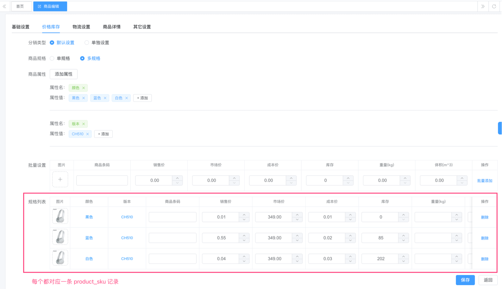

```json
[
  {
    "propertyId": 1,
    "propertyName": "颜色",
    "valueId": 5,
    "valueName": "黑色"
  },
  {
    "propertyId": 3,
    "propertyName": "版本",
    "valueId": 8,
    "valueName": "CH510"
  }
]

```

很明显，`property_id` 对应 `product_property` 表的 `id` 字段，`value_id` 对应 `product_property_value` 表的 `id` 字段。

那么为什么要冗余 `propertyName`、`valueName` 字段呢？主要是为了方便查询，不用再关联 `product_property`、`product_property_value` 表，嘿嘿~

③ `price`、`market_price`、`cost_price`、`bar_code`、`weight`、`volume`、`pic_url` 字段，都是商品 SKU 的基本信息。

④ `sales_count` 字段：商品销量，每次用户下单时，更新该字段。

⑤ `first_brokerage_price`、`second_brokerage_price` 字段：一级分销、二级分销的佣金，可能未来会挪到【营销】模块下，目前不用特别关注。

### [#](#_1-2-商品-spu) 1.2 商品 SPU

**SPU：Standard Product Unit**

中文翻译为标准产品单位。SPU 从产品视角，是产品信息聚合的最小单位，是一组可复用、易检索的标准化信息的集合，该集合描述了一个产品的特性。通俗点讲，属性值、特性相同的商品就可以被称为一个 SPU。

例如 iPhone 14 就是一个 SPU，iPhone 14 Plus 也是一个 SPU ，这个与商家无关，与颜色、款式、套餐等规格无关。

商家出售某个 SPU，那么这就是一个商品。商品在 SPU 之上，增加了销售价格、运费等等信息。**另外，一个商品可以包含多个 SKU**。

最终 SPU 表结构如下：

> 省略 creator/create\_time/updater/update\_time/deleted/tenant\_id 等通用字段

```sql
CREATE TABLE `product_spu` (
  `id` bigint NOT NULL AUTO_INCREMENT COMMENT '商品 SPU 编号，自增',
  `name` varchar(128) CHARACTER SET utf8mb4 COLLATE utf8mb4_unicode_ci NOT NULL COMMENT '商品名称',
  `keyword` varchar(256) CHARACTER SET utf8mb4 COLLATE utf8mb4_unicode_ci DEFAULT NULL COMMENT '关键字',
  `introduction` varchar(256) CHARACTER SET utf8mb4 COLLATE utf8mb4_unicode_ci DEFAULT NULL COMMENT '商品简介',
  `description` text CHARACTER SET utf8mb4 COLLATE utf8mb4_unicode_ci COMMENT '商品详情',
  `category_id` bigint NOT NULL COMMENT '商品分类编号',
  `brand_id` int DEFAULT NULL COMMENT '商品品牌编号',
  `pic_url` varchar(256) CHARACTER SET utf8mb4 COLLATE utf8mb4_unicode_ci NOT NULL COMMENT '商品封面图',
  `slider_pic_urls` varchar(2000) CHARACTER SET utf8mb4 COLLATE utf8mb4_unicode_ci DEFAULT '' COMMENT '商品轮播图地址\n 数组，以逗号分隔\n 最多上传15张',
  
  `status` tinyint NOT NULL COMMENT '商品状态: 0 上架（开启） 1 下架（禁用）-1 回收',
  
  `spec_type` bit(1) DEFAULT NULL COMMENT '规格类型：0 单规格 1 多规格',
  `price` int NOT NULL DEFAULT '-1' COMMENT '商品价格，单位使用：分',
  `market_price` int DEFAULT NULL COMMENT '市场价，单位使用：分',
  `cost_price` int NOT NULL DEFAULT '-1' COMMENT '成本价，单位： 分',
  `stock` int NOT NULL DEFAULT '0' COMMENT '库存',
  
  `delivery_types` varchar(32) CHARACTER SET utf8mb4 COLLATE utf8mb4_unicode_ci NOT NULL DEFAULT '' COMMENT '配送方式数组',
  `delivery_template_id` bigint DEFAULT NULL COMMENT '物流配置模板编号',
  
  `give_integral` int NOT NULL DEFAULT '0' COMMENT '赠送积分',
  `sales_count` int DEFAULT '0' COMMENT '商品销量',
  `virtual_sales_count` int DEFAULT '0' COMMENT '虚拟销量',
  `browse_count` int DEFAULT '0' COMMENT '商品点击量',
  `sort` int NOT NULL DEFAULT '0' COMMENT '排序字段',

  `sub_commission_type` bit(1) DEFAULT NULL COMMENT '分销类型',
  PRIMARY KEY (`id`) USING BTREE
) ENGINE=InnoDB AUTO_INCREMENT=640 DEFAULT CHARSET=utf8mb4 COLLATE=utf8mb4_unicode_ci COMMENT='商品spu';

```

① 【基础设置】`name`、`keyword`、`introduction`、`description`、`category_id`、`brand_id`、`pic_url`、`slider_pic_urls` 字段：商品 SPU 的基本信息。

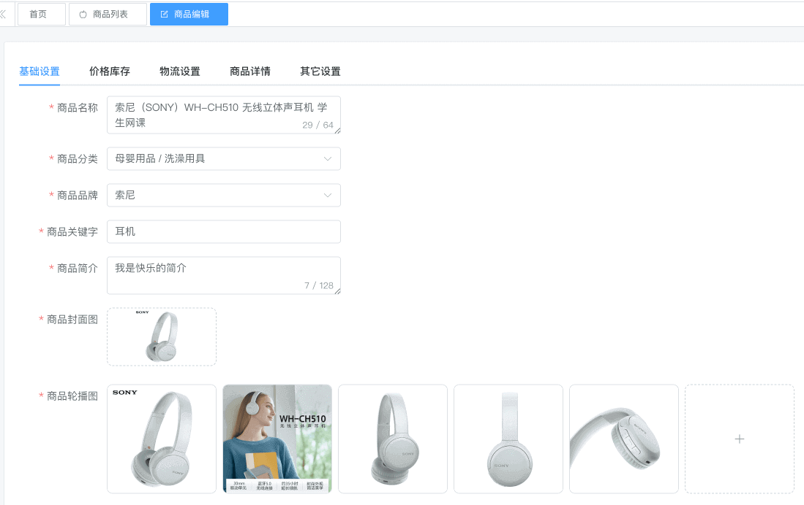

② `status` 字段：商品状态，1 上架（开启）、0 下架（禁用）、-1 回收，用户在 uni-app 看到的商品，只有 `status` 为 1 的商品。

③ 【库存价格】`spec_type` 字段：规格类型，`false` 单规格、`true` 多规格。要注意，即使是单规格，也会创建一个 SKU，这个 SKU 的 `properties` 字段为“默认”数组 `[{"propertyId":0,"propertyName":"默认","valueId":0,"valueName":"默认"}]`。

`price`、`market_price`、`cost_price` 字段：取对应 SKU 的最小值。`stock` 字段：取对应 SKU 库存的累加值。


④ 【物流设置】`delivery_types` 字段：配送方式数组，目前有 1 快递发货、2 门店自提。

`delivery_template_id` 字段：物流配置模板编号，仅当 `delivery_types` 为 1 时，才会有值。

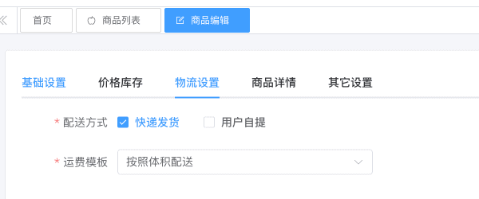

⑤ 【其它设置】`give_integral` 字段：赠送积分，用户购买该商品，赠送的积分。

`sales_count` 字段：商品销量，每次用户下单时，更新该字段。`virtual_sales_count` 字段：虚拟销量，最终展示给用户的销量是 `sales_count` + `virtual_sales_count` 。

`browse_count` 字段：商品点击量，每次用户点击商品时，更新该字段。另外，也会往 `product_browse_history` 插入一条浏览记录。

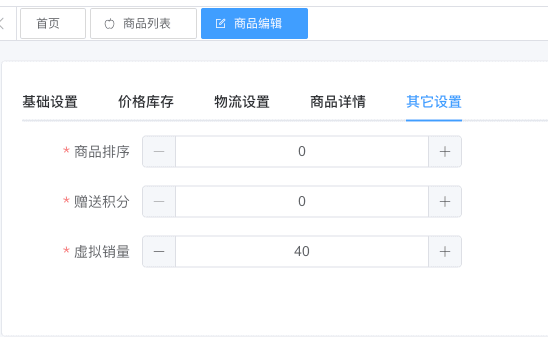

## [#](#_2-管理后台) 2. 管理后台
### [#](#_2-1-商品列表) 2.1 商品列表

对应 \[商城系统 -> 商品中心 -> 商品列表\] 菜单，对应 `yudao-ui-admin-vue3` 项目的 `@/views/mall/product/spu` 目录。

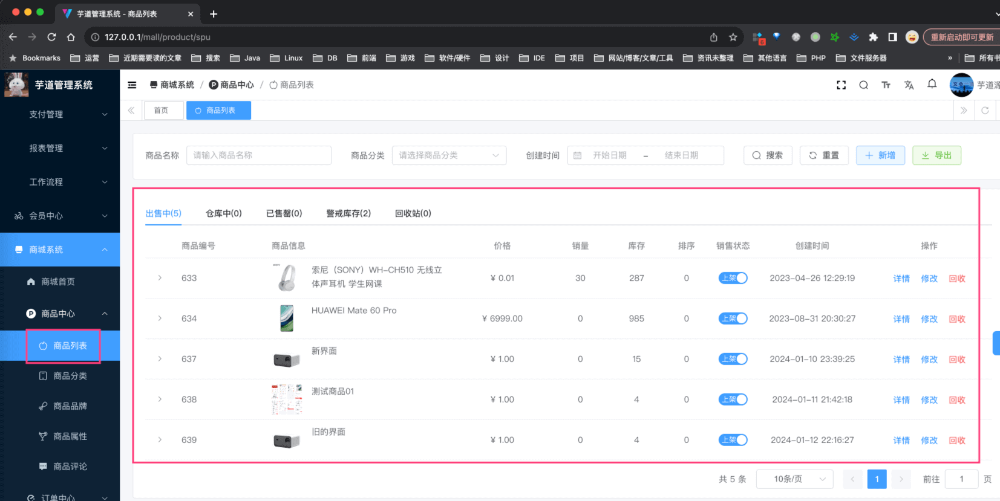

### [#](#_2-2-商品发布) 2.2 商品发布

商品的新增、修改、详情界面，都对应 `yudao-ui-admin-vue3` 项目的 `@/views/mall/product/spu/form` 目录。

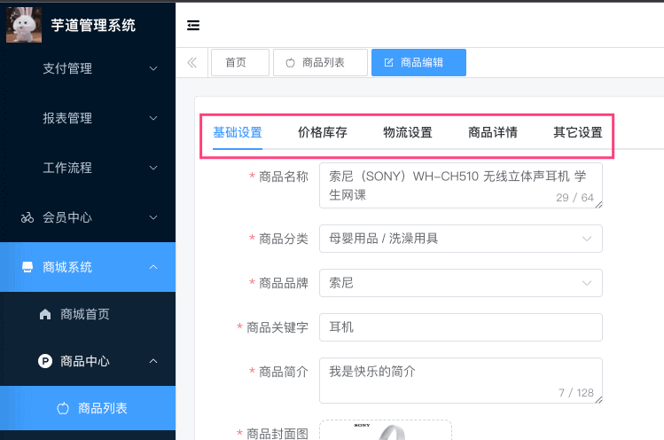

考虑到前端代码的维护性，每个 Tab 对应一个组件，这样修改某个 Tab 的代码，不会影响到其它 Tab 的代码。如下图所示：

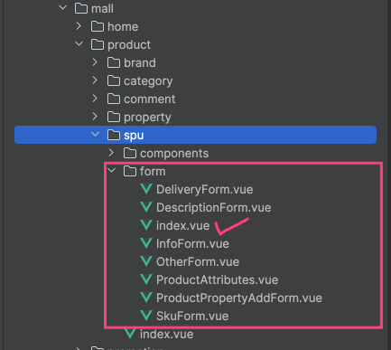

*   基础设置：`views/mall/product/spu/form/InfoForm.vue`
*   库存价格：`views/mall/product/spu/form/SkuForm.vue`
*   物流设置：`views/mall/product/spu/form/DeliveryForm.vue`
*   商品描述：`views/mall/product/spu/form/DescriptionForm.vue`
*   其它设置：`views/mall/product/spu/form/OtherForm.vue`

## [#](#_3-移动端) 3. 移动端

商品在 uni-app 的代码，主要在 `yudao-ui-uniapp` 项目的 `@/pages/goods` 目录。如下图所示：

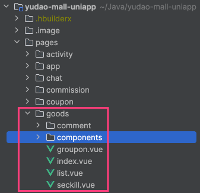

### [#](#_3-1-商品列表) 3.1 商品列表

商品列表，对应 `@/pages/goods/list.vue` 文件。界面效果如下图所示：

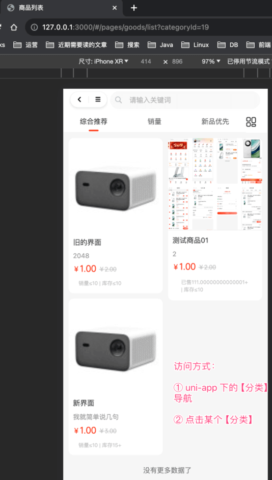

### [#](#_3-2-商品详情) 3.2 商品详情

商品详情，对应 `@/pages/goods/index.vue` 文件。界面效果如下图所示：

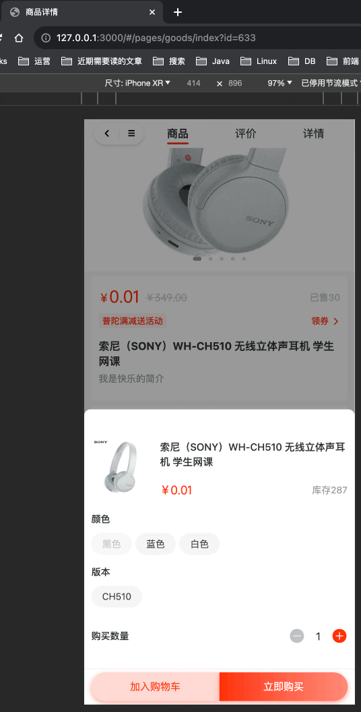

考虑到商品详情界面的复杂性，所以将其拆分成多个组件，如下图所示：

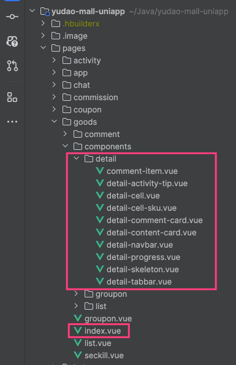

另外，如果你想看商品 SKU 选择的代码，可以看 `/sheep/components/s-select-sku/s-select-sku.vue` 文件。

注意，拼团、秒杀商品的界面展示不同，所以单独分别对应了 `@/pages/goods/groupon.vue`、`@/pages/goods/seckill.vue` 文件。

## [#](#_4-社区贡献的商品相关) 4. 社区贡献的商品相关

*   新增基于 SPU id 复制商品的功能：[#517 (opens new window)](https://github.com/YunaiV/ruoyi-vue-pro/pull/517)、[#49 (opens new window)](https://github.com/yudaocode/yudao-ui-admin-vue3/pull/49)