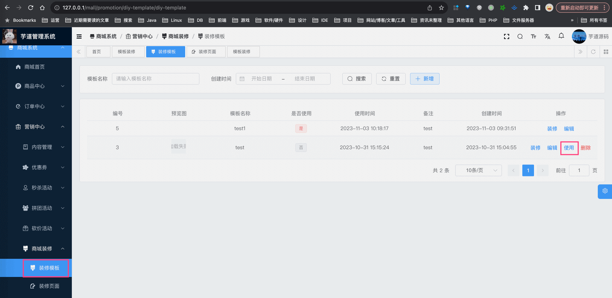
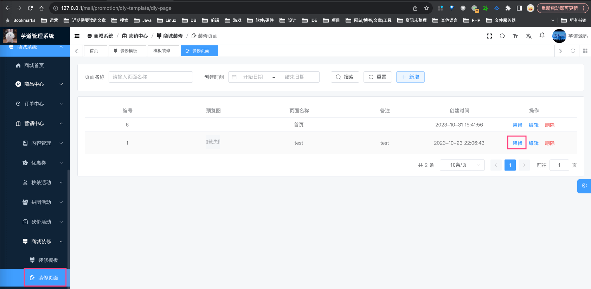
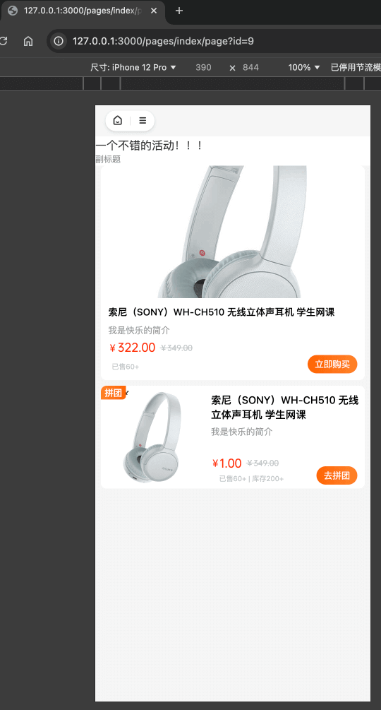
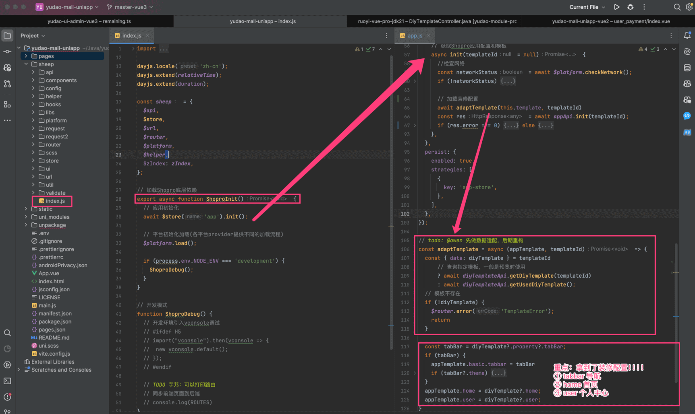
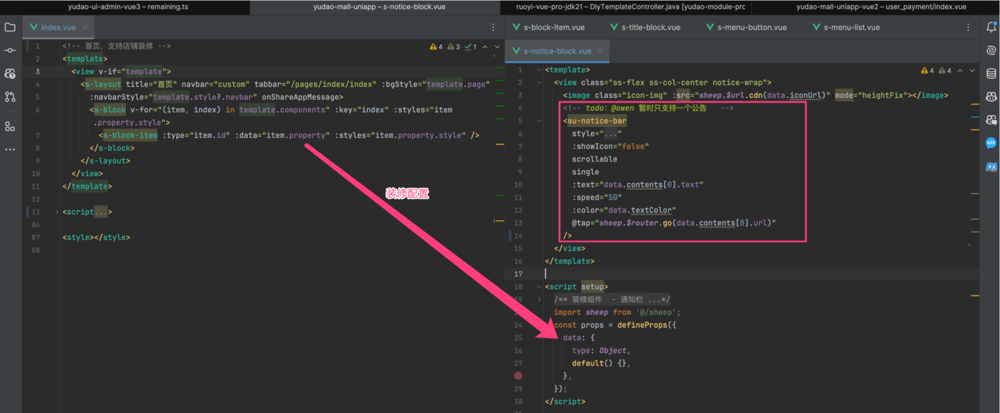
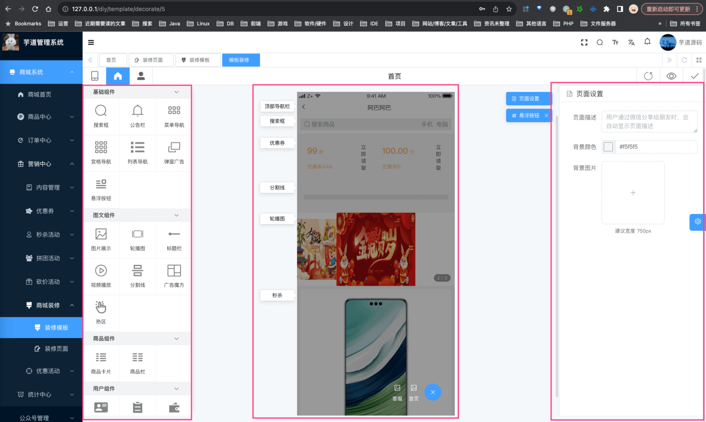
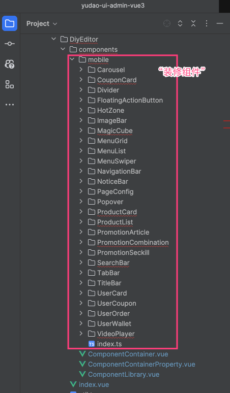

目录

# 商城装修

## [#](#_1-功能介绍) 1. 功能介绍

项目支持商城装修，通过简单的拖拉拽，即可进行 uni-app 页面的制作，最终可以在 H5、小程序进行展示。

对应管理后台的 \[商城系统 -> 营销中心 -> 商城装修\] 菜单。目前它有两个子菜单：装修模版、装修页面。

### [#](#_1-1-装修模版) 1.1 装修模版

装修模版，实现对 uni-app 的首页、个人中心进行配置。

① 可以新建多个装修模版，点击「使用」后，设置为当前 uni-app 默认使用。如下图所示：



② 点击「装修」后，可以进行首页、个人中心设计。如下图所示：


### [#](#_1-2-装修页面) 1.2 装修页面

装修模版，可以简单理解它由两个装修页面组成：首页、个人中心。所以装修页面的「装修」功能，和装修模版是一致的。如下图所示：



② 那么装修页面为什么要独立一个菜单呢？在某些场景下，需要制作一个广告业、活动页等等，可以通过它来实现。

例如说，我们先「新建」一个装修页面，然后进行「装修」后，然后使用 uni-app 进行直接访问。访问的地址示例，`/pages/index/page?id=${pageId}` 。如下图所示：



## [#](#_2-实现原理) 2. 实现原理

店铺装修的实现原理并不复杂，我们将分成三部分来讲解：uni-app、管理后台、后端存储。

### [#](#_2-1-uni-app) 2.1 uni-app

本质上来说，uni-app 就是读取到装修配置，`for` 循环创建对应的组件，使用该组件对应的配置，进行渲染即可。

① uni-app 前台打开时，在 `sheep/index.js` 的 `ShoproInit` 方法中，会调用后端接口，获取到默认的装修模版。这样，它就获取到了装修配置。如下图所示：



② 有了装修配置后，首页（`pages/index/index.vue`）、个人中心（`pages/index/user.vue`）就可以进行渲染展示。以首页举例子，它会包含多个“装修组件”，每个“装修组件”由 `s-block-item` 进行渲染。如下图所示：


例如说，`s-title-block.vue` 它用于“标题栏”的展示。拿到它对应的 `data` 装修配置，就可以进行展示了。如下图所示：



### [#](#_2-2-管理后台) 2.2 管理后台

① 管理后台的 `components/DiyEditor` 组件，实现了商城装修功能，它被装修模版的「装修」（`views/mall/promotion/diy/template/decorate.vue`）和装修页面的「装修」（`views/mall/promotion/diy/page/decorate.vue`）所使用。如下图所示：



它可以分成如下三个部分所组成：

*   【左边】组件区域：可选中的“装修组件”列表，由 `components/DiyEditor/components/ComponentLibrary.vue` 实现
*   【中间】设计区域：由选中的多个 `components/DiyEditor/components/ComponentContainer.vue` “装修组件”所组成
*   【右边】属性面板：设置当前选中的“装修组件”属性，由 `components/DiyEditor/components/ComponentContainerProperty.vue` 实现

② 在 `components/DiyEditor/components/mobile` 目录下，可以看到每个“装修组件”的实现。如下图所示：



③ 点击右上角的「保存」按钮，每个“装修组件”的属性会存储成对应的 JSON 格式，那么一个页面其实就是多个 JSON 组成的数组。具体的存储格式，我们放在「2.3 后端存储」小节来看。

### [#](#_2-3-后端存储) 2.3 后端存储

后端由 `yudao-module-promotion-biz` 模块的 `diy` 包下来实现。它有两个表：

① `promotion_diy_template` 装修模版表，关键字段如下所示：

```sql
CREATE TABLE `promotion_diy_template` (
  `id` bigint NOT NULL AUTO_INCREMENT COMMENT '装修模板编号',
  `name` varchar(100) CHARACTER SET utf8mb4 COLLATE utf8mb4_general_ci NOT NULL COMMENT '模板名称',
  `used` bit(1) NOT NULL DEFAULT b'0' COMMENT '是否使用',
  `property` text CHARACTER SET utf8mb4 COLLATE utf8mb4_general_ci COMMENT '模板属性，JSON 格式',
  PRIMARY KEY (`id`) USING BTREE
) ENGINE=InnoDB AUTO_INCREMENT=6 DEFAULT CHARSET=utf8mb4 COLLATE=utf8mb4_general_ci ROW_FORMAT=DYNAMIC COMMENT='装修模板';

```

其中 `property` 是最关键字段，存储了整个 uni-app 全局的界面配置，如下所示：

```json
{
    "page": {
        "description": "", 
        "backgroundColor": "#f5f5f5", 
        "backgroundImage": ""
    }, 
    "navigationBar": {
        "title": "页面标题", 
        "description": "", 
        "navBarHeight": 35, 
        "backgroundColor": "#f5f5f5", 
        "backgroundImage": "", 
        "styleType": "default", 
        "alwaysShow": true, 
        "showGoBack": true
    }, 
    "tabBar": {
        "theme": "orange", 
        "style": {
            "backgroundType": "img", 
            "background": "", 
            "color": "#282828", 
            "activeColor": "#f37b1d"
        }, 
        "items": [
            {
                "name": "首页1", 
                "link": "/", 
                "iconUrl": "http://mall.yudao.iocoder.cn/static/images/1-001.png", 
                "activeIconUrl": "http://mall.yudao.iocoder.cn/static/images/1-002.png"
            }, 
            {
                "name": "分类", 
                "link": "/pages/goods_cate/goods_cate", 
                "iconUrl": "http://mall.yudao.iocoder.cn/static/images/2-001.png", 
                "activeIconUrl": "http://mall.yudao.iocoder.cn/static/images/2-002.png"
            }, 
            {
                "name": "购物车", 
                "link": "/pages/order_addcart/order_addcart", 
                "iconUrl": "http://mall.yudao.iocoder.cn/static/images/3-001.png", 
                "activeIconUrl": "http://mall.yudao.iocoder.cn/static/images/3-002.png"
            }, 
            {
                "name": "我的", 
                "link": "/pages/user/index", 
                "iconUrl": "http://mall.yudao.iocoder.cn/static/images/4-001.png", 
                "activeIconUrl": "http://mall.yudao.iocoder.cn/static/images/4-002.png"
            }
        ]
    }, 
    "components": [ ]
}

```

*   `page` 属性：对应「附录」小节的“页面设置”组件，定义了整个 uni-app 页面的背景色、背景图等等
*   `navigationBar` 属性：对应「附录」小节的“顶部导航栏”组件，定义了 uni-app 顶部导航的背景色、高度等等
*   `tabBar` 属性：对应「附录」小节的“底部导航栏”组件，定义了 uni-app 底部导航（菜单）的名字、链接、icon 等等

注意，后端仅仅进行存储，具体每个组件有哪些属性，本质上是前端自己所决定。

那么，uni-app 首页、个人中心的装修页面，存储在哪里呢？答案在 `promotion_diy_page` 表。

② `promotion_diy_page` 装修页面表，关键字段如下所示：

```sql
CREATE TABLE `promotion_diy_page` (
  `id` bigint NOT NULL AUTO_INCREMENT COMMENT '装修页面编号',
  `template_id` bigint DEFAULT NULL COMMENT '装修模板编号',
  `name` varchar(100) CHARACTER SET utf8mb4 COLLATE utf8mb4_general_ci NOT NULL COMMENT '页面名称',
  `property` text CHARACTER SET utf8mb4 COLLATE utf8mb4_general_ci COMMENT '页面属性，JSON 格式',
  PRIMARY KEY (`id`) USING BTREE
) ENGINE=InnoDB AUTO_INCREMENT=10 DEFAULT CHARSET=utf8mb4 COLLATE=utf8mb4_general_ci ROW_FORMAT=DYNAMIC COMMENT='装修页面';

```

*   `template_id` 字段，关联对应的装修模版。当然，如果直接创建的装修页面，不会进行关联，该字段的值为空

其中 `property` 也是最关键字段，存储了单个 uni-app 页面的界面配置，如下所示：

```json
{
    "page": {
        "description": "", 
        "backgroundColor": "#f5f5f5", 
        "backgroundImage": ""
    }, 
    "navigationBar": {
        "title": "双 11 购物节", 
        "description": "", 
        "navBarHeight": 35, 
        "backgroundColor": "#fff", 
        "backgroundImage": "", 
        "styleType": "default", 
        "alwaysShow": true, 
        "showGoBack": true
    }, 
    "components": [
        {
            "id": "TitleBar", 
            "property": {
                "title": "一个不错的活动！！！", 
                "description": "副标题", 
                "titleSize": 16, 
                "descriptionSize": 12, 
                "titleWeight": 400, 
                "textAlign": "left", 
                "descriptionWeight": 200, 
                "titleColor": "rgba(50, 50, 51, 10)", 
                "descriptionColor": "rgba(150, 151, 153, 10)", 
                "more": {
                    "show": false, 
                    "type": "icon", 
                    "text": "查看更多", 
                    "url": ""
                }, 
                "style": {
                    "bgType": "color", 
                    "bgColor": "#fff"
                }
            }
        },
        {
            "id": "CouponCard", 
            "property": {
                "columns": 1, 
                "bgImg": "", 
                "textColor": "#E9B461", 
                "button": {
                    "color": "#434343", 
                    "bgColor": ""
                }, 
                "space": 0, 
                "couponIds": [
                    2
                ], 
                "style": {
                    "bgType": "color", 
                    "bgColor": "", 
                    "marginBottom": 8
                }
            }
        }
    ]
}

```

*   `page` 和 `navigationBar` 属性，和 `promotion_diy_template` 表的类似。但是，没有 `tabBar` 属性，因为该属性属于全局配置
*   `components` 属性，存储每个“装修组件”的 JSON 配置，注意它是一个数组。对应到「附录」小节的话，就是『基础组件』、『图文组件』、『商品组件』、『用户组件』、『营销组件』

## [#](#附录-组件对应关系) 附录：组件对应关系

管理后台与 uni-app 组件的对应关系，方便你学习研究~~

### [#](#布局组件) 布局组件

uni-app 地址

管理后台地址

页面设置

pages/index/index.vue 或 /pages/index/user.vue

DiyEditor/components/mobile/PageConfig

顶部导航栏

components/s-custom-navbar/s-custom-navbar.vue

DiyEditor/components/mobile/NavigationBar

底部导航栏

ui/su-tabbar/su-tabbar.vue

DiyEditor/components/mobile/TabBar

“顶部导航栏”会有遮挡问题？

如果你选择他的样式是「沉浸式」，就会出现这个情况，这个是符合预期的。想要解决，就换成「标准」。具体如下几个帖子，也有提到：

*   [https://t.zsxq.com/o7s2Y (opens new window)](https://t.zsxq.com/o7s2Y)
*   [https://t.zsxq.com/DhPZF (opens new window)](https://t.zsxq.com/DhPZF)

另外，顶部导航是常态存在的，不会随着滚动下面进行隐藏。如果需要隐藏，需要自己二次开发。

### [#](#基础组件) 基础组件

uni-app 地址

管理后台地址

搜索框

components/s-search-block/s-search-block.vue

DiyEditor/components/mobile/SearchBar

公告栏

components/s-notice-block/s-notice-block.vue

DiyEditor/components/mobile/NoticeBar

菜单导航

components/s-menu-button/s-menu-button.vue

DiyEditor/components/mobile/MenuSwiper

宫格导航

components/s-menu-grid/s-menu-grid.vue

DiyEditor/components/mobile/MenuGrid

列表导航

components/s-menu-list/s-menu-list.vue

DiyEditor/components/mobile/MenuList

弹窗广告

components/s-popup-image/s-popup-image.vue

DiyEditor/components/mobile/Popover

悬浮按钮

components/s-float-menu/s-float-menu.vue

DiyEditor/components/mobile/FloatingActionButton

### [#](#图文组件) 图文组件

uni-app 地址

管理后台地址

图片展示

components/s-image-block/s-image-block.vue

DiyEditor/components/mobile/ImageBar

轮播图

components/s-image-banner/s-image-banner.vue

DiyEditor/components/mobile/Carousel

标题栏

components/s-title-block/s-title-block.vue

DiyEditor/components/mobile/TitleBar

视频播放

components/s-video-block/s-video-block.vue

DiyEditor/components/mobile/VideoPlayer

分割线

components/s-line-block/s-line-block.vue

DiyEditor/components/mobile/Divider

广告魔方

components/s-image-cube/s-image-cube.vue

DiyEditor/components/mobile/MagicCube

热区

components/s-hotzone-block/s-hotzone-block.vue

DiyEditor/components/mobile/HotZone

### [#](#商品组件) 商品组件

uni-app 地址

管理后台地址

商品卡片

components/s-goods-card/s-goods-card.vue

DiyEditor/components/mobile/ProductCard

商品栏

components/s-goods-shelves/s-goods-shelves.vue

DiyEditor/components/mobile/ProductList

### [#](#用户组件) 用户组件

uni-app 地址

管理后台地址

用户卡片

components/s-user-card/s-user-card.vue

DiyEditor/components/mobile/UserCard

用户订单

components/s-order-card/s-order-card.vue

DiyEditor/components/mobile/UserOrder

用户资产

components/s-wallet-card/s-wallet-card.vue

DiyEditor/components/mobile/UserWallet

用户卡券

components/s-coupon-card/s-coupon-card.vue

DiyEditor/components/mobile/UserCoupon

### [#](#营销组件) 营销组件

uni-app 地址

管理后台地址

拼团

components/s-groupon-block/s-groupon-block.vue

DiyEditor/components/mobile/PromotionCombination

秒杀

components/s-seckill-block/s-seckill-block.vue

DiyEditor/components/mobile/PromotionSeckill

优惠劵

components/s-coupon-block/s-coupon-block.vue

DiyEditor/components/mobile/CouponCard

营销文章

components/s-richtext-block/s-richtext-block.vue

DiyEditor/components/mobile/PromotionArticle