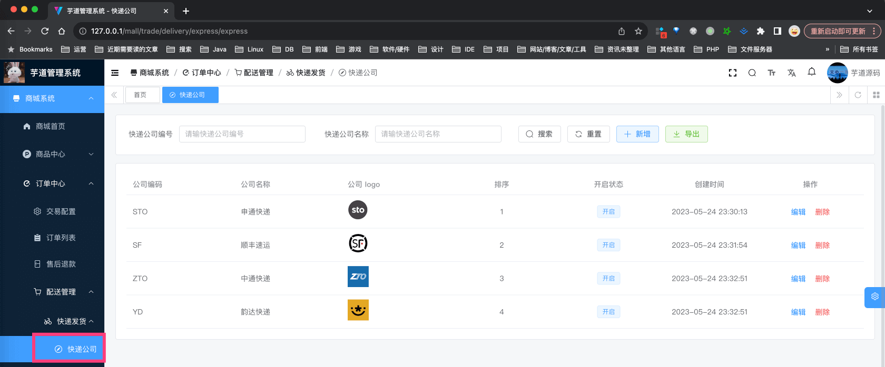
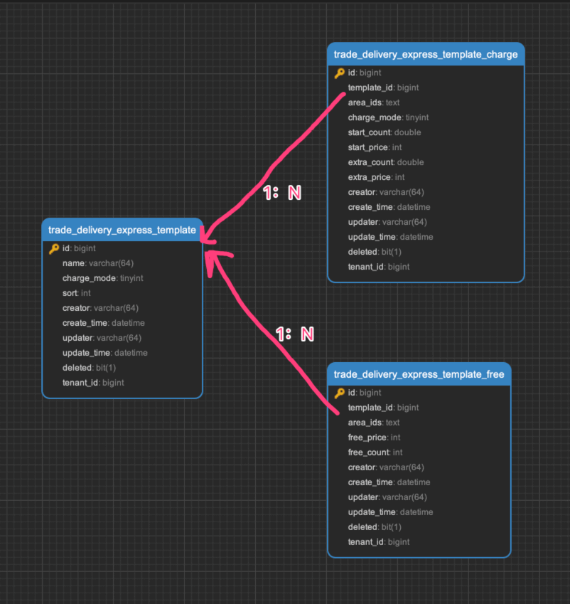
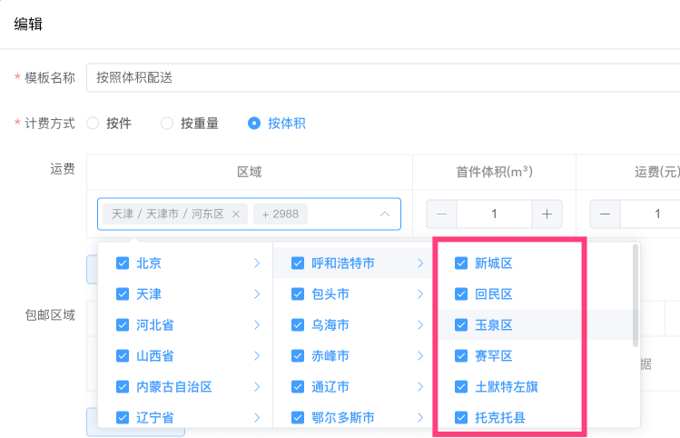
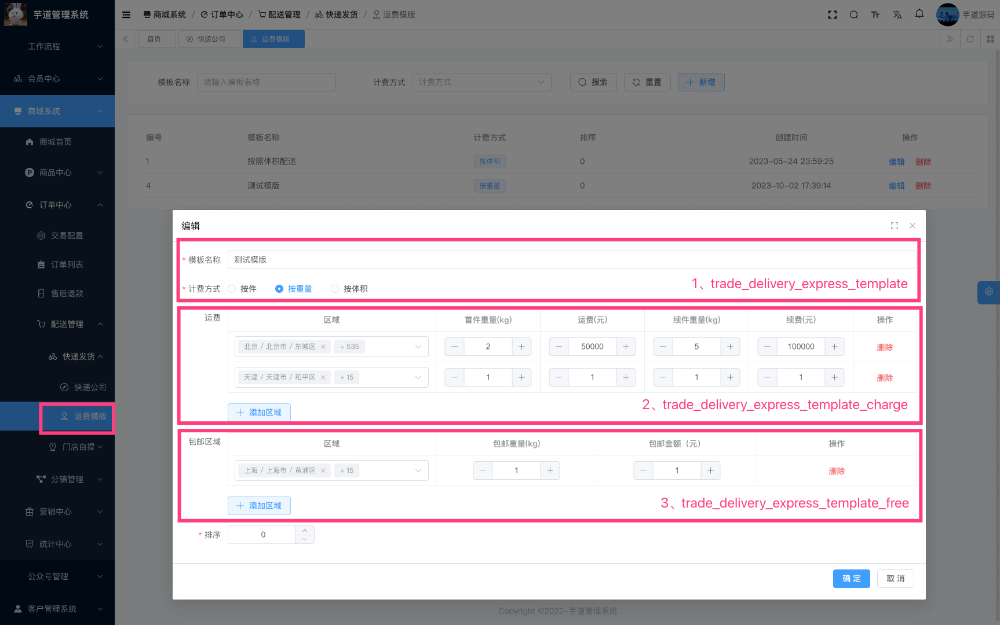
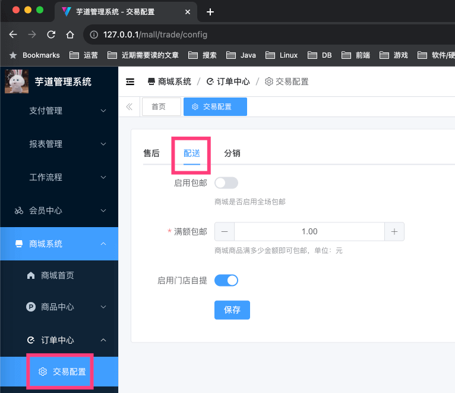

目录

# 【交易】快递发货

## [#](#_1-快递公司) 1. 快递公司
### [#](#_1-1-表结构) 1.1 表结构

快递公司，由 `yudao-module-trade-biz` 后端模块的 `delivery` 包的 DeliveryExpressService 实现，只有一个表：

> 省略 creator/create\_time/updater/update\_time/deleted/tenant\_id 等通用字段

```sql
CREATE TABLE `trade_delivery_express` (
  `id` bigint NOT NULL AUTO_INCREMENT COMMENT '编号',
  `code` varchar(64) CHARACTER SET utf8mb4 COLLATE utf8mb4_unicode_ci NOT NULL COMMENT '快递公司编码',
  `name` varchar(64) CHARACTER SET utf8mb4 COLLATE utf8mb4_unicode_ci NOT NULL COMMENT '快递公司名称',
  `logo` varchar(256) CHARACTER SET utf8mb4 COLLATE utf8mb4_unicode_ci DEFAULT NULL COMMENT '快递公司 logo',
  `sort` int NOT NULL DEFAULT '0' COMMENT '排序',
  `status` tinyint NOT NULL DEFAULT '0' COMMENT '状态',
  PRIMARY KEY (`id`) USING BTREE
) ENGINE=InnoDB AUTO_INCREMENT=5 DEFAULT CHARSET=utf8mb4 COLLATE=utf8mb4_unicode_ci COMMENT='快递公司';

```

比较简单，就是存储下快递公司的基本信息。

### [#](#_1-2-管理后台) 1.2 管理后台

对应 \[商城系统 -> 订单中心 -> 配送管理 -> 快递发货 -> 快递公司\] 菜单，对应 `yudao-ui-admin-vue3` 项目的 `views/mall/trade/delivery/express` 目录。如下图所示：



### [#](#_1-3-物流信息) 1.3 物流信息

由 `yudao-module-trade-biz` 后端模块的 ExpressClient 实现，已对接快递鸟、快递 100 等快递查询接口。

## [#](#_2-快递运费模板) 2. 快递运费模板
### [#](#_2-1-表结构) 2.1 表结构

运费模版，由 `yudao-module-trade-biz` 后端模块的 `delivery` 包的 DeliveryExpressTemplateService 实现，包括一个主表 + 两个子表：



#### [#](#_2-1-1-运费模版表) 2.1.1 运费模版表

> 省略 creator/create\_time/updater/update\_time/deleted/tenant\_id 等通用字段

```sql
CREATE TABLE `trade_delivery_express_template` (
  `id` bigint NOT NULL AUTO_INCREMENT COMMENT '编号',
  `name` varchar(64) CHARACTER SET utf8mb4 COLLATE utf8mb4_unicode_ci NOT NULL COMMENT '模板名称',
  `charge_mode` tinyint NOT NULL COMMENT '配送计费方式',
  `sort` int NOT NULL DEFAULT '0' COMMENT '排序',
  PRIMARY KEY (`id`) USING BTREE
) ENGINE=InnoDB AUTO_INCREMENT=5 DEFAULT CHARSET=utf8mb4 COLLATE=utf8mb4_unicode_ci COMMENT='快递运费模板';

```

比较简单，关键信息都在两个子表中。

唯一需要注意的是，`charge_mode` 字段，表示配送计费方式，由 DeliveryExpressChargeModeEnum 枚举，有三种：按件、按重量、按体积。

#### [#](#_2-1-2-运费模板【计费】配置表) 2.1.2 运费模板【计费】配置表

> 省略 creator/create\_time/updater/update\_time/deleted/tenant\_id 等通用字段

```sql
CREATE TABLE `trade_delivery_express_template_charge` (
  `id` bigint NOT NULL AUTO_INCREMENT COMMENT '编号，自增',
  
  `template_id` bigint NOT NULL COMMENT '快递运费模板编号',
  `charge_mode` tinyint NOT NULL COMMENT '配送计费方式',
  
  `area_ids` text CHARACTER SET utf8mb4 COLLATE utf8mb4_unicode_ci NOT NULL COMMENT '配送区域 id',
  
  `start_count` double NOT NULL COMMENT '首件数量',
  `start_price` int NOT NULL COMMENT '起步价，单位：分',
  `extra_count` double NOT NULL COMMENT '续件数量',
  `extra_price` int NOT NULL COMMENT '额外价，单位：分',
  PRIMARY KEY (`id`) USING BTREE
) ENGINE=InnoDB AUTO_INCREMENT=15 DEFAULT CHARSET=utf8mb4 COLLATE=utf8mb4_unicode_ci COMMENT='快递运费模板计费配置';

```

① `template_id` 字段：关联 `trade_delivery_express_template` 表的 `id` 字段，表示该计费配置属于哪个运费模版。而 `charge_mode` 字段，只是进行冗余存储，减少查询次数。

② `area_ids` 字段：配送区域 id 数组，存储的区级别。如下图所示：



③ `start_count`、`start_price`、`extra_count`、`extra_price` 字段：配送计费的具体配置。

#### [#](#_2-1-3-运费模板【包邮】配置) 2.1.3 运费模板【包邮】配置

> 省略 creator/create\_time/updater/update\_time/deleted/tenant\_id 等通用字段

```sql
CREATE TABLE `trade_delivery_express_template_free` (
  `id` bigint NOT NULL AUTO_INCREMENT COMMENT '编号',
  
  `template_id` bigint NOT NULL COMMENT '快递运费模板编号',
  
  `area_ids` text CHARACTER SET utf8mb4 COLLATE utf8mb4_unicode_ci NOT NULL COMMENT '包邮区域 id',
  
  `free_price` int NOT NULL COMMENT '包邮金额，单位：分',
  `free_count` int NOT NULL DEFAULT '0' COMMENT '包邮件数,',
  PRIMARY KEY (`id`) USING BTREE
) ENGINE=InnoDB AUTO_INCREMENT=21 DEFAULT CHARSET=utf8mb4 COLLATE=utf8mb4_unicode_ci COMMENT='快递运费模板包邮配置';

```

整体类似 `trade_delivery_express_template_charge` 表，就不重复赘述。

### [#](#_2-2-管理后台) 2.2 管理后台

对应 \[商城系统 -> 交易系统 -> 快递发货 -> 快递发货 -> 运费模版\] 菜单，对应 `yudao-ui-admin-vue3` 项目的 `views/mall/trade/delivery/expressTemplate` 目录。如下图所示：



### [#](#_2-3-运费计算) 2.3 运费计算

由 `yudao-module-trade-biz` 后端模块的 TradeDeliveryPriceCalculator 实现订单的运费计算。

## [#](#_3-配送配置) 3. 配送配置



*   SQL 对应 `trade_config` 表的 `delivery_` 开头的字段。
*   前端对应 `yudao-ui-admin-vue3` 项目的 `views/mall/trade/config/index.vue` 目录
*   后端对应 `yudao-module-trade-biz` 项目的 TradeConfigController 类