目录

# 【营销】拼团活动

拼团，主要由 `yudao-module-promotion-biz` 后端模块的 `promotion` 实现，包括两部分：拼团活动、拼团记录。如下图所示：

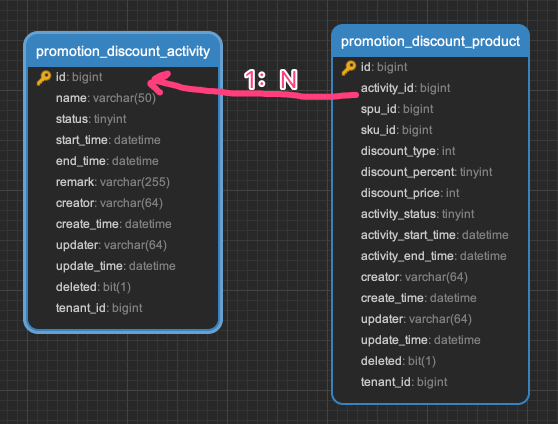

## [#](#_1-拼团活动) 1. 拼团活动

拼团活动，由卖家在管理后台配置，提供给买家参与拼团，由 CombinationActivityService 类实现。

### [#](#_1-1-表结构) 1.1 表结构

一个拼团活动，对应一条 `promotion_combination_activity` 表记录，对应一个商品 SPU。而每个商品 SKU 在该拼团下可以单独配置拼团价格，所以会有多条 `promotion_combination_activity_sku` 子表记录。

> 省略 creator/create\_time/updater/update\_time/deleted/tenant\_id 等通用字段

```sql
CREATE TABLE `promotion_combination_activity` (
  `id` bigint NOT NULL AUTO_INCREMENT COMMENT '活动编号',
  `name` varchar(50) CHARACTER SET utf8mb4 COLLATE utf8mb4_general_ci NOT NULL DEFAULT '' COMMENT '拼团名称',
  
  `spu_id` bigint NOT NULL COMMENT '商品 SPU ID',
  
  `status` tinyint NOT NULL DEFAULT '0' COMMENT '活动状态：0开启 1关闭',

  `total_limit_count` int NOT NULL COMMENT '总限购数量',
  `single_limit_count` int NOT NULL COMMENT '单次限购数量',
  `start_time` datetime NOT NULL COMMENT '开始时间',
  `end_time` datetime NOT NULL COMMENT '结束时间',
  
  `user_size` int DEFAULT NULL COMMENT '购买人数',
  `virtual_group` int NOT NULL COMMENT '虚拟成团',
  `limit_duration` int NOT NULL COMMENT '限制时长（小时）',
  PRIMARY KEY (`id`) USING BTREE
) ENGINE=InnoDB AUTO_INCREMENT=9 DEFAULT CHARSET=utf8mb4 COLLATE=utf8mb4_general_ci COMMENT='拼团活动';

```

① `spu_id` 字段：商品 SPU ID，对应商品 SPU 表的 `id` 字段。

注意：一个拼团活动，只能对应一个商品 SPU，不能对应多个商品 SPU！！！

② `status` 字段：活动状态，由 CommonStatusEnum 枚举，只有开启、禁用两个状态。禁用时，无法参与拼团。

③ `user_size` 字段：每个拼团需要的人数，例如说，3 人团、5 人团。

如果超过 `limit_duration` 时长，还没凑齐人数，就会自动拼团失败。当然，如果希望虚拟成团，则可以设置 `virtual_group` 字段，此时只要 `user_size - virtual_group` 人即可拼团成功。这块逻辑，由 CombinationRecordExpireJob 定时任务实现。

* * *

```sql
CREATE TABLE `promotion_combination_product` (
  `id` bigint NOT NULL AUTO_INCREMENT COMMENT '编号',
  
  `activity_id` bigint DEFAULT NULL COMMENT '拼团活动编号',
  `activity_status` tinyint NOT NULL DEFAULT '0' COMMENT '拼团商品状态',
  `activity_start_time` datetime NOT NULL COMMENT '活动开始时间点',
  `activity_end_time` datetime NOT NULL COMMENT '活动结束时间点',
  `spu_id` bigint DEFAULT NULL COMMENT '商品 SPU 编号',
  
  `sku_id` bigint DEFAULT NULL COMMENT '商品 SKU 编号',

  `combination_price` int NOT NULL DEFAULT '0' COMMENT '拼团价格，单位分',
  PRIMARY KEY (`id`) USING BTREE
) ENGINE=InnoDB AUTO_INCREMENT=32 DEFAULT CHARSET=utf8mb4 COLLATE=utf8mb4_general_ci COMMENT='拼团商品';

```

① 【活动信息】`activity_id` 字段：拼团活动编号，对应 `promotion_combination_activity` 表的 `id` 字段。其它 `activity_*` + `spu_id` 字段，都是冗余字段，方便查询。

② 【SKU 信息】`sku_id` 字段：商品 SKU 编号，对应商品 SKU 表的 `id` 字段。`combination_price` 字段：拼团价格，单位分。

### [#](#_1-2-管理后台) 1.2 管理后台

对应 \[商城系统 -> 营销中心 -> 拼团活动 -> 拼团商品\] 菜单，对应 `yudao-ui-admin-vue3` 项目的 `views/mall/promotion/combination/activity` 目录。如下图所示：

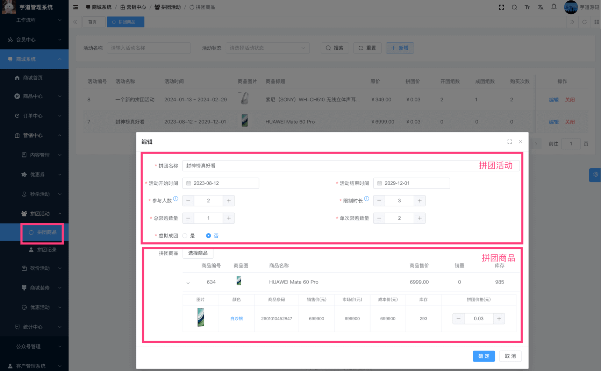

### [#](#_1-3-移动端) 1.3 移动端

① 点击 uni-app 首页的 \[拼团\] 菜单，进入拼团列表页，对应 `pages/activity/groupon/list.vue` 目录。如下图所示：

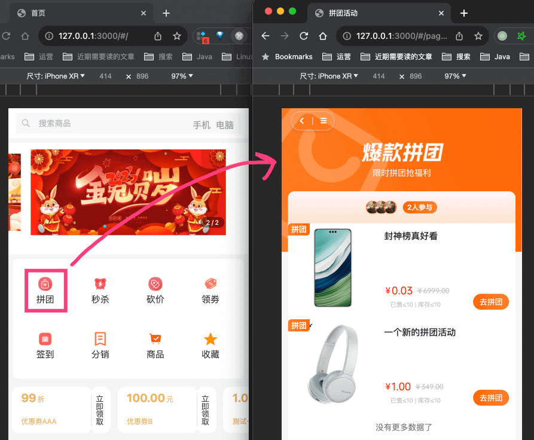

② 点击某个拼团，进入拼团详情页，对应 `pages/goods/groupon.vue` 目录。如下图所示：

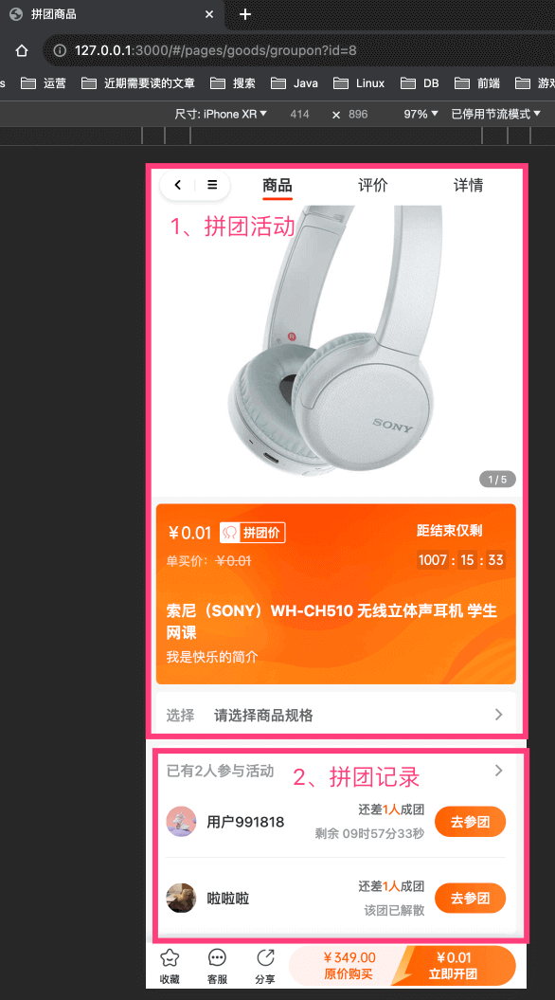

## [#](#_2-拼团记录) 2. 拼团记录

拼团记录，由买家参与拼团时生成，分成团长和团员，由 CombinationRecordService 类实现。

### [#](#_2-1-表结构) 2.1 表结构

> 省略 creator/create\_time/updater/update\_time/deleted/tenant\_id 等通用字段

```sql
CREATE TABLE `promotion_combination_record` (
  `id` bigint NOT NULL AUTO_INCREMENT COMMENT '编号',
  
  `activity_id` bigint DEFAULT NULL COMMENT '拼团活动编号',
  `spu_id` bigint DEFAULT NULL COMMENT '商品 SPU 编号',
  `pic_url` varchar(255) CHARACTER SET utf8mb4 COLLATE utf8mb4_general_ci NOT NULL COMMENT '商品图片',
  `spu_name` varchar(64) CHARACTER SET utf8mb4 COLLATE utf8mb4_general_ci NOT NULL COMMENT '商品名称',
  `sku_id` bigint DEFAULT NULL COMMENT '商品 SKU 编号',
  `count` int DEFAULT NULL COMMENT '购买的商品数量',
  `combination_price` int NOT NULL COMMENT '拼团商品单价，单位分',
  `user_size` int NOT NULL COMMENT '可参团人数',
  
  `user_id` bigint DEFAULT NULL COMMENT '用户编号',
  `nickname` varchar(64) CHARACTER SET utf8mb4 COLLATE utf8mb4_general_ci DEFAULT '' COMMENT '用户昵称',
  `avatar` varchar(255) CHARACTER SET utf8mb4 COLLATE utf8mb4_general_ci DEFAULT '' COMMENT '用户头像',

  `status` tinyint NOT NULL DEFAULT '0' COMMENT '参与状态：1进行中 2已完成 3未完成',  
  `head_id` bigint DEFAULT NULL COMMENT '团长编号',
  `user_count` int NOT NULL COMMENT '已参团人数',
  `virtual_group` bit(1) DEFAULT NULL COMMENT '是否虚拟拼团',
  `expire_time` datetime NOT NULL COMMENT '过期时间',
  `start_time` datetime DEFAULT NULL COMMENT '开始时间 (订单付款后开始的时间)',
  `end_time` datetime DEFAULT NULL COMMENT '结束时间（成团时间/失败时间）',
  
  `order_id` bigint DEFAULT NULL COMMENT '订单编号',
  PRIMARY KEY (`id`) USING BTREE
) ENGINE=InnoDB AUTO_INCREMENT=13 DEFAULT CHARSET=utf8mb4 COLLATE=utf8mb4_general_ci COMMENT='拼团记录';

```

① 【活动信息】`activity_id` 字段：拼团活动编号，对应 `promotion_combination_activity` 表的 `id` 字段。

其它 `spu_id`、`pic_url`、`spu_name`、`sku_id`、`count`、`combination_price`、`user_size` 字段，都是冗余字段，方便查询。

② 【用户信息】`user_id` 字段：用户编号，就是拼团的买家。

其它 `nickname`、`avatar` 字段，都是冗余字段，方便查询。

③ 【拼团信息】`status` 字段：参与状态，由 CombinationRecordStatusEnum 枚举，分成 3 种情况：进行中、拼团成功、拼团失败。

`head_id` 字段：团长“编号”。分成两种情况：

*   团长：则该字段为 `0`，表示它是团长的拼团记录。
*   团员：则该字段为团队拼团记录的 `id`，表示它是团长的拼团记录的团员。

其它 `user_count`、`virtual_group`、`expire_time`、`start_time`、`end_time` 字段，就是拼团的一些信息。

④ 【订单信息】`order_id` 字段：订单编号，对应订单表的 `id` 字段。每个拼团记录，都会生成一个订单。

### [#](#_2-2-管理后台) 2.2 管理后台

对应 \[商城系统 -> 营销中心 -> 拼团活动 -> 拼团记录\] 菜单，对应 `yudao-ui-admin-vue3` 项目的 `views/mall/promotion/combination/record` 目录。如下图所示：

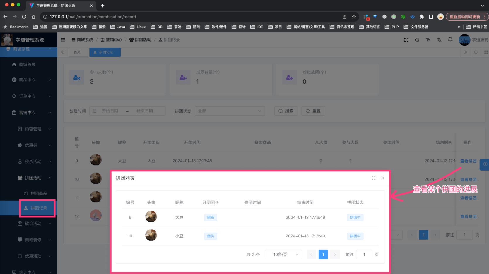

### [#](#_2-3-移动端【团长】) 2.3 移动端【团长】

友情提示：本小节，我们会“发起”一次拼团，扮演【团长】的角色

① 在 uni-app 拼团详情页，点击「立即购买」按钮，选择商品后，进入确认订单页，如下图所示：

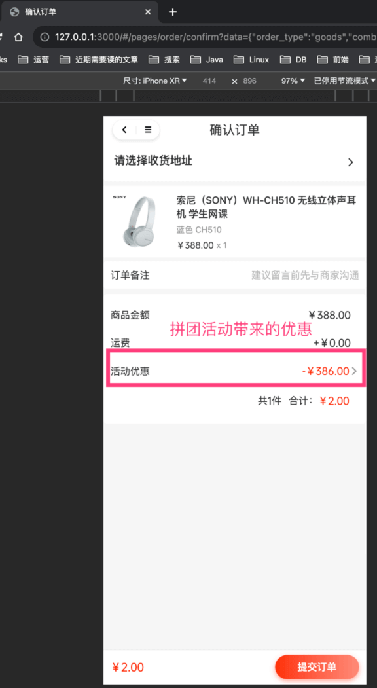

点击「提交订单」按钮后，会创建一条 `trade_order` 订单记录。此时，并未创建 `promotion_combination_record` 拼团记录：

*   `trade_order` 的 `type` 字段为拼团类型，`combination_activity_id` 字段为拼团活动编号，`head_id` 字段为 0 表示它是团长，`combination_head_id` 字段为 0 因为此时还没拼团记录
*   拼团优惠金额的计算，由 TradeCombinationActivityPriceCalculator 类实现
*   拼团在订单的自定义处理逻辑，由 TradeCombinationOrderHandler 类实现

② 之后，会跳转到支付页。完成支付后，在 `trade_order` 订单记录为“已支付”的同时，会创建一条 `promotion_combination_record` 拼团记录，此时，拼团记录的状态为“进行中”，如下图所示：

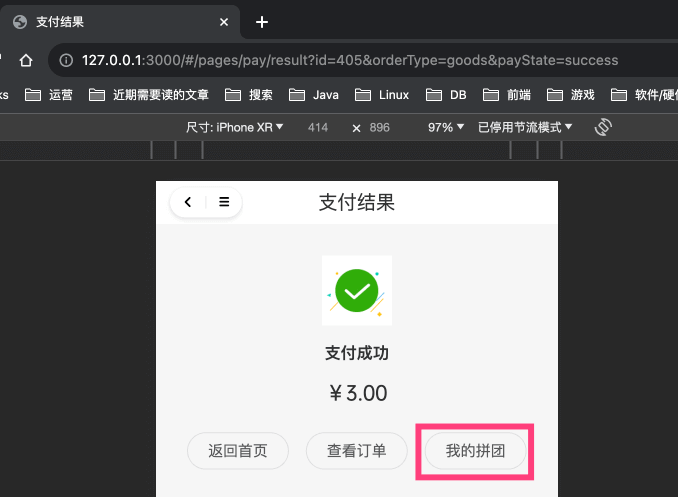

*   相关的逻辑处理，也是由 TradeCombinationOrderHandler 类实现
*   `trade_order` 的 `combination_head_id` 字段为拼团记录的 `id`

③ 点击「我的拼团」按钮，进入拼团列表页，对应 `yudao-mall-unipp` 项目的 `pages/activity/groupon/order.vue` 目录。如下图所示：

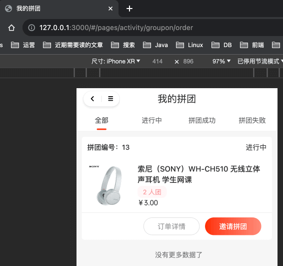

④ 点击「邀请拼团」按钮，进入拼团详情页，对应 `yudao-mall-unipp` 项目的 `pages/activity/groupon/detail.vue` 目录。如下图所示：

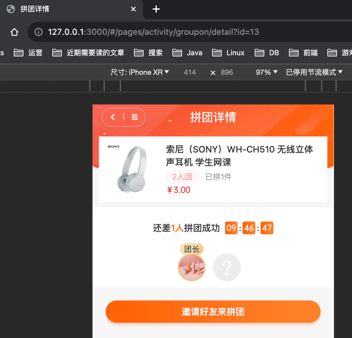

### [#](#_2-4-移动端【团员】) 2.4 移动端【团员】

友情提示：本小节，我们会“参与”一次拼团，扮演【团员】的角色

① 注册一个新的买家账号，然后在 uni-app 拼团详情页。如下图所示：


② 点击拼团记录后面的「去参团」按钮，选择商品后，进入确认订单页，如下图所示：

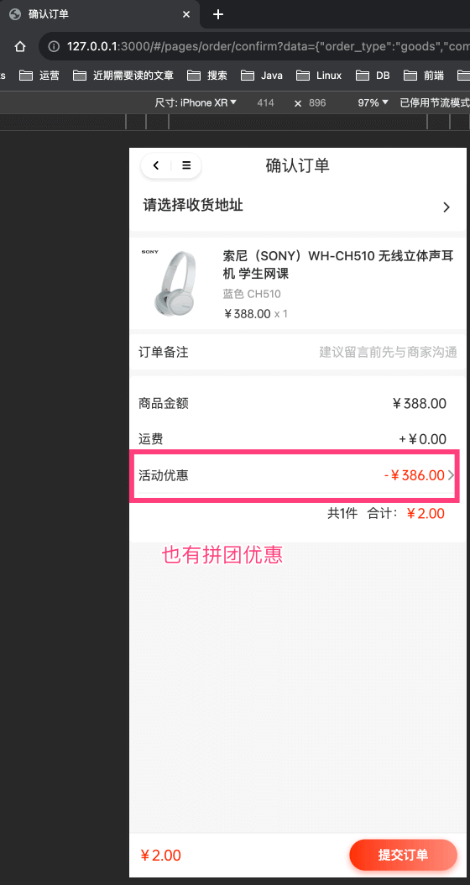

整体流程和【团长】的流程一致，只是在 `trade_order` 订单记录的 `combination_head_id` 字段为拼团记录的 `id`。

③ 之后，会跳转到支付页。完成支付后，在 `trade_order` 订单记录为“已支付”的同时，会创建一条 `promotion_combination_record` 拼团记录，此时，拼团记录的状态为“拼团成功”。

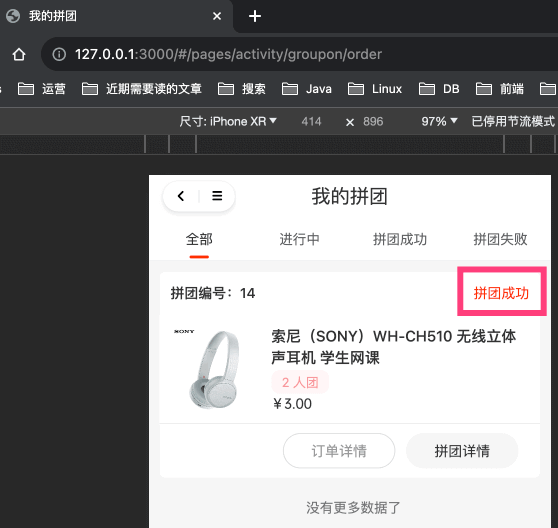

为什么是“拼团成功”呢？因为该拼团是 2 人团，此时显然已经满足，所以拼团成功。具体逻辑，可见 CombinationRecordService 类的 `#createCombinationRecord(...)` 方法，它会更新拼团进展（状态）。

* * *

至此，我们已经完成了拼团流程，可以 debug 调试调试哈~~~