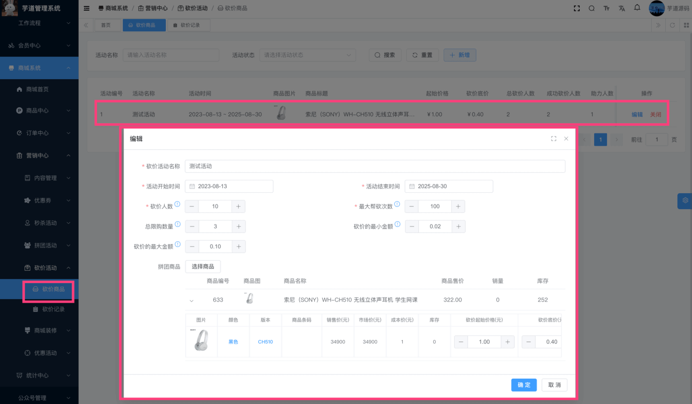
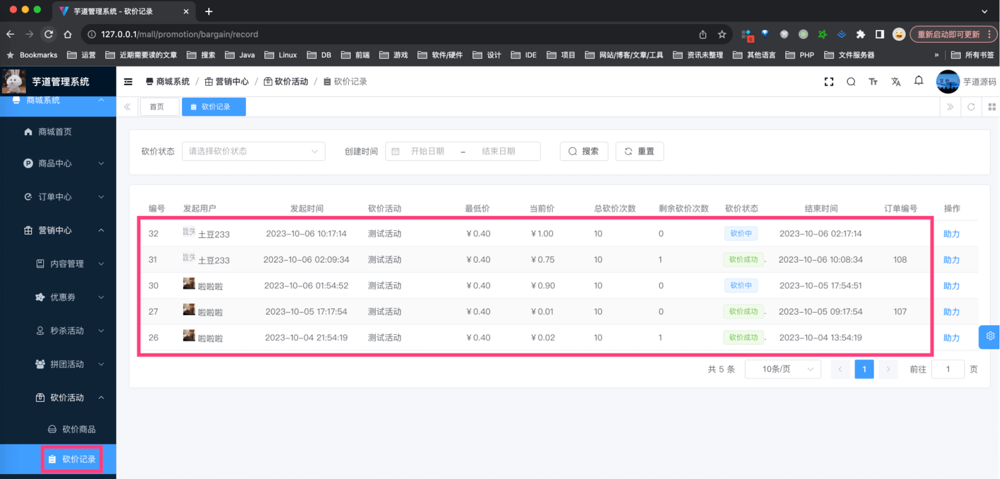
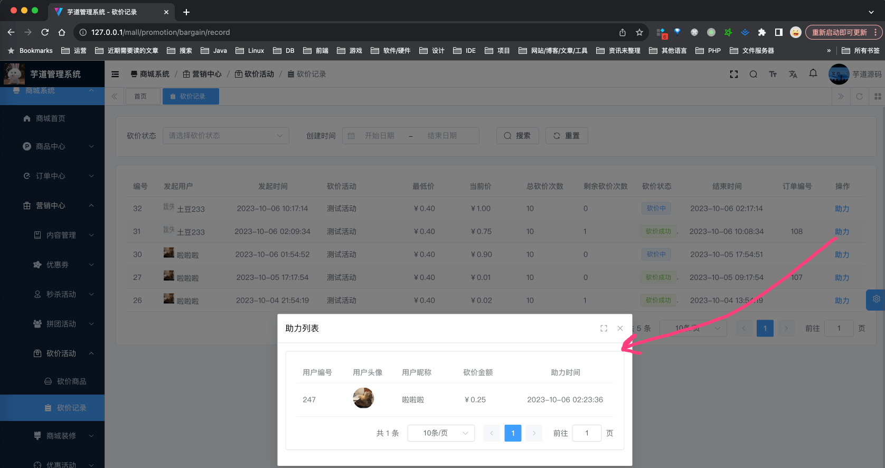

目录

# 【营销】砍价活动

友情提示：

uni-app Vue3 版本，砍价暂未迁移完成，预计 2024 年 Q2 完成。目前缺两部分：

*   砍价商品详情页

如果你着急的话，可以参考 [uni-app Vue2 版本 (opens new window)](https://gitee.com/yudaocode/yudao-mall-uniapp/tree/master-vue2/) 迁移过来，相关的后端接口都已经完成。

砍价功能，主要由 `yudao-module-promotion-biz` 后端模块的 `bargain` 实现，包括三部分：砍价活动、砍价助力。如下图所示：


## [#](#_1-砍价活动) 1. 砍价活动

砍价活动，由卖家在管理后台配置，提供给买家参与砍价，由 BargainActivityService 类实现。

### [#](#_1-1-表结构) 1.1 表结构

不同于砍价、砍价活动，一个砍价活动，只对应一个商品 SKU。

> 省略 creator/create\_time/updater/update\_time/deleted/tenant\_id 等通用字段

```sql
CREATE TABLE `promotion_bargain_activity` (
  `id` bigint NOT NULL AUTO_INCREMENT COMMENT '砍价活动编号',
  `name` varchar(200) CHARACTER SET utf8mb4 COLLATE utf8mb4_general_ci NOT NULL DEFAULT '' COMMENT '砍价活动名称',
  
  `spu_id` bigint NOT NULL DEFAULT '0' COMMENT '商品 SPU 编号',
  `sku_id` bigint NOT NULL COMMENT '商品 SKU 编号',
  
  `status` int NOT NULL DEFAULT '0' COMMENT '活动状态',
  
  `total_limit_count` int NOT NULL DEFAULT '0' COMMENT '总限购数量',
  `start_time` datetime NOT NULL DEFAULT CURRENT_TIMESTAMP COMMENT '活动开始时间',
  `end_time` datetime NOT NULL DEFAULT CURRENT_TIMESTAMP COMMENT '活动结束时间',

  `bargain_first_price` int NOT NULL DEFAULT '0' COMMENT '砍价起始价格，单位分',
  `bargain_min_price` int NOT NULL DEFAULT '0' COMMENT '砍价底价，单位：分',
  `help_max_count` int NOT NULL DEFAULT '0' COMMENT '砍价人数',
  `bargain_count` int NOT NULL DEFAULT '0' COMMENT '最大帮砍次数',
  `random_min_price` int NOT NULL DEFAULT '0' COMMENT '用户每次砍价的最小金额，单位：分',
  `random_max_price` int NOT NULL DEFAULT '0' COMMENT '用户每次砍价的最大金额，单位：分',

  `stock` int NOT NULL DEFAULT '0' COMMENT '砍价库存',
  `total_stock` int NOT NULL DEFAULT '0' COMMENT '砍价总库存',

  PRIMARY KEY (`id`) USING BTREE
) ENGINE=InnoDB AUTO_INCREMENT=26 DEFAULT CHARSET=utf8mb4 COLLATE=utf8mb4_general_ci COMMENT='砍价活动';

```

① `spu_id`、`sku_id` 字段：对应的商品 SPU 编号、商品 SKU 编号。

注意：一个砍价活动，只能对应一个商品 SKU，不能对应多个商品 SPU 或者 SKU！！！

② `status` 字段：活动状态，由 CommonStatusEnum 枚举，只有开启、禁用两个状态。禁用时，无法参与砍价。

③ `stock`、`total_stock` 字段：砍价库存，自定义参与砍价的数量。

④ `bargain_first_price`、`bargain_min_price` 字段：砍价起始价格、砍价最低价格。比如商品原价 100 元，砍价起始价格 80 元，砍价底价 50 元，那么用户发起砍价时的价格为 80 元，最多邀请好友砍价到 50 元。

`help_max_count` 字段：砍价人数，需要多少人，砍价才能成功。如果不砍价成功，则该砍价记录不允许下单支付。

`help_max_count` 字段：单个活动，用户可以帮砍的次数。例如说：帮砍次数为 1 时，A 和 B 同时将该活动链接发给 C，C 只能帮其中一个人砍价。

`random_min_price`、`random_max_price` 字段：用户每次砍价的最小金额、最大金额。比如用户每次砍价的金额为 1 元到 10 元之间的随机数。

### [#](#_1-2-管理后台) 1.2 管理后台

对应 \[商城系统 -> 营销中心 -> 砍价活动 -> 砍价商品\] 菜单，对应 `yudao-ui-admin-vue3` 项目的 `views/mall/promotion/combination/activity` 目录。如下图所示：



### [#](#_1-3-移动端) 1.3 移动端

TODO 界面迁移后，补充

## [#](#_2-砍价记录) 2. 砍价记录

砍价记录，由买家发起砍价时生成，后续可邀请好友助力（砍价），由 BargainRecordService 类实现。

### [#](#_2-1-表结构) 2.1 表结构

> 省略 creator/create\_time/updater/update\_time/deleted/tenant\_id 等通用字段

```sql
CREATE TABLE `promotion_bargain_record` (
  `id` bigint NOT NULL AUTO_INCREMENT COMMENT '砍价记录编号',

  `activity_id` bigint NOT NULL COMMENT '砍价活动名称',  
  `spu_id` bigint NOT NULL DEFAULT '0' COMMENT '商品 SPU 编号',
  `sku_id` bigint NOT NULL COMMENT '商品 SKU 编号',
  
  `user_id` bigint NOT NULL COMMENT '用户编号',

  `status` int NOT NULL DEFAULT '0' COMMENT '砍价状态',
  `bargain_first_price` int NOT NULL DEFAULT '0' COMMENT '砍价起始价格，单位：分',
  `bargain_price` int NOT NULL DEFAULT '0' COMMENT '当前砍价，单位：分',
  `end_time` datetime NOT NULL DEFAULT CURRENT_TIMESTAMP COMMENT '结束时间',

  `order_id` bigint DEFAULT NULL COMMENT '订单编号',
  PRIMARY KEY (`id`) USING BTREE
) ENGINE=InnoDB AUTO_INCREMENT=33 DEFAULT CHARSET=utf8mb4 COLLATE=utf8mb4_general_ci COMMENT='砍价记录表';

```

① 【活动信息】`activity_id` 字段：砍价活动编号，对应 `promotion_bargain_activity` 表的 `id` 字段。其它 `spu_id`、`sku_id` 字段，都是冗余字段，方便查询。

② 【用户信息】`user_id` 字段：用户编号，就是砍价发起的买家。

③ 【砍价信息】`status` 字段：砍价状态，由 BargainRecordStatusEnum 枚举，分成 3 种情况：砍价中、砍价成功、砍价失败。

`bargain_first_price`、`bargain_price` 字段：砍价起始价格、当前砍价。

④ 【订单信息】`order_id` 字段：订单编号，对应订单表的 `id` 字段。砍价记录的 `status` 为砍价成功时，才可以创建并支付订单。

### [#](#_2-2-管理后台) 2.2 管理后台

对应 \[商城系统 -> 营销中心 -> 砍价活动 -> 砍价记录\] 菜单，对应 `yudao-ui-admin-vue3` 项目的 `views/mall/promotion/bargain/record` 目录。如下图所示：



### [#](#_2-3-移动端) 2.3 移动端

TODO 界面迁移后，补充

## [#](#_3-砍价助力) 3. 砍价助力

砍价助力，给好友的砍价记录助力（砍价）时生成，由 BargainHelpService 类实现。

### [#](#_3-1-表结构) 3.1 表结构

> 省略 creator/create\_time/updater/update\_time/deleted/tenant\_id 等通用字段

```sql
CREATE TABLE `promotion_bargain_help` (
  `id` bigint NOT NULL AUTO_INCREMENT COMMENT '砍价助力编号',
  
  `user_id` bigint NOT NULL COMMENT '用户编号',
  
  `activity_id` bigint NOT NULL COMMENT '砍价活动名称',
  
  `record_id` bigint NOT NULL DEFAULT '0' COMMENT '砍价记录编号',
  
  `reduce_price` int NOT NULL DEFAULT '0' COMMENT '减少砍价，单位：分',
  PRIMARY KEY (`id`) USING BTREE
) ENGINE=InnoDB AUTO_INCREMENT=37 DEFAULT CHARSET=utf8mb4 COLLATE=utf8mb4_general_ci COMMENT='砍价助力表';

```

比较简单，主要是一些关联的字段，自己瞅瞅就好。

### [#](#_3-2-管理后台) 3.2 管理后台

点击某个砍价记录后面的「助力」按钮，可以查看它的助力列表。如下图所示：



### [#](#_3-3-移动端) 3.3 移动端

TODO 界面迁移后，补充