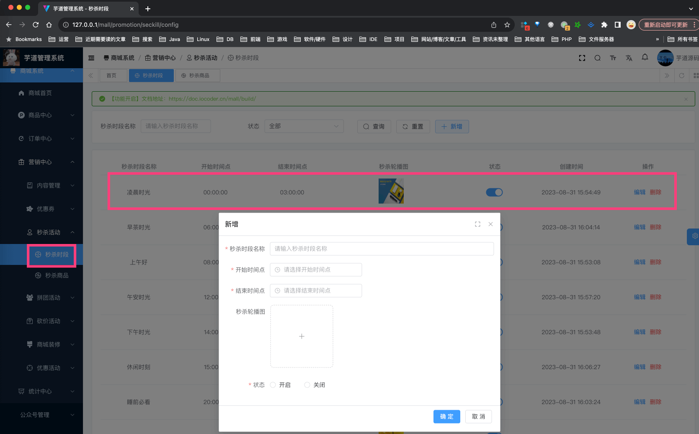
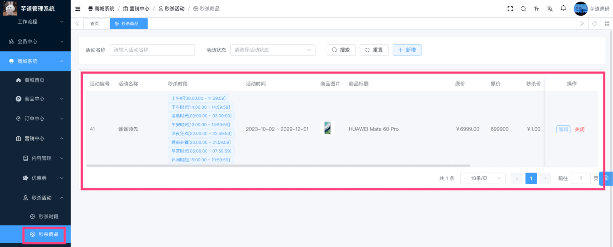
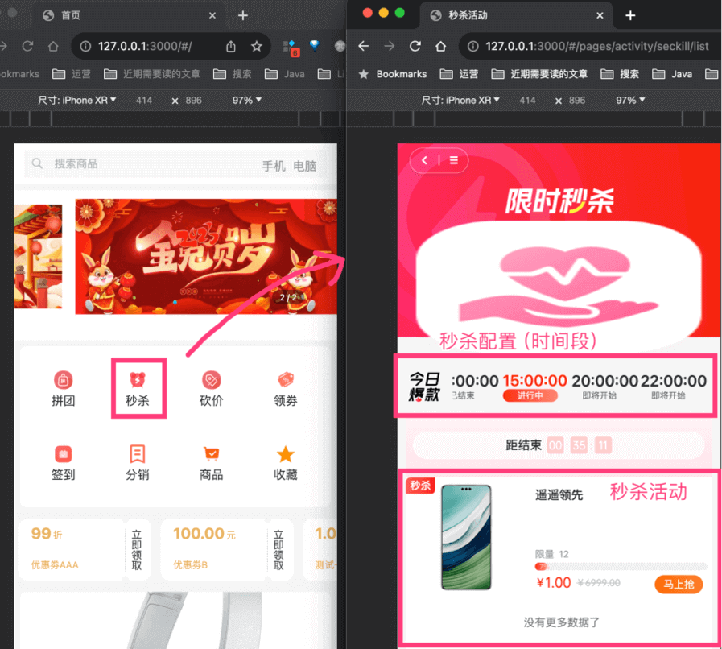
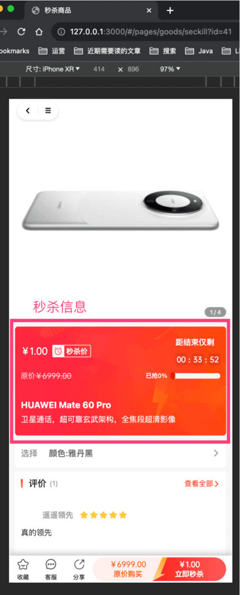
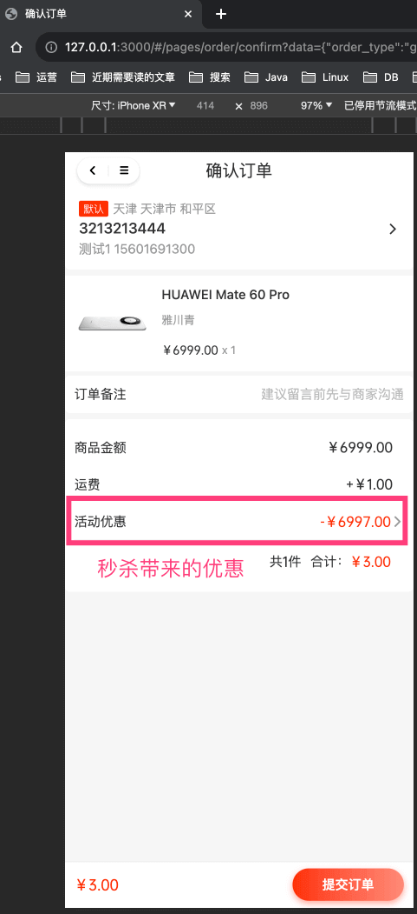

目录

# 【营销】秒杀活动

秒杀功能，主要由 `yudao-module-promotion-biz` 后端模块的 `seckill` 实现，包括两部分：秒杀配置（场次）、秒杀活动。如下图所示：


## [#](#_1-秒杀配置) 1. 秒杀配置

秒杀配置，由卖家在管理后台配置，设置可参与秒杀的时间段（场次），由 SeckillConfigService 类实现。

### [#](#_1-1-表结构) 1.1 表结构

> 省略 creator/create\_time/updater/update\_time/deleted/tenant\_id 等通用字段

```sql
CREATE TABLE `promotion_seckill_config` (
  `id` bigint NOT NULL AUTO_INCREMENT COMMENT '编号',
  `name` varchar(255) CHARACTER SET utf8mb4 COLLATE utf8mb4_general_ci NOT NULL COMMENT '秒杀时段名称',
  `start_time` varchar(25) CHARACTER SET utf8mb4 COLLATE utf8mb4_general_ci NOT NULL COMMENT '开始时间点',
  `end_time` varchar(25) CHARACTER SET utf8mb4 COLLATE utf8mb4_general_ci NOT NULL COMMENT '结束时间点',
  `slider_pic_urls` varchar(1024) CHARACTER SET utf8mb4 COLLATE utf8mb4_general_ci NOT NULL COMMENT '秒杀主图',
  `status` tinyint NOT NULL DEFAULT '0' COMMENT '活动状态',
  PRIMARY KEY (`id`) USING BTREE
) ENGINE=InnoDB AUTO_INCREMENT=38 DEFAULT CHARSET=utf8mb4 COLLATE=utf8mb4_general_ci COMMENT='秒杀时段';

```

### [#](#_1-2-管理后台) 1.2 管理后台

对应 \[商城系统 -> 营销中心 -> 秒杀活动 -> 秒杀时段\] 菜单，对应 `yudao-ui-admin-vue3` 项目的 `views/mall/promotion/seckill/config` 目录。如下图所示：



## [#](#_2-秒杀活动) 2. 秒杀活动

秒杀活动，由卖家在管理后台配置，提供给买家参与秒杀，由 SeckillActivityService 类实现。

### [#](#_2-1-表结构) 2.1 表结构

一个秒杀活动，对应一条 `promotion_seckill_activity` 表记录，对应一个商品 SPU。而每个商品 SKU 在该秒杀下可以单独配置秒杀价格、库存，所以会有多条 `promotion_seckill_product` 子表记录。

> 省略 creator/create\_time/updater/update\_time/deleted/tenant\_id 等通用字段

```sql
CREATE TABLE `promotion_seckill_activity` (
  `id` bigint NOT NULL AUTO_INCREMENT COMMENT '秒杀活动编号',
  `name` varchar(255) CHARACTER SET utf8mb4 COLLATE utf8mb4_general_ci NOT NULL DEFAULT '' COMMENT '秒杀活动名称',
  `sort` int NOT NULL DEFAULT '0' COMMENT '排序',
  `remark` varchar(1000) CHARACTER SET utf8mb4 COLLATE utf8mb4_general_ci DEFAULT '' COMMENT '备注',

  `config_ids` varchar(255) CHARACTER SET utf8mb4 COLLATE utf8mb4_general_ci NOT NULL DEFAULT '0' COMMENT '秒杀时段 id 数组',
  
  `spu_id` bigint NOT NULL DEFAULT '0' COMMENT '秒杀活动商品',
  
  `status` tinyint NOT NULL DEFAULT '0' COMMENT '活动状态',
  
  `total_limit_count` int DEFAULT '0' COMMENT '总限购数量',  
  `single_limit_count` int DEFAULT '0' COMMENT '单次限够数量',
  `start_time` datetime NOT NULL DEFAULT CURRENT_TIMESTAMP COMMENT '活动开始时间',
  `end_time` datetime NOT NULL DEFAULT CURRENT_TIMESTAMP COMMENT '活动结束时间',
  
  `stock` int DEFAULT '0' COMMENT '秒杀库存',
  `total_stock` int DEFAULT '0' COMMENT '秒杀总库存',  
  
  PRIMARY KEY (`id`) USING BTREE
) ENGINE=InnoDB AUTO_INCREMENT=42 DEFAULT CHARSET=utf8mb4 COLLATE=utf8mb4_general_ci COMMENT='秒杀活动';

```

① `config_ids` 字段：秒杀时段 id 数组，由 `promotion_seckill_config` 表的 `id` 字段组成的数组。

② `spu_id` 字段：商品 SPU ID，对应商品 SPU 表的 `id` 字段。

注意：一个秒杀活动，只能对应一个商品 SPU，不能对应多个商品 SPU！！！

③ `status` 字段：活动状态，由 CommonStatusEnum 枚举，只有开启、禁用两个状态。禁用时，无法参与秒杀。

④ `stock`、`total_stock` 字段：秒杀库存、秒杀总库存。业务上考虑秒杀价格可能较低，一般少量库存参与秒杀。

* * *

```sql
CREATE TABLE `promotion_seckill_product` (
  `id` bigint NOT NULL AUTO_INCREMENT COMMENT '秒杀参与商品编号',
  
  `activity_id` bigint NOT NULL DEFAULT '0' COMMENT '秒杀活动 id',
  `config_ids` varchar(100) CHARACTER SET utf8mb4 COLLATE utf8mb4_general_ci NOT NULL DEFAULT '0' COMMENT '秒杀时段 id 数组',
  `activity_status` tinyint NOT NULL DEFAULT '0' COMMENT '秒杀商品状态',
  `activity_start_time` datetime NOT NULL COMMENT '活动开始时间点',
  `activity_end_time` datetime NOT NULL COMMENT '活动结束时间点',
  `spu_id` bigint NOT NULL DEFAULT '0' COMMENT '商品 spu_id',
  
  `sku_id` bigint NOT NULL DEFAULT '0' COMMENT '商品 sku_id',
  
  `seckill_price` int NOT NULL DEFAULT '0' COMMENT '秒杀金额，单位：分',
  `stock` int NOT NULL DEFAULT '0' COMMENT '秒杀库存',
  
  PRIMARY KEY (`id`) USING BTREE
) ENGINE=InnoDB AUTO_INCREMENT=81 DEFAULT CHARSET=utf8mb4 COLLATE=utf8mb4_general_ci COMMENT='秒杀参与商品';

```

① 【活动信息】`activity_id` 字段：秒杀活动编号，对应 `promotion_seckill_activity` 表的 `id` 字段。其它 `activity_*` + `spu_id` 字段，都是冗余字段，方便查询。

② 【SKU 信息】`sku_id` 字段：商品 SKU 编号，对应商品 SKU 表的 `id` 字段。`seckill_price` 字段：秒杀价格，单位分。`stock` 字段：秒杀库存。

### [#](#_2-2-管理后台) 2.2 管理后台

对应 \[商城系统 -> 营销中心 -> 秒杀活动 -> 秒杀商品\] 菜单，对应 `yudao-ui-admin-vue3` 项目的 `views/mall/promotion/seckill/activity` 目录。如下图所示：



### [#](#_2-3-移动端) 2.3 移动端

① 点击 uni-app 首页的 \[秒杀\] 菜单，进入秒杀列表页，对应 `pages/activity/seckill/list.vue` 目录。如下图所示：



② 点击某个秒杀，进入秒杀详情页，对应 `pages/goods/seckill.vue` 目录。如下图所示：



③ 点击「立即购买」按钮，选择商品后，进入确认订单页，如下图所示：



点击「提交订单」按钮后，会创建一条 `trade_order` 订单记录：

*   `trade_order` 的 `type` 字段为秒杀类型，`seckill_activity_id` 字段为秒杀活动编号
*   秒杀优惠金额的计算，由 TradeSeckillActivityPriceCalculator 类实现
*   秒杀在订单的自定义处理逻辑，由 TradeSeckillOrderHandler 类实现

后续的逻辑，就是普通订单的流程，就不重复赘述了~