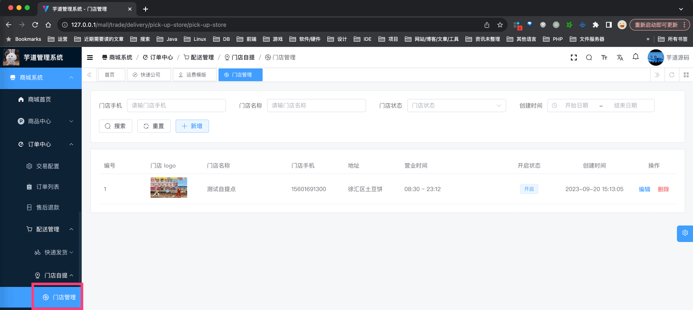
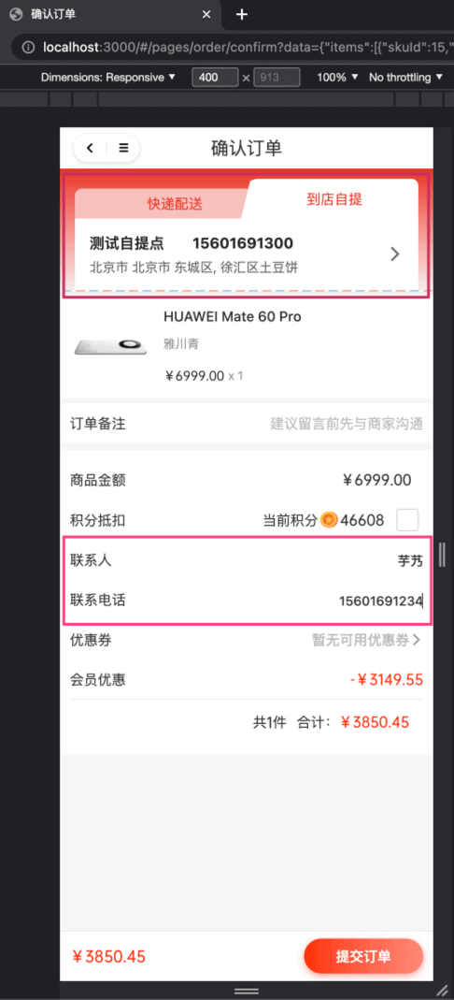
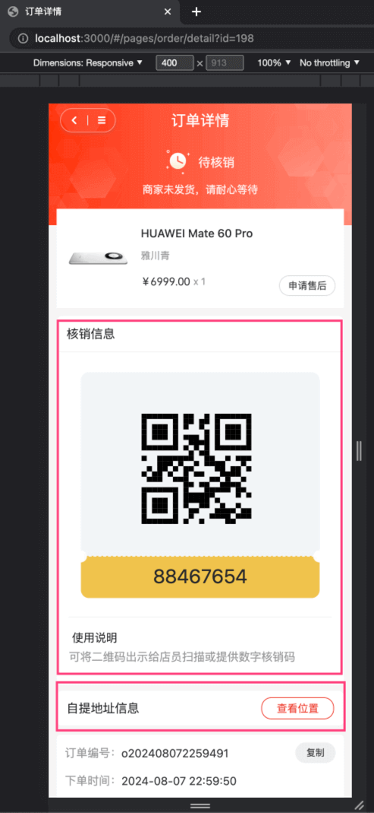
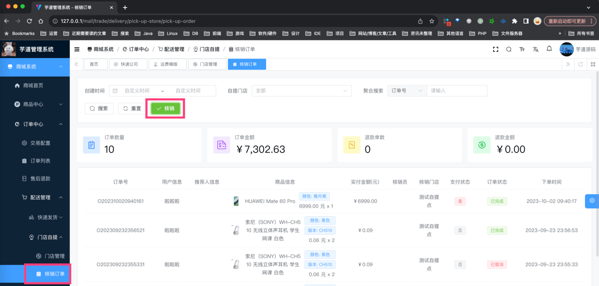
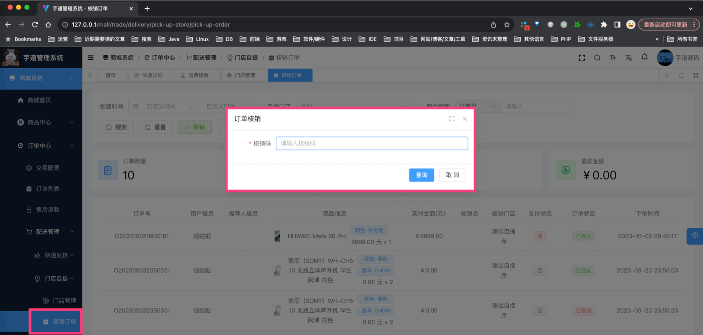
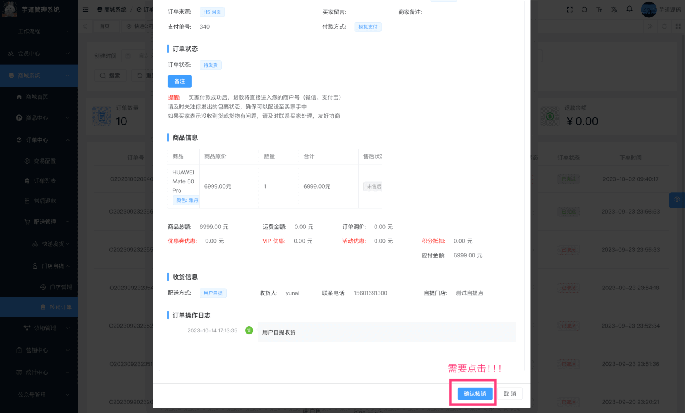

目录

# 【交易】门店自提

门店自提，是指用户在下单时，选择自提，然后到指定的门店进行自提（核销）。

## [#](#_1-门店信息) 1. 门店信息

门店自提时，需要使用门店信息，由 `yudao-module-trade-biz` 后端模块的 `delivery` 包的 DeliveryPickUpStoreService 实现。

### [#](#_1-1-表结构) 1.1 表结构

> 省略 creator/create\_time/updater/update\_time/deleted/tenant\_id 等通用字段

```sql
CREATE TABLE `trade_delivery_pick_up_store` (
  `id` bigint NOT NULL AUTO_INCREMENT COMMENT '编号',
  `name` varchar(64) CHARACTER SET utf8mb4 COLLATE utf8mb4_unicode_ci NOT NULL COMMENT '门店名称',
  `introduction` varchar(256) CHARACTER SET utf8mb4 COLLATE utf8mb4_unicode_ci DEFAULT NULL COMMENT '门店简介',
  `phone` varchar(16) CHARACTER SET utf8mb4 COLLATE utf8mb4_unicode_ci NOT NULL COMMENT '门店手机',
  `area_id` int NOT NULL COMMENT '区域编号',
  `detail_address` varchar(256) CHARACTER SET utf8mb4 COLLATE utf8mb4_unicode_ci NOT NULL COMMENT '门店详细地址',
  `logo` varchar(256) CHARACTER SET utf8mb4 COLLATE utf8mb4_unicode_ci NOT NULL COMMENT '门店 logo',
  `opening_time` time NOT NULL COMMENT '营业开始时间',
  `closing_time` time NOT NULL COMMENT '营业结束时间',
  `latitude` double NOT NULL COMMENT '纬度',
  `longitude` double NOT NULL COMMENT '经度',
  `status` tinyint NOT NULL DEFAULT '0' COMMENT '门店状态',
  PRIMARY KEY (`id`) USING BTREE
) ENGINE=InnoDB AUTO_INCREMENT=2 DEFAULT CHARSET=utf8mb4 COLLATE=utf8mb4_unicode_ci COMMENT='自提门店';

```

比较简单，就是存储下门店的基本信息。

### [#](#_1-2-管理后台) 1.2 管理后台

对应 \[商城系统 -> 订单中心 -> 配送管理 -> 门店自提 -> 门店管理\] 菜单，对应 `yudao-ui-admin-vue3` 项目的 `views/mall/trade/delivery/express` 目录。如下图所示：



## [#](#_2-自提流程) 2. 自提流程
### [#](#_2-1-下单【买家】) 2.1 下单【买家】

① 买家在 uni-app 订单结算页时，选择自提，然后选择自提门店。如下图所示：



注意：商品的配送方式需要支持自提，才会显示自提的选项！！！如果没设置，去“商品管理”里，编辑下相关的商品。

② 下单并支付完成后，买家在 uni-app 订单详情页时，可以看到自提门店的信息，也包括核销码、核销二维码。如下图所示：



### [#](#_2-2-核销【卖家】) 2.2 核销【卖家】

① 核销订单列表，对应 \[商城系统 -> 订单中心 -> 配送管理 -> 门店自提 -> 核销订单\] 菜单，对应 `yudao-ui-admin-vue3` 项目的 `views/mall/trade/delivery/pickUpOrder` 目录。如下图所示：



② 点击「核销」按钮，输入核销码，查询核销订单的信息。如下图所示：



后端对应 AppTradeOrderController 的 `#getByPickUpVerifyCode(...)` 提供的“查询核销码对应的订单”接口，基于 `trade_order` 表的 `pick_up_verify_code` 字段查询。

③ 点击「确认核销」按钮后，即可核销成功。如下图所示：



后端对应 AppTradeOrderController 的 `#pickUpOrderByVerifyCode(...)` 提供的“订单核销”接口。

## [#](#_3-配送配置) 3. 配送配置


*   SQL 对应 `trade_config` 表的 `delivery_` 开头的字段。
*   前端对应 `yudao-ui-admin-vue3` 项目的 `views/mall/trade/config/index.vue` 目录
*   后端对应 `yudao-module-trade-biz` 项目的 TradeConfigController 类