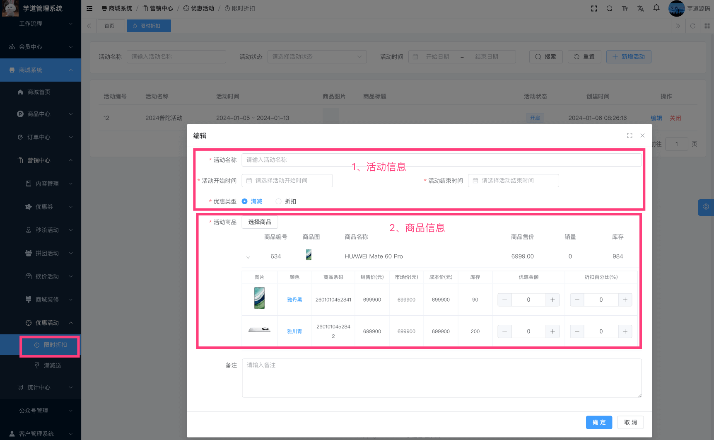

目录

# 【营销】限时折扣

友情提示：限时折扣的后端 + 管理后台已经实现，uni-app 前端暂未实现，预计 2024 年 Q2 完成。

限时折扣，指的是在指定时间段内，对指定商品进行折扣。主要由 `yudao-module-promotion-biz` 后端模块的 `discount` 实现。

## [#](#_1-表结构) 1. 表结构

一个限时折扣活动，可以有多个商品参与，所以它有一个 `promotion_discount_activity` 活动主表，和 `promotion_discount_activity_product` 活动商品子表。如下图所示：


> 省略 creator/create\_time/updater/update\_time/deleted/tenant\_id 等通用字段

```sql
CREATE TABLE `promotion_discount_activity` (
  `id` bigint NOT NULL AUTO_INCREMENT COMMENT '活动编号',
  `name` varchar(50) CHARACTER SET utf8mb4 COLLATE utf8mb4_general_ci NOT NULL DEFAULT '' COMMENT '活动标题',
  
  `status` tinyint NOT NULL DEFAULT '-1' COMMENT '活动状态',
  
  `start_time` datetime NOT NULL COMMENT '开始时间',
  `end_time` datetime NOT NULL COMMENT '结束时间',
  `remark` varchar(255) CHARACTER SET utf8mb4 COLLATE utf8mb4_general_ci DEFAULT '' COMMENT '备注',
  PRIMARY KEY (`id`) USING BTREE
) ENGINE=InnoDB AUTO_INCREMENT=13 DEFAULT CHARSET=utf8mb4 COLLATE=utf8mb4_general_ci COMMENT='限时折扣活动';

```

① `status` 字段：活动状态，由 CommonStatusEnum 枚举，只有开启、禁用两个状态。禁用时，无法参与限时折扣活动。

* * *

```sql
CREATE TABLE `promotion_discount_product` (
  `id` bigint NOT NULL AUTO_INCREMENT COMMENT '编号，主键自增',
  
  `activity_id` bigint NOT NULL COMMENT '活动编号',
  `activity_status` tinyint NOT NULL DEFAULT '0' COMMENT '秒杀商品状态',
  `activity_start_time` datetime NOT NULL COMMENT '活动开始时间点',
  `activity_end_time` datetime NOT NULL COMMENT '活动结束时间点',
  
  `spu_id` bigint NOT NULL DEFAULT '-1' COMMENT '商品 SPU 编号',
  `sku_id` bigint NOT NULL COMMENT '商品 SKU 编号',
  
  `discount_type` int NOT NULL COMMENT '优惠类型；1-代金卷；2-折扣卷',
  `discount_percent` tinyint DEFAULT NULL COMMENT '折扣百分比',
  `discount_price` int DEFAULT NULL COMMENT '优惠金额，单位：分',
  PRIMARY KEY (`id`) USING BTREE
) ENGINE=InnoDB AUTO_INCREMENT=22 DEFAULT CHARSET=utf8mb4 COLLATE=utf8mb4_general_ci COMMENT='限时折扣商品\n';

```

① `activity_id` 字段：活动编号，对应 `promotion_discount_activity` 表的 `id` 字段。而 `activity_` 开头字段，是为了方便查询，冗余存储的。

② `spu_id`、`sku_id` 字段：对应的商品 SPU 编号、商品 SKU 编号。

③ `discount_type` 字段：优惠类型，由 DiscountTypeEnum 枚举，分成 2 种情况：

*   满减：配合 `discount_price` 字段，表示优惠多少金额
*   折扣：配合 `discount_percent` 字段，表示折扣百分比

## [#](#_2-管理后台) 2. 管理后台

对应 \[商城系统 -> 营销中心 -> 优惠活动 -> 限时折扣\] 菜单，对应 `yudao-ui-admin-vue3` 项目的 `src/views/mall/promotion/discountActivity` 目录。如下图所示：



## [#](#_3-移动端) 3. 移动端

TODO TradeDiscountActivityPriceCalculator 类实现

TODO 前端需要在商品详情上增加一些信息