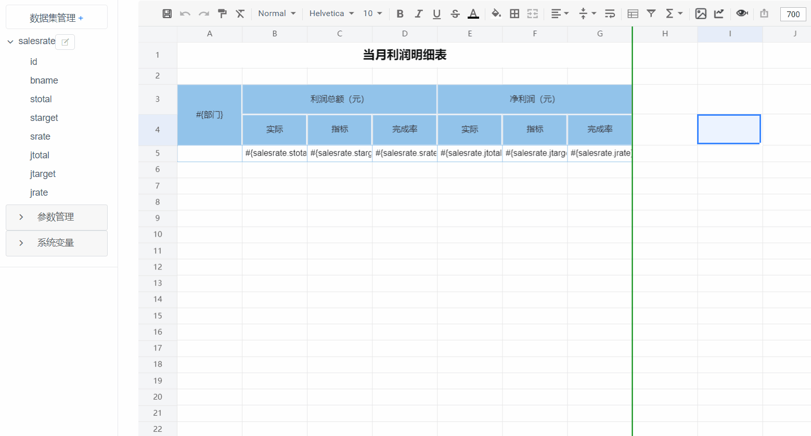
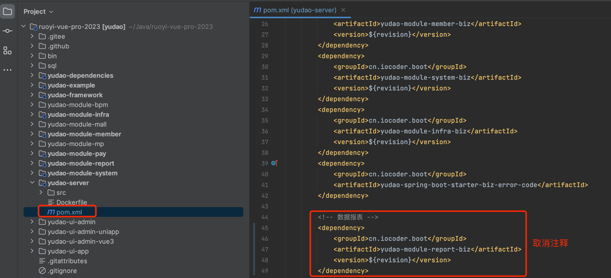
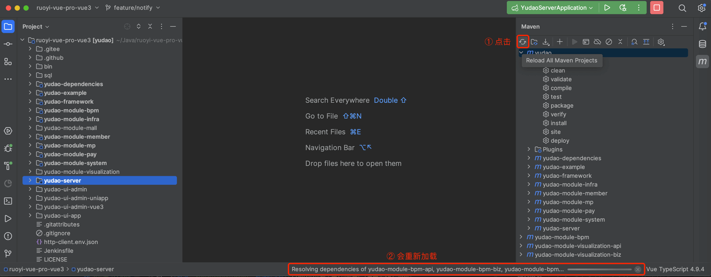
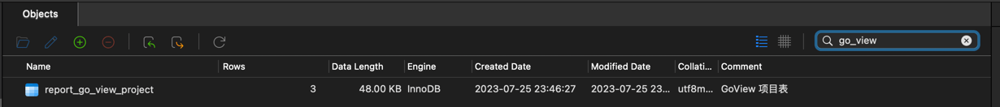
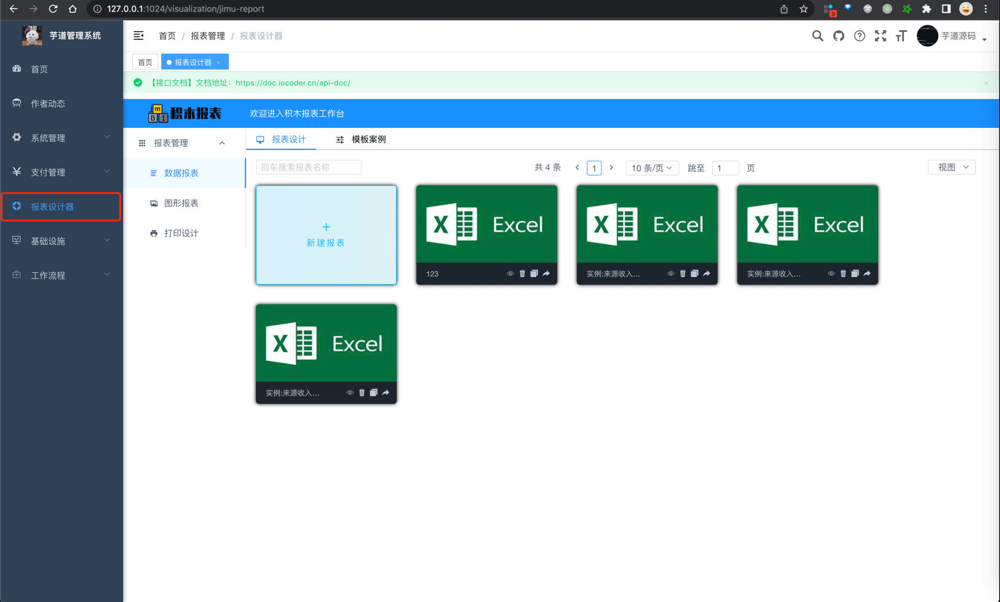

目录

# 报表设计器

数据可视化，一般可以通过报表设计器、或者大屏设计器来实现。本小节，我们来讲解报表设计器的功能开启。

报表设计器，指的是使用 Web 版设计器，通过类似于 Excel 操作风格，通过拖拽完成报表设计。如下图所示：

在项目中，通过集成市面上的报表引擎，实现了报表设计器的能力。目前使用如下：

是否集成

是否开源

[JimuReport (opens new window)](https://github.com/jeecgboot/JimuReport)

已集成

不开源

[AJ-Report (opens new window)](https://gitee.com/anji-plus/report)

集成中

开源

[UReport2 (opens new window)](https://github.com/youseries/ureport)

不集成

开源

为什么不使用 UReport2 报表引擎呢？

UReport2 基本处于不维护的状态，最后发版时间是 2018 年！

## [#](#_1-功能开启) 1. 功能开启

`yudao-module-report` 实现了报表设计器的能力，考虑到编译速度，默认是关闭的。开启步骤如下：

*   第一步，开启 `yudao-report-report` 模块
*   第二步，导入报表的 SQL 数据库脚本
*   第三步，启动后端项目，确认功能是否生效
*   第四步，启动报表设计器的前端项目

### [#](#_1-1-第一步-开启模块) 1.1 第一步，开启模块

① 修改根目录的 [`pom.xml` (opens new window)](https://github.com/YunaiV/ruoyi-vue-pro/blob/master/pom.xml) 文件，取消 `yudao-module-report` 模块的注释。

② 修改 `yudao-server` 目录的 [`pom.xml` (opens new window)](https://github.com/YunaiV/ruoyi-vue-pro/blob/master/yudao-server/pom.xml) 文件，引入 `yudao-module-report` 模块。如下图所示：

③ 点击 IDEA 右上角的【Reload All Maven Projects】，刷新 Maven 依赖。如下图所示：

### [#](#_1-2-第二步-导入-sql) 1.2 第二步，导入 SQL

下载 [`jimureport.mysql5.7.create.sql`](/file/jimureport.mysql5.7.create.sql) 脚本，并导入数据库，初始化 JimuReport 相关的表结构和数据。如果你是 Oracle、PostgreSQL 等其它数据库，需要自己使用 Navicat 进行转换。

友情提示：↑↑↑ jimureport.mysql5.7.create.sql 是可以点击下载的！ ↑↑↑

### [#](#_1-3-第三步-启动后端项目) 1.3 第三步，启动后端项目

启动后端项目，看到 `"Init JimuReport Config [ 线程池 ] "` 说明开启成功。

### [#](#_1-4-第四步-启动前端项目-aj-report) 1.4 第四步，启动前端项目（AJ-Report）

TODO 开发中，预计 4 月份左右。

### [#](#_1-4-第四步-启动前端项目-jimureport) 1.4 第四步，启动前端项目（JimuReport）

① JimuReport 前端项目内置在后端项目中，无需启动。

② 访问 \[报表管理 -> 报表设计器\] 菜单，可以查看对应的功能。如下图所示：

可以看到，JimuReport 支持数据报表、图形报表、打印设计等能力。

## [#](#_2-如何使用) 2. 如何使用？
### [#](#_2-1-aj-report-报表设计器) 2.1 AJ-Report 报表设计器

TODO 开发中，预计 4 月份左右。

### [#](#_2-2-jimureport-报表设计器) 2.2 JimuReport 报表设计器

可以查看 JimuReport 的官方文档，主要是：

*   [快速入门 (opens new window)](http://report.jeecg.com/2075805)
*   [操作手册（报表设计器） (opens new window)](http://report.jeecg.com/1423422)

注意，JimuReport 是商业化的产品，报表设计器的功能应该是免费的，大屏设计器的功能是收费的。

集成 JimuReport 的代码实现？

① 后端：在 [`jmreport` (opens new window)](https://github.com/YunaiV/ruoyi-vue-pro/tree/master/yudao-module-report/yudao-module-report-biz/src/main/java/cn/iocoder/yudao/module/report/framework/jmreport) 包下，进行 JimuReport 的集成。

② 前端：在 [`@/views/report/jmreport` (opens new window)](https://github.com/yudaocode/yudao-ui-admin-vue2/blob/master/src/views/report/jmreport/index.vue) 文件，通过 IFrame 嵌入 JimuReport 界面。

* * *

星球里，不错的问题：

*   [《我想问下积木报表集成里，官方的 yaml 配置参数维护在哪里呀？》 (opens new window)](https://t.zsxq.com/19s87CV2J)