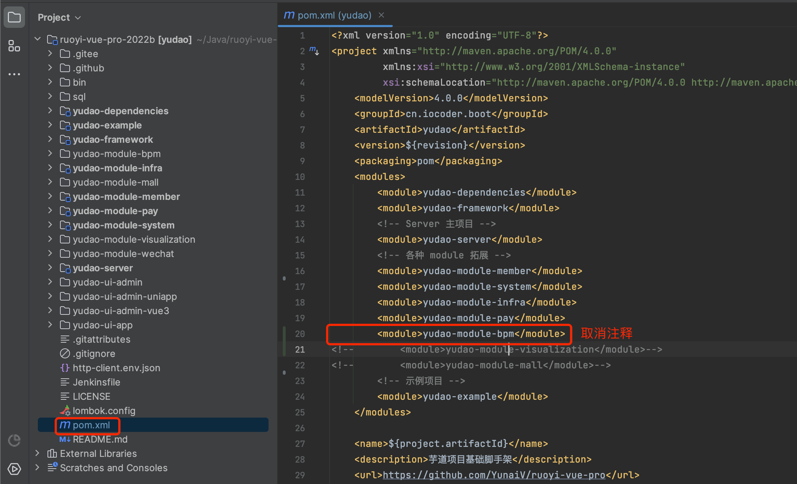
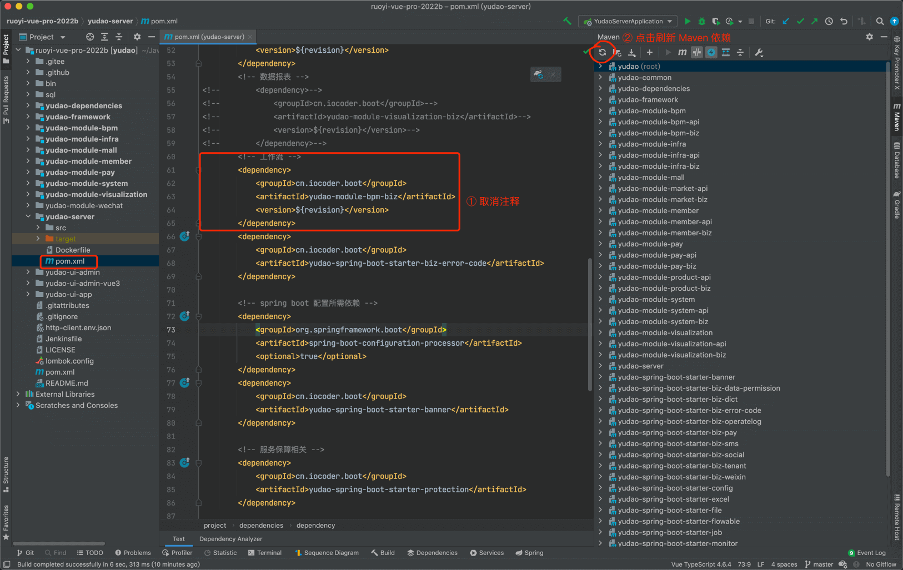
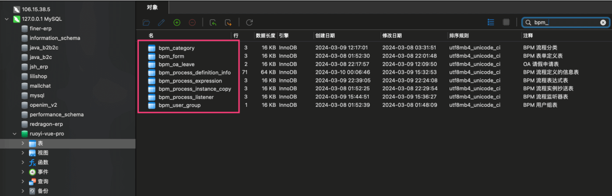

目录

# 功能开启

进度说明：

*   管理后台，请使用 [https://gitee.com/yudaocode/yudao-ui-admin-vue3 (opens new window)](https://gitee.com/yudaocode/yudao-ui-admin-vue3) 仓库的 `master` 分支
*   后端项目，请使用 [https://gitee.com/zhijiantianya/ruoyi-vue-pro (opens new window)](https://gitee.com/zhijiantianya/ruoyi-vue-pro) 仓库的 `master`（JDK8） 或 `master-jdk17`（JDK17/21） 分支

BPM 系统，后端由 `yudao-module-bpm` 模块实现，前端由 `yudao-ui-admin-vue3` 的 `bpm` 目录实现。

考虑到编译速度，默认 `yudao-module-bpm` 模块是关闭的，需要手动开启。步骤如下：

*   第一步，开启 `yudao-module-bpm` 模块
*   第二步，导入 bpm 系统的 SQL 数据库脚本
*   第三步，重启后端项目，确认功能是否生效

## [#](#_1-第一步-开启模块) 1. 第一步，开启模块

① 修改根目录的 [`pom.xml` (opens new window)](https://github.com/YunaiV/ruoyi-vue-pro/blob/master/pom.xml) 文件，取消 `yudao-module-bpm` 模块的注释。

② 第二步，修改 `yudao-server` 的 [`pom.xml` (opens new window)](https://github.com/YunaiV/ruoyi-vue-pro/blob/master/yudao-server/pom.xml) 文件，取消 `yudao-module-bpm-biz` 依赖的注释，并进行 IDEA 的 Maven 刷新。

③ 点击 IDEA 右上角的【Reload All Maven Projects】，刷新 Maven 依赖。如下图所示：

## [#](#_2-第二步-导入-sql) 2. 第二步，导入 SQL

点击 [`bpm-2024-03-24.sql.zip` (opens new window)](https://t.zsxq.com/150EPtWgV) 下载附件，解压出 SQL 文件，然后导入到数据库中。

友情提示：↑↑↑ bpm.sql 是可以点击下载的！ ↑↑↑

以 `bpm_` 作为前缀的表，就是 BPM 模块的表。

## [#](#_3-第三步-重启项目) 3. 第三步，重启项目

重启后端项目，重启项目，看到 `Property Source flowable-liquibase-override refreshed` 说明开启成功。

然后访问前端的 BPM 菜单，确认功能是否生效。如下图所示：

另外，启动过程中，Flowable 会自动创建 `ACT_` 和 `FLW_` 开头的表。

常见问题：

① 问题：如果启动中报 [MySQL “Specified key was too long; max key length is 1000 bytes” (opens new window)](https://gitee.com/zhijiantianya/ruoyi-vue-pro/issues/I57FYM) 错误？

解决方案：可以将 MySQL 的缺省存储引擎设置为 innodb，即 `default-storage-engine=innodb` 配置项。

② 问题：如果 Flowable 启动报错 `problem during schema upgrade&&couldn‘t upgrade db schema` 错误？

解决方案：参见 [https://www.cnblogs.com/sowler/p/17195427.html (opens new window)](https://www.cnblogs.com/sowler/p/17195427.html) 帖子，MySQL 不区分大小写导致的，需要调整为区分。

③ 问题：我想使用达梦数据库，怎么办？

解决方案：参见 [《工作流（达梦适配）》](/bpm/dameng/) 文档。

## [#](#_666-后续学习) 666. 后续学习

建议阅读如下两篇文档，对整个工作流建立一个整体的认识：

*   [《审批接入（流程表单）》](/bpm/use-bpm-form/)
*   [《审批接入（业务表单）》](/bpm/use-business-form/)

## [#](#补充说明-如何集成-activiti) 补充说明：如何集成 Activiti？

Activiti 和 Flowable 提供的 Java API 是基本一致的，例如说 Flowable 的 `org.flowable.engine.RepositoryService` 对应 Activiti 的 `org.activiti.engine .RepositoryService`。所以，我们可以修改 `import` 的包路径来替换。

另外，在项目的老版本，我们也提供了 Activiti 实现，你可以具体参考下：

*   [`yudao-spring-boot-starter-activiti` (opens new window)](https://gitee.com/zhijiantianya/ruoyi-vue-pro/tree/v1.6.2/yudao-framework/yudao-spring-boot-starter-activiti)
*   [`yudao-module-bpm-biz-activiti` (opens new window)](https://gitee.com/zhijiantianya/ruoyi-vue-pro/tree/v1.6.2/yudao-module-bpm/yudao-module-bpm-biz-activiti)

