目录

# 审批加签、减签

本文，我们来讲解下审批加签、减签的功能：

*   加签：添加其他审批人来共同审批，自己仍需参与审批。例如，不好判断当前审批时，可以添加其他人来共同审批
*   减签：当以“加签”的方式添加了其他审批人时，可以操作减签进行移除，对方无需再审批。例如，加签有误时，可以通过减签来操作

其中，加签分成两种：

*   向前加签：在任务 A 之【前】添加 B、C、D 三个子任务，在 B、C、D 子任务都审批完成后，任务 A 才能继续审批
*   向后加签：在任务 A 之【后】添加 B、C、D 三个子任务，在任务 A 审批通过（处于审批通过中），只有 B、C、D 三个子任务都审批通过，任务 A 才会审批通过

## [#](#_1-向前加签) 1. 向前加签
### [#](#_1-1-发起向前加签) 1.1 发起向前加签
#### [#](#_1-1-1-操作步骤) 1.1.1 操作步骤

① 首先，点击「加签」按钮，选择被加签的处理人，之后点击「向前加签」按钮，完成向前加签操作。如下图所示：

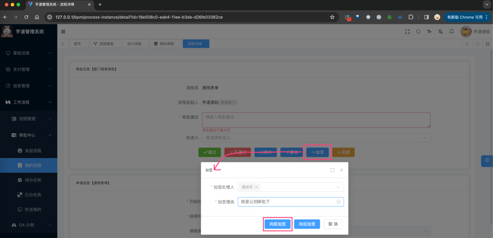

② 之后，可以看到当前任务变成“待审核”状态，它有加签出来的一个子任务，该子任务的状态是“待审核”状态，如下图所示：

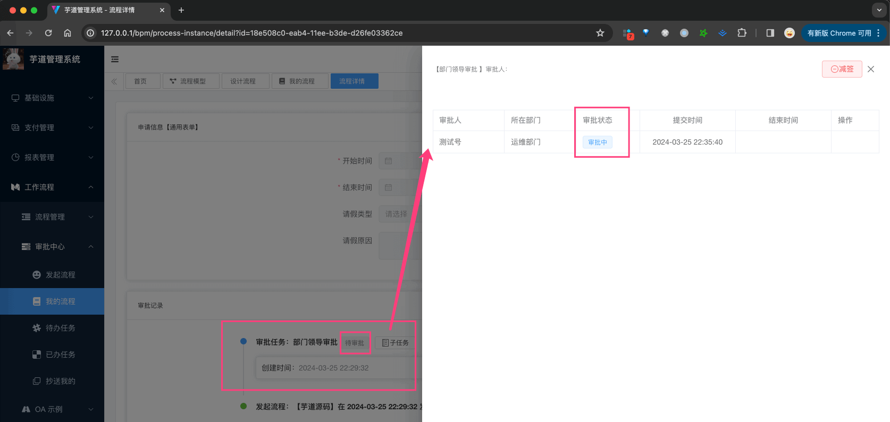

#### [#](#_1-1-2-后端实现) 1.1.2 后端实现

对应 BpmTaskController 的 `#createSignTask(...)` 方法，如下图所示：

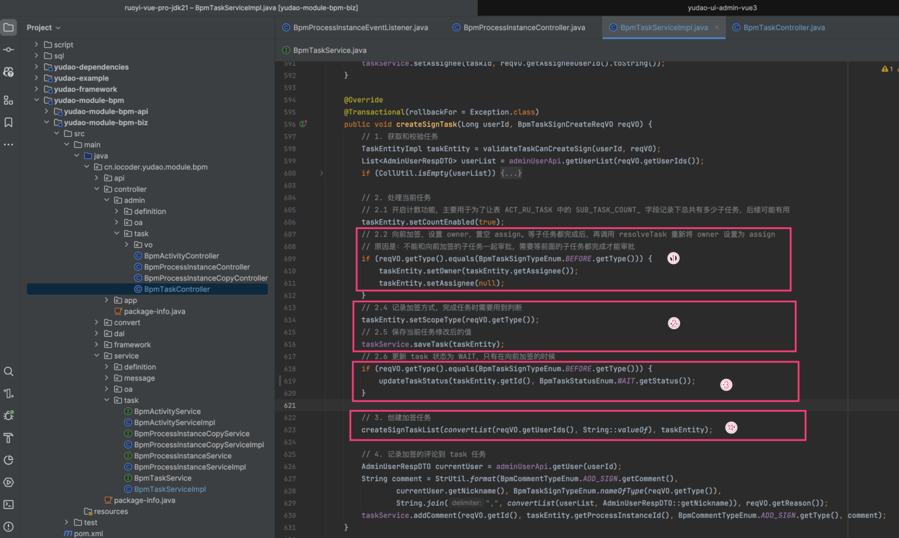

*   红圈 ① 的 `2.2` 处：需要将当前任务的 `assignee` 置空，并保存到 `owner` 中，避免它被审批。因为它如何被审批，就会直接进入下一个节点，而不会等待加签的子任务审批完成，显然这不是我们所希望的
*   红圈 ② 的 `2.4` 处：通过 `scopeType` 标记当前任务是向前还是向后加签，因为一个任务不能同时向前和向后加签。这里，我们将 `scopeType` 设置为 `before`，表示向前加签
*   红圈 ③ 的 `2.6` 处：更新当前任务的状态为 `WAITING`，表示当前任务处于“待审核状态”
*   红圈 ④ 的 `3.` 处：调用 `#createSignTaskList(...)` 方法，创建加签的子任务，如下图所示：

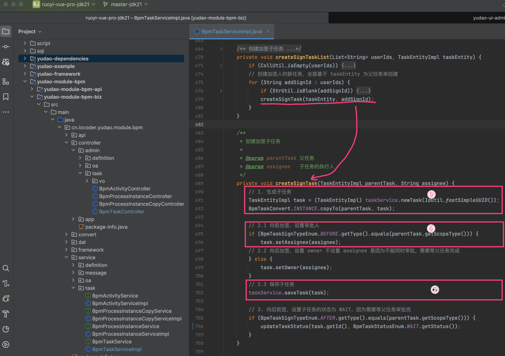

*   红圈 ⑤ 的 `1` 处：创建加签的子任务，将当前任务的属性部分复制给改子任务
*   红圈 ⑥ 的 `2.1` 处：设置向前加签的子任务的 `assignee` 审批人
*   红圈 ⑦ 的 `2.3` 处：真正保存加签的子任务

### [#](#_1-2-审批向前加签子任务) 1.2 审批向前加签子任务
#### [#](#_1-2-1-操作步骤) 1.2.1 操作步骤

登录账号 test、密码 test123 的用户，审批加签任务。

① 和普通审批一样，点击【通过】按钮，将子任务审批通过，如下图所示：

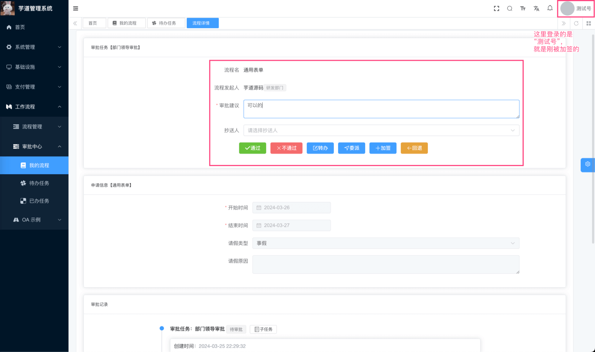

② 之后，可以看到当前（原）任务又变回“待审核”状态，加签出来的子任务处于“审核通过”状态，如下图所示：

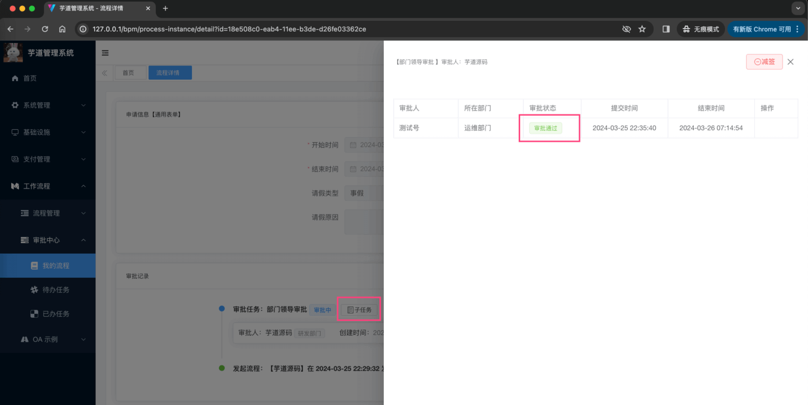

后续，我们登录回之前的账号，继续审批当前（原）任务即可。

#### [#](#_1-2-2-后端实现) 1.2.2 后端实现

因为和普通审批一样，所以对应的还是 BpmTaskController 的 `#approveTask(...)` 方法，如下图所示：

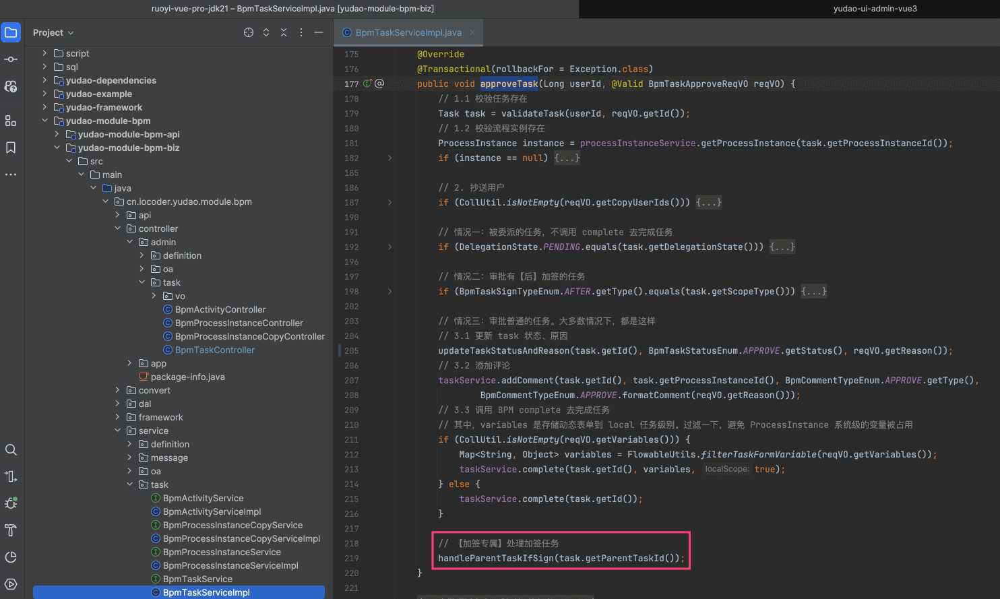

关键还是 `#handleParentTaskIfSign(...)` 方法，在向前加签的情况下，需要将当前（原）任务又变回“待审核”状态。如下图所示：

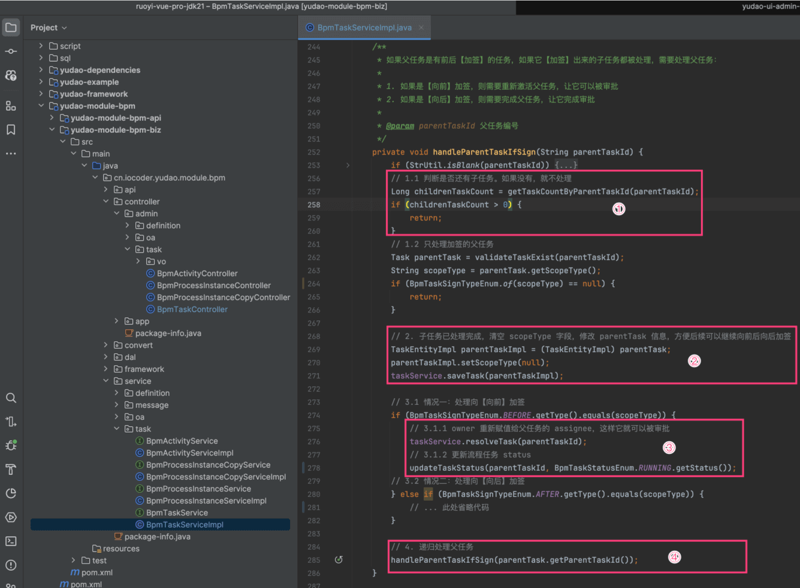

*   红圈 ① 的 `1.1` 处：由于可以加签多个子任务，所以需要全部审批通过后才能继续审批当前（原）任务
*   红圈 ② 的 `2.` 处：清空当前（原）任务的 `scopeType` 属性，表示当前任务不再处于加签状态，这样它后续可以自由的向前或是向后继续加签
*   红圈 ③ 的 `3.1` 处：恢复当前（原）任务的 `assignee` 审批人，并更新状态回 `RUNNING` 审批中
*   红圈 ④ 的 `4.` 处：由于加签出来的子任务，自身可以继续被加签，所以需要递归向上处理。如果要体验一下，就在「1.2.1 操作步骤」时，不要审批通过，而是加签

## [#](#_2-向后加签) 2. 向后加签
### [#](#_2-1-发起向后加签) 2.1 发起向后加签
#### [#](#_2-1-1-操作步骤) 2.1.1 操作步骤

① 首先，点击「加签」按钮，选择被加签的处理人，之后点击「向后加签」按钮，完成向后加签操作。如下图所示：

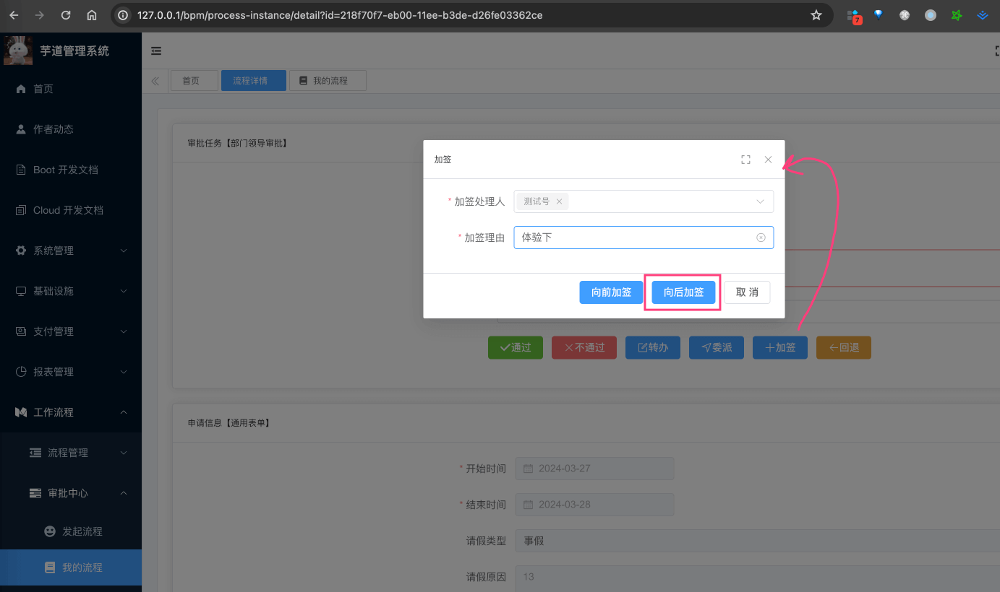

② 之后，可以看到当前任务变成“审核中”状态，它有加签出来的一个子任务，该子任务的状态是“待审核”状态，如下图所示：

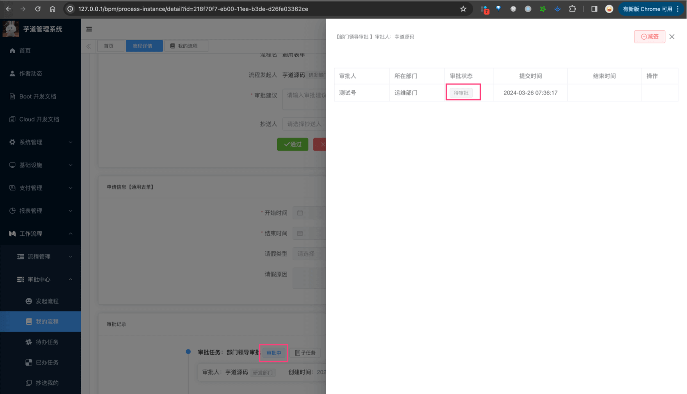

### [#](#_2-2-审批向后加签子任务) 2.2 审批向后加签子任务

对应 BpmTaskController 的 `#createSignTask(...)` 方法，如下图所示：

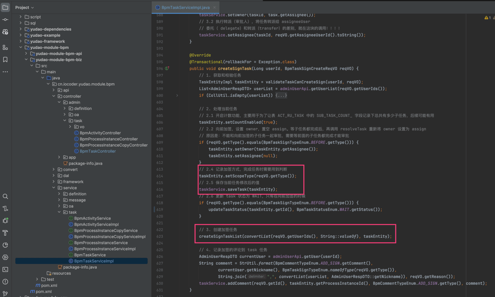

*   相比于向前加签，向后加签的实现更加简单，因为它不需要处理当前（原）任务的状态，只需要创建加签的子任务即可

调用 `#createSignTaskList(...)` 方法，创建加签的子任务，如下图所示：

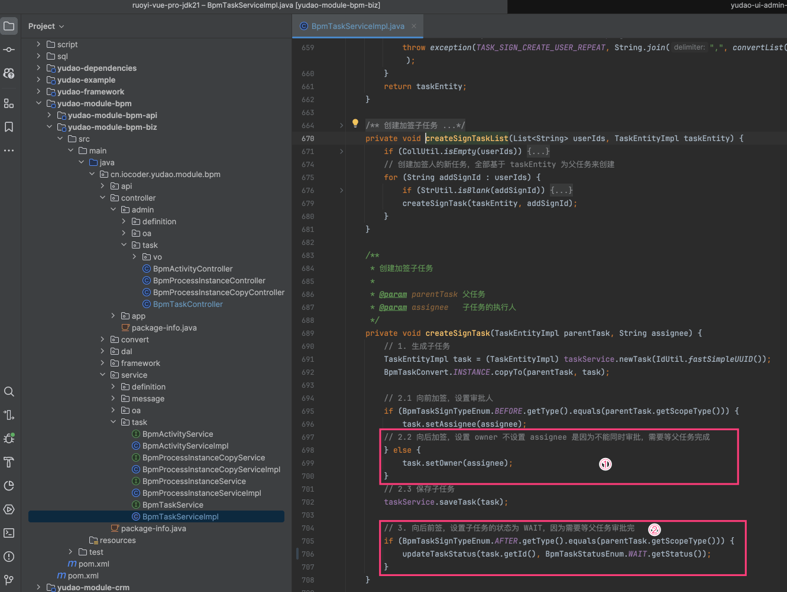

*   红圈 ① 的 `1` 处：创建的向后加签的子任务，只将 `owner` 设置为选择加签的处理人，不包括 `assignee` 审批人。原因是，需要等到当前（原）任务审批通过后，才会设置 `assignee` 审批人
*   红圈 ② 的 `2.` 处：设置向后加签的子任务的状态为 `WAITING` 待审核状态。原因是，当前（原）任务审批通过后，才会设置子任务为 `RUNNING` 审批中

### [#](#_2-2-审批当前-原-任务) 2.2 审批当前（原）任务
### [#](#_2-2-1-操作步骤) 2.2.1 操作步骤

不用切换账号！直接审批当前（原）任务即可。

点击【通过】按钮，将当前（原）任务审批通过，如下图所示：

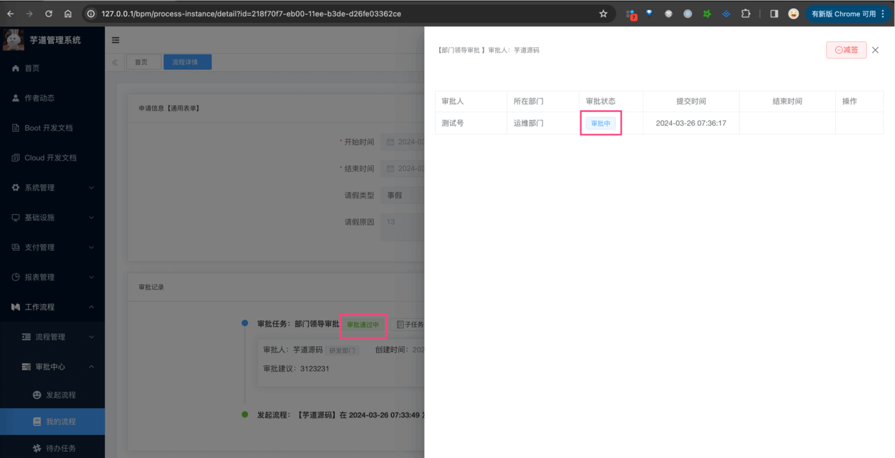

可以看到当前（原）任务变成 `APPROVING` “审批通过中”状态，加签出来的子任务变成 `RUNNING` 审批中状态。

### [#](#_2-2-2-后端实现) 2.2.2 后端实现

对应 BpmTaskController 的 `#createSignTask(...)` 方法，如下图所示：

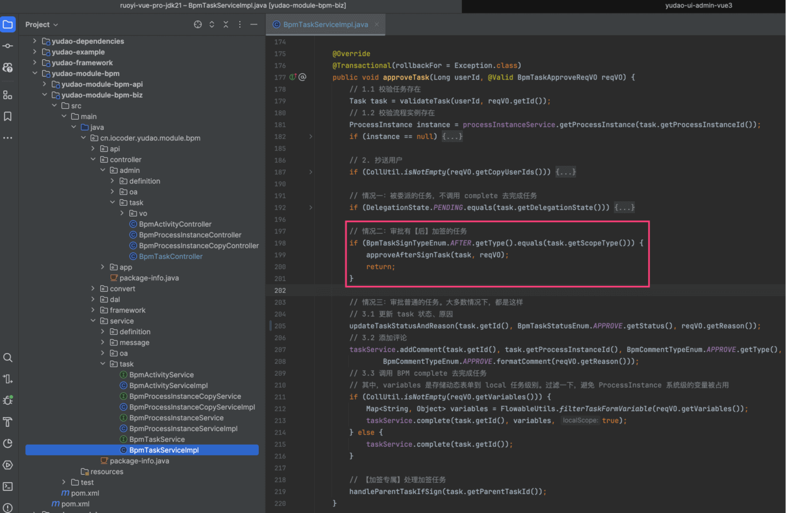

核心实现在 `#approveAfterSignTask(...)` 方法，如下图所示：

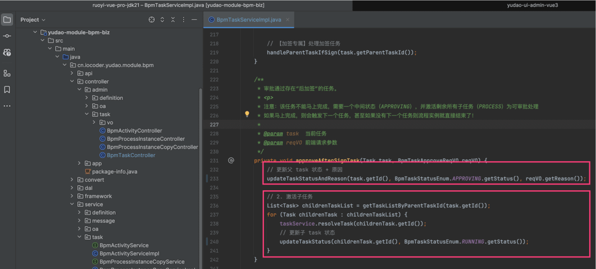

*   对于当前（原）任务来说，任务变成 `APPROVING` “审批通过中”状态
*   对于被加签出来的子任务来说，任务变成 `RUNNING` “审批中”状态，并设置 `assignee` 审批人。也就是说，被加签的人可以开始审批啦~

### [#](#_2-3-审批向后加签子任务) 2.3 审批向后加签子任务
#### [#](#_2-3-1-操作步骤) 2.3.1 操作步骤

登录账号 test、密码 test123 的用户，审批加签任务。

点击【通过】按钮，将后向加签的子任务审批通过，如下图所示：

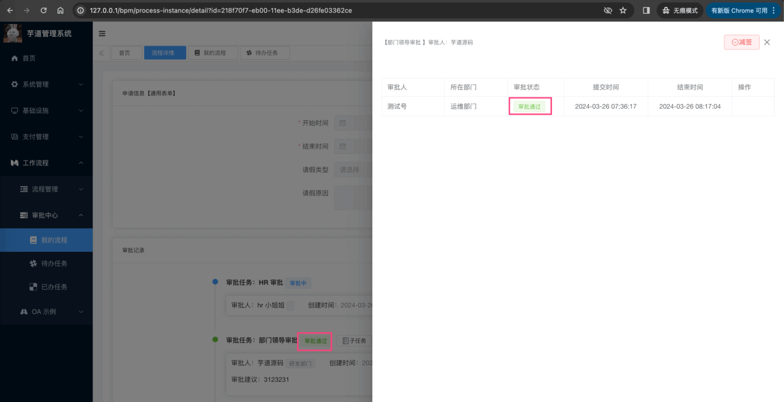

可以看到当前（原）任务变成 `APPROVE` “审批通过”状态，加签出来的子任务也变成 `APPROVE` “审批通过”状态。

#### [#](#_2-3-2-后端实现) 2.3.2 后端实现

对应 BpmTaskController 的 `#createSignTask(...)` 方法，核心实现在 `#handleParentTaskIfSign(...)` 方法，如下图所示：

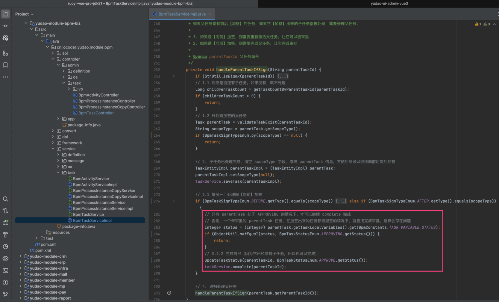

*   红圈部分，当前（原）任务变成 `APPROVE` “审批通过”状态，并调用 `TaskService#complete(...)` 方法来完成

友情提示：

向前、向后加签的逻辑，整体可能有点弯弯绕绕~ 大家在理解的时候，可以找个纸头画一画，这样会更加清晰~

## [#](#_3-减签) 3. 减签
### [#](#_3-1-操作步骤) 3.1 操作步骤

① 点击【减签】按钮，获得可减钱的任务列表，如下图所示：

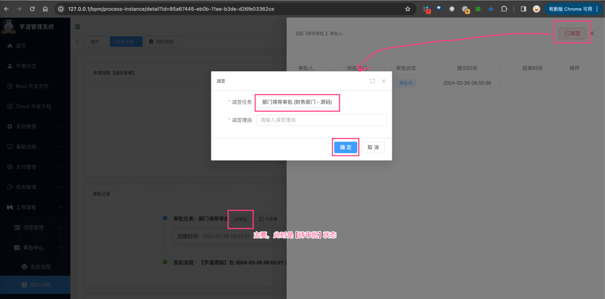

② 选择需要减签的任务，点击【减签】按钮，完成减签操作。如下图所示：

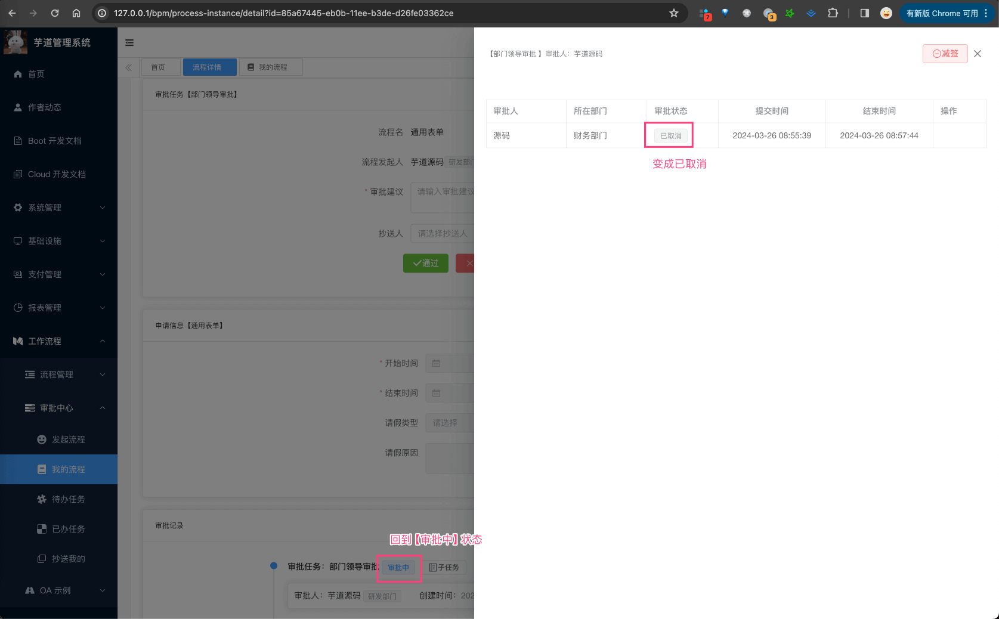

### [#](#_3-2-后端实现) 3.2 后端实现

① 获得可减钱的任务列表，对应 BpmTaskController 的 `#getTaskListByParentTaskId(...)` 方法。如下图所示：

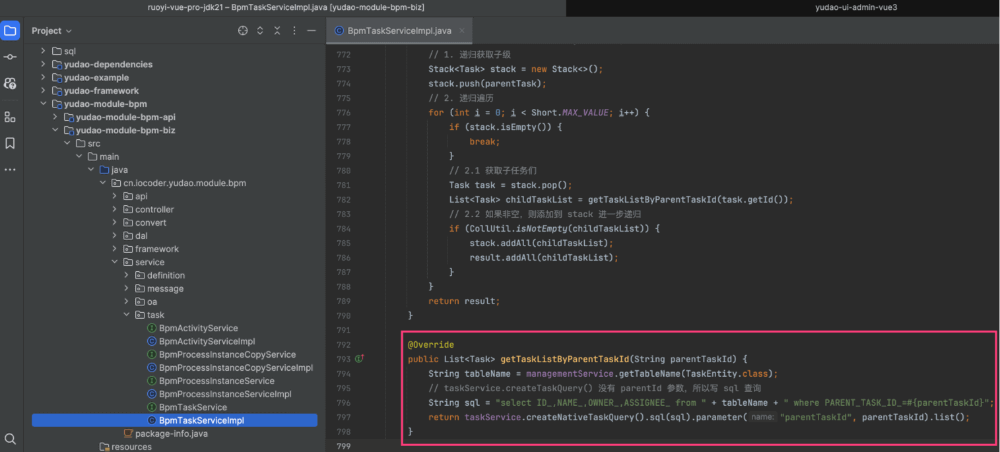

② 执行减签操作，对应 BpmTaskController 的 `#deleteSignTask(...)` 方法。如下图所示：

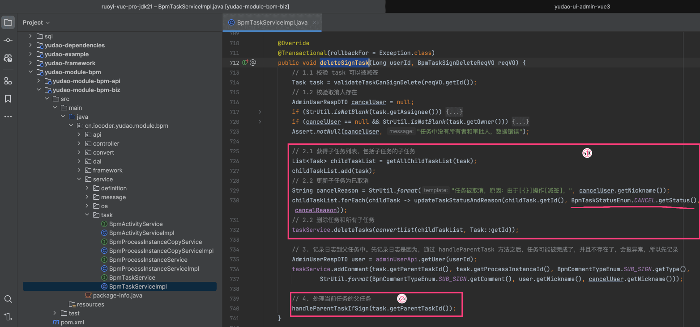

*   红圈 ① 的 `2.1`、`2.2` 处：获得所有的子任务列表，一方面更新它们为 `CANCEL` “已取消”状态，另一方面调用 `TaskService#deleteTasks(...)` 删除它们
*   红圈 ② 的 `4.` 处：需要调用 `#handleParentTaskIfSign(...)` 方法，处理当前（原）任务的状态，不然该任务的状态就一直卡在加签的情况下了