目录

# 审批通过、不通过、驳回

相关视频：

*   [16、如何实现我的待办任务列表？ (opens new window)](https://t.zsxq.com/04QZzjAme)
*   [17、如何实现我的已办任务列表？ (opens new window)](https://t.zsxq.com/04uj6AQJE)
*   [18、如何实现任务的审批通过？ (opens new window)](https://t.zsxq.com/04Q7UbqBM)
*   [19、如何实现任务的审批不通过？ (opens new window)](https://t.zsxq.com/04BQvJM7y)
*   [20、如何实现流程的审批记录？ (opens new window)](https://t.zsxq.com/04Ie2v7m2)

本文，我们围绕 \[审批中心\] 菜单下的 \[待办任务\]、\[已办任务\] 两个子菜单，讲解审批通过、审批不通过、驳回的操作流程。

## [#](#_1-待办任务) 1. 待办任务

待办任务，仅展示需要我审批的任务，对应 \[审批中心 -> 待办任务\] 菜单，如下图所示：

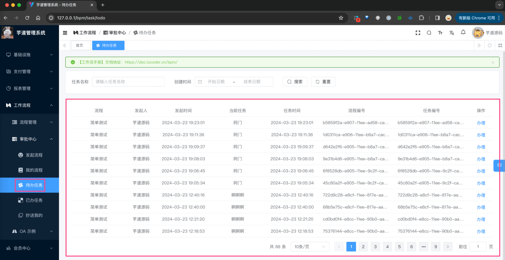

*   后端，对应 BpmTaskController 的 `#getTaskTodoPage(...)` 提供接口
*   前端，对应 `/views/bpm/task/todo/index.vue` 实现界面

### [#](#_1-1-表结构) 1.1 表结构

① 流程任务表，由 Flowable 提供的 `ACT_RU_TASK` 表实现，如下所示：

字段

类型

主键

说明

备注

ID\_

NVARCHAR2(64)

Y

主键

REV\_

INTEGER

N

数据版本

EXECUTION\_ID\_

NVARCHAR2(64)

N

任务所在的执行流 ID

PROC\_INST\_ID\_

NVARCHAR2(64)

N

流程实例 ID

PROC\_DEF\_ID\_

NVARCHAR2(64)

N

流程定义数据 ID

NAME\_

NVARCHAR2(255)

N

任务名称

PARENT\_TASK\_ID\_

NVARCHAR2(64)

N

父任务 ID

DESCRIPTION\_

NVARCHAR2(2000)

N

说明

TASK\_DEF\_KEY\_

NVARCHAR2(255)

N

任务定义的 ID 值

OWNER\_

NVARCHAR2(255)

N

任务拥有人

ASSIGNEE\_

NVARCHAR2(255)

N

被指派执行该任务的人

DELEGATION\_

NVARCHAR2(64)

N

PRIORITY\_

INTEGER

N

CREATE\_TIME\_

TIMESTAMP(6)

N

创建时间

DUE\_DATE\_

TIMESTAMP(6)

N

耗时

CATEGORY\_

NVARCHAR2(255)

N

SUSPENSION\_STATE\_

INTEGER

N

是否挂起

1 代表激活 2 代表挂起

TENANT\_ID\_

NVARCHAR2(255)

N

FORM\_KEY\_

NVARCHAR2(255)

N

CLAIM\_TIME\_

TIMESTAMP(6)

N

② 流程参数表，由 Flowable 提供的 `ACT_RU_VARIABLE` 表实现，如下所示：

字段

类型

主键

说明

备注

ID\_

NVARCHAR2(64)

Y

主键

REV\_

INTEGER

N

数据版本

TYPE\_

NVARCHAR2(255)

N

参数类型

可以是基本的类型，也可以用户自行扩展

NAME\_

NVARCHAR2(255)

N

参数名称

EXECUTION\_ID\_

NVARCHAR2(64)

N

参数执行 ID

PROC\_INST\_ID\_

NVARCHAR2(64)

N

流程实例 ID

TASK\_ID\_

NVARCHAR2(64)

N

任务 ID

BYTEARRAY\_ID\_

NVARCHAR2(64)

N

资源 ID

DOUBLE\_

NUMBER(\*,10)

N

参数为 double，则保存在该字段中

LONG\_

NUMBER(19)

N

参数为 long，则保存在该字段中

TEXT\_

NVARCHAR2(2000)

N

用户保存文本类型的参数值

TEXT2\_

NVARCHAR2(2000)

N

用户保存文本类型的参数值

在 Flowable 中，如果想给 Task 增加拓展字段，无法通过 `ACT_RU_TASK` 实现，而是通过 `ACT_RU_VARIABLE` 表实现。

该表是一种 Key-Value 的形式，可以存储任意类型的数据。例如说，项目中给 Task 增加了一个 `TASK_STATUS` 字段，表示任务状态，如下图所示：

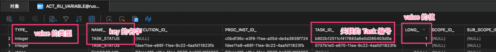

### [#](#_1-2-任务状态) 1.2 任务状态

任务状态，由 [BpmTaskStatusEnum (opens new window)](https://github.com/YunaiV/ruoyi-vue-pro/blob/master/yudao-module-bpm/yudao-module-bpm-api/src/main/java/cn/iocoder/yudao/module/bpm/enums/task/BpmTaskStatusEnum.java) 目前有 8 种，如下图所示：

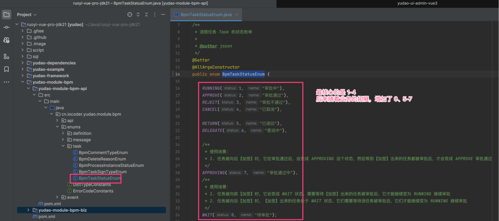

### [#](#_1-3-审批通过) 1.3 审批通过

审批通过，由 BpmTaskController 的 `#approveTask(...)` 提供接口，如下图所示：

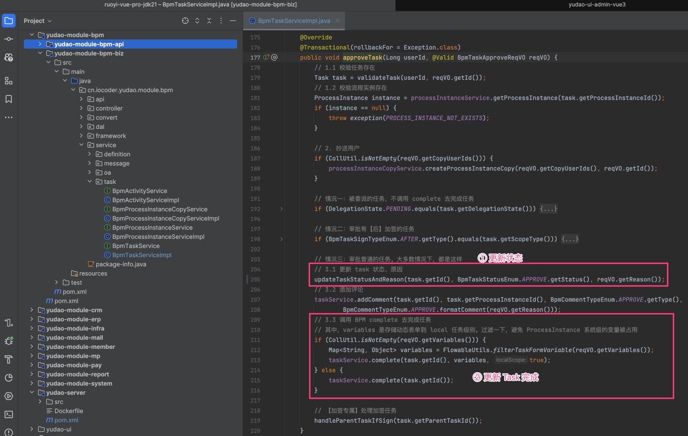

最核心的，就是调用 Flowable 的 `TaskService#complete(...)` 方法，完成任务。同时因为 Flowable 自身没有任务状态，所以需要我们自己维护任务状态。如下图所示：

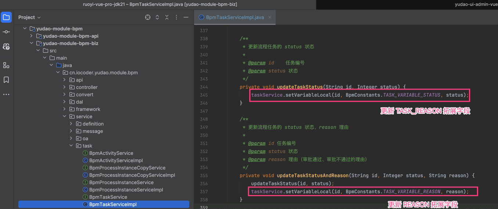

### [#](#_1-4-审批不通过) 1.4 审批不通过

审批不通过，由 BpmTaskController 的 `#rejectTask(...)` 提供接口，如下图所示：

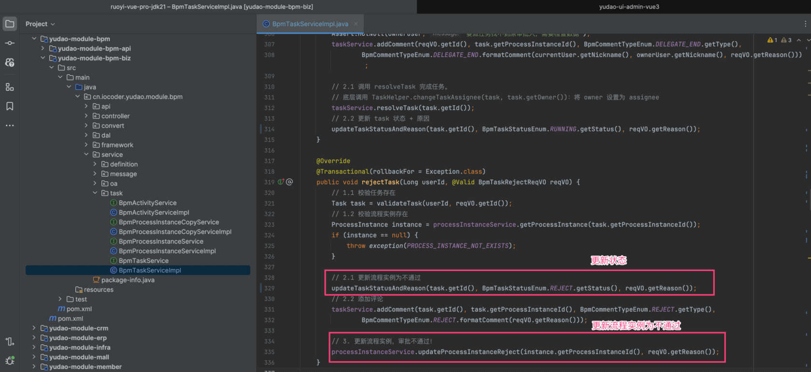

注意，任务只要审批不通过，整个流程都会被中止（审批不通过），即使在或签场景下！

### [#](#_1-5-驳回) 1.5 驳回

驳回（退回），将审批重置发送给某节点，重新审批。如下图所示：

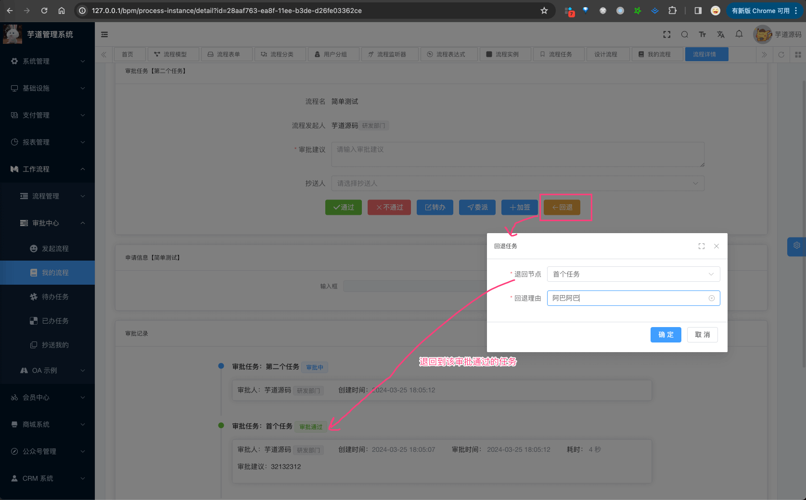

① 获得可驳回的节点，由 BpmTaskController 的 `#getTaskListByReturn(...)` 提供接口，如下图所示：

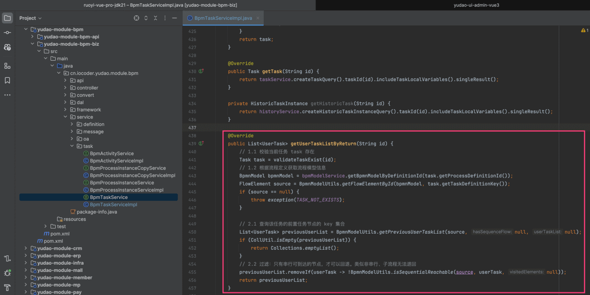

② 发起驳回，由 BpmTaskController 的 `#returnTask(...)` 提供接口，如下图所示：

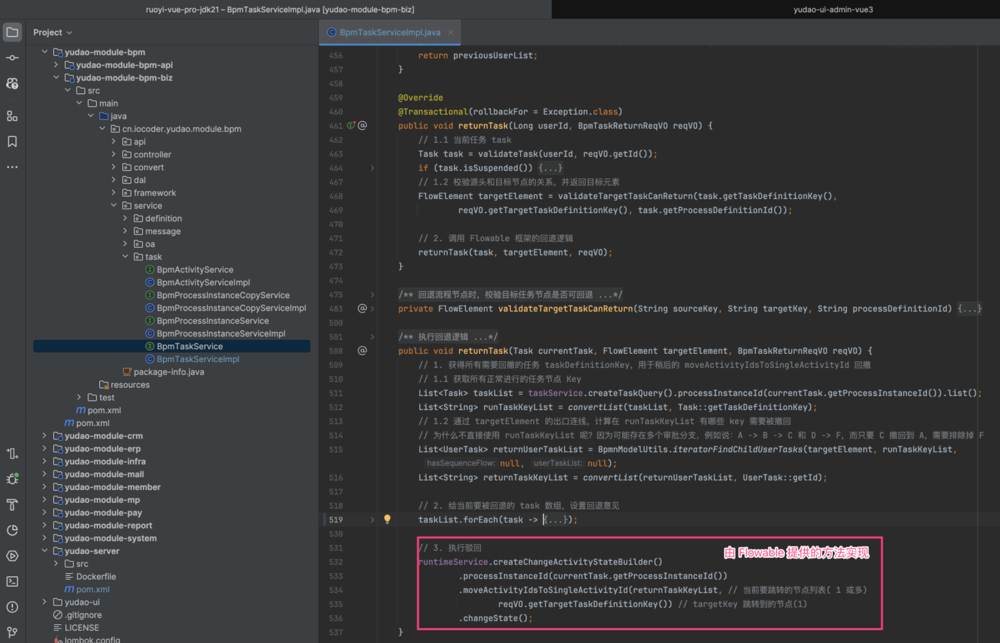

核心还是 Flowable 提供的 `#moveActivityIdsToSingleActivityId(...)` 方法，它是 Activiti 没有内置的方法，所以在 Activiti 实现驳回就略微麻烦一些。

## [#](#_2-已办任务) 2. 已办任务

已办任务，仅展示我审批过的任务，对应 \[审批中心 -> 已办任务\] 菜单，如下图所示：

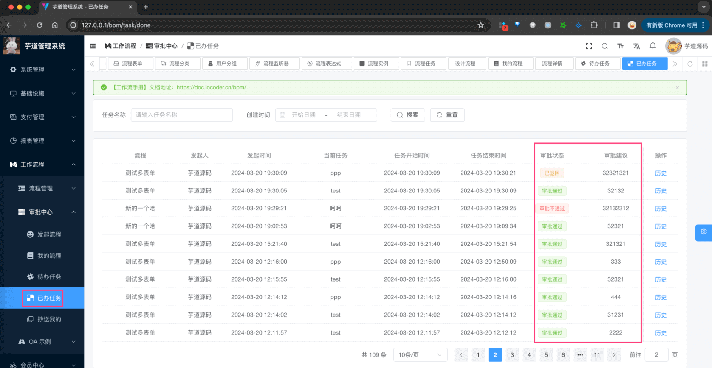

*   后端，对应 BpmTaskController 的 `#getTaskDonePage(...)` 提供接口
*   前端，对应 `/views/bpm/task/done/index.vue` 实现界面

### [#](#_2-1-表结构) 2.1 表结构

① 流程历史任务表，由 Flowable 提供的 `ACT_HI_TASKINST` 表实现，如下所示：

字段

类型

主键

说明

备注

字段

类型

主键

说明

备注

ID\_

NVARCHAR2(64)

Y

主键

PROC\_DEF\_ID\_

NVARCHAR2(64)

N

流程定义 ID

TASK\_DEF\_KEY\_

NVARCHAR2(255)

N

任务定义的 ID 值

PROC\_INST\_ID\_

NVARCHAR2(64)

N

流程实例 ID

EXECUTION\_ID\_

NVARCHAR2(64)

N

执行 ID

PARENT\_TASK\_ID\_

NVARCHAR2(64)

N

父任务 ID

NAME\_

NVARCHAR2(255)

N

名称

DESCRIPTION\_

NVARCHAR2(2000)

N

说明

OWNER\_

NVARCHAR2(255)

N

实际签收人 任务的拥有者

签收人（默认为空，只有在委托时才有值）

ASSIGNEE\_

NVARCHAR2(255)

N

被指派执行该任务的人

START\_TIME\_

TIMESTAMP(6)

N

开始时间

CLAIM\_TIME\_

TIMESTAMP(6)

N

提醒时间

END\_TIME\_

TIMESTAMP(6)

N

结束时间

DURATION\_

NUMBER(19)

N

耗时

DELETE\_REASON\_

NVARCHAR2(2000)

N

删除原因

PRIORITY\_

INTEGER

N

优先级别

DUE\_DATE\_

TIMESTAMP(6)

N

过期时间

FORM\_KEY\_

NVARCHAR2(255)

N

节点定义的 formkey

CATEGORY\_

NVARCHAR2(255)

N

类别

TENANT\_ID\_

NVARCHAR2(255)

N

在 Flowable 中，如果 Task 被完成（审批通过、不通过、取消等）时候，会从 `ACT_RU_TASK` 表中删除，只能在 `ACT_HI_TASKINST` 表查询到。这是一种“冷热分离”的设计思想，因为进行的任务访问比较频繁，数据量越小，性能会越好。

② 流程历史参数表，由 Flowable 提供的 `ACT_HI_VARINST` 表实现，如下所示：

字段

类型

主键

说明

备注

ID\_

NVARCHAR2(64)

Y

主键

PROC\_INST\_ID\_

NVARCHAR2(64)

N

流程实例 ID

EXECUTION\_ID\_

NVARCHAR2(64)

N

指定 ID

TASK\_ID\_

NVARCHAR2(64)

N

任务 ID

NAME\_

NVARCHAR2(255)

N

名称

VAR\_TYPE\_

NVARCHAR2(100)

N

参数类型

REV\_

INTEGER

N

数据版本

BYTEARRAY\_ID\_

NVARCHAR2(64)

N

字节表 ID

DOUBLE\_

NUMBER(\*,10)

N

存储 double 类型数据

LONG\_

NUMBER(\*,10)

N

存储 long 类型数据

TEXT\_

NVARCHAR2(2000)

N

TEXT2\_

NVARCHAR2(2000)

N

CREATE\_TIME\_

TIMESTAMP(6)(2000)

N

LAST\_UPDATED\_TIME\_

TIMESTAMP(6)(2000)

N

在 Flowable 中，如果 Task 被完成（审批通过、不通过、取消等）时候，会从 `ACT_RU_VARIABLE` 表中删除，只能在 `ACT_HI_VARINST` 表查询到。这当然也是是一种“冷热分离”的设计思想~

## [#](#_3-流程任务) 3. 流程任务

流程任务，展示系统中所有的任务，一般用于管理员查询，对应 \[流程管理 -> 流程任务\] 菜单，如下图所示：

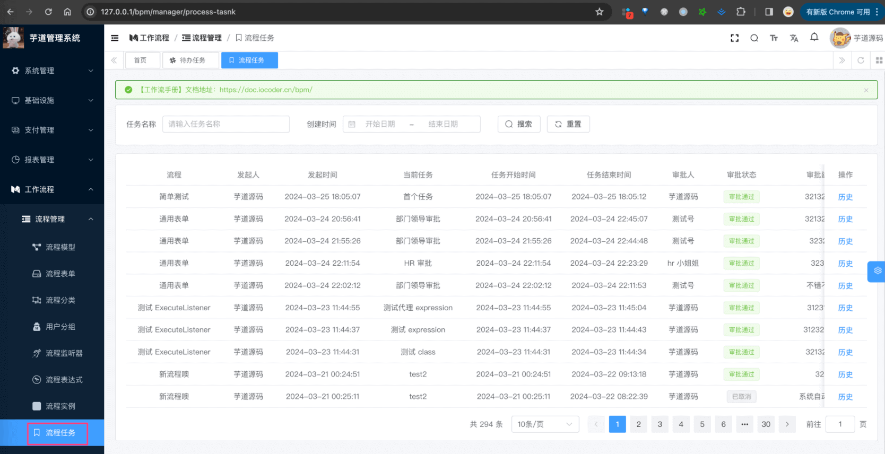

*   后端，对应 BpmTaskController 的 `#getTaskManagerPage(...)` 提供接口
*   前端，对应 `/views/bpm/task/manager/index.vue` 实现界面

由于它查询的是所有任务，所以读取的是 `ACT_HI_TASKINST` 表，而不是 `ACT_RU_TASK` 表。

## [#](#_666-更多功能) 666. 更多功能

*   [《自动跳过、自动审批》 (opens new window)](https://t.zsxq.com/9fXWS)