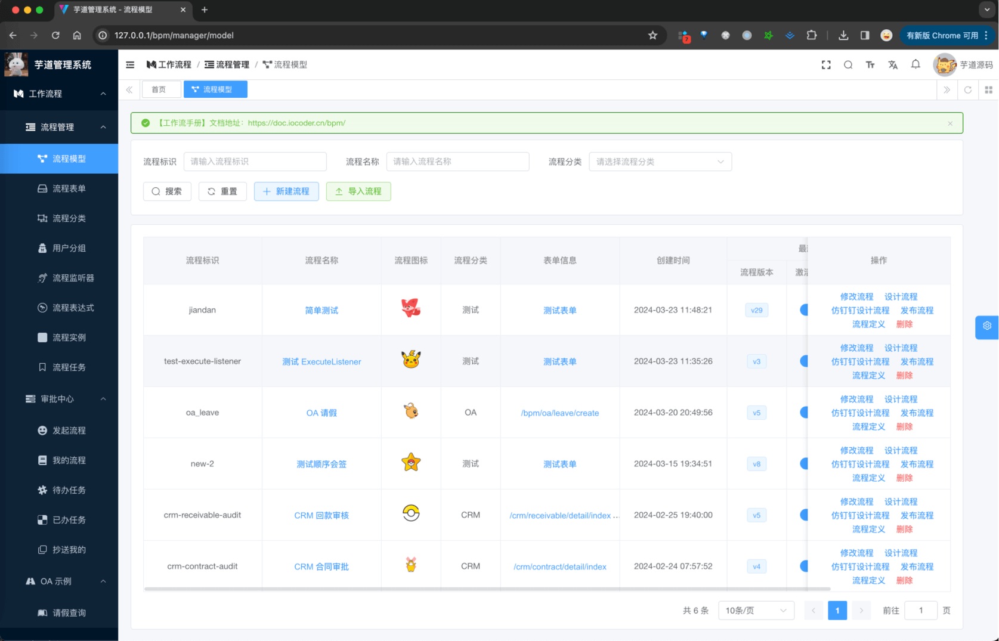
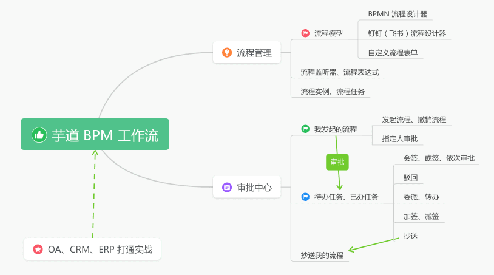
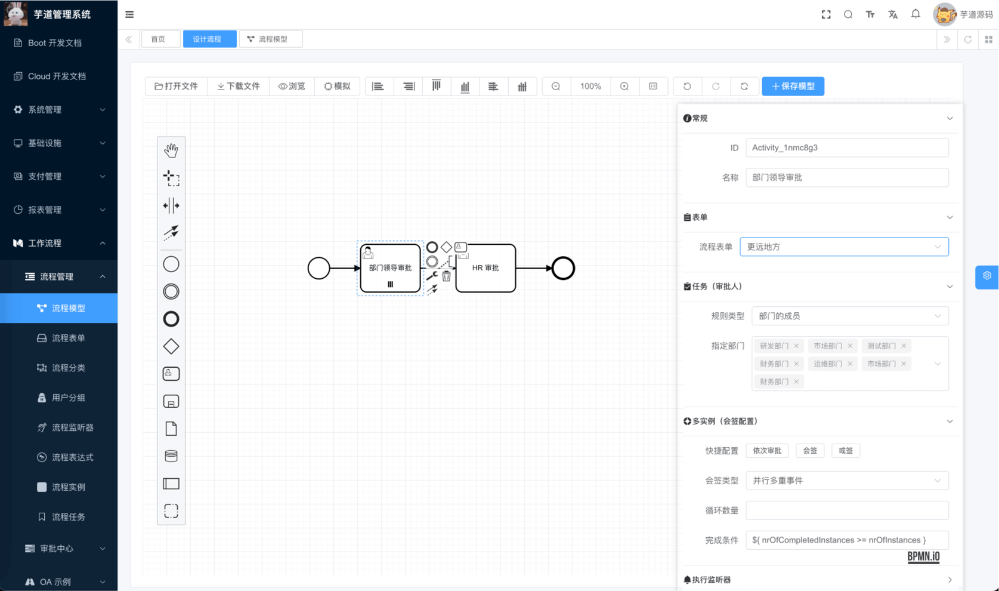
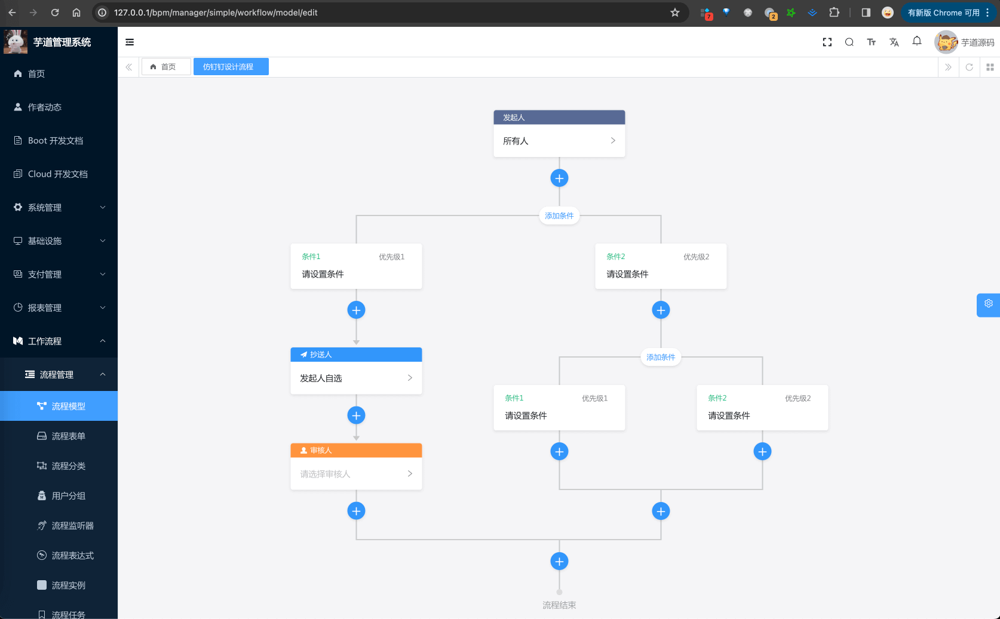
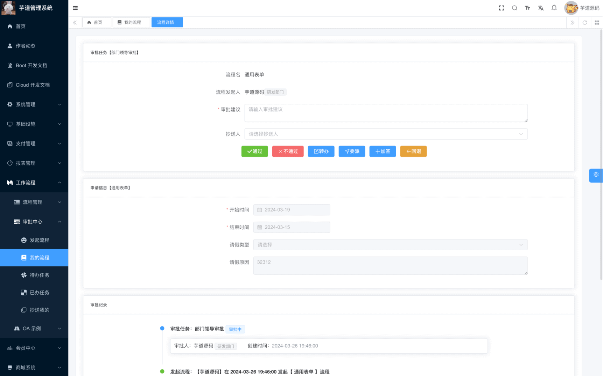

目录

# 工作流演示

友情提示：BPM 全称是，业务流程管理（Business Process Management），实现工作流的功能

## [#](#_1-演示地址) 1. 演示地址
### [#](#_1-1-bpm-管理后台) 1.1 BPM 管理后台

*   演示地址：[http://dashboard-vue3.yudao.iocoder.cn/ (opens new window)](http://dashboard-vue3.yudao.iocoder.cn/)
*   菜单：“工作流程”下的「流程管理」「审批菜单」「OA 实例」等
*   仓库：[https://github.com/yudaocode/yudao-ui-admin-vue3 (opens new window)](https://github.com/yudaocode/yudao-ui-admin-vue3) 的 `bpm` 目录，基于 Vue3 + Element Plus 实现

### [#](#_1-2-bpm-后端) 1.2 BPM 后端

支持 Spring Boot 单体、Spring Cloud 微服务架构

*   单体仓库： [https://github.com/YunaiV/ruoyi-vue-pro (opens new window)](https://github.com/YunaiV/ruoyi-vue-pro) 的 `yudao-module-bpm` 模块
*   微服务仓库： [https://github.com/YunaiV/yudao-cloud (opens new window)](https://github.com/YunaiV/yudao-cloud) 的 `yudao-module-bpm` 服务

## [#](#_2-工作流启动) 2. 工作流启动

参见 [《工作流手册 —— 功能开启》](/bpm/) 文档，一般 3 分钟就可以启动完成。

## [#](#_3-工作流交流) 3. 工作流交流

专属交流社区，欢迎扫码加入。

微信扫描上方二维码，加入后可观看视频！

*   [01、如何集成 Flowable 框架？ (opens new window)](https://t.zsxq.com/04aqfIiY3)
*   [02、如何实现动态的流程表单？ (opens new window)](https://t.zsxq.com/04nun2RRz)
*   [03、如何实现流程表单的保存？ (opens new window)](https://t.zsxq.com/04uneeaUb)
*   [04、如何实现流程表单的展示？ (opens new window)](https://t.zsxq.com/04jiMrjAm)
*   [05、如何实现流程模型的新建？ (opens new window)](https://t.zsxq.com/04iynUF6e)
*   [06、如何实现流程模型的流程图的设计？ (opens new window)](https://t.zsxq.com/04rNVbEQB)
*   [07、如何实现流程模型的流程图的预览？ (opens new window)](https://t.zsxq.com/042neybYz)
*   [08、如何实现流程模型的分配规则？ (opens new window)](https://t.zsxq.com/04uburRvZ)
*   [09、如何实现流程模型的发布？ (opens new window)](https://t.zsxq.com/04jUBMjyF)
*   [10、如何实现流程定义的查询？ (opens new window)](https://t.zsxq.com/04MF6URvz)
*   [11、如何实现流程的发起？ (opens new window)](https://t.zsxq.com/04jyvNfqj)
*   [12、如何实现我的流程列表？ (opens new window)](https://t.zsxq.com/046UFqRzz)
*   [13、如何实现流程的取消？ (opens new window)](https://t.zsxq.com/04aM72rzv)
*   [14、如何实现流程的任务分配？ (opens new window)](https://t.zsxq.com/04rNvFI2f)
*   [15、如何实现会签、或签任务？ (opens new window)](https://t.zsxq.com/04yFUVZvF)
*   [16、如何实现我的待办任务列表？ (opens new window)](https://t.zsxq.com/04QZzjAme)
*   [17、如何实现我的已办任务列表？ (opens new window)](https://t.zsxq.com/04uj6AQJE)
*   [18、如何实现任务的审批通过？ (opens new window)](https://t.zsxq.com/04Q7UbqBM)
*   [19、如何实现任务的审批不通过？ (opens new window)](https://t.zsxq.com/04BQvJM7y)
*   [20、如何实现流程的审批记录？ (opens new window)](https://t.zsxq.com/04Ie2v7m2)
*   [21、如何实现流程的流程图的高亮？ (opens new window)](https://t.zsxq.com/04R72rzzN)
*   [22、如何实现工作流的短信通知？ (opens new window)](https://t.zsxq.com/04eyRRJ2f)
*   [23、如何实现 OA 请假的发起？ (opens new window)](https://t.zsxq.com/04rFUjIei)
*   [24、如何实现 OA 请假的审批？ (opens new window)](https://t.zsxq.com/04fMJiufQ)

## [#](#_4-功能描述) 4. 功能描述

基于 Flowable 构建，满足中国特色流程操作：

功能

描述

进度

会签

同一个审批节点设置多个人（如 A、B、C 三人，三人会同时收到待办任务），需全部同意之后，审批才可到下一审批节点

✅

或签

同一个审批节点设置多个人，任意一个人处理后，就能进入下一个节点

✅

依次审批

（顺序会签）同一个审批节点设置多个人（如 A、B、C 三人），三人按顺序依次收到待办，即 A 先审批，A 提交后 B 才能审批，需全部同意之后，审批才可到下一审批节点

✅

抄送

将审批结果通知给抄送列表对应的人，同一个流程实例默认不重复抄送给同一人

✅

驳回

（退回）将审批重置发送给某节点，重新审批

✅

转办

A 转给其 B 审批，B 审批后，进入下一节点

✅

委派

A 转给其 B 审批，B 审批后，转给 A，A 继续审批后进入下一节点

✅

加签

允许当前办理人根据需要，自行增加当前办理节点的办理人员，支持向前、向后加签

✅

减签

在当前办理人操作之前减少办理人

✅

撤销

流程发起者可以对流程进行撤销处理

✅

终止

在任意节点终止流程实例

✅

### [#](#_4-1-bpmn-流程设计器) 4.1 BPMN 流程设计器

*   [《流程设计器（BPMN）》](/bpm/model-designer-bpmn/)
*   [《选择审批人、发起人自选》](/bpm/assignee/)
*   [《会签、或签、依次审批》](/bpm/multi-instance/)
*   [《执行监听器、任务监听器》](/bpm/listener/)
*   [《流程表达式》](/bpm/expression/)

### [#](#_4-2-钉钉-飞书-流程设计器) 4.2 钉钉（飞书）流程设计器

*   [《流程设计器（钉钉、飞书）》](/bpm/model-designer-dingding/)

### [#](#_4-3-审批界面) 4.3 审批界面

*   [《审批接入（流程表单）》](/bpm/use-bpm-form/)
*   [《审批接入（业务表单）》](/bpm/use-business-form/)
*   [《流程发起、取消、重新发起》](/bpm/process-instance/)
*   [《审批通过、不通过、驳回》](/bpm/task-todo-done/)
*   [《审批加签、减签》](/bpm/sign/)
*   [《审批转办、委派、抄送》](/bpm/task-delegation-and-cc/)
*   [《流程审批通知》](/bpm/message/)