目录

# 执行监听器、任务监听器

友情提示：

在 BPMN 设计流程图，配置完监听器后，一定要发布流程，否则监听器不会生效。

## [#](#_1-执行监听器) 1. 执行监听器

执行监听器（execution listener），可以在流程执行中发生特定的事件时，执行外部 Java 代码或计算表达式。可以被捕获的事件有：

*   流程实例的启动和结束
*   流程执行转移
*   活动的启动和结束
*   网关的启动和结束
*   中间事件的启动和结束
*   启动事件的结束，和结束事件的启动

总结来说，可以监听的事件只有 start 开始、end 结束。

学习文档：

*   [《Flowable BPMN 用户手册 (v 6.3.0) —— 执行监听器》 (opens new window)](https://tkjohn.github.io/flowable-userguide/#executionListeners)
*   [《Flowable 服务任务执行的三种方式》 (opens new window)](https://developer.aliyun.com/article/1233153)
*   [《Flowable 服务任务类，表达式，委托表达式（代理表达式）》 (opens new window)](https://blog.csdn.net/CCCout/article/details/132454867)

我们可以在 BPMN 设计流程图时，给某个节点添加执行监听器，监听器可以是 Java 类、表达式、委托表达式。如下图所示：

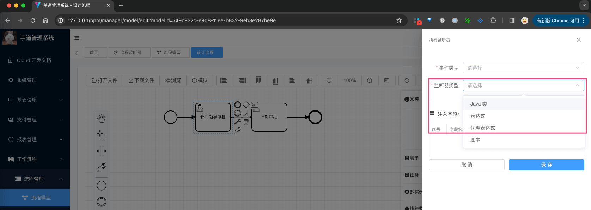

这三种监听器怎么使用呢？我们逐个来看看。

### [#](#_1-1-java-类监听器) 1.1 Java 类监听器

① 新建一个 [DemoDelegateClassExecutionListener (opens new window)](https://github.com/YunaiV/ruoyi-vue-pro/blob/master/yudao-module-bpm/yudao-module-bpm-biz/src/main/java/cn/iocoder/yudao/module/bpm/framework/flowable/core/listener/demo/exection/DemoDelegateClassExecutionListener.java) 类，需要实现 `org.flowable.engine.delegate.JavaDelegate` 接口，如下图所示：

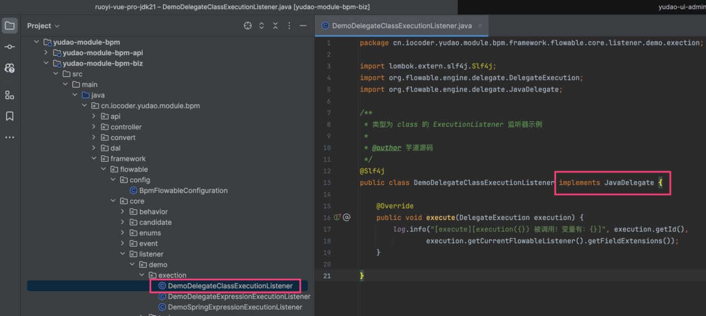

② 在 BPMN 流程图中，配置 Java 类监听器，如下图所示：

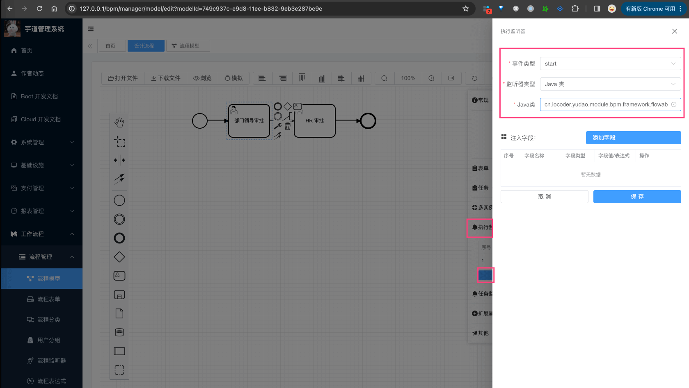

注意，图中填写的是 `cn.iocoder.yudao.module.bpm.framework.flowable.core.listener.demo.exection.DemoDelegateClassExecutionListener` 全路径。

### [#](#_1-2-委托表达式监听器) 1.2 委托表达式监听器

① 新建一个 [DemoDelegateExpressionExecutionListener (opens new window)](https://github.com/YunaiV/ruoyi-vue-pro/blob/master/yudao-module-bpm/yudao-module-bpm-biz/src/main/java/cn/iocoder/yudao/module/bpm/framework/flowable/core/listener/demo/exection/DemoDelegateExpressionExecutionListener.java) 类，也需要实现 `org.flowable.engine.delegate.JavaDelegate` 接口，如下图所示：

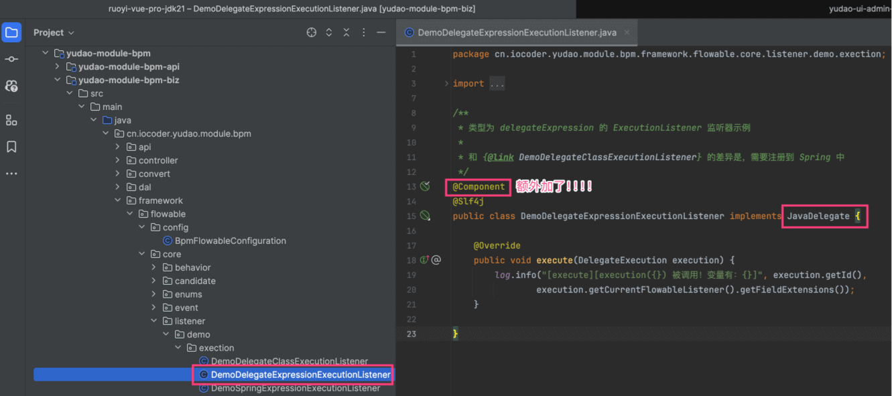

并且，需要声明成 Spring Bean！本质上，“委托表达式”是“Java 类”的特例，和 Spring 做了集成。

② 在 BPMN 流程图中，配置委托表达式监听器，如下图所示：

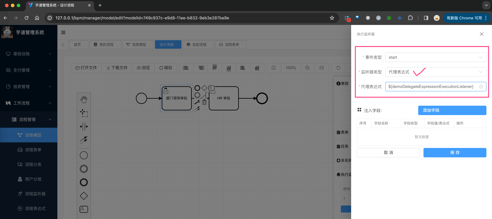

注意，图中填写的是 `${demoDelegateExpressionExecutionListener}`，这个是 Spring Bean 的名称。

### [#](#_1-3-spring-表达式监听器) 1.3 Spring 表达式监听器

① 新建一个 [DemoSpringExpressionExecutionListener (opens new window)](https://github.com/YunaiV/ruoyi-vue-pro/blob/master/yudao-module-bpm/yudao-module-bpm-biz/src/main/java/cn/iocoder/yudao/module/bpm/framework/flowable/core/listener/demo/exection/DemoSpringExpressionExecutionListener.java) 类，只需要声明成 Spring Bean，如下图所示：

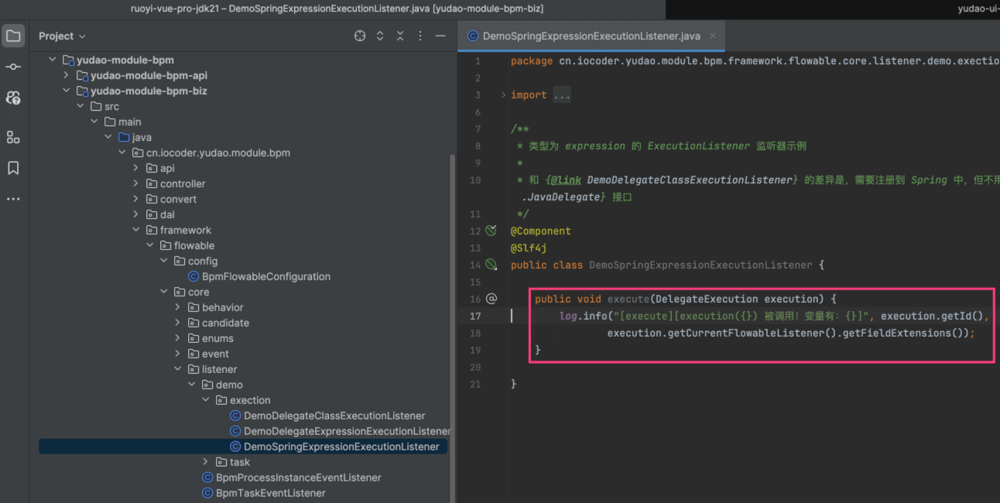

② 在 BPMN 流程图中，配置 Spring 表达式监听器，如下图所示：

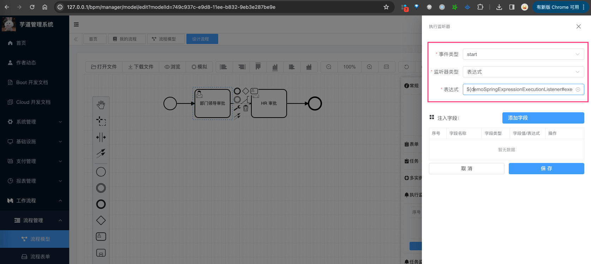

注意，图中填写的是 `${demoSpringExpressionExecutionListener.execute(execution)}`，这个就是通过 Spring EL 表达式，实现对某个 Bean 的某个方法的调用。

## [#](#_2-任务监听器) 2. 任务监听器

任务监听器（task listener），用于在特定的任务相关事件发生时，执行自定义的 Java 逻辑或表达式。

相比执行器来说，它只能监听 UserTask 用户任务，但是事件有 create 创建、assignment 指派、complete 完成、delete 删除、update 更新、timeout 超时。

学习文档：

*   [《Flowable BPMN 用户手册 (v 6.3.0) —— 任务监听器》 (opens new window)](https://tkjohn.github.io/flowable-userguide/#taskListeners)

我们可以在 BPMN 设计流程图时，给某个节点添加任务监听器，监听器可以是 Java 类、表达式、委托表达式。如下图所示：

友情提示：任务监听器，和执行监听器的使用基本是一致的。

### [#](#_2-1-java-类监听器) 2.1 Java 类监听器

① 新建一个 [DemoDelegateClassTaskListener (opens new window)](https://github.com/YunaiV/ruoyi-vue-pro/blob/master/yudao-module-bpm/yudao-module-bpm-biz/src/main/java/cn/iocoder/yudao/module/bpm/framework/flowable/core/listener/demo/task/DemoDelegateClassTaskListener.java) 类，需要实现 `org.flowable.engine.delegate.TaskListener` 接口，如下图所示：

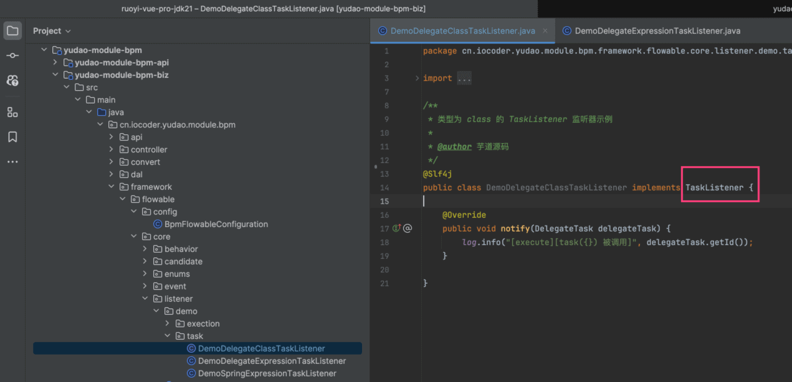

② 在 BPMN 流程图中，配置 Java 类监听器，如下图所示：


注意，图中填写的是 `cn.iocoder.yudao.module.bpm.framework.flowable.core.listener.demo.task.DemoDelegateClassTaskListener` 全路径。

### [#](#_2-2-委托表达式监听器) 2.2 委托表达式监听器

① 新建一个 [DemoDelegateExpressionTaskListener (opens new window)](https://github.com/YunaiV/ruoyi-vue-pro/blob/master/yudao-module-bpm/yudao-module-bpm-biz/src/main/java/cn/iocoder/yudao/module/bpm/framework/flowable/core/listener/demo/task/DemoDelegateExpressionTaskListener.java) 类，也需要实现 `org.flowable.engine.delegate.TaskListener` 接口，如下图所示：

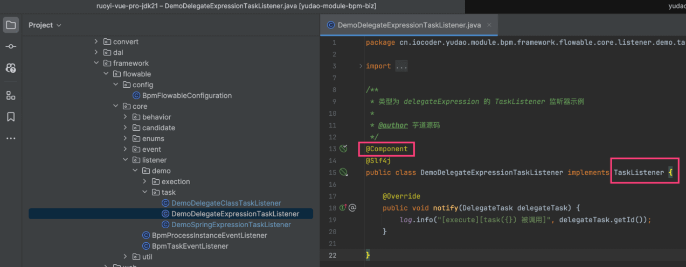

并且，需要声明成 Spring Bean！本质上，“委托表达式”是“Java 类”的特例，和 Spring 做了集成。

② 在 BPMN 流程图中，配置委托表达式监听器，如下图所示：

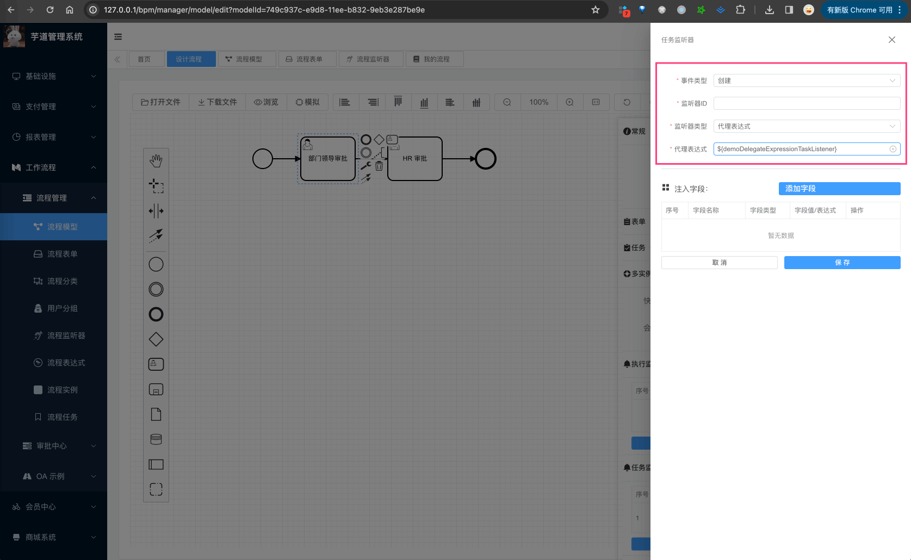

注意，图中填写的是 `${demoDelegateExpressionTaskListener}`，这个是 Spring Bean 的名称。

### [#](#_2-3-spring-表达式监听器) 2.3 Spring 表达式监听器

① 新建一个 [DemoSpringExpressionTaskListener (opens new window)](https://github.com/YunaiV/ruoyi-vue-pro/blob/master/yudao-module-bpm/yudao-module-bpm-biz/src/main/java/cn/iocoder/yudao/module/bpm/framework/flowable/core/listener/demo/task/DemoSpringExpressionTaskListener.java) 类，只需要声明成 Spring Bean，如下图所示：

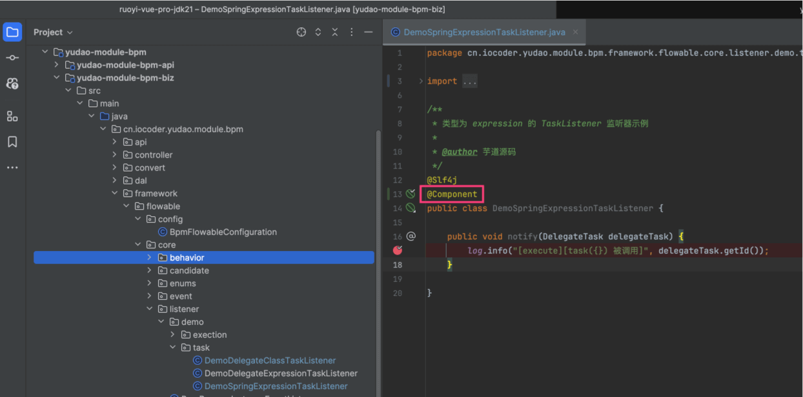

② 在 BPMN 流程图中，配置 Spring 表达式监听器，如下图所示：

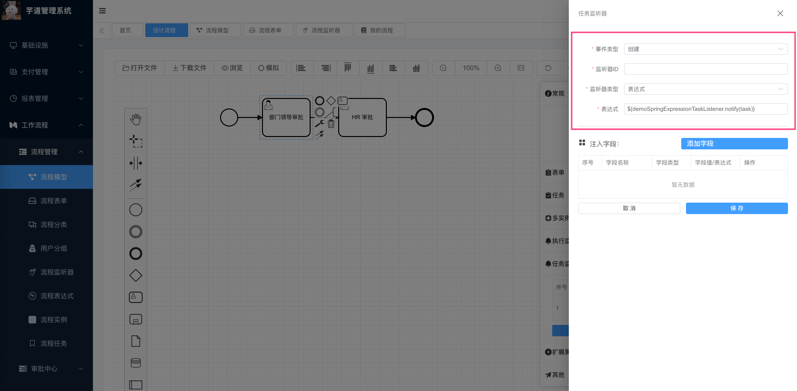

注意，图中填写的是 `${demoSpringExpressionTaskListener.notify(task)}`，这个就是通过 Spring EL 表达式，实现对某个 Bean 的某个方法的调用。

## [#](#_3-流程监听器的模版) 3. 流程监听器的模版

在 \[工作流程 -> 流程管理 -> 流程监控器\] 菜单，可以配置执行监听器、任务监听器的模版。如下图所示：

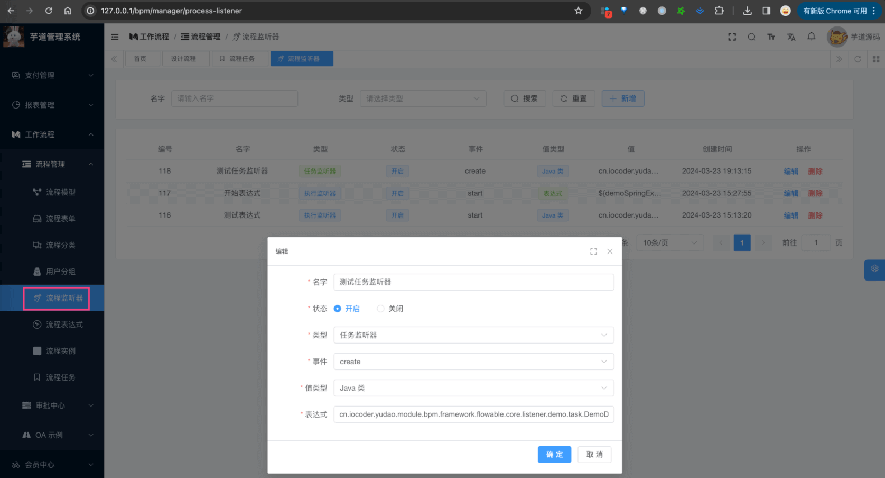

*   前端，对应 `views/bpm/processListener/index.vue` 提供界面
*   后端，对应 `BpmProcessListenerController` 提供接口

### [#](#_3-1-使用场景) 3.1 使用场景

当我们在 BPMN 流程图中，配置监听器时，可以选择模版，而不需要每次都填写监听器信息。如下图所示：


### [#](#_3-2-表结构) 3.2 表结构

流程监听器表，是我们自己定义的 `bpm_process_listener` 表，结构如下：

> 省略 creator/create\_time/updater/update\_time/deleted/tenant\_id 等通用字段

```sql
CREATE TABLE `bpm_process_listener` (
  `id` bigint NOT NULL AUTO_INCREMENT COMMENT '编号',
  `name` varchar(30) CHARACTER SET utf8mb4 COLLATE utf8mb4_unicode_ci NOT NULL DEFAULT '' COMMENT '监听器名字',
  
  `type` varchar(255) COLLATE utf8mb4_unicode_ci NOT NULL COMMENT '监听器类型',
  
  `status` tinyint NOT NULL COMMENT '监听器状态',
  
  `event` varchar(30) CHARACTER SET utf8mb4 COLLATE utf8mb4_unicode_ci NOT NULL DEFAULT '' COMMENT '监听事件',
  
  `value_type` varchar(64) CHARACTER SET utf8mb4 COLLATE utf8mb4_unicode_ci NOT NULL DEFAULT '' COMMENT '监听器值类型',
  `value` varchar(1024) CHARACTER SET utf8mb4 COLLATE utf8mb4_unicode_ci NOT NULL COMMENT '监听器值',
  PRIMARY KEY (`id`) USING BTREE
) ENGINE=InnoDB AUTO_INCREMENT=119 DEFAULT CHARSET=utf8mb4 COLLATE=utf8mb4_unicode_ci COMMENT='BPM 流程监听器表';

```

① `type` 字段，表示监听器类型，可以是 `execution` 执行监听器、`task` 任务监听器。

② `event` 字段，表示监听事件，可以是执行监听器的 `start` 开始、`end` 结束，或者任务监听器的 `create` 创建、`assignment` 指派、`complete` 完成、`delete` 删除、`update` 更新、`timeout` 超时。

③ `value_type` 字段，表示监听器值类型，可以是 `class` Java 类、`expression` 表达式、`delegateExpression` 委托表达式。

`value` 字段，表示监听器值，可以是 Java 类的全路径、表达式、委托表达式。