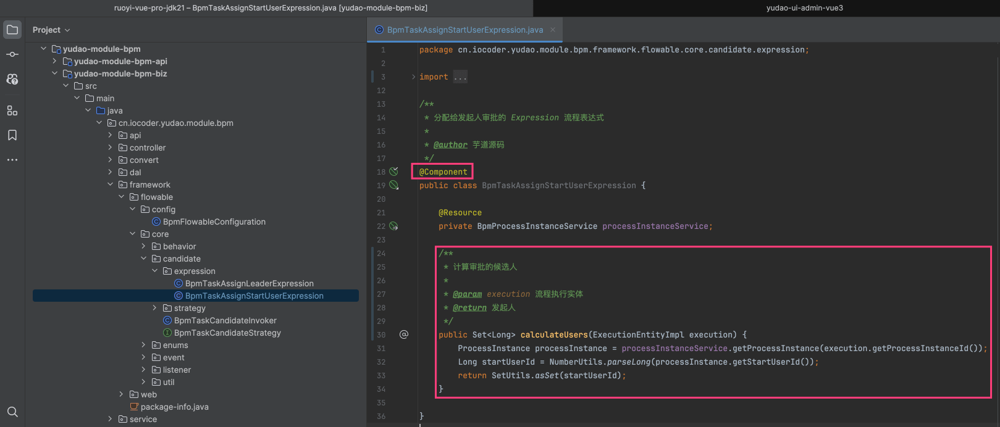
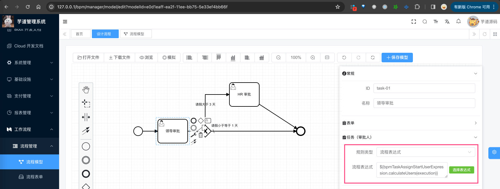
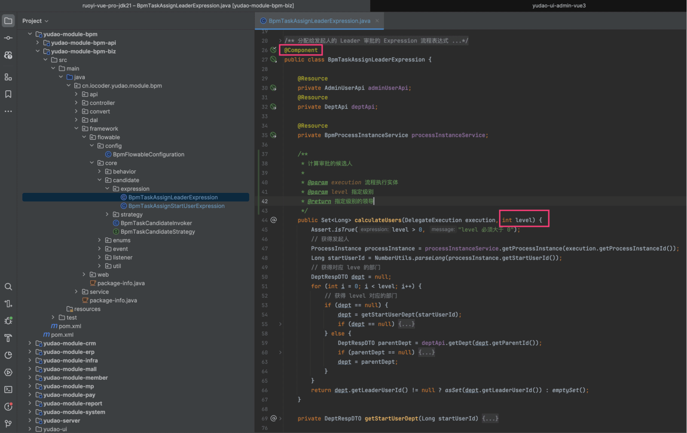
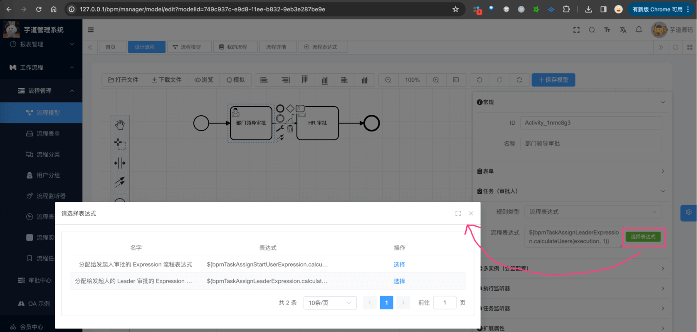

目录

# 流程表达式

## [#](#_1-流程表达式) 1. 流程表达式

Flowable 使用 UEL 进行表达式解析。UEL 代表 [Unified Expression Language (opens new window)](https://docs.oracle.com/javaee/6/tutorial/doc/gjddd.html)，是 EE6 规范的一部分。例如说：

*   在 [《会签、或签、依次审批》](/bpm/multi-instance/) 看到的 `${ nrOfCompletedInstances >= nrOfInstances }`、`${ nrOfCompletedInstances == 1 }` 等，就是 UEL 表达式
*   在 [《审批接入（流程表单）》](/bpm/use-business-form/) 看到的流转条件 `${day > 3}`，也是 UEL 表达式

学习文档：

*   [《Flowable BPMN 用户手册 (v 6.3.0) —— 表达式》 (opens new window)](https://tkjohn.github.io/flowable-userguide/#apiExpressions)

那么，具体怎么定义 UEL 表达式呢？我们逐个来看看。

### [#](#_1-1-bpmtaskassignstartuserexpression) 1.1 BpmTaskAssignStartUserExpression

[BpmTaskAssignStartUserExpression (opens new window)](https://github.com/YunaiV/ruoyi-vue-pro/blob/master/yudao-module-bpm/yudao-module-bpm-biz/src/main/java/cn/iocoder/yudao/module/bpm/framework/flowable/core/candidate/expression/BpmTaskAssignStartUserExpression.java)，分配给发起人审批的 Expression 流程表达式，需要声明成 Spring Bean，代码如下：



使用时，可以在 BPMN 流程图中，配置表达式 `${bpmTaskAssignStartUserExpression.calculateUsers(execution)}` ，如下图所示：



这样，该任务节点的审批人，就会被分配给发起人。

### [#](#_1-2-bpmtaskassignleaderexpression) 1.2 BpmTaskAssignLeaderExpression

[BpmTaskAssignLeaderExpression (opens new window)](https://github.com/YunaiV/ruoyi-vue-pro/blob/master/yudao-module-bpm/yudao-module-bpm-biz/src/main/java/cn/iocoder/yudao/module/bpm/framework/flowable/core/candidate/expression/BpmTaskAssignLeaderExpression.java)，分配给发起人的指定 `level` 级别 Leader 审批的 Expression 流程表达式，需要声明成 Spring Bean，代码如下：



使用时，可以在 BPMN 流程图中，配置表达式 `${bpmTaskAssignLeaderExpression.calculateUsers(execution, 1)}` 表示一级领导，如下图所示：


这样，该任务节点的审批人，就会被分配给发起人的一级领导。

如果想要分配给二级领导，可以使用 `${bpmTaskAssignLeaderExpression.calculateUsers(execution, 2)}`。也就是说，`level` 参数，表示领导的级别。

## [#](#_2-流程表达式的模版) 2. 流程表达式的模版

在 \[工作流程 -> 流程管理 -> 流程表达式\] 菜单，可以配置执行表达式的模版。如下图所示：


*   前端，对应 `views/bpm/processExpression/index.vue` 提供界面
*   后端，对应 `BpmProcessExpressionController` 提供接口

### [#](#_2-1-使用场景) 2.1 使用场景

当我们在 BPMN 流程图中，配置表达式时，可以选择模版，而不需要每次都填写表达式信息。如下图所示：



### [#](#_2-2-表结构) 2.2 表结构

流程表达式表，是我们自己定义的 `bpm_process_expression` 表，结构如下：

> 省略 creator/create\_time/updater/update\_time/deleted/tenant\_id 等通用字段

```sql
CREATE TABLE `bpm_process_expression` (
  `id` bigint NOT NULL AUTO_INCREMENT COMMENT '编号',
  `name` varchar(64) CHARACTER SET utf8mb4 COLLATE utf8mb4_unicode_ci NOT NULL DEFAULT '' COMMENT '表达式名字',
  `status` tinyint NOT NULL COMMENT '表达式状态',
  
  `expression` varchar(1024) CHARACTER SET utf8mb4 COLLATE utf8mb4_unicode_ci NOT NULL COMMENT '表达式',
  PRIMARY KEY (`id`) USING BTREE
) ENGINE=InnoDB AUTO_INCREMENT=120 DEFAULT CHARSET=utf8mb4 COLLATE=utf8mb4_unicode_ci COMMENT='BPM 流程表达式表';

```

关键是 `expression` 字段，表示表达式的内容。