目录

# 流程设计器（BPMN）

相关视频：

*   [05、如何实现流程模型的新建？ (opens new window)](https://t.zsxq.com/04iynUF6e)
*   [06、如何实现流程模型的流程图的设计？ (opens new window)](https://t.zsxq.com/04rNVbEQB)
*   [07、如何实现流程模型的流程图的预览？ (opens new window)](https://t.zsxq.com/042neybYz)
*   [09、如何实现流程模型的发布？ (opens new window)](https://t.zsxq.com/04jUBMjyF)
*   [10、如何实现流程定义的查询？ (opens new window)](https://t.zsxq.com/04MF6URvz)
*   [21、如何实现流程的流程图的高亮？ (opens new window)](https://t.zsxq.com/04R72rzzN)

在 [《审批接入（流程表单）》](/bpm/use-bpm-form/)、[《审批接入（业务表单）》](/bpm/use-business-form/) 小节中，我们已经新建过流程模型，并发布为流程定义，如下图所示：

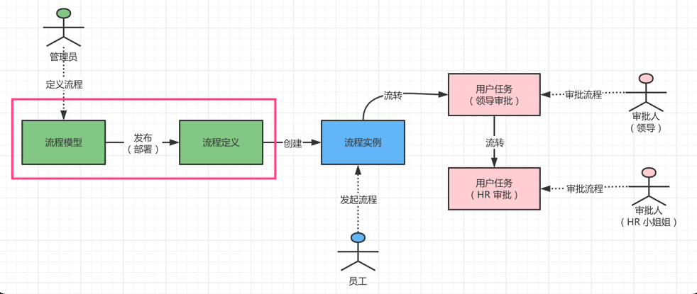

本文，我们将进一步讲解【**流程模型**】、【**流程定义**】，特别是如何使用 BPMN 流程设计器。

## [#](#_1-流程模型) 1. 流程模型

流程模型，对应 \[工作流程 -> 流程管理 -> 流程模型\] 菜单，如下图所示：


*   后端，由 BpmModelController 提供接口
*   前端，由 `/views/bpm/model/index.vue` 实现界面

### [#](#_1-1-表结构) 1.1 表结构

流程设计模型部署表，由 Flowable 提供的 `ACT_RE_MODEL` 表实现，如下所示：

字段名称

字段描述

数据类型

主键

为空

取值说明

ID\_

ID\_

nvarchar(64)

√

ID\_

REV\_

乐观锁

int

√

乐观锁

NAME\_

名称

nvarchar(255)

√

名称

KEY\_

KEY\_

nvarchar(255)

√

key

CATEGORY\_

分类

nvarchar(255)

√

分类

CREATE\_TIME\_

创建时间

datetime

√

创建时间

LAST\_UPDATE\_TIME\_

最新修改时间

datetime

√

最新修改时间

VERSION\_

版本

int

√

版本

META\_INFO\_

META\_INFO\_

nvarchar(255)

√

以 json 格式保存流程定义的信息

DEPLOYMENT\_ID\_

部署ID

nvarchar(255)

√

部署ID

EDITOR\_SOURCE\_VALUE\_ID\_

datetime

√

EDITOR\_SOURCE\_EXTRA\_VALUE\_ID\_

datetime

√

我们可以通过 `META_INFO` 字段，额外拓展了 `icon` 图标、`description` 描述、`formType`、`formId`、`formCustomCreatePath`、`formCustomViewPath` 表单等信息。如下图所示：

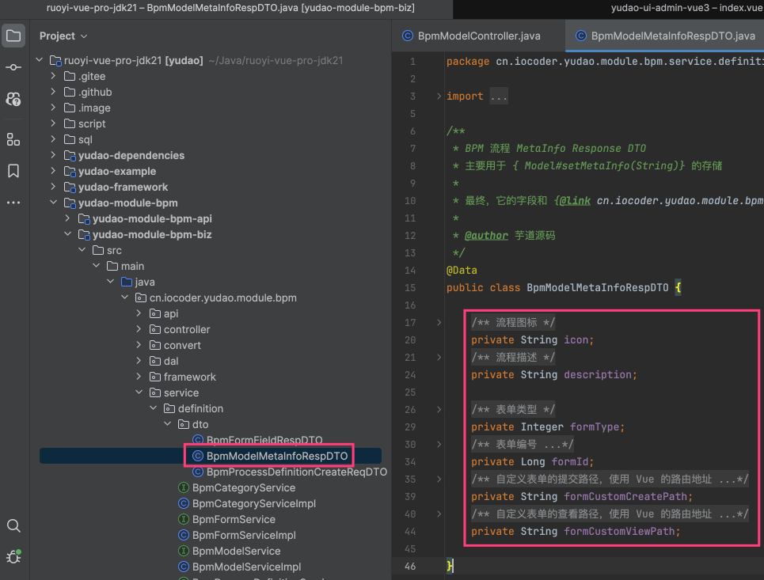

### [#](#_1-2-流程设计器) 1.2 流程设计器

① BPMN 流程设计器，由项目的 [ProcessDesigner.vue (opens new window)](https://github.com/yudaocode/yudao-ui-admin-vue3/blob/master/src/components/bpmnProcessDesigner/package/designer/ProcessDesigner.vue) 实现。

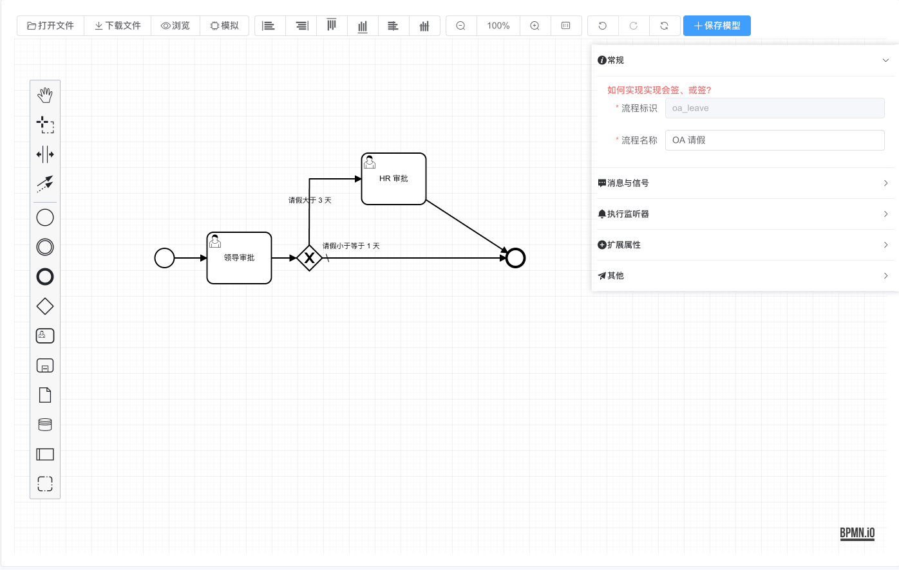

它是基于 [https://github.com/miyuesc/bpmn-process-designer (opens new window)](https://github.com/miyuesc/bpmn-process-designer) 拓展，底层是 [bpmn-js (opens new window)](https://github.com/bpmn-io)。

补充说明：

`bpmn-process-designer` 提供 Vue2 + ElementUI、Vue3 + NaiveUI 两个版本，而我们是 Vue3 + ElementPlus，是通过 Vue2 + ElementUI 迁移适配实现。

② BPMN 预览，支持高亮，由 [ProcessViewer.vue (opens new window)](https://github.com/yudaocode/yudao-ui-admin-vue3/blob/master/src/components/bpmnProcessDesigner/package/designer/ProcessViewer.vue) 实现。

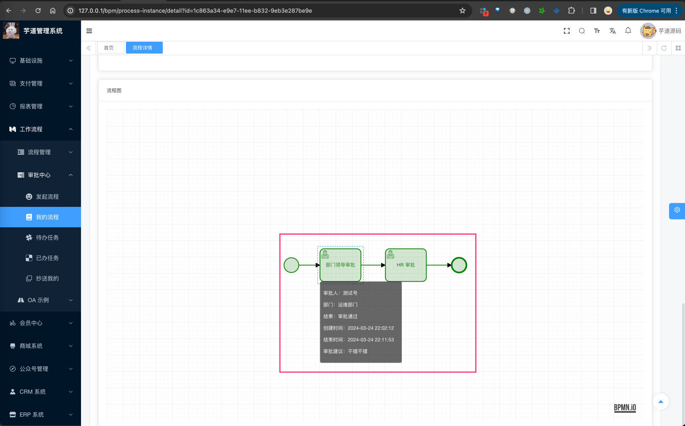

它是直接基于 [bpmn-js (opens new window)](https://github.com/bpmn-io) 拓展，没有基于 `bpmn-process-designer`。

* * *

下面，我们将详细讲解 BPMN 流程设计器的各个配置项：任务（表单）、任务（审批人）、多实例（会签配置）、执行监听器、任务监听器等等。

### [#](#_1-3-任务-表单) 1.3 任务（表单）
#### [#](#_1-3-1-表单配置) 1.3.1 表单配置

每个任务节点，有个 \[表单\] 配置项，用于配置任务审批时，补充填写表单信息。如下图所示：

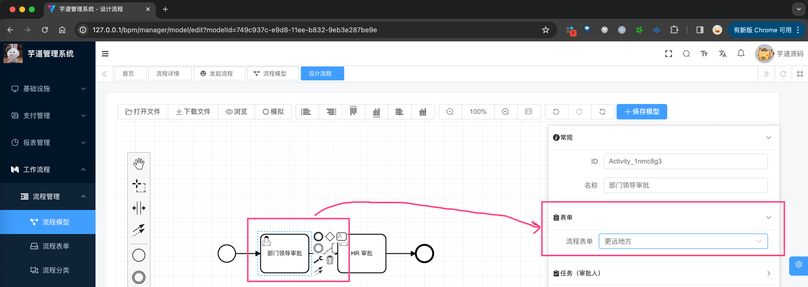

拓展知识：

① 问题：配置的表单，最终是怎么存储的？

回答：在 BPMN 的 UserTask 节点上，有个 `formKey` 属性，用于存储表单的 key，这里我们就存了【流程表单】的编号。

② 问题：为什么只支持【流程表单】，不支持【业务表单】呢？

回答：【业务表单】暂时没想到比较优雅的二次修改方案，因为它属于业务系统，无法在审批通过时，一起进行提交。

③ 问题：表单设计器，怎么使用远程数据？

回答：参见 [https://docs.qq.com/doc/DZlNIVkZSTlVJVEd2 (opens new window)](https://docs.qq.com/doc/DZlNIVkZSTlVJVEd2) 文档。

#### [#](#_1-3-2-表单效果) 1.3.2 表单效果

在审批任务通过时，需要额外填写表单信息，如下图所示：

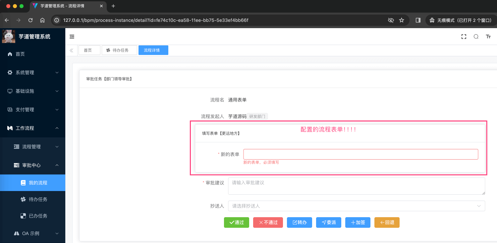

填写的表单数据，会存储到 Flowable 任务的 `variables` 中，如下图所示：

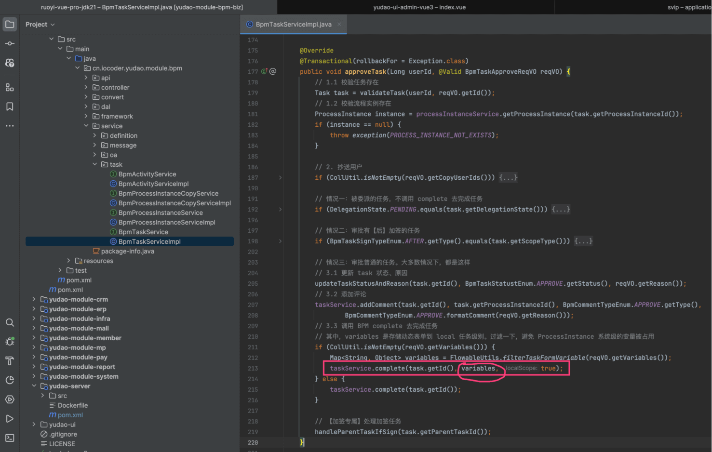

### [#](#_1-4-任务-审批人) 1.4 任务（审批人）


详细见 [《选择审批人、发起人自选》](/bpm/assignee/) 文档。

### [#](#_1-5-多实例-会签配置) 1.5 多实例（会签配置）

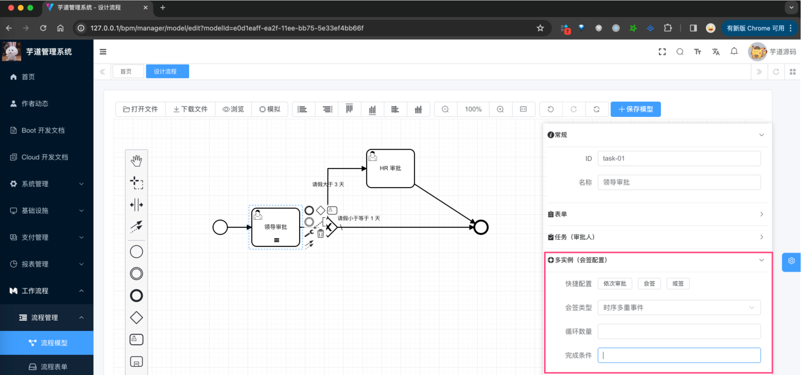

详细见 [《会签、或签、依次审批》](/bpm/multi-instance/) 文档。

### [#](#_1-6-执行监听器) 1.6 执行监听器


详细见 [《执行监听器、任务监听器》](/bpm/listener/) 文档。

### [#](#_1-7-任务监听器) 1.7 任务监听器

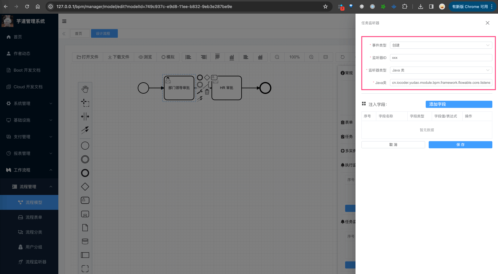

详细见 [《执行监听器、任务监听器》](/bpm/listener/) 文档。

## [#](#_2-流程定义) 2. 流程定义

流程模型在部署后，会创建一个新版本的流程定义，并怪气老版本的流程定义。最终，我们点击某个流程模型的「流程定义」按钮，可以看到它对应的流程定义，如下图所示：

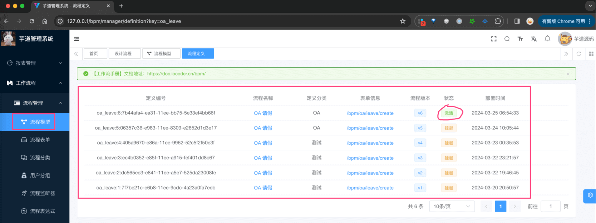

*   后端，由 BpmProcessDefinitionController 提供接口
*   前端，由 [`/views/bpm/definition/index.vue` (opens new window)](https://github.com/yudaocode/yudao-ui-admin-vue3) 实现界面

### [#](#_2-1-表结构) 2.1 表结构

① 流程定义表，由 Flowable 提供的 `ACT_RE_PROCDEF` 表实现，如下所示：

字段

类型

主键

说明

备注

ID\_

NVARCHAR2(64)

Y

主键

REV\_

INTEGER

N

数据版本号

CATEGORY\_

NVARCHAR2(255)

N

流程定义分类

读取 xml 文件中程的 `targetNamespace` 值

NAME\_

NVARCHAR2(255)

N

流程定义的名称

读取流程文件中 `process`元素的 `name` 属性

KEY\_

NVARCHAR2(255)

N

流程定义key

读取流程文件中 `process` 元素的 id 属性

VERSION\_

INTEGER

N

版本

DEPLOYMENT\_ID\_

NVARCHAR2(64)

N

部署ID

流程定义对应的部署数据 ID

RESOURCE\_NAME\_

NVARCHAR2(2000)

N

bpmn文件名称

一般为流程文件的相对路径

DGRM\_RESOURCE\_NAME\_

VARCHAR2(4000)

N

流程定义对应的流程图资源名称

DESCRIPTION\_

NVARCHAR2(2000)

N

说明

HAS\_START\_FORM\_KEY\_

NUMBER(1)

N

是否存在开始节点formKey

`start` 节点是否存在 `formKey`：0-否，1-是

HAS\_GRAPHICAL\_NOTATION\_

NUMBER(1)

N

SUSPENSION\_STATE\_

INTEGER

N

流程定义状态

1-激活、2中止

TENANT\_ID\_

NVARCHAR2(255)

N

ENGINE\_VERSION\_

NVARCHAR2(255)

N

引擎版本

② 由于 `ACT_RE_PROCDEF` 表没有类似 `ACT_RE_MODEL` 有 `META_INFO_` 字段，所以我们额外创建了一个 BPM 流程定义的信息表，用于存储流程定义的额外信息。如下所示：

> 省略 creator/create\_time/updater/update\_time/deleted/tenant\_id 等通用字段

```sql
CREATE TABLE `bpm_process_definition_info` (
  `id` bigint NOT NULL AUTO_INCREMENT COMMENT '编号',
  `process_definition_id` varchar(64) CHARACTER SET utf8mb4 COLLATE utf8mb4_unicode_ci NOT NULL COMMENT '流程定义的编号',
  `model_id` varchar(64) CHARACTER SET utf8mb4 COLLATE utf8mb4_unicode_ci NOT NULL COMMENT '流程模型的编号',
  `icon` varchar(512) CHARACTER SET utf8mb4 COLLATE utf8mb4_unicode_ci DEFAULT NULL COMMENT '图标',
  `description` varchar(255) CHARACTER SET utf8mb4 COLLATE utf8mb4_unicode_ci DEFAULT NULL COMMENT '描述',
  `form_type` tinyint NOT NULL COMMENT '表单类型',
  `form_id` bigint DEFAULT NULL COMMENT '表单编号',
  `form_conf` varchar(1000) CHARACTER SET utf8mb4 COLLATE utf8mb4_unicode_ci DEFAULT NULL COMMENT '表单的配置',
  `form_fields` varchar(5000) CHARACTER SET utf8mb4 COLLATE utf8mb4_unicode_ci DEFAULT NULL COMMENT '表单项的数组',
  `form_custom_create_path` varchar(255) CHARACTER SET utf8mb4 COLLATE utf8mb4_unicode_ci DEFAULT NULL COMMENT '自定义表单的提交路径',
  `form_custom_view_path` varchar(255) CHARACTER SET utf8mb4 COLLATE utf8mb4_unicode_ci DEFAULT NULL COMMENT '自定义表单的查看路径',
  PRIMARY KEY (`id`) USING BTREE
) ENGINE=InnoDB AUTO_INCREMENT=246 DEFAULT CHARSET=utf8mb4 COLLATE=utf8mb4_unicode_ci COMMENT='BPM 流程定义的信息表';

```

本质上，就是把 `ACT_RE_MODEL` 的 `META_INFO_` 字段存储到 `bpm_process_definition_info` 表中。

因此，最终每次流程模型在部署时，会往 Flowable 插入一条 `ACT_RE_PROCDEF` 记录，也会往 `bpm_process_definition_info` 表中插入一条记录。

### [#](#_2-2-流程定义列表-可发起流程) 2.2 流程定义列表（可发起流程）

注意！一个流程模型，有且仅有一个【激活】状态的流程定义。最终，用户发起流程时，选择的是【激活】状态的流程定义。如下图所示：

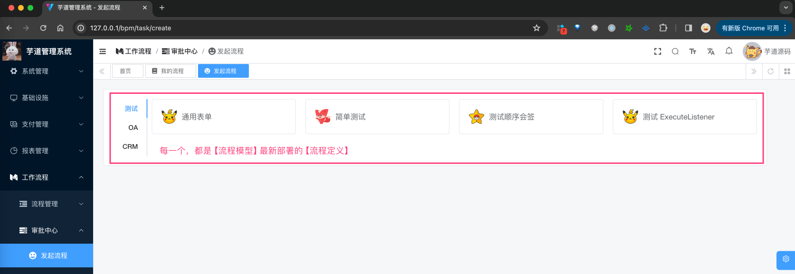