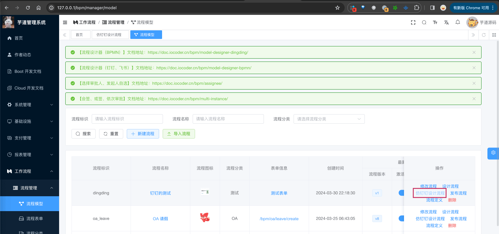
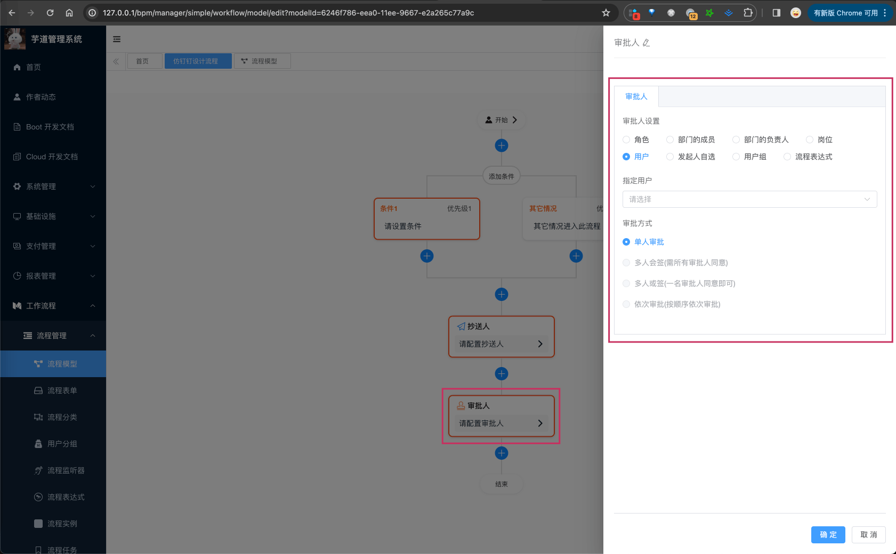

目录

# 流程设计器（钉钉、飞书）

友情提示：【开发中，可体验】

*   前端：[https://gitee.com/yudaocode/yudao-ui-admin-vue3 (opens new window)](https://gitee.com/yudaocode/yudao-ui-admin-vue3) 的 [`feature/bpm` (opens new window)](https://gitee.com/yudaocode/yudao-ui-admin-vue3/tree/feature%2Fbpm/) 分支
*   后端：[https://gitee.com/zhijiantianya/ruoyi-vue-pro (opens new window)](https://gitee.com/zhijiantianya/ruoyi-vue-pro) 的 [`feature/bpm` (opens new window)](https://gitee.com/zhijiantianya/ruoyi-vue-pro/tree/feature%2Fbpm/) 分支

## [#](#_1-如何体验) 1. 如何体验？

① 启动：参考 [《工作流 —— 功能开启》](/bpm/) 文档，前后端都切换成 `feature/bpm` 分支！

② 使用：参考 [《流程设计器（BPMN）》](/bpm/model-designer-bpmn/) 文档，只是编辑器换成 \[访钉钉设计流程\]，如下图所示：

## [#](#_2-开发进展) 2. 开发进展

目前正在开发“第一期”部分，完成会合并到 master 分支。

### [#](#_2-1-一期-进行中) 2.1 一期（进行中）

TODO 05.31 前：同步“一期”的每个功能进展

功能

状态

进展

流程节点 -> 发起人

流程节点 -> 审批人

流程节点 -> 抄送人

流程节点 -> 条件分支

流程节点 -> 并行分支

### [#](#_2-2-二期-未开始) 2.2 二期（未开始）

功能

状态

进展

流程节点 -> 表单权限

流程节点 -> 包容分支

流程节点 -> 延迟器

流程节点 -> 同步/异步触发器

流程节点 -> 子流程

流程节点 -> 动态路由

流程节点 -> 修改/删除数据（待定）

拓展设置 -> 自动去重

拓展设置 -> 撤销流程

### [#](#_2-3-三期-未开始) 2.3 三期（未开始）

功能

状态

进展

拓展设置 -> 前置校验

拓展设置 -> 前置/后置通知

流程设置 -> 流程报表

流程设置 -> 自定义打印模版

流程设置 -> 自定义流程编号

流程设置 -> 动态路由

流程节点 -> 修改/删除数据（待定）