目录

# 选择审批人、发起人自选

相关视频：

*   [08、如何实现流程模型的分配规则？ (opens new window)](https://t.zsxq.com/04uburRvZ)
*   [14、如何实现流程的任务分配？ (opens new window)](https://t.zsxq.com/04rNvFI2f)

当用户发起流程（审批）时，会根据【流程定义】创建对应的审批任务，审批任务会根据【审批人规则】，自动分配给对应的审批人。

审批人可以是固定的角色（比如上级、HR 等），也可以是发起人自选。

## [#](#_1-审批人配置) 1. 审批人配置

在 BPMN 流程设计器重，每个任务节点，有个 \[任务（审批人）\] 配置项，用于配置任务审批时，审批人的分配。如下图所示：

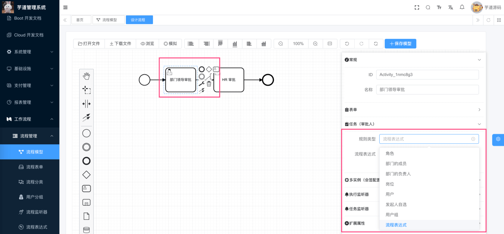

在 BPMN 的 UserTask 节点上，没有合适的内置属性存储“规则类型”、“规则参数”的属性，所以是我们拓展了 `candidateStrategy` 和 `candidateParam` 属性，用于存储审批人的规则类型和参数。如下图所示：

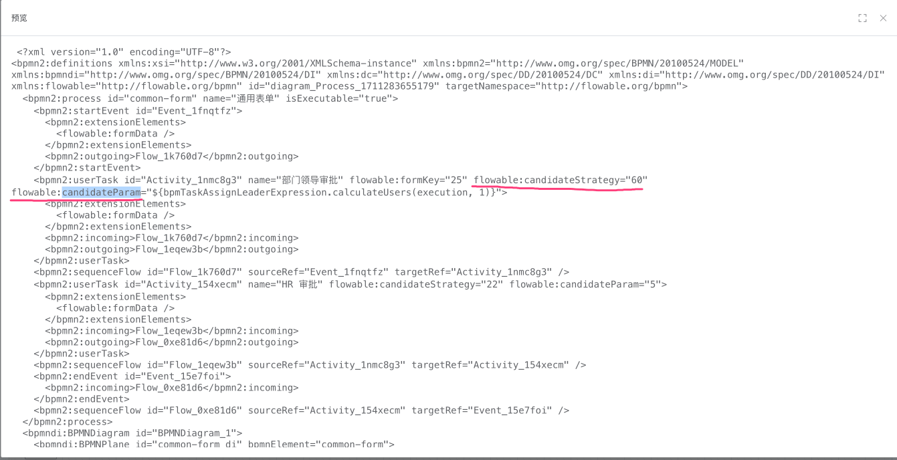

拓展知识：BPMN 的 UserTask 节点，是如何拓展 \`candidateStrategy\` 和 \`candidateParam\` 属性的呢？

参见 [feadd02 (opens new window)](https://gitee.com/yudaocode/yudao-ui-admin-vue3/commit/feadd022e7c0e67e5176b0bddc0361f4ef90da4b)、[797fddf (opens new window)](https://gitee.com/zhijiantianya/ruoyi-vue-pro/commit/cdbcd4d673d491ad5203b8cdb05b00919deda6c9) 提交的代码。

## [#](#_2-选择审批人) 2. 选择审批人

在上图中，我们可以看到 8 种审批人规则类型，它们都是 [BpmTaskCandidateStrategy (opens new window)](https://github.com/YunaiV/ruoyi-vue-pro/blob/master/yudao-module-bpm/yudao-module-bpm-biz/src/main/java/cn/iocoder/yudao/module/bpm/framework/flowable/core/candidate/BpmTaskCandidateStrategy.java) 的一种实现，如下图所示：

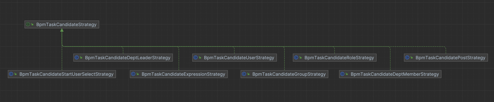

```java
public interface BpmTaskCandidateStrategy {

    /**
     * 对应策略
     *
     * @return 策略
     */
    BpmTaskCandidateStrategyEnum getStrategy();

    /**
     * 校验参数
     *
     * @param param 参数
     */
    void validateParam(String param);

    /**
     * 基于执行任务，获得任务的候选用户们
     *
     * @param execution 执行任务
     * @return 用户编号集合
     */
    Set<Long> calculateUsers(DelegateExecution execution, String param);

    /**
     * 是否一定要输入参数
     *
     * @return 是否
     */
    default boolean isParamRequired() {
        return true;
    }

}

```

*   关键是 `calculateUsers` 方法，用于计算候选的审批人。

最终，Flowable 在创建审批任务，分配审批人时，会通过 [BpmUserTaskActivityBehavior (opens new window)](https://github.com/YunaiV/ruoyi-vue-pro/blob/master/yudao-module-bpm/yudao-module-bpm-biz/src/main/java/cn/iocoder/yudao/module/bpm/framework/flowable/core/behavior/BpmUserTaskActivityBehavior.java) => [BpmTaskCandidateInvoker (opens new window)](https://github.com/YunaiV/ruoyi-vue-pro/blob/master/yudao-module-bpm/yudao-module-bpm-biz/src/main/java/cn/iocoder/yudao/module/bpm/framework/flowable/core/candidate/BpmTaskCandidateInvoker.java) => [BpmTaskCandidateStrategy (opens new window)](https://github.com/YunaiV/ruoyi-vue-pro/blob/master/yudao-module-bpm/yudao-module-bpm-biz/src/main/java/cn/iocoder/yudao/module/bpm/framework/flowable/core/candidate/BpmTaskCandidateStrategy.java)，时序图如下：

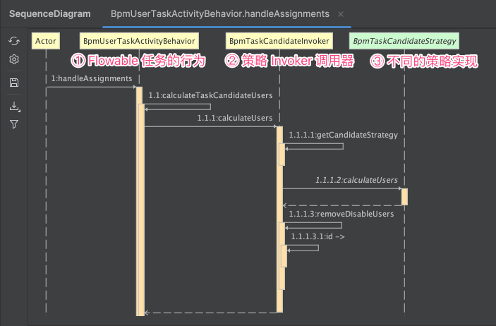

## [#](#_3-自定义-bpmtaskcandidatestrategy-策略) 3. 自定义 BpmTaskCandidateStrategy 策略

① 第一步，在 [BpmTaskCandidateStrategyEnum (opens new window)](https://github.com/YunaiV/ruoyi-vue-pro/blob/master/yudao-module-bpm/yudao-module-bpm-biz/src/main/java/cn/iocoder/yudao/module/bpm/framework/flowable/core/enums/BpmTaskCandidateStrategyEnum.java) 中，自定义一个枚举值。

然后，在 `bpm_task_candidate_strategy` 数据字典中，配置对应的枚举值。

② 第二步，创建一个 BpmTaskCandidateStrategy 的实现类，实现对应的逻辑，并注册成 Spring Bean 即可。

## [#](#_3-发起人自选) 3. 发起人自选

上述的 8 种审批人规则类型中，有一种是【发起人自选】，它是一种特殊的审批人规则类型。在发起流程时，发起人需要选择对应任务的发起人。

下面，我们分别来看看在【流程表单】、【业务表单】下的例子。

### [#](#_3-1-【流程表单】示例) 3.1 【流程表单】示例

① 第一步，设置在 [《审批接入（流程表单）》](/bpm/use-bpm-form/) 的“部门领导审批”任务的审批人规则为【发起人自选】。如下图所示：

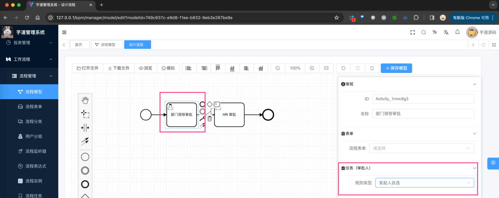

注意，需要保存流程，并进行发布流程。

② 选择该流程，进行发起流程，则可以看到“指定审批人”的表单。如下图所示：

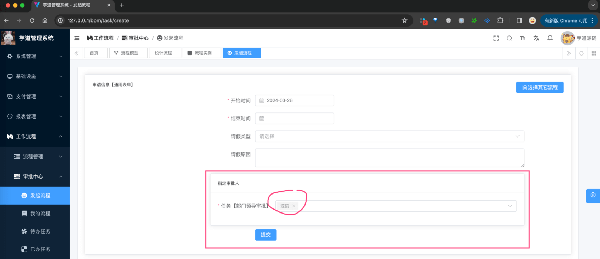

选择“指定审批人”为“源码”，然后进行提交。

③ 查看发起流程的详情，可以看到审批人为“源码”。如下图所示：

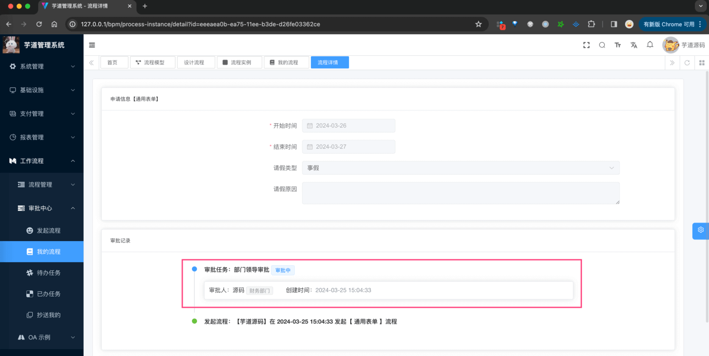

### [#](#_3-2-【业务表单】示例) 3.2 【业务表单】示例

① 第一步，设置在 [《审批接入（业务表单）》](/bpm/use-business-form/) 的“领导审批”任务的审批人规则为【发起人自选】。如下图所示：

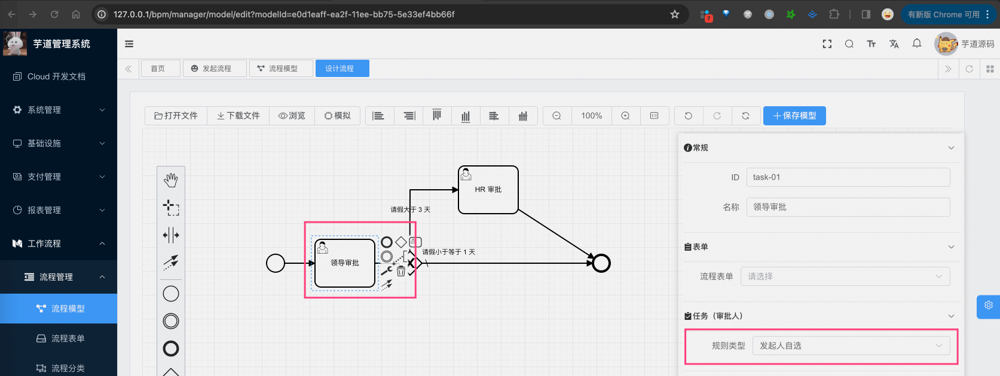

注意，需要保存流程，并进行发布流程。

② 选择该流程，进行发起流程，则可以看到“指定审批人”的表单。如下图所示：

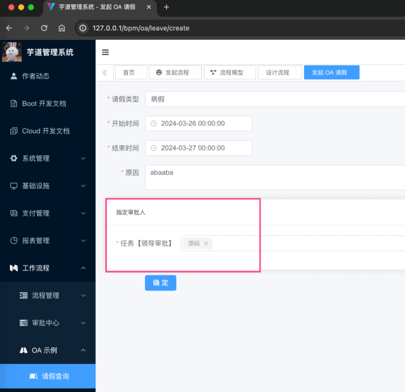

选择“指定审批人”为“源码”，然后进行提交。

③ 查看发起流程的详情，可以看到审批人为“源码”。如下图所示：

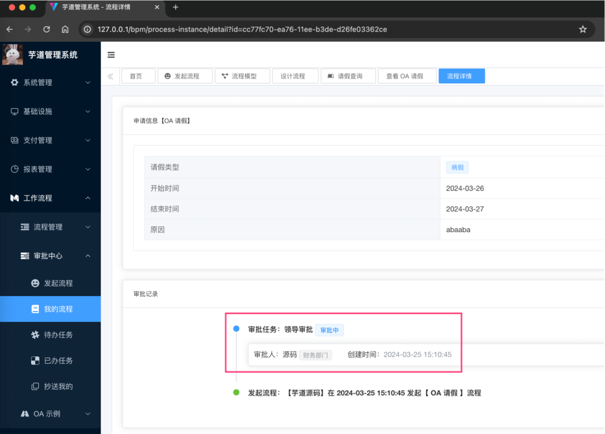

### [#](#_3-3-【流程表单】实现原理) 3.3 【流程表单】实现原理

① 在【流程表单】的流程发起界面 [`views/bpm/processInstance/create/index.vue` (opens new window)](https://github.com/yudaocode/yudao-ui-admin-vue3/blob/master/src/views/bpm/processInstance/create/index.vue#L54-L82) 中，从后端读取【流程定义】时，发现有任务节点的审批人规则是【发起人自选】，则会增加一个“指定审批人”表单项。如下图所示：

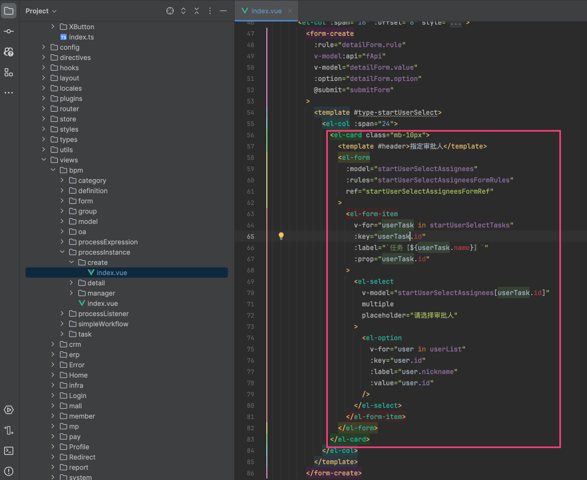

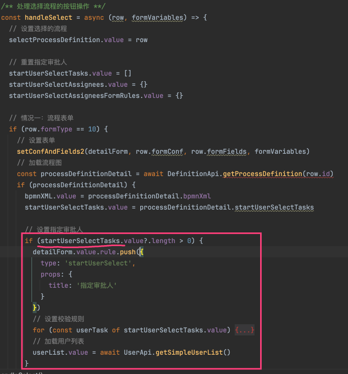

② 在提交流程时，会将选择的审批人，存储到 Flowable 的流程的 `variables` 中。如下图所示：

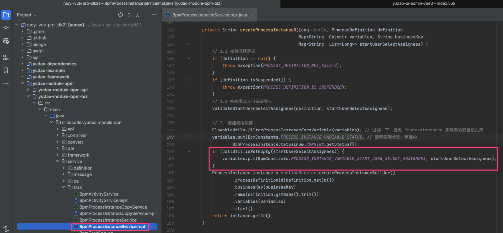

③ 最终审批任务在分配审批人时，会读取这个 `variables`，然后分配给对应的审批人。如下图所示：

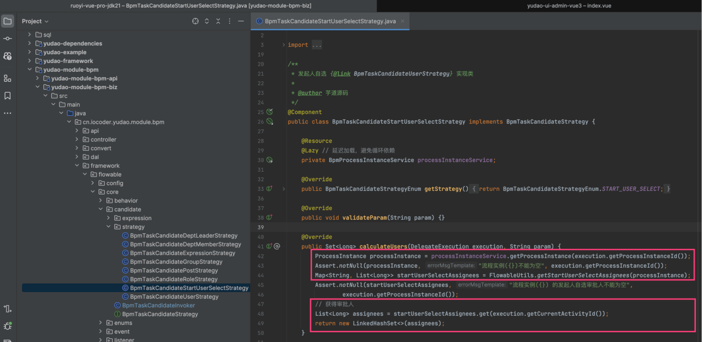

### [#](#_3-4-【业务表单】实现原理) 3.4 【业务表单】实现原理

① 在【业务表单】的流程发起界面 [`views/bpm/oa/leave/create.vue` (opens new window)](https://github.com/yudaocode/yudao-ui-admin-vue3/blob/master/src/views/bpm/oa/leave/create.vue#L40-L69)

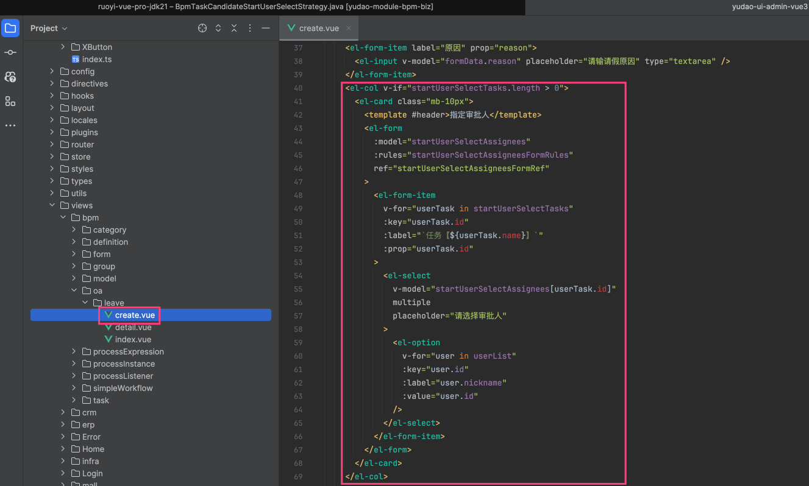

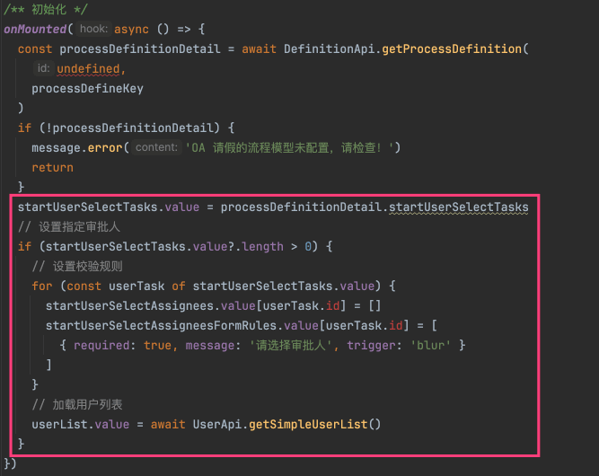

② 在提交流程时，会将选择的审批人，存储到 Flowable 的流程的 `variables` 中。如下图所示：

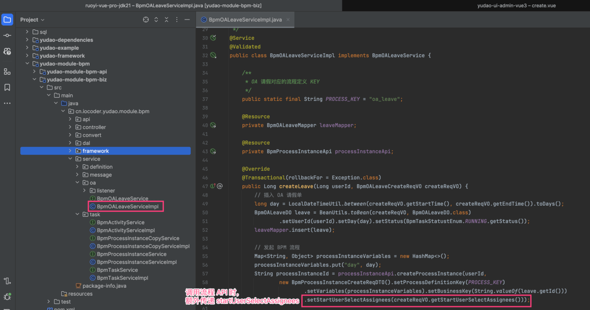

后续的流程，和「3.3 【流程表单】实现原理」就是一致的！总结来说，就是创建流程指定审批人，创建任务使用指定审批人。

## [#](#_4-流程表达式) 4. 流程表达式

除了自定义 BpmTaskCandidateStrategy 策略外，还可以使用流程表达式，实现审批人的动态分配。

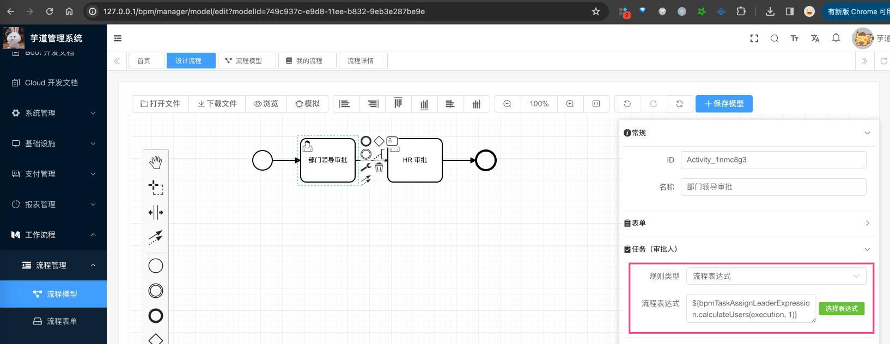