目录

# 功能开启

项目提供统一的支付中心，提供微信、支付宝等支付渠道的支付、退款等能力，方便业务模块进行快速接入，无需关注各种繁琐的支付 API。

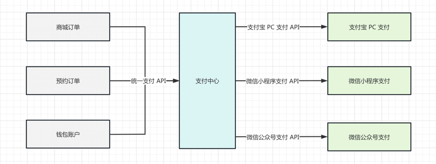

## [#](#_1-概述) 1. 概述

它由如下 3 部分组成：

① [`yudao-spring-boot-starter-biz-pay` (opens new window)](https://github.com/YunaiV/ruoyi-vue-pro/blob/master/yudao-framework/yudao-spring-boot-starter-biz-pay/) 组件：对接微信、支付宝等支付，提供统一的 [PayClient 支付客户端 (opens new window)](https://github.com/YunaiV/ruoyi-vue-pro/blob/master/yudao-framework/yudao-spring-boot-starter-biz-pay/src/main/java/cn/iocoder/yudao/framework/pay/core/client/PayClient.java)。

② [`yudao-module-pay` (opens new window)](https://github.com/YunaiV/ruoyi-vue-pro/tree/master/yudao-module-pay) 后端模块：实现支付中心的后端功能，包括支付、退款等能力。

*   基于 PayClient 支付客户端，对接微信、支付宝等支付渠道。
*   对内提供 [PayOrderApi (opens new window)](https://github.com/YunaiV/ruoyi-vue-pro/blob/master/yudao-module-pay/yudao-module-pay-api/src/main/java/cn/iocoder/yudao/module/pay/api/order/PayOrderApi.java) 统一支付 API 能力、[PayRefundApi (opens new window)](https://github.com/YunaiV/ruoyi-vue-pro/blob/master/yudao-module-pay/yudao-module-pay-api/src/main/java/cn/iocoder/yudao/module/pay/api/refund/PayRefundApi.java) 统一退款 API 能力。

③ 支付中心的前端，提供支付中心的管理后台，可进行支付渠道的配置、支付订单、退款单的查看等操作。

*   Vue2 版本：[`@/views/pay` (opens new window)](https://github.com/yudaocode/yudao-ui-admin-vue2/tree/master/src/views/pay) 目录
*   Vue3 版本：[`@/views/pay` (opens new window)](https://github.com/yudaocode/yudao-ui-admin-vue3/tree/master/src/views/pay) 目录

## [#](#_2-功能开启) 2. 功能开启

考虑到编译速度，默认 `yudao-module-pay` 模块是关闭的，需要手动开启。步骤如下：

*   第一步，开启 `yudao-module-pay` 模块
*   第二步，导入支付的 SQL 数据库脚本
*   第三步，重启后端项目，确认功能是否生效
*   第四步，开启支付相关的 Job 任务

### [#](#_2-1-开启-yudao-module-pay-模块) 2.1 开启 yudao-module-pay 模块

① 修改根目录的 [`pom.xml` (opens new window)](https://github.com/YunaiV/ruoyi-vue-pro/blob/master/pom.xml) 文件，取消 `yudao-module-pay` 模块的注释。如下图所示：

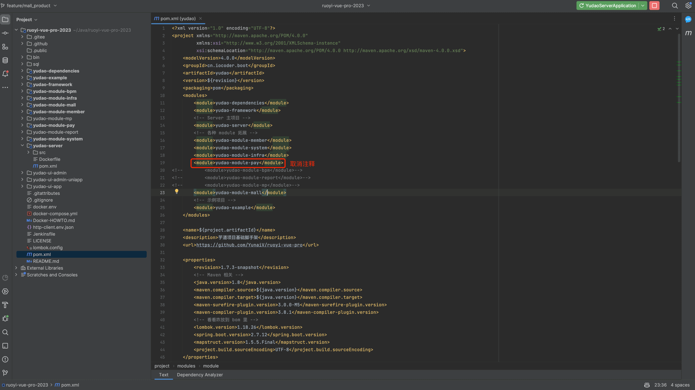

② 修改 `yudao-server` 目录的 [`pom.xml` (opens new window)](https://github.com/YunaiV/ruoyi-vue-pro/blob/master/yudao-server/pom.xml) 文件，引入 `yudao-module-pay` 模块。如下图所示：

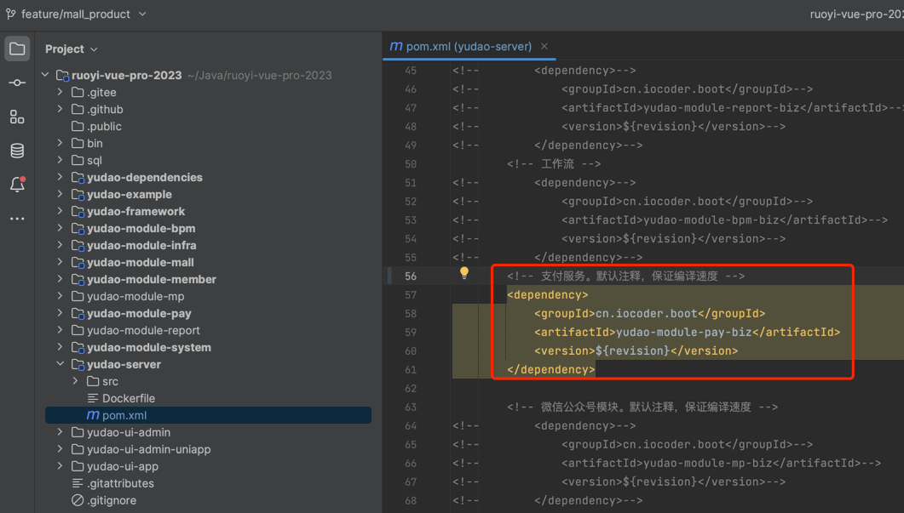

③ 点击 IDEA 右上角的【Reload All Maven Projects】，刷新 Maven 依赖。如下图所示：

### [#](#_2-2-第二步-导入-sql) 2.2 第二步，导入 SQL

点击 [`pay-2024-01-05.sql.zip` (opens new window)](https://t.zsxq.com/15mEuhfnK) 下载附件，解压出 SQL 文件，然后导入到数据库中。

友情提示：↑↑↑ pay.sql 是可以点击下载的！ ↑↑↑

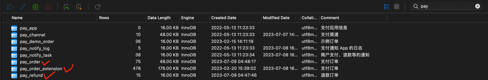

### [#](#_2-3-第三步-重启项目) 2.3 第三步，重启项目

重启后端项目，然后访问前端的支付菜单，确认功能是否生效。如下图所示：

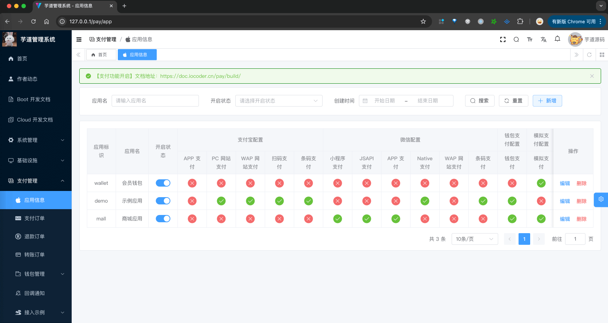

至此，我们就成功开启了支付的功能 🙂

### [#](#_2-4-第四步-开启支付-job) 2.4 第四步，开启支付 Job

① 参考 [《定时任务》](/job/) 文档，将 Job 定时任务开启。

② 将 `pay` 开头的定时都进行开启，例如说：`payNotifyJob`、`payOrderSyncJob`、`payOrderExpireJob`、`payRefundSyncJob`。如下图所示：

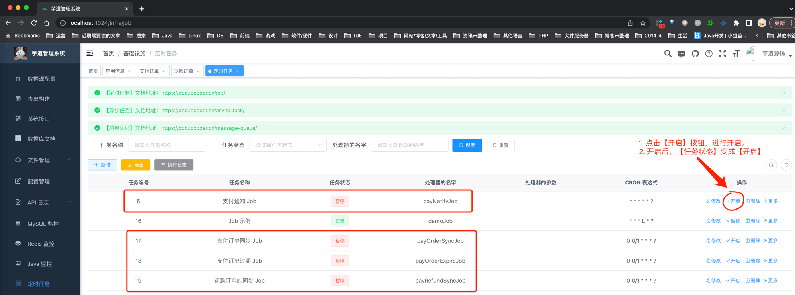

## [#](#_3-功能介绍) 3. 功能介绍
### [#](#_3-1-应用信息) 3.1 应用信息

对应 \[支付管理 -> 应用信息\] 菜单，进行支付渠道、支付应用的管理。如下图所示：

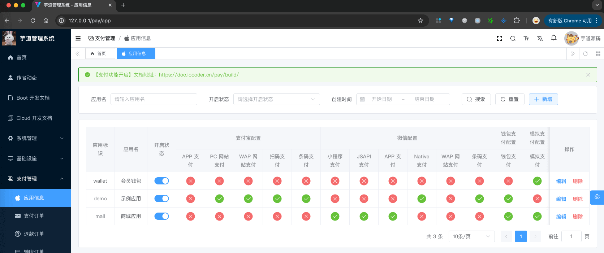

#### [#](#_3-1-1-支付应用) 3.1.1 支付应用

每个要接入支付中心的业务，对应一个支付应用。例如说：商城订单算一个应用，预约订单算一个应用。

点击【新增】按钮，可以进行支付应用的配置，保存在 `pay_app` 表。如下图所示：

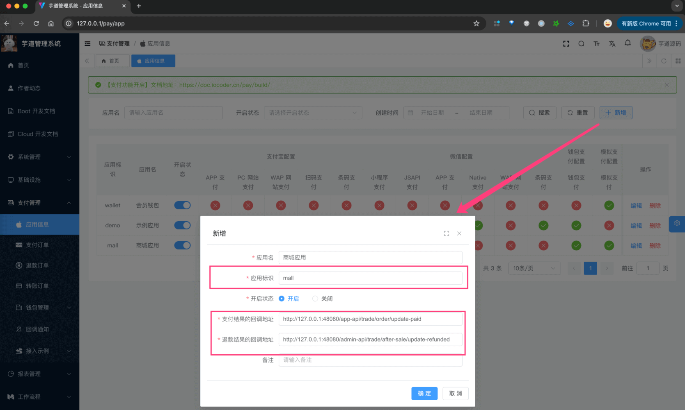

*   应用标识：每个接入支付中心的应用（业务）标识，例如说现有项目中的商城订单使用 `mall`、会员钱包使用 `wallet`
*   支付结果的回调地址：每个业务需要实现一个支付回调接口，在用户支付成功时，支付中心会进行回调。[示例订单的支付回调 (opens new window)](https://github.com/YunaiV/ruoyi-vue-pro/blob/master/yudao-module-pay/yudao-module-pay-biz/src/main/java/cn/iocoder/yudao/module/pay/controller/admin/demo/PayDemoOrderController.java#L50-L58)、[商城订单的支付回调 (opens new window)](https://github.com/YunaiV/ruoyi-vue-pro/blob/master/yudao-module-mall/yudao-module-trade-biz/src/main/java/cn/iocoder/yudao/module/trade/controller/app/order/AppTradeOrderController.java#L64-L70)
*   退款结果的回调地址：每个业务需要实现一个退款回调接口，在用户退款成功时，支付中心会进行回调。[示例订单的退款回调 (opens new window)](https://github.com/YunaiV/ruoyi-vue-pro/blob/master/yudao-module-pay/yudao-module-pay-biz/src/main/java/cn/iocoder/yudao/module/pay/controller/admin/demo/PayDemoOrderController.java#L68-L76)、[商城订单的退款回调 (opens new window)](https://github.com/YunaiV/ruoyi-vue-pro/blob/master/yudao-module-mall/yudao-module-trade-biz/src/main/java/cn/iocoder/yudao/module/trade/controller/admin/aftersale/AfterSaleController.java#L134)

为什么要有支付应用？直接配置支付渠道不行吗？

1.  一个系统中，可能有多个业务需要，每个业务的支付、退款回调地址不同。
2.  同时，每个业务的订单编号可能重复，需要使用支付应用进行隔离，只要求在每个支付应用下保持唯一即可。
3.  另外，每个业务可能想要配置不同的支付渠道。

#### [#](#_3-1-2-支付渠道) 3.1.2 支付渠道

每个支付应用下，可以配置多个支付渠道。例如说：这里“示例应用”就配置了支付宝 PC 网站支付、支付宝 Wap 网站支付等等。

点击【√】或者【×】图标，可以进行支付应用的配置，保存在 `pay_channel` 表。如下图所示：

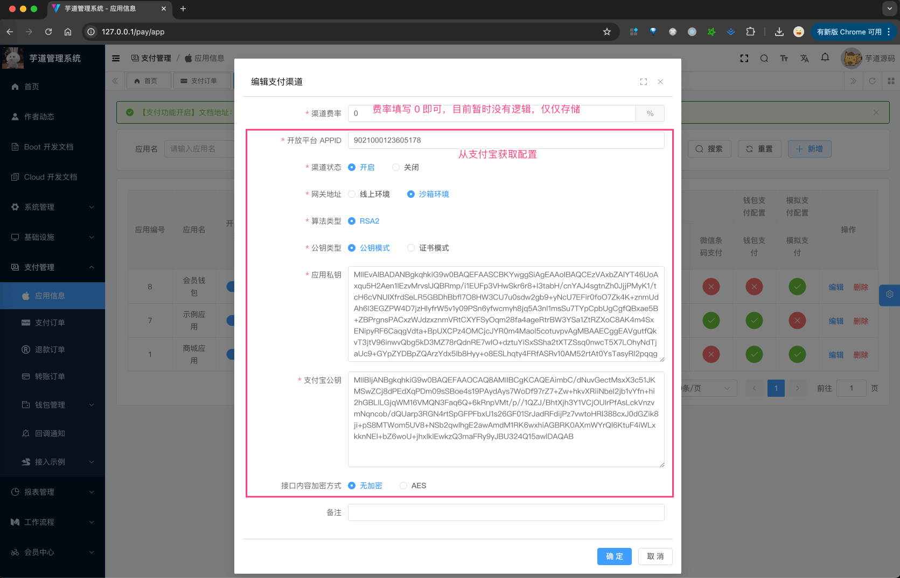

支付费率？

参见 [《第三方支付的费率、限额、通道分析》 (opens new window)](https://zhuanlan.zhihu.com/p/352559274) 文档。

### [#](#_3-2-支付订单) 3.2 支付订单

对应 \[支付管理 -> 支付订单\] 菜单，进行支付订单的查看。如下图所示：

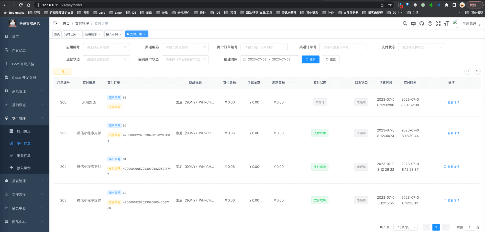

一般情况下，每个业务订单对应一条支付订单，保存在 `pay_order` 表，通过 `merchant_order_id` 字段关联。

### [#](#_3-3-退款订单) 3.3 退款订单

对应 \[支付管理 -> 退款订单\] 菜单，进行退款订单的查看。如下图所示：

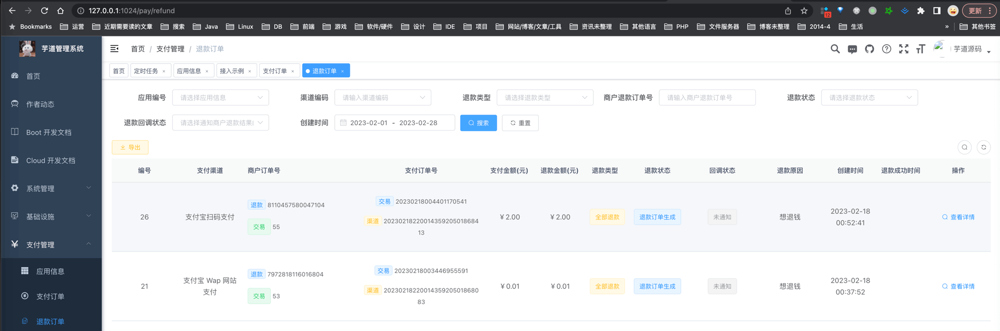

一般情况下，每个业务退款对应一条退款订单，保存在 `pay_refund` 表，通过 `merchant_refund_no` 字段关联。

### [#](#_3-4-回调通知) 3.4 回调通知

对应 \[支付管理 -> 回调通知\] 菜单，查看支付、退款的回调业务的结果。如下图所示：

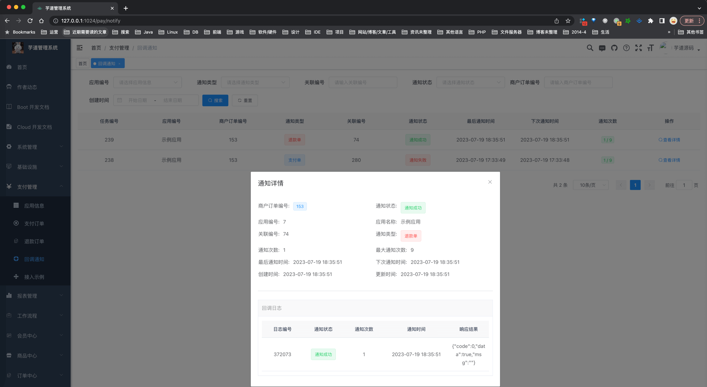

### [#](#_3-5-支付回调【重要】) 3.5 支付回调【重要】

这里，我们要配置支付【**中心**】提供给支付【**渠道**】的回调地址，不同于上面支付【**应用**】的回调地址。整体的回调关系如下图所示：

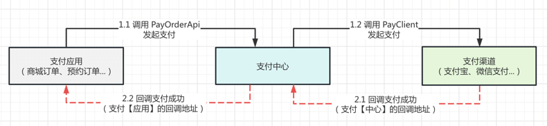

① 由于支付回调需要外网，可参考 [《内网穿透》](/natapp/) 文档，将本地的 48080 端口，转发到外网中。这里，我的域名是 `http://yunai.natapp1.cc`。

② 在 [`application-local.yaml` (opens new window)](https://github.com/YunaiV/ruoyi-vue-pro/blob/master/yudao-server/src/main/resources/application-local.yaml#L196-L197) 配置文件中，修改 `yudao.pay` 配置项，设置为支付【中心】的回调地址。如下图所示：

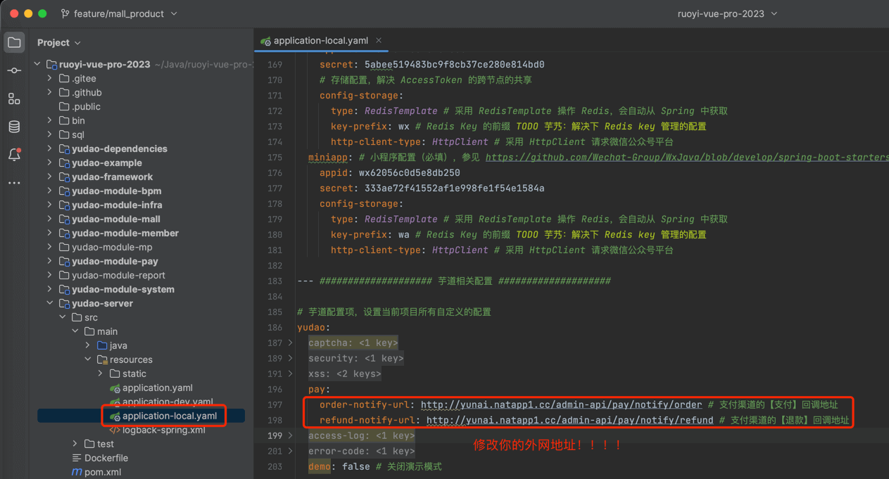

*   `yudao.pay.order-notify-url` 配置项：对应 PayNotifyController 的 [`#notifyOrder(...)` (opens new window)](https://github.com/YunaiV/ruoyi-vue-pro/blob/master/yudao-module-pay/yudao-module-pay-biz/src/main/java/cn/iocoder/yudao/module/pay/controller/admin/notify/PayNotifyController.java#L59-L98) 方法
*   `yudao.pay.refund-notify-url` 配置项：对应 PayNotifyController 的 [`#notifyRefund(...)` (opens new window)](https://github.com/YunaiV/ruoyi-vue-pro/blob/master/yudao-module-pay/yudao-module-pay-biz/src/main/java/cn/iocoder/yudao/module/pay/controller/admin/notify/PayNotifyController.java#L59-L98) 方法

如果你想理解的更深入，可以后续 debug 断条调试。

### [#](#_3-6-接入示例) 3.6 接入示例

对应 \[支付管理 -> 接入示例 -> 支付&退款案例\] 菜单，提供一个支付、退款的接入示例。如下图所示：

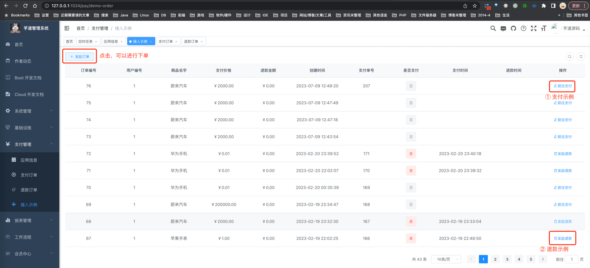

详细说明，可见如下文档：

*   [《支付宝支付接入》](/pay/alipay-pay-demo)
*   [《支付宝、微信退款接入》](/pay/refund-demo)

### [#](#_3-7-钱包充值、支付、退款) 3.7 钱包充值、支付、退款

详细可见 [《钱包充值、支付、退款》](/pay/wallet) 文档

### [#](#_3-8-模拟支付、退款) 3.8 模拟支付、退款

详细可见 [《模拟支付、退款》](/pay/mock) 文档