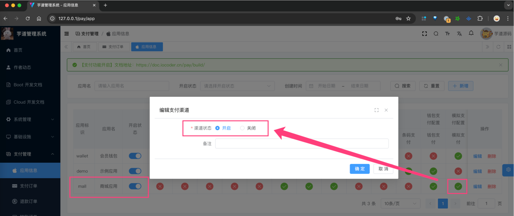

目录

# 模拟支付、退款

前置阅读：

需要先阅读如下文档，对支付、退款功能有一定了解：

*   [《支付功能开启》](/pay/build/)
*   [《支付宝支付接入》](/pay/alipay-pay-demo/)
*   [《支付宝、微信退款接入》](/pay/refund-demo)

考虑到支付、退款功能的接入，需要依赖支付宝、微信等支付渠道，会比较麻烦。所以，我们提供了模拟支付、退款的功能，方便开发者进行接入。

具体的实现，可见 [MockPayClient (opens new window)](https://github.com/YunaiV/ruoyi-vue-pro/blob/master/yudao-module-pay/yudao-spring-boot-starter-biz-pay/src/main/java/cn/iocoder/yudao/framework/pay/core/client/impl/mock/MockPayClient.java) 客户端：

*   在 `#doUnifiedOrder(...)` 方法中，直接返回支付【成功】
*   在 `#doUnifiedRefund(...)` 方法中，直接返回退款【成功】

下面，我们以“商城”为例子，讲解模拟支付的开启、使用。

## [#](#_1-模拟支付的开启) 1. 模拟支付的开启

在管理后台的 \[支付管理 -> 应用信息\] 菜单，将商城对应的支付应用 `mall` 进行开启（开启状态为打开）。如下图所示：

## [#](#_2-模拟支付的使用) 2. 模拟支付的使用

在商城 uni-app 收银台，选择“模拟支付”时，内部会调用 MockPayClient 的 `#doUnifiedOrder(...)` 方法，发起支付，直接成功。

它的整体流程和 [《支付宝支付接入》](/pay/alipay-pay-demo) 是类似的。

## [#](#_3-模拟退款的使用) 3. 模拟退款的使用

模拟支付后，如果发起退款，内部会调用 MockPayClient 的 `#doUnifiedRefund(...)` 方法，发起退款，直接成功。

它的整体流程和 [《支付宝、微信退款接入》](/pay/refund-demo) 是类似的。