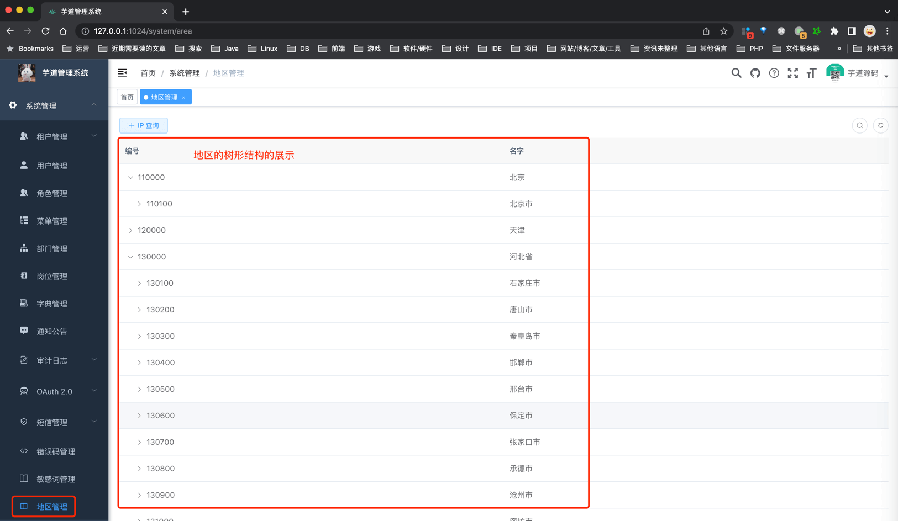
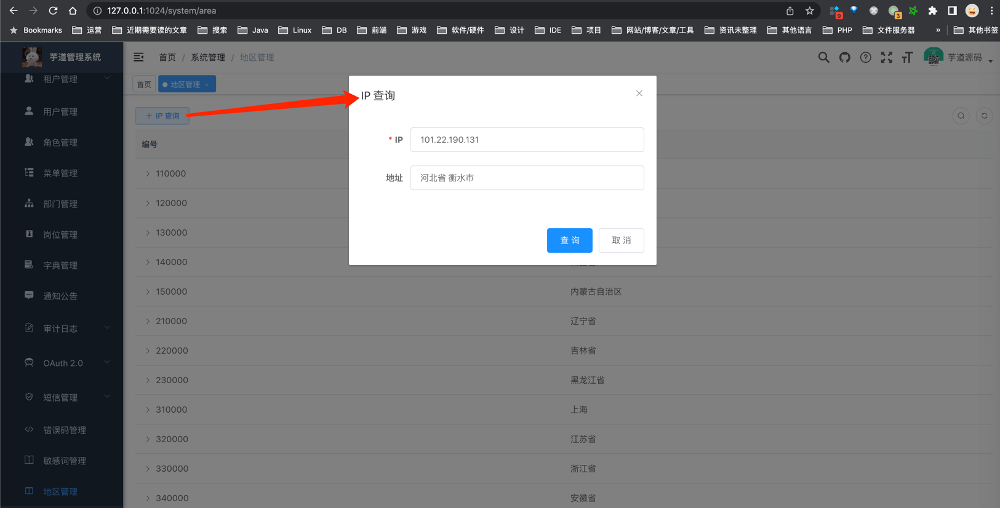

目录

# 地区 & IP 库

[`yudao-spring-boot-starter-biz-ip` (opens new window)](https://github.com/YunaiV/ruoyi-vue-pro/tree/master/yudao-framework/yudao-spring-boot-starter-biz-ip) 业务组件，提供地区 & IP 库的封装。

## [#](#_1-地区) 1. 地区

[AreaUtils (opens new window)](https://github.com/YunaiV/ruoyi-vue-pro/blob/master/yudao-framework/yudao-spring-boot-starter-biz-ip/src/main/java/cn/iocoder/yudao/framework/ip/core/utils/AreaUtils.java) 是地区工具类，可以查询中国的省、市、区县，也可以查询国外的国家。

它的数据来自 [Administrative-divisions-of-China (opens new window)](https://github.com/modood/Administrative-divisions-of-China) 项目，最终整理到项目的 [area.csv (opens new window)](https://github.com/YunaiV/ruoyi-vue-pro/blob/master/yudao-framework/yudao-spring-boot-starter-biz-ip/src/main/resources/area.csv) 文件。每一行的数据，对应 [Area (opens new window)](https://github.com/YunaiV/ruoyi-vue-pro/blob/master/yudao-framework/yudao-spring-boot-starter-biz-ip/src/main/java/cn/iocoder/yudao/framework/ip/core/Area.java) 对象。代码所示：

```java
public class Area {

    /**
     * 编号
     */
    private Integer id;
    /**
     * 名字
     */
    private String name;
    /**
     * 类型
     *
     * 枚举 {@link AreaTypeEnum}
     * 1 - 国家
     * 2 - 省份
     * 3 - 城市
     * 4 - 地区, 例如说县、镇、区等
     */
    private Integer type;

    /**
     * 父节点
     */
    private Area parent;
    /**
     * 子节点
     */
    private List<Area> children;
    
}

```

AreaUtils 主要有如下两个方法：

```java
// AreaUtils.java

/**
 * 获得指定编号对应的区域
 *
 * @param id 区域编号
 * @return 区域
 */
public static Area getArea(Integer id) {
    // ... 省略具体实现
}

/**
 * 格式化区域
 *
 * 例如说：
 *      1. id = “静安区”时：上海 上海市 静安区
 *      2. id = “上海市”时：上海 上海市
 *      3. id = “上海”时：上海
 *      4. id = “美国”时：美国
 * 当区域在中国时，默认不显示中国
 *
 * @param id 区域编号
 * @param separator 分隔符
 * @return 格式化后的区域
 */
public static String format(Integer id, String separator) {
    // ... 省略具体实现
}

```

*   具体的使用，可见 [AreaUtilsTest (opens new window)](https://github.com/YunaiV/ruoyi-vue-pro/blob/master/yudao-framework/yudao-spring-boot-starter-biz-ip/src/test/java/cn/iocoder/yudao/framework/ip/core/utils/AreaUtilsTest.java) 测试类。

另外，管理后台提供了 \[系统管理 -> 地区管理\] 菜单，可以按照树形结构查看地区列表。如下图所示：



*   后端代码，对应 [AreaController (opens new window)](https://github.com/YunaiV/ruoyi-vue-pro/blob/master/yudao-module-system/yudao-module-system-biz/src/main/java/cn/iocoder/yudao/module/system/controller/admin/ip/AreaController.java#L29-L35) 的 `/admin-api/system/area/tree` 接口
*   前端代码，对应 [system/area/index.vue (opens new window)](https://github.com/yudaocode/yudao-ui-admin-vue2/blob/master/src/views/system/area/index.vue) 界面

## [#](#_2-ip) 2. IP

[IPUtils (opens new window)](https://github.com/YunaiV/ruoyi-vue-pro/blob/master/yudao-framework/yudao-spring-boot-starter-biz-ip/src/main/java/cn/iocoder/yudao/framework/ip/core/utils/IPUtils.java) 是 IP 工具类，可以查询 IP 对应的城市信息。

它的数据来自 [ip2region (opens new window)](https://gitee.com/lionsoul/ip2region) 项目，最终整理到项目的 [ip2region.xdb (opens new window)](https://github.com/YunaiV/ruoyi-vue-pro/blob/master/yudao-framework/yudao-spring-boot-starter-biz-ip/src/main/resources/ip2region.xdb) 文件。

IPUtils 主要有如下两个方法：

```java
// IPUtils.java
/**
 * 查询 IP 对应的地区编号
 *
 * @param ip IP 地址，格式为 127.0.0.1
 * @return 地区id
 */
public static Integer getAreaId(String ip) {
    // ... 省略具体实现
}

/**
 * 查询 IP 对应的地区
 *
 * @param ip IP 地址，格式为 127.0.0.1
 * @return 地区
 */
public static Area getArea(String ip) {
        // ... 省略具体实现
}

```

*   具体的使用，可见 [IPUtilsTest (opens new window)](https://github.com/YunaiV/ruoyi-vue-pro/blob/master/yudao-framework/yudao-spring-boot-starter-biz-ip/src/test/java/cn/iocoder/yudao/framework/ip/core/utils/IPUtilsTest.java) 测试类。

另外，管理后台提供了 \[系统管理 -> 地区管理\] 菜单，也提供了 IP 查询城市的示例。如下图所示：



*   后端代码，对应 [AreaController (opens new window)](https://github.com/YunaiV/ruoyi-vue-pro/blob/master/yudao-module-system/yudao-module-system-biz/src/main/java/cn/iocoder/yudao/module/system/controller/admin/ip/AreaController.java#L37-L48) 的 `/admin-api/system/area/get-by-ip` 接口