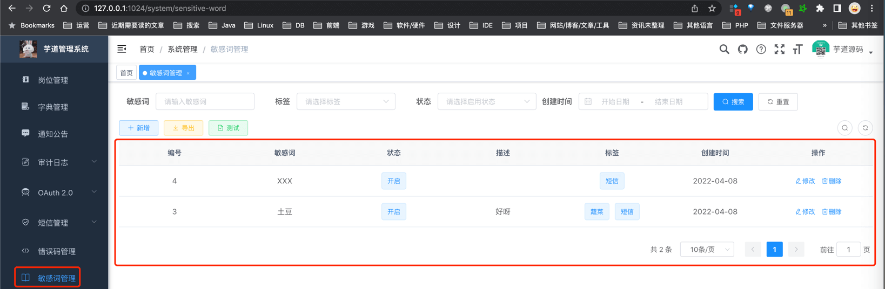
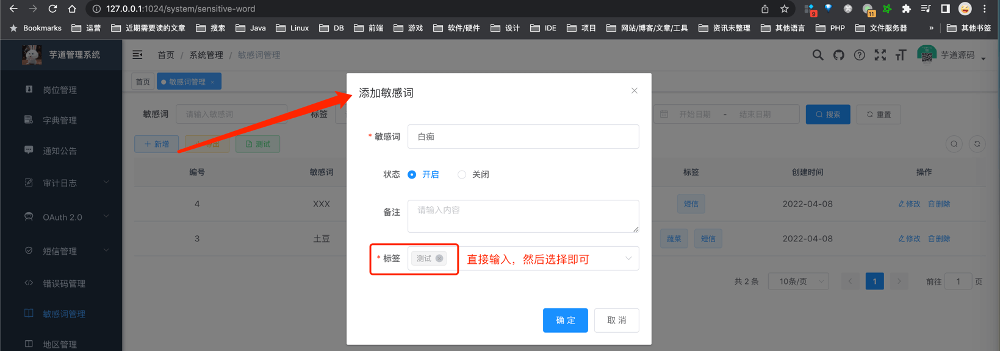
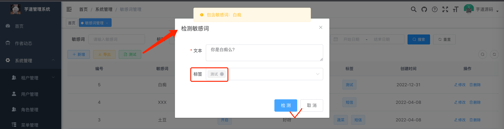
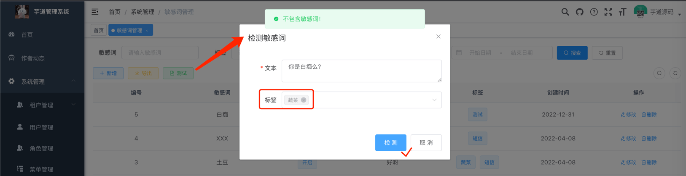

目录

# 敏感词

友情提示：

最新版本的代码，已经移除“敏感词”功能。原因是，该功能比较小众，可能只有极少数的用户需要~

如果你系统里需要，可以参考 [9a31613（后端） (opens new window)](https://gitee.com/zhijiantianya/ruoyi-vue-pro/commit/9a31613e5b766977df62a4977a40ef08bdeefa0b)、[0925253（前端） (opens new window)](https://gitee.com/yudaocode/yudao-ui-admin-vue3/commit/0925253a9dd0e3d9502178fc5c8f4a907eaeb852) 把代码复制、粘贴回来。

本章节，介绍项目的敏感词功能，可用于文本检测，高效过滤色情、广告、敏感、暴恐等违规内容。例如说，用户昵称、评论、私信等文本内容，都可以使用敏感词功能进行过滤。

## [#](#_1-实现原理) 1. 实现原理

敏感词采用 [前缀树 (opens new window)](https://zh.m.wikipedia.org/zh-hans/Trie) 算法，，核心代码见 [SimpleTrie (opens new window)](https://github.com/YunaiV/ruoyi-vue-pro/blob/master/yudao-module-system/yudao-module-system-biz/src/main/java/cn/iocoder/yudao/module/system/util/collection/SimpleTrie.java) 类。

## [#](#_2-使用教程) 2. 使用教程

对应的管理后台，可以在 \[系统管理 -> 敏感词\] 菜单，进行敏感词的管理。如下图所示：



*   前端实现：[sensitiveWord/index.vue (opens new window)](https://github.com/yudaocode/yudao-ui-admin-vue2/blob/master/src/views/system/sensitiveWord/index.vue)
*   后端实现：[SensitiveWordController (opens new window)](https://github.com/YunaiV/ruoyi-vue-pro/blob/master/yudao-module-system/yudao-module-system-biz/src/main/java/cn/iocoder/yudao/module/system/controller/admin/sensitiveword/SensitiveWordController.java)

### [#](#_2-1-添加敏感词) 2.1 添加敏感词



*   标签：用于敏感词分组，不同的场景会需要使用不同的敏感词，通过标签进行分组。

添加完敏感词后，刷新下界面。

### [#](#_2-2-测试敏感词) 2.2 测试敏感词

① 输入检测文本为“你是白痴么？”，选择标签为“测试”，检测到有敏感词：



② 选择标签为“蔬菜”，检测到米有敏感词：



## [#](#_3-敏感词的使用) 3. 敏感词的使用

[SensitiveWordApi (opens new window)](https://github.com/YunaiV/ruoyi-vue-pro/blob/master/yudao-module-system/yudao-module-system-api/src/main/java/cn/iocoder/yudao/module/system/api/sensitiveword/SensitiveWordApi.java) 提供了敏感词的 API 接口，可以在任意地方使用。方法如下：

```java
public interface SensitiveWordApi {

    /**
     * 获得文本所包含的不合法的敏感词数组
     *
     * @param text 文本
     * @param tags 标签数组
     * @return 不合法的敏感词数组
     */
    List<String> validateText(String text, List<String> tags);

    /**
     * 判断文本是否包含敏感词
     *
     * @param text 文本
     * @param tags 表述数组
     * @return 是否包含
     */
    boolean isTextValid(String text, List<String> tags);

}

```

使用步骤如下：

① 在需要使用的 `yudao-module-*-biz` 模块的 `pom.xml` 中，引入 `yudao-module-system-api` 依赖。代码如下：

```xml
<dependency>
    <groupId>cn.iocoder.boot</groupId>
    <artifactId>yudao-module-system-api</artifactId>
    <version>${revision}</version>
</dependency>

```

② 注入 SensitiveWordApi Bean，调用对应的方法即可。例如说：

```java
@Service
public class DemoService {

    @Resource
    private SensitiveWordApi sensitiveWordApi;

    public void demo() {
        sensitiveWordApi.validateText("你是白痴吗", Collections.singletonList("测试"));
        sensitiveWordApi.isTextValid("你是白痴吗", Collections.singletonList("蔬菜"));
    }

}

```